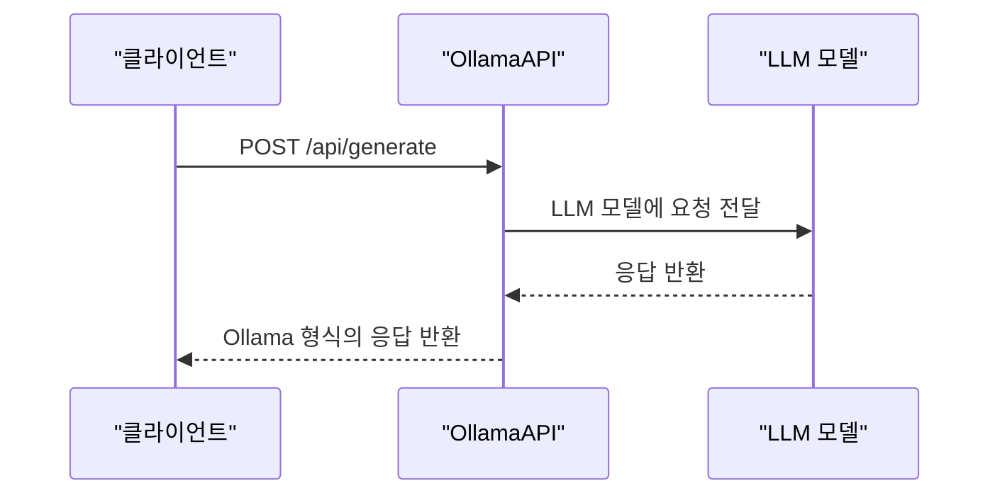
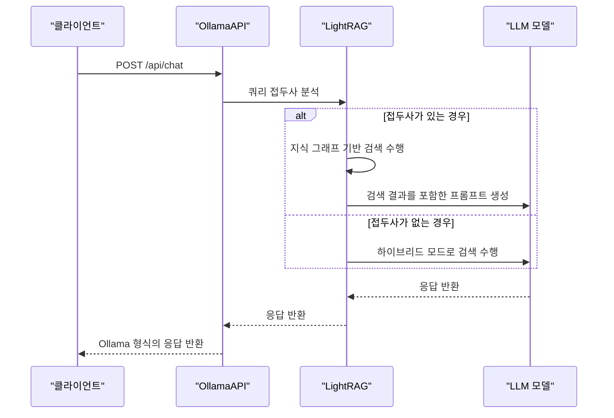
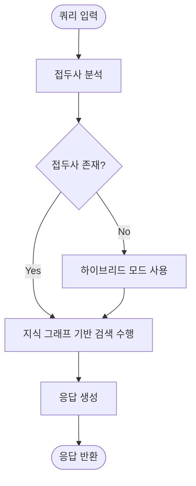

# Ollama 호환 API

<cite>
**이 문서에서 참조한 파일**
- [ollama_api.py](file://lightrag/api/routers/ollama_api.py)
- [auth.py](file://lightrag/api/auth.py)
- [config.py](file://lightrag/api/config.py)
- [lightrag_server.py](file://lightrag/api/lightrag_server.py)
- [ollama.py](file://lightrag/llm/ollama.py)
</cite>

## 목차
1. [소개](#소개)
2. [엔드포인트 개요](#엔드포인트-개요)
3. [/api/generate 엔드포인트](#apigenerate-엔드포인트)
4. [/api/chat 엔드포인트](#apichat-엔드포인트)
5. [/api/tags 엔드포인트](#apitags-엔드포인트)
6. [지식 그래프 기반 검색](#지식-그래프-기반-검색)
7. [인증 설정](#인증-설정)
8. [통합 테스트 예제](#통합-테스트-예제)
9. [결론](#결론)

## 소개
LightRAG은 Ollama의 공식 API 사양과 호환되는 엔드포인트를 제공하여 Open WebUI, Anything LLM 등의 외부 챗봇 UI와의 원활한 통합을 가능하게 합니다. 이 문서는 `ollama_api.py`에 구현된 주요 엔드포인트(`/api/generate`, `/api/chat`, `/api/tags`)를 설명하고, 각 엔드포인트가 Ollama 공식 사양과 어떻게 일치하는지, 그리고 LightRAG 고유의 지식 그래프 기반 검색 기능이 어떻게 구현되는지 설명합니다.

**Section sources**
- [ollama_api.py](file://lightrag/api/routers/ollama_api.py#L1-L50)

## 엔드포인트 개요
LightRAG은 Ollama API와 호환되는 다음과 같은 주요 엔드포인트를 제공합니다:

- **`/api/generate`**: 텍스트 생성 요청을 처리합니다.
- **`/api/chat`**: 채팅 완료 요청을 처리합니다.
- **`/api/tags`**: 사용 가능한 모델 목록을 반환합니다.
- **`/api/version`**: Ollama 버전 정보를 반환합니다.
- **`/api/ps`**: 현재 실행 중인 모델 목록을 반환합니다.

이러한 엔드포인트는 Ollama 공식 API 사양을 따르며, 기존 Ollama 클라이언트와의 호환성을 보장합니다.

**Section sources**
- [ollama_api.py](file://lightrag/api/routers/ollama_api.py#L212-L245)

## /api/generate 엔드포인트

### 요청/응답 스키마
`/api/generate` 엔드포인트는 Ollama의 공식 `/api/generate` 엔드포인트와 동일한 요청 및 응답 스키마를 사용합니다.

**요청 스키마 (OllamaGenerateRequest)**
- `model`: 사용할 모델 이름 (문자열)
- `prompt`: 생성할 프롬프트 (문자열)
- `system`: 시스템 프롬프트 (선택 사항, 문자열)
- `stream`: 스트리밍 응답 여부 (선택 사항, 불리언, 기본값: `False`)
- `options`: 추가 옵션 (선택 사항, 객체)

**응답 스키마 (OllamaGenerateResponse)**
- `model`: 사용된 모델 이름 (문자열)
- `created_at`: 생성 시간 (문자열)
- `response`: 생성된 응답 (문자열)
- `done`: 생성 완료 여부 (불리언)
- `context`: 컨텍스트 토큰 (선택 사항, 정수 배열)
- `total_duration`: 전체 지속 시간 (선택 사항, 정수)
- `load_duration`: 로드 지속 시간 (선택 사항, 정수)
- `prompt_eval_count`: 프롬프트 평가 횟수 (선택 사항, 정수)
- `prompt_eval_duration`: 프롬프트 평가 지속 시간 (선택 사항, 정수)
- `eval_count`: 평가 횟수 (선택 사항, 정수)
- `eval_duration`: 평가 지속 시간 (선택 사항, 정수)

### LightRAG 고유 동작
`/api/generate` 엔드포인트는 LightRAG의 지식 그래프 기반 검색을 거치지 않고, 기본 LLM 모델에 직접 요청을 전달합니다. 이는 Ollama 호환성을 위해 설계된 동작으로, 단순한 텍스트 생성 요청에 적합합니다.



**Diagram sources**
- [ollama_api.py](file://lightrag/api/routers/ollama_api.py#L269-L368)

**Section sources**
- [ollama_api.py](file://lightrag/api/routers/ollama_api.py#L269-L368)

## /api/chat 엔드포인트

### 요청/응답 스키마
`/api/chat` 엔드포인트는 Ollama의 공식 `/api/chat` 엔드포인트와 동일한 요청 및 응답 스키마를 사용합니다.

**요청 스키마 (OllamaChatRequest)**
- `model`: 사용할 모델 이름 (문자열)
- `messages`: 메시지 배열 (객체 배열)
  - `role`: 역할 (문자열, "system", "user", "assistant")
  - `content`: 메시지 내용 (문자열)
  - `images`: 이미지 배열 (선택 사항, 문자열 배열)
- `stream`: 스트리밍 응답 여부 (선택 사항, 불리언, 기본값: `True`)
- `system`: 시스템 프롬프트 (선택 사항, 문자열)
- `options`: 추가 옵션 (선택 사항, 객체)

**응답 스키마 (OllamaChatResponse)**
- `model`: 사용된 모델 이름 (문자열)
- `created_at`: 생성 시간 (문자열)
- `message`: 메시지 객체
  - `role`: 역할 (문자열)
  - `content`: 메시지 내용 (문자열)
  - `images`: 이미지 배열 (선택 사항, 문자열 배열)
- `done`: 생성 완료 여부 (불리언)
- `done_reason`: 완료 이유 (선택 사항, 문자열)
- `total_duration`: 전체 지속 시간 (선택 사항, 정수)
- `load_duration`: 로드 지속 시간 (선택 사항, 정수)
- `prompt_eval_count`: 프롬프트 평가 횟수 (선택 사항, 정수)
- `prompt_eval_duration`: 프롬프트 평가 지속 시간 (선택 사항, 정수)
- `eval_count`: 평가 횟수 (선택 사항, 정수)
- `eval_duration`: 평가 지속 시간 (선택 사항, 정수)

### LightRAG 고유 동작
`/api/chat` 엔드포인트는 LightRAG의 핵심 기능인 지식 그래프 기반 검색을 활용합니다. 사용자의 쿼리에 접두사(`/local`, `/global`, `/hybrid`, `/mix`)를 붙여 검색 모드를 지정할 수 있습니다. 접두사가 없는 경우 기본적으로 `hybrid` 모드가 사용됩니다.



**Diagram sources**
- [ollama_api.py](file://lightrag/api/routers/ollama_api.py#L459-L630)

**Section sources**
- [ollama_api.py](file://lightrag/api/routers/ollama_api.py#L459-L630)

## /api/tags 엔드포인트

### 요청/응답 스키마
`/api/tags` 엔드포인트는 Ollama의 공식 `/api/tags` 엔드포인트와 동일한 응답 스키마를 사용합니다.

**응답 스키마 (OllamaTagResponse)**
- `models`: 모델 배열 (객체 배열)
  - `name`: 모델 이름 (문자열)
  - `model`: 모델 이름 (문자열)
  - `modified_at`: 수정 시간 (문자열)
  - `size`: 모델 크기 (정수)
  - `digest`: 모델 다이제스트 (문자열)
  - `details`: 모델 세부 정보 객체
    - `parent_model`: 부모 모델 (문자열)
    - `format`: 형식 (문자열)
    - `family`: 패밀리 (문자열)
    - `families`: 패밀리 배열 (문자열 배열)
    - `parameter_size`: 파라미터 크기 (문자열)
    - `quantization_level`: 양자화 수준 (문자열)

### LightRAG 고유 동작
`/api/tags` 엔드포인트는 LightRAG가 시뮬레이션하는 Ollama 모델 정보를 반환합니다. 모델 정보는 `config.py`에서 설정한 `simulated-model-name` 및 `simulated-model-tag` 인수에 따라 동적으로 구성됩니다.

**Section sources**
- [ollama_api.py](file://lightrag/api/routers/ollama_api.py#L244-L270)
- [config.py](file://lightrag/api/config.py#L400-L424)

## 지식 그래프 기반 검색
LightRAG의 핵심 기능은 지식 그래프 기반 검색입니다. 사용자는 쿼리에 접두사를 붙여 검색 모드를 지정할 수 있습니다:

- **`/local`**: 로컬 검색 모드
- **`/global`**: 글로벌 검색 모드
- **`/hybrid`**: 하이브리드 검색 모드
- **`/mix`**: 믹스 검색 모드

접두사 뒤에 대괄호(`[]`)를 사용하여 사용자 지정 프롬프트를 지정할 수 있습니다. 예: `/local[다이어그램에 mermaid 형식 사용] 쿼리 문자열`



**Diagram sources**
- [ollama_api.py](file://lightrag/api/routers/ollama_api.py#L147-L179)

**Section sources**
- [ollama_api.py](file://lightrag/api/routers/ollama_api.py#L147-L179)

## 인증 설정

### 인증이 필요 없는 경우
인증이 필요 없는 경우, `AUTH_ACCOUNTS` 환경 변수를 설정하지 않으면 됩니다. 이 경우, 시스템은 게스트 토큰을 생성하여 인증 없이 접근을 허용합니다.

### 인증이 필요한 경우
인증이 필요한 경우, `AUTH_ACCOUNTS` 환경 변수에 사용자 계정 정보를 설정해야 합니다. 형식은 `username:password`이며, 여러 계정은 쉼표로 구분합니다.

```bash
export AUTH_ACCOUNTS="user1:password1,user2:password2"
```

또는 `.env` 파일에 다음 내용을 추가합니다:

```env
AUTH_ACCOUNTS=user1:password1,user2:password2
```

JWT 토큰은 `auth.py`에 정의된 `AuthHandler` 클래스를 통해 생성 및 검증됩니다. 토큰의 만료 시간은 `TOKEN_EXPIRE_HOURS` 환경 변수로 설정할 수 있습니다.

**Section sources**
- [auth.py](file://lightrag/api/auth.py#L1-L110)
- [config.py](file://lightrag/api/config.py#L400-L424)

## 통합 테스트 예제

### curl 예제
다음은 `curl`을 사용한 통합 테스트 예제입니다.

**`/api/generate` 테스트**
```bash
curl http://localhost:9621/api/generate -d '{
  "model": "lightrag",
  "prompt": "LightRAG에 대해 알려주세요.",
  "stream": false
}'
```

**`/api/chat` 테스트**
```bash
curl http://localhost:9621/api/chat -d '{
  "model": "lightrag",
  "messages": [
    { "role": "user", "content": "LightRAG에 대해 알려주세요." }
  ],
  "stream": false
}'
```

**`/api/tags` 테스트**
```bash
curl http://localhost:9621/api/tags
```

### 인증이 필요한 경우
인증이 필요한 경우, `Authorization` 헤더에 JWT 토큰을 포함해야 합니다.

```bash
curl http://localhost:9621/api/chat -H "Authorization: Bearer <your_token>" -d '{
  "model": "lightrag",
  "messages": [
    { "role": "user", "content": "LightRAG에 대해 알려주세요." }
  ],
  "stream": false
}'
```

**Section sources**
- [ollama_api.py](file://lightrag/api/routers/ollama_api.py#L212-L245)

## 결론
LightRAG은 Ollama의 공식 API 사양과 호환되는 엔드포인트를 제공하여 다양한 외부 챗봇 UI와의 통합을 가능하게 합니다. `/api/generate`, `/api/chat`, `/api/tags` 엔드포인트는 Ollama 공식 사양과 일치하며, LightRAG 고유의 지식 그래프 기반 검색 기능을 통해 보다 정확한 응답을 생성할 수 있습니다. 인증은 선택 사항이며, 필요에 따라 JWT 기반 인증을 설정할 수 있습니다. 제공된 curl 예제를 통해 통합 테스트를 쉽게 수행할 수 있습니다.