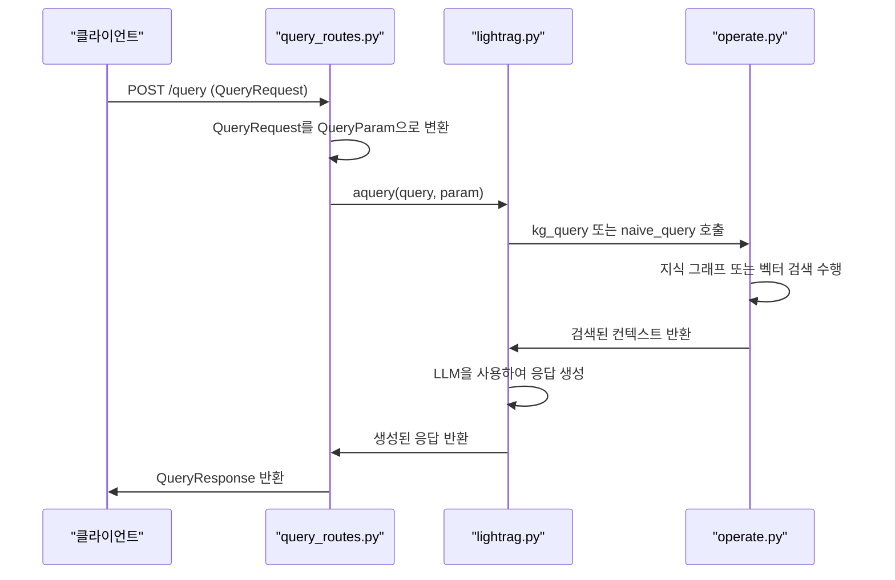

# 쿼리 API

<cite>
**이 문서에서 참조된 파일**   
- [query_routes.py](file://lightrag/api/routers/query_routes.py)
- [lightrag.py](file://lightrag/lightrag.py)
- [operate.py](file://lightrag/operate.py)
- [base.py](file://lightrag/base.py)
- [prompt.py](file://lightrag/prompt.py)
</cite>

## 목차
1. [소개](#소개)
2. [요청 파라미터](#요청-파라미터)
3. [검색 모드](#검색-모드)
4. [스트리밍 응답](#스트리밍-응답)
5. [응답 본문 구조](#응답-본문-구조)
6. [통합 맥락](#통합-맥락)

## 소개

`query_routes.py` 파일은 LightRAG API의 쿼리 관련 라우트를 정의합니다. 이 모듈은 사용자 쿼리를 처리하고 검색 증강 생성(RAG) 기능을 제공합니다. 주요 기능으로는 `/query` 및 `/query/stream` 엔드포인트를 통한 쿼리 처리가 있습니다. 이 문서는 `/query` 엔드포인트를 중심으로 검색 모드, 요청 및 응답 파라미터, 스트리밍 응답, 그리고 내부 연동 방식에 대해 상세히 설명합니다.

## 요청 파라미터

`/query` 엔드포인트는 `QueryRequest` Pydantic 모델을 사용하여 요청 본문을 정의합니다. 다음은 주요 파라미터의 의미와 데이터 타입입니다.

- **query** (`str`): 검색할 쿼리 텍스트입니다. 최소 길이는 1자 이상이어야 합니다.
- **mode** (`Literal["local", "global", "hybrid", "naive", "mix", "bypass"]`): 검색 모드를 지정합니다. 기본값은 "mix"입니다.
- **only_need_context** (`Optional[bool]`): `True`일 경우 검색된 컨텍스트만 반환하고 응답 생성을 수행하지 않습니다.
- **only_need_prompt** (`Optional[bool]`): `True`일 경우 생성된 프롬프트만 반환하고 응답 생성을 수행하지 않습니다.
- **response_type** (`Optional[str]`): 응답 형식을 정의합니다. 예: 'Multiple Paragraphs', 'Single Paragraph', 'Bullet Points'.
- **top_k** (`Optional[int]`): 검색할 상위 항목의 수를 지정합니다. 'local' 모드에서는 엔티티를, 'global' 모드에서는 관계를 나타냅니다.
- **chunk_top_k** (`Optional[int]`): 벡터 검색에서 초기에 검색할 텍스트 청크의 수를 지정합니다.
- **max_entity_tokens** (`Optional[int]`): 통합 토큰 제어 시스템에서 엔티티 컨텍스트에 할당할 최대 토큰 수를 지정합니다.
- **max_relation_tokens** (`Optional[int]`): 관계 컨텍스트에 할당할 최대 토큰 수를 지정합니다.
- **max_total_tokens** (`Optional[int]`): 전체 쿼리 컨텍스트(엔티티 + 관계 + 청크 + 시스템 프롬프트)에 대한 최대 토큰 예산을 지정합니다.
- **conversation_history** (`Optional[List[Dict[str, Any]]]`): 대화 이력을 저장하여 컨텍스트를 유지합니다. 형식은 `[{'role': 'user/assistant', 'content': 'message'}]`입니다.
- **history_turns** (`Optional[int]`): 응답 컨텍스트에서 고려할 완전한 대화 턴(사용자-어시스턴트 쌍)의 수를 지정합니다.
- **ids** (`list[str] | None`): 결과를 필터링할 ID 목록입니다.
- **user_prompt** (`Optional[str]`): 사용자가 제공한 프롬프트입니다. 제공된 경우 기본 프롬프트 템플릿 대신 사용됩니다.
- **enable_rerank** (`Optional[bool]`): 검색된 텍스트 청크에 리랭킹을 활성화합니다. 기본값은 `True`입니다.

**Section sources**
- [query_routes.py](file://lightrag/api/routers/query_routes.py#L1-L224)

## 검색 모드

LightRAG은 다양한 검색 모드를 제공하여 사용자의 요구에 맞는 검색을 지원합니다. 각 모드의 차이점과 사용 사례는 다음과 같습니다.

- **local**: 컨텍스트에 의존하는 정보에 초점을 맞춥니다. 엔티티 중심의 검색을 수행하며, 특정 문서 내의 관련 정보를 찾는 데 적합합니다.
- **global**: 글로벌 지식을 활용합니다. 관계 중심의 검색을 수행하며, 문서 간의 연결성을 분석하는 데 유용합니다.
- **hybrid**: 로컬 및 글로벌 검색 방법을 결합합니다. 두 가지 접근 방식의 장점을 활용하여 보다 포괄적인 검색 결과를 제공합니다.
- **naive**: 고급 기술 없이 기본 검색을 수행합니다. 단순한 텍스트 매칭을 기반으로 하며, 빠른 응답이 필요한 경우에 적합합니다.
- **mix**: 지식 그래프와 벡터 검색을 통합합니다. 엔티티, 관계, 텍스트 청크를 모두 활용하여 정확도와 포괄성을 높입니다.
- **bypass**: 검색 없이 직접 LLM을 사용합니다. 지식 기반 검색이 필요 없는 경우에 사용됩니다.

각 모드는 `QueryParam` 클래스에서 정의되며, `aquery` 메서드를 통해 호출됩니다.

**Section sources**
- [base.py](file://lightrag/base.py#L1-L777)
- [lightrag.py](file://lightrag/lightrag.py#L1-L2928)

## 스트리밍 응답

`/query/stream` 엔드포인트는 검색 증강 생성(RAG) 쿼리를 수행하고 응답을 스트리밍합니다. 이 기능은 청크 전송 인코딩(chunked transfer encoding)을 지원하여 실시간으로 응답을 전송합니다.

### 스트리밍 형식

스트리밍 응답은 `application/x-ndjson` 미디어 타입을 사용합니다. 각 청크는 JSON 형식으로 전송되며, 응답 본문은 다음과 같은 형식을 따릅니다:

```json
{"response": "응답 내용"}
```

또는 오류 발생 시:

```json
{"error": "오류 메시지"}
```

### 클라이언트 처리 방법

클라이언트는 스트리밍 응답을 처리하기 위해 다음과 같은 절차를 따릅니다:

1. HTTP 요청을 보낼 때 `Accept` 헤더에 `application/x-ndjson`를 포함합니다.
2. 응답 본문을 스트림으로 수신합니다.
3. 각 줄을 개별 JSON 객체로 파싱합니다.
4. `response` 필드를 추출하여 사용자에게 실시간으로 표시합니다.
5. 스트림이 종료될 때까지 반복합니다.

예시 코드는 `lightrag_webui/src/api/lightrag.ts` 파일에서 확인할 수 있습니다.

**Section sources**
- [query_routes.py](file://lightrag/api/routers/query_routes.py#L173-L223)
- [lightrag_webui/src/api/lightrag.ts](file://lightrag_webui/src/api/lightrag.ts#L384-L426)

## 응답 본문 구조

`/query` 엔드포인트의 응답 본문은 `QueryResponse` Pydantic 모델을 따릅니다. 응답은 검색된 청크, 생성된 응답, 메타데이터로 구성됩니다.

### 예시 응답

```json
{
  "response": "생성된 응답 내용"
}
```

또는 캐시 히트 시:

```json
{
  "response": "캐시된 응답 내용"
}
```

또는 오류 발생 시:

```json
{
  "detail": "오류 메시지"
}
```

응답 본문은 `response` 필드에 생성된 응답을 포함합니다. 만약 응답이 문자열이 아닌 경우, `json.dumps`를 사용하여 JSON 문자열로 변환합니다.

**Section sources**
- [query_routes.py](file://lightrag/api/routers/query_routes.py#L113-L148)

## 통합 맥락

`query_routes.py`의 `/query` 엔드포인트는 `lightrag.py`의 `LightRAG` 클래스와 연동됩니다. 내부적으로 `operate.py`의 `kg_query` 및 `naive_query` 함수가 호출되어 검색 및 생성 작업을 수행합니다.

### 연동 흐름

1. 사용자는 `/query` 엔드포인트에 `QueryRequest`를 전송합니다.
2. `query_text` 함수는 `QueryRequest`를 `QueryParam`으로 변환합니다.
3. `LightRAG` 인스턴스의 `aquery` 메서드를 호출하여 쿼리를 처리합니다.
4. `aquery` 메서드는 `QueryParam`의 `mode`에 따라 `kg_query` 또는 `naive_query`를 선택적으로 호출합니다.
5. `kg_query`는 지식 그래프를 기반으로 엔티티와 관계를 검색하고, `naive_query`는 벡터 검색을 수행합니다.
6. 검색된 컨텍스트를 기반으로 LLM이 응답을 생성합니다.
7. 생성된 응답은 `QueryResponse`로 변환되어 클라이언트에 반환됩니다.

이러한 흐름을 통해 LightRAG은 다양한 검색 모드를 지원하며, 지식 그래프와 벡터 검색을 통합하여 정확한 응답을 제공합니다.



**Diagram sources**
- [query_routes.py](file://lightrag/api/routers/query_routes.py#L1-L224)
- [lightrag.py](file://lightrag/lightrag.py#L1-L2928)
- [operate.py](file://lightrag/operate.py#L1-L3601)

**Section sources**
- [lightrag.py](file://lightrag/lightrag.py#L2029-L2088)
- [operate.py](file://lightrag/operate.py#L1917-L2073)
- [operate.py](file://lightrag/operate.py#L3397-L3599)