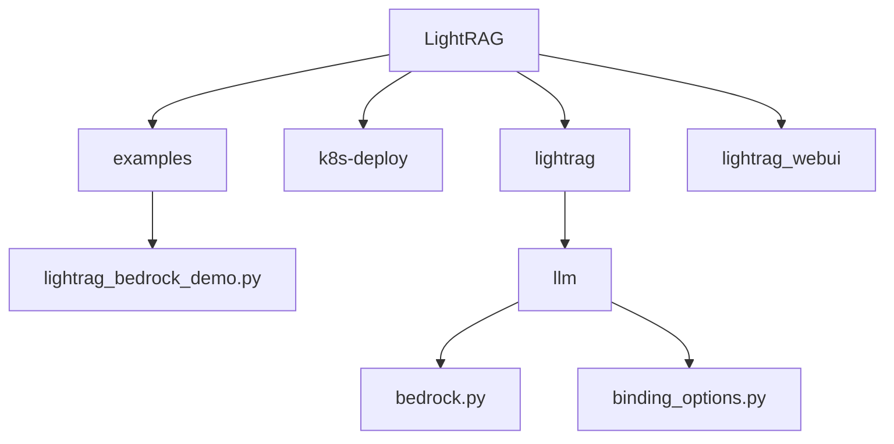
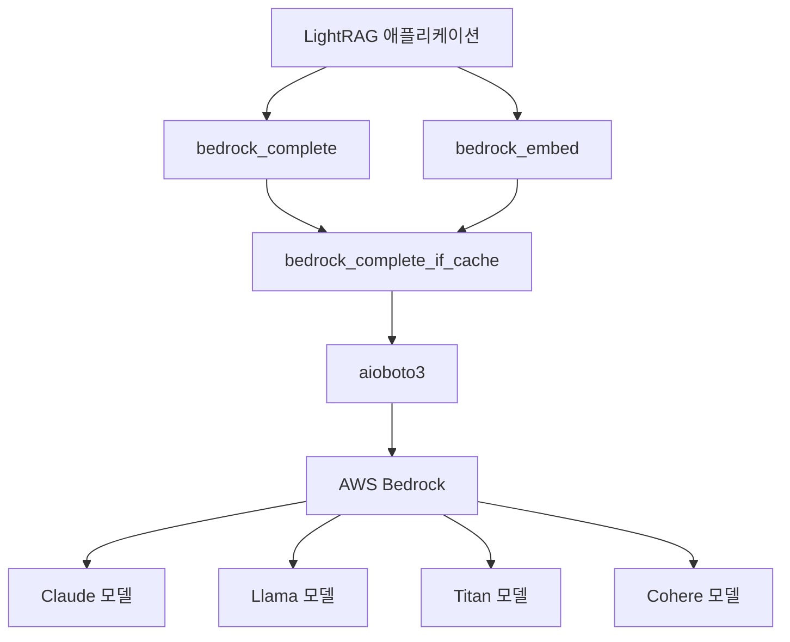
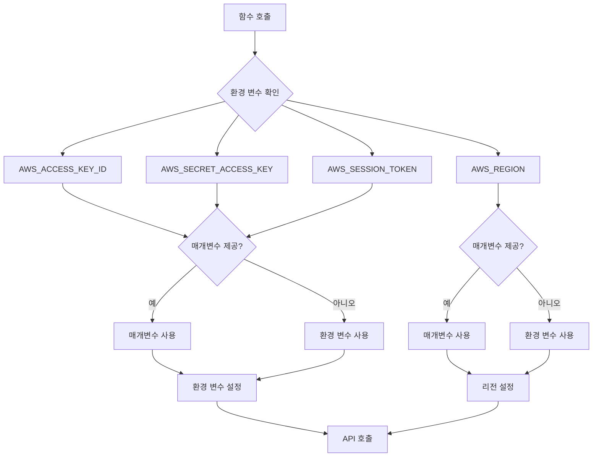
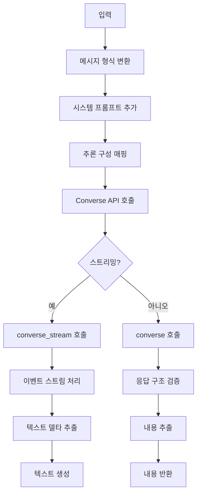
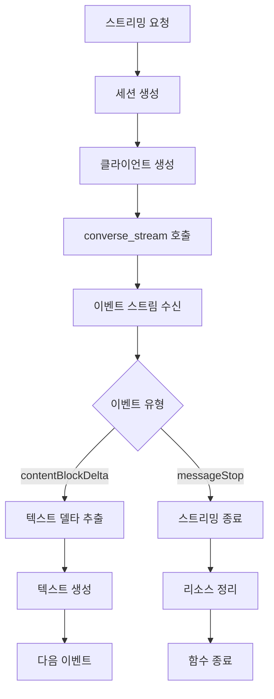
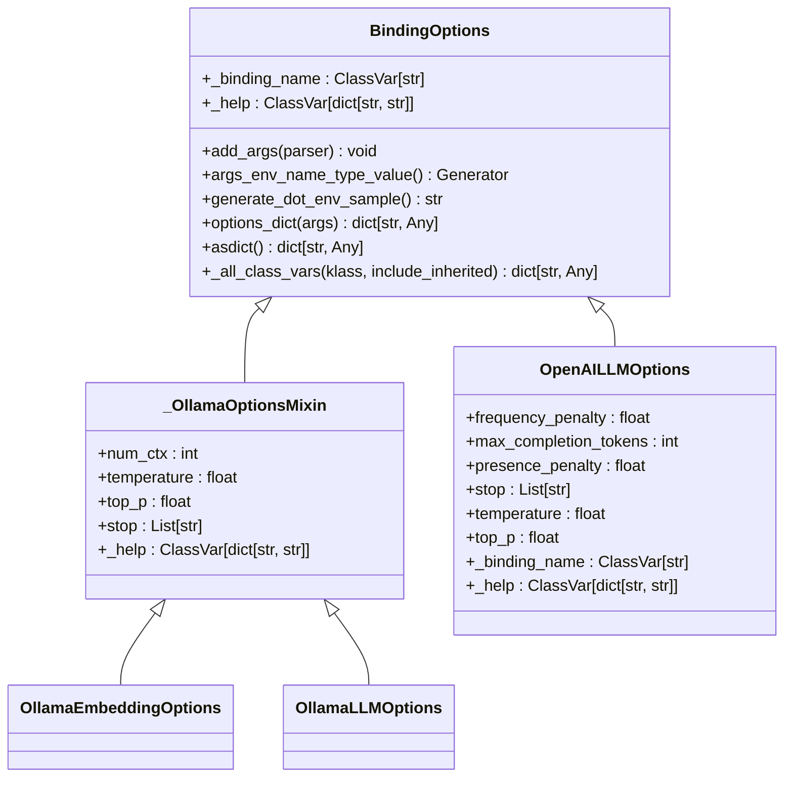
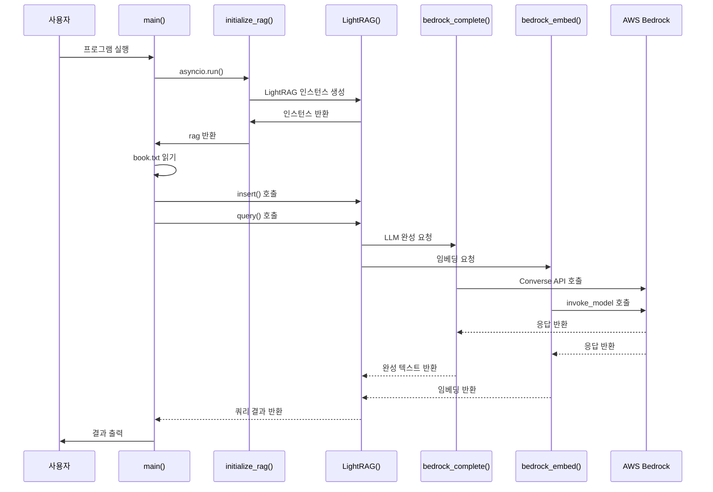
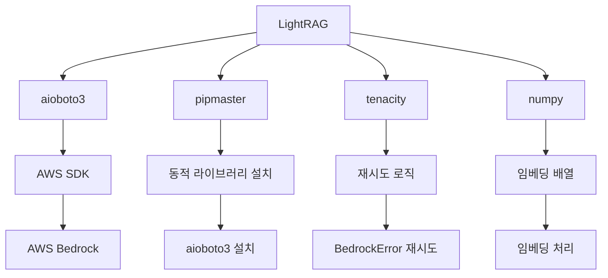

# AWS Bedrock 통합

<cite>
**이 문서에서 참조한 파일**
- [bedrock.py](file://lightrag/llm/bedrock.py)
- [lightrag_bedrock_demo.py](file://examples/unofficial-sample/lightrag_bedrock_demo.py)
- [binding_options.py](file://lightrag/llm/binding_options.py)
</cite>

## 목차
1. [소개](#소개)
2. [프로젝트 구조](#프로젝트-구조)
3. [핵심 구성 요소](#핵심-구성-요소)
4. [아키텍처 개요](#아키텍처-개요)
5. [상세 구성 요소 분석](#상세-구성-요소-분석)
6. [종속성 분석](#종속성-분석)
7. [성능 고려사항](#성능-고려사항)
8. [문제 해결 가이드](#문제-해결-가이드)
9. [결론](#결론)
10. [부록](#부록) (필요 시)

## 소개
이 문서는 LightRAG 프레임워크에 AWS Bedrock을 통합하는 방법을 설명합니다. AWS Bedrock는 Anthropic Claude, Meta Llama, Amazon Titan 등 다양한 대규모 언어 모델(LLM)과 임베딩 모델을 호스팅하는 완전 관리형 서비스입니다. 이 문서는 AWS 인증 설정, 리전 구성, 모델 ARN 지정, 요청/응답 형식, 스트리밍 지원, 보안 통신 및 운영 가이드에 대해 설명합니다.

## 프로젝트 구조
LightRAG 프로젝트는 다음과 같은 주요 디렉터리로 구성됩니다:
- `examples`: 다양한 LLM 통합 예제
- `k8s-deploy`: 쿠버네티스 배포 스크립트
- `lightrag`: 핵심 라이브러리
- `lightrag_webui`: 웹 기반 사용자 인터페이스

AWS Bedrock 통합과 관련된 핵심 파일은 다음과 같습니다:
- `lightrag/llm/bedrock.py`: Bedrock API 통합 로직
- `examples/unofficial-sample/lightrag_bedrock_demo.py`: Bedrock 통합 예제
- `lightrag/llm/binding_options.py`: 바인딩 옵션 관리



**도표 출처**
- [lightrag_bedrock_demo.py](file://examples/unofficial-sample/lightrag_bedrock_demo.py)
- [bedrock.py](file://lightrag/llm/bedrock.py)
- [binding_options.py](file://lightrag/llm/binding_options.py)

**섹션 출처**
- [lightrag_bedrock_demo.py](file://examples/unofficial-sample/lightrag_bedrock_demo.py)
- [bedrock.py](file://lightrag/llm/bedrock.py)
- [binding_options.py](file://lightrag/llm/binding_options.py)

## 핵심 구성 요소
LightRAG의 AWS Bedrock 통합은 다음과 같은 핵심 구성 요소로 이루어져 있습니다:
- `bedrock_complete_if_cache`: Bedrock LLM 완성 API 호출
- `bedrock_embed`: Bedrock 임베딩 API 호출
- `bedrock_complete`: 완성 함수 래퍼
- `BindingOptions`: 바인딩 옵션 관리

이 구성 요소들은 AWS Bedrock 서비스와의 상호작용을 추상화하고, 인증, 리전, 모델 설정 등을 관리합니다.

**섹션 출처**
- [bedrock.py](file://lightrag/llm/bedrock.py#L41-L320)

## 아키텍처 개요
LightRAG의 AWS Bedrock 통합 아키텍처는 다음과 같습니다:



**도표 출처**
- [bedrock.py](file://lightrag/llm/bedrock.py#L41-L320)

## 상세 구성 요소 분석

### Bedrock 완성 함수 분석
`bedrock_complete_if_cache` 함수는 Bedrock의 Converse API를 사용하여 LLM 완성을 처리합니다. 이 함수는 다음과 같은 기능을 제공합니다:

#### 인증 및 리전 설정


**도표 출처**
- [bedrock.py](file://lightrag/llm/bedrock.py#L52-L59)

#### 요청/응답 형식


**도표 출처**
- [bedrock.py](file://lightrag/llm/bedrock.py#L70-L249)

#### 스트리밍 지원


**도표 출처**
- [bedrock.py](file://lightrag/llm/bedrock.py#L133-L181)

### Bedrock 임베딩 함수 분석
`bedrock_embed` 함수는 다양한 공급자의 임베딩 모델을 지원합니다.

#### 모델 공급자별 처리
```mermaid
classDiagram
class bedrock_embed {
+texts : list[str]
+model : str
+aws_access_key_id : str
+aws_secret_access_key : str
+aws_session_token : str
+bedrock_embed(texts, model, aws_access_key_id, aws_secret_access_key, aws_session_token) np.ndarray
}
class AmazonTitan {
+invoke_model(body) response
+body : {"inputText" : text, "embeddingTypes" : ["float"]}
}
class Cohere {
+invoke_model(body) response
+body : {"texts" : texts, "input_type" : "search_document", "truncate" : "NONE"}
}
bedrock_embed --> AmazonTitan : "Amazon 모델 사용"
bedrock_embed --> Cohere : "Cohere 모델 사용"
```

**도표 출처**
- [bedrock.py](file://lightrag/llm/bedrock.py#L254-L320)

### 바인딩 옵션 분석
`binding_options.py` 모듈은 LLM 바인딩 옵션을 관리합니다.

#### 바인딩 옵션 아키텍처


**도표 출처**
- [binding_options.py](file://lightrag/llm/binding_options.py#L91-L320)

### 실제 통합 절차
`lightrag_bedrock_demo.py` 예제는 Bedrock 통합의 실제 절차를 보여줍니다.

#### 통합 절차 시퀀스 다이어그램


**도표 출처**
- [lightrag_bedrock_demo.py](file://examples/unofficial-sample/lightrag_bedrock_demo.py#L30-L58)
- [bedrock.py](file://lightrag/llm/bedrock.py#L41-L320)

**섹션 출처**
- [lightrag_bedrock_demo.py](file://examples/unofficial-sample/lightrag_bedrock_demo.py#L30-L58)
- [bedrock.py](file://lightrag/llm/bedrock.py#L41-L320)

## 종속성 분석
LightRAG의 AWS Bedrock 통합은 다음과 같은 주요 종속성을 가집니다:



**도표 출처**
- [bedrock.py](file://lightrag/llm/bedrock.py#L1-L10)
- [binding_options.py](file://lightrag/llm/binding_options.py)

**섹션 출처**
- [bedrock.py](file://lightrag/llm/bedrock.py#L1-L10)
- [binding_options.py](file://lightrag/llm/binding_options.py)

## 성능 고려사항
AWS Bedrock 통합 시 다음과 같은 성능 고려사항이 있습니다:
- 비동기 API 사용으로 동시 처리 가능
- 재시도 메커니즘으로 일시적인 오류 처리
- 스트리밍 지원으로 지연 시간 감소
- 캐싱 메커니즘으로 반복 요청 최적화
- 배치 처리로 임베딩 성능 향상

## 문제 해결 가이드
AWS Bedrock 통합 시 발생할 수 있는 문제와 해결 방법:

**섹션 출처**
- [bedrock.py](file://lightrag/llm/bedrock.py#L41-L320)
- [lightrag_bedrock_demo.py](file://examples/unofficial-sample/lightrag_bedrock_demo.py#L30-L58)

## 결론
LightRAG의 AWS Bedrock 통합은 다양한 LLM과 임베딩 모델을 쉽게 사용할 수 있도록 설계되었습니다. 이 통합은 AWS 인증, 리전 설정, 모델 선택, 요청/응답 처리, 스트리밍 지원 등을 추상화하여 개발자가 모델에 집중할 수 있도록 합니다. 보안 통신, 비용 최적화, 프라이버시 준수를 위한 운영 가이드를 따르면 안정적인 프로덕션 환경에서 사용할 수 있습니다.

## 부록
### 환경 변수 샘플
```env
# AWS 인증
AWS_ACCESS_KEY_ID=your-access-key-id
AWS_SECRET_ACCESS_KEY=your-secret-access-key
AWS_SESSION_TOKEN=your-session-token
AWS_REGION=us-east-1

# LLM 모델 설정
LLM_MODEL_NAME=anthropic.claude-v2
EMBEDDING_MODEL_NAME=amazon.titan-embed-text-v1
```

### 모델 ARN 예시
- Anthropic Claude 2: `anthropic.claude-v2`
- Anthropic Claude Instant: `anthropic.claude-instant-v1`
- Meta Llama 2: `meta.llama2-13b-chat-v1`
- Amazon Titan Text: `amazon.titan-tg1-large`
- Cohere Embed: `cohere.embed-english-v3`