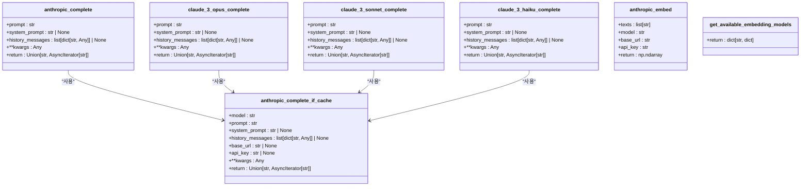

# Anthropic 통합

<cite>
**이 문서에서 참조한 파일**  
- [anthropic.py](file://lightrag/llm/anthropic.py)
- [binding_options.py](file://lightrag/llm/binding_options.py)
- [lightrag_llamaindex_litellm_demo.py](file://examples/unofficial-sample/lightrag_llamaindex_litellm_demo.py)
</cite>

## 목차
1. [소개](#소개)
2. [Anthropic 모듈 구조](#anthropic-모듈-구조)
3. [API 키 및 구성 절차](#api-키-및-구성-절차)
4. [메시지 형식 및 역할 기반 프롬프트](#메시지-형식-및-역할-기반-프롬프트)
5. [콘텐츠 필터링 및 정책](#콘텐츠-필터링-및-정책)
6. [토큰 카운팅 및 Rate Limit](#토큰-카운팅-및-rate-limit)
7. [재시도 및 폴백 전략](#재시도-및-폴백-전략)
8. [BindingOptions를 통한 바인딩 생성](#bindingoptions를-통한-바인딩-생성)
9. [다중 LLM 오케스트레이션](#다중-llm-오케스트레이션)
10. [장기 컨텍스트 처리 및 RAG 성능](#장기-컨텍스트-처리-및-rag-성능)

## 소개
이 문서는 LightRAG에 Anthropic의 Claude 모델을 통합하는 방법을 설명합니다. `anthropic.py` 모듈의 구현을 분석하고, API 키 설정, 메시지 형식, 콘텐츠 필터링 정책을 포함한 구성 절차를 안내합니다. 또한 Anthropic 고유의 토큰 카운팅 방식과 rate limit 제한을 설명하고, 실패 시 재시도 및 폴백 전략을 제안합니다. `binding_options.py`를 통해 Anthropic 바인딩을 생성하는 방법을 코드 예제로 제공하고, `lightrag_llamaindex_litellm_demo.py`에서의 사용 사례를 참조하여 다중 LLM 오케스트레이션 시나리오를 설명합니다. 마지막으로, Claude 모델의 장기 컨텍스트 처리 능력이 RAG 성능에 미치는 영향을 논의합니다.

## Anthropic 모듈 구조
`anthropic.py` 모듈은 Anthropic의 Claude 모델과의 통합을 위한 핵심 기능을 제공합니다. 이 모듈은 비동기 클라이언트를 사용하여 API 호출을 처리하며, 재시도 메커니즘과 스트리밍 응답을 지원합니다. 주요 구성 요소는 다음과 같습니다:

- `anthropic_complete_if_cache`: 캐시를 고려한 핵심 완성 함수
- `anthropic_complete`: 일반적인 완성 함수
- `claude_3_opus_complete`, `claude_3_sonnet_complete`, `claude_3_haiku_complete`: 특정 Claude 모델을 위한 전용 함수
- `anthropic_embed`: Voyage AI를 사용한 임베딩 생성 함수
- `get_available_embedding_models`: 사용 가능한 임베딩 모델 정보 제공 함수



**도표 출처**  
- [anthropic.py](file://lightrag/llm/anthropic.py#L89-L129)

**섹션 출처**  
- [anthropic.py](file://lightrag/llm/anthropic.py#L0-L320)

## API 키 및 구성 절차
Anthropic 모델을 사용하기 위해서는 API 키가 필요합니다. 이 키는 환경 변수를 통해 설정할 수 있으며, `anthropic.py` 모듈은 이를 자동으로 읽어들입니다.

### API 키 설정
API 키는 `ANTHROPIC_API_KEY` 환경 변수에 설정해야 합니다. 코드 내에서 이 키를 읽는 방식은 다음과 같습니다:

```python
if not api_key:
    api_key = os.environ.get("ANTHROPIC_API_KEY")
```

이 코드는 `api_key` 매개변수가 제공되지 않은 경우, 환경 변수에서 API 키를 가져옵니다. 만약 환경 변수에도 설정되어 있지 않으면, API 호출 시 오류가 발생합니다.

### 구성 절차
1. Anthropic 계정에서 API 키를 생성합니다.
2. `.env` 파일이나 시스템 환경 변수에 `ANTHROPIC_API_KEY=your_api_key_here` 형식으로 설정합니다.
3. 애플리케이션을 실행하면, `anthropic.py` 모듈이 자동으로 API 키를 읽어들입니다.


**도표 출처**  
- [anthropic.py](file://lightrag/llm/anthropic.py#L68)

**섹션 출처**  
- [anthropic.py](file://lightrag/llm/anthropic.py#L52-L92)

## 메시지 형식 및 역할 기반 프롬프트
Anthropic 모델은 역할 기반 프롬프트를 사용하여 대화를 구성합니다. 이 방식은 시스템, 사용자, 어시스턴트 역할을 명확히 구분하여 더 자연스럽고 일관된 응답을 생성할 수 있게 합니다.

### 메시지 구조
`anthropic_complete_if_cache` 함수는 다음과 같은 메시지 구조를 사용합니다:

```python
messages: list[dict[str, Any]] = []
if system_prompt:
    messages.append({"role": "system", "content": system_prompt})
messages.extend(history_messages)
messages.append({"role": "user", "content": prompt})
```

이 구조는 세 부분으로 나뉩니다:
1. **시스템 프롬프트**: 모델의 역할과 행동 지침을 정의합니다.
2. **이력 메시지**: 이전 대화 내용을 포함합니다.
3. **사용자 프롬프트**: 현재 요청을 포함합니다.

### 역할 기반 프롬프트의 장점
- **일관성 유지**: 시스템 프롬프트를 통해 모델의 행동을 일관되게 유지할 수 있습니다.
- **맥락 제공**: 이력 메시지를 통해 대화의 맥락을 유지할 수 있습니다.
- **명확한 구분**: 사용자와 어시스턴트의 메시지를 명확히 구분하여 혼란을 방지합니다.


**도표 출처**  
- [anthropic.py](file://lightrag/llm/anthropic.py#L89-L129)

**섹션 출처**  
- [anthropic.py](file://lightrag/llm/anthropic.py#L89-L129)

## 콘텐츠 필터링 및 정책
Anthropic 모델은 콘텐츠 필터링을 통해 부적절하거나 위험한 콘텐츠의 생성을 방지합니다. 이 필터링은 모델 내부에서 자동으로 수행되며, 사용자가 별도로 설정할 필요는 없습니다.

### 필터링 메커니즘
- **자동 감지**: 모델은 입력과 출력에서 부적절한 콘텐츠를 자동으로 감지합니다.
- **정책 준수**: Anthropic의 콘텐츠 정책을 준수하여, 폭력, 혐오, 성적 콘텐츠 등을 필터링합니다.
- **사용자 보호**: 사용자가 의도하지 않은 부적절한 콘텐츠를 생성하는 것을 방지합니다.

### 정책 준수를 위한 팁
1. **명확한 지침 제공**: 시스템 프롬프트에서 모델의 행동 지침을 명확히 제공합니다.
2. **부적절한 요청 회피**: 폭력적이거나 부적절한 요청을 피합니다.
3. **모니터링**: 생성된 콘텐츠를 주기적으로 검토하여 정책 준수 여부를 확인합니다.


**도표 출처**  
- [anthropic.py](file://lightrag/llm/anthropic.py#L124-L169)

**섹션 출처**  
- [anthropic.py](file://lightrag/llm/anthropic.py#L124-L169)

## 토큰 카운팅 및 Rate Limit
Anthropic 모델은 토큰 기반으로 요금이 부과되며, rate limit이 적용됩니다. 이 섹션에서는 토큰 카운팅 방식과 rate limit 제한에 대해 설명합니다.

### 토큰 카운팅
- **입력 토큰**: 사용자 프롬프트와 시스템 프롬프트의 토큰 수
- **출력 토큰**: 모델이 생성한 응답의 토큰 수
- **총 토큰**: 입력 토큰과 출력 토큰의 합계

### Rate Limit
- **요청 제한**: 일정 시간 내에 보낼 수 있는 요청 수 제한
- **토큰 제한**: 일정 시간 내에 사용할 수 있는 토큰 수 제한
- **재시도 메커니즘**: 제한 초과 시 재시도를 위한 메커니즘 제공


**도표 출처**  
- [anthropic.py](file://lightrag/llm/anthropic.py#L52-L92)

**섹션 출처**  
- [anthropic.py](file://lightrag/llm/anthropic.py#L52-L92)

## 재시도 및 폴백 전략
API 호출 시 네트워크 문제나 rate limit 초과로 인해 실패할 수 있습니다. 이를 대비하여 `anthropic.py` 모듈은 재시도 및 폴백 전략을 제공합니다.

### 재시도 메커니즘
`tenacity` 라이브러리를 사용하여 재시도를 구현합니다. 주요 예외 유형에 대해 다음과 같은 재시도 전략을 적용합니다:

- `RateLimitError`: rate limit 초과 시
- `APIConnectionError`: API 연결 오류 시
- `APITimeoutError`: API 타임아웃 오류 시
- `InvalidResponseError`: 유효하지 않은 응답 수신 시

```python
@retry(
    stop=stop_after_attempt(3),
    wait=wait_exponential(multiplier=1, min=4, max=10),
    retry=retry_if_exception_type(
        (RateLimitError, APIConnectionError, APITimeoutError, InvalidResponseError)
    ),
)
```

이 설정은 최대 3회 재시도하며, 지수 백오프 방식으로 대기 시간을 증가시킵니다.

### 폴백 전략
재시도 후에도 실패할 경우, 다음과 같은 폴백 전략을 고려할 수 있습니다:

1. **다른 모델 사용**: `claude-3-haiku`와 같은 더 가벼운 모델로 전환
2. **다른 공급자 사용**: OpenAI 또는 다른 LLM 공급자로 전환
3. **캐시된 응답 사용**: 이전에 캐시된 응답을 사용


**도표 출처**  
- [anthropic.py](file://lightrag/llm/anthropic.py#L52-L92)

**섹션 출처**  
- [anthropic.py](file://lightrag/llm/anthropic.py#L52-L92)

## BindingOptions를 통한 바인딩 생성
`binding_options.py` 모듈은 다양한 LLM 공급자에 대한 구성 옵션을 관리합니다. 이 모듈을 사용하면 Anthropic 바인딩을 쉽게 생성하고 관리할 수 있습니다.

### BindingOptions 클래스
`BindingOptions` 클래스는 모든 LLM 공급자 바인딩의 기반 클래스입니다. 이 클래스는 다음과 같은 기능을 제공합니다:

- **구성 관리**: 각 LLM 공급자의 구성 매개변수를 구조화합니다.
- **환경 통합**: 환경 변수에서 구성 옵션을 자동으로 읽어들입니다.
- **명령줄 인터페이스**: 명령줄 인수를 통해 구성 옵션을 설정할 수 있습니다.
- **확장성**: 새로운 LLM 공급자 바인딩을 쉽게 추가할 수 있습니다.

### Anthropic 바인딩 생성
Anthropic 바인딩을 생성하기 위해 `BindingOptions` 클래스를 상속하는 새로운 클래스를 정의할 수 있습니다. 예를 들어:

```python
@dataclass
class AnthropicLLMOptions(BindingOptions):
    """Anthropic LLM에 대한 옵션."""
    
    # 바인딩 이름
    _binding_name: ClassVar[str] = "anthropic_llm"
    
    # 샘플링 및 생성 매개변수
    temperature: float = DEFAULT_TEMPERATURE
    top_p: float = 1.0
    max_tokens: int = None
    
    # 도움말 설명
    _help: ClassVar[dict[str, str]] = {
        "temperature": "무작위성 제어 (0.0-2.0, 높을수록 더 창의적)",
        "top_p": "핵심 샘플링 매개변수 (0.0-1.0, 낮을수록 더 집중됨)",
        "max_tokens": "생성할 최대 토큰 수",
    }
```

이 클래스를 사용하면 명령줄 인수나 환경 변수를 통해 Anthropic 모델의 구성 옵션을 쉽게 설정할 수 있습니다.


**도표 출처**  
- [binding_options.py](file://lightrag/llm/binding_options.py#L32-L61)

**섹션 출처**  
- [binding_options.py](file://lightrag/llm/binding_options.py#L32-L61)

## 다중 LLM 오케스트레이션
`lightrag_llamaindex_litellm_demo.py` 예제는 다중 LLM 오케스트레이션 시나리오를 보여줍니다. 이 예제에서는 LiteLLM을 사용하여 다양한 LLM 공급자를 통합하고, Anthropic 모델을 포함한 다양한 모델을 오케스트레이션합니다.

### 오케스트레이션 구조
1. **LLM 함수 초기화**: `llm_model_func` 함수는 LiteLLM을 사용하여 LLM 인스턴스를 초기화합니다.
2. **임베딩 함수 초기화**: `embedding_func` 함수는 LiteLLM을 사용하여 임베딩 모델을 초기화합니다.
3. **RAG 초기화**: `initialize_rag` 함수는 LLM 및 임베딩 함수를 사용하여 LightRAG 인스턴스를 초기화합니다.

### 코드 예제
```python
async def llm_model_func(prompt, system_prompt=None, history_messages=[], **kwargs):
    try:
        if "llm_instance" not in kwargs:
            llm_instance = LiteLLM(
                model=f"openai/{LLM_MODEL}",
                api_base=LITELLM_URL,
                api_key=LITELLM_KEY,
                temperature=0.7,
            )
            kwargs["llm_instance"] = llm_instance

        response = await llama_index_complete_if_cache(
            kwargs["llm_instance"],
            prompt,
            system_prompt=system_prompt,
            history_messages=history_messages,
        )
        return response
    except Exception as e:
        print(f"LLM request failed: {str(e)}")
        raise
```

이 코드는 `LiteLLM`을 사용하여 다양한 LLM 공급자를 통합하고, `llama_index_complete_if_cache` 함수를 통해 응답을 생성합니다.

```mermaid
sequenceDiagram
   