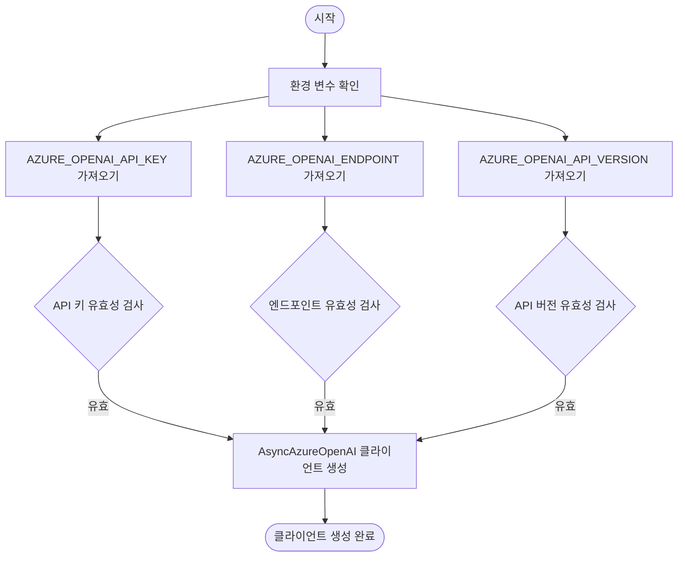
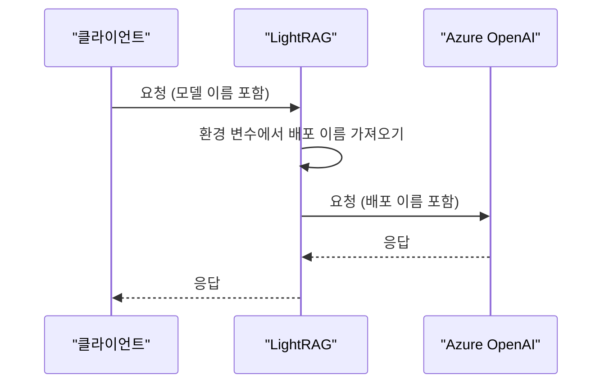
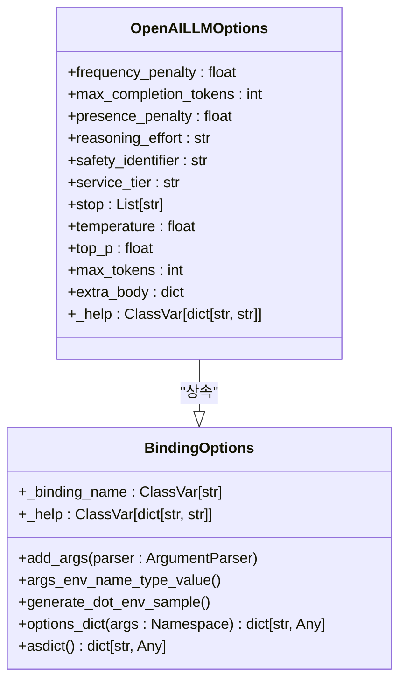
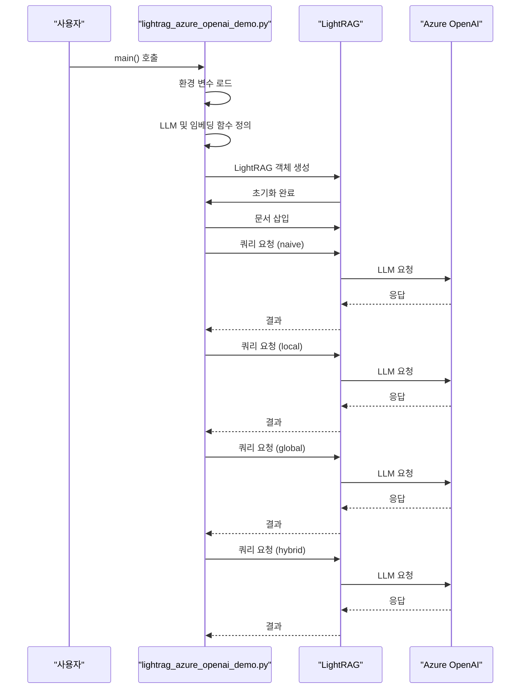

# Azure OpenAI 통합

<cite>
**이 문서에서 참조한 파일**
- [azure_openai.py](file://lightrag/llm/azure_openai.py)
- [binding_options.py](file://lightrag/llm/binding_options.py)
- [lightrag_azure_openai_demo.py](file://examples/lightrag_azure_openai_demo.py)
- [constants.py](file://lightrag/constants.py)
- [README.md](file://lightrag/api/README.md)
</cite>

## 목차
1. [소개](#소개)
2. [Azure OpenAI 인증 및 구성](#azure-openai-인증-및-구성)
3. [Azure 전용 설정](#azure-전용-설정)
4. [OpenAI와의 호환성 차이점](#openai와의-호환성-차이점)
5. [모델 바인딩 생성](#모델-바인딩-생성)
6. [키 관리 전략](#키-관리-전략)
7. [요청 흐름 분석](#요청-흐름-분석)
8. [기업용 보안 기능 통합](#기업용-보안-기능-통합)
9. [결론](#결론)

## 소개
이 문서는 LightRAG에 Azure OpenAI 서비스를 통합하는 절차를 설명합니다. Azure OpenAI는 기업 환경에서 OpenAI 모델을 안전하게 사용할 수 있도록 해주는 Microsoft Azure의 서비스입니다. 이 통합을 통해 사용자는 Azure의 보안, 규정 준수 및 관리 기능을 활용하면서 OpenAI의 강력한 언어 모델을 활용할 수 있습니다. 본 문서는 `azure_openai.py`의 구현을 분석하고, Azure 전용 설정(배포 이름, 엔드포인트 URL, API 버전)을 포함한 인증 및 구성 방법을 안내합니다.

**Section sources**
- [azure_openai.py](file://lightrag/llm/azure_openai.py#L1-L171)

## Azure OpenAI 인증 및 구성
Azure OpenAI 서비스에 연결하기 위해서는 인증 및 구성이 필요합니다. `azure_openai.py` 파일은 Azure OpenAI 서비스에 연결하기 위한 비동기 클라이언트를 생성하고, 환경 변수를 통해 인증 정보를 가져오는 로직을 포함하고 있습니다. 주요 인증 및 구성 요소는 다음과 같습니다:

- **API 키**: `AZURE_OPENAI_API_KEY` 환경 변수를 통해 제공되며, Azure OpenAI 리소스에 대한 액세스를 인증합니다.
- **엔드포인트 URL**: `AZURE_OPENAI_ENDPOINT` 환경 변수를 통해 제공되며, Azure OpenAI 서비스의 기본 URL입니다.
- **API 버전**: `AZURE_OPENAI_API_VERSION` 환경 변수를 통해 제공되며, 사용할 Azure OpenAI API의 버전을 지정합니다.

이러한 환경 변수는 코드 내에서 `os.getenv()` 함수를 통해 읽어오며, 기본값이 설정되어 있지 않으면 `None`을 반환합니다. 이는 사용자가 `.env` 파일이나 시스템 환경 변수를 통해 이러한 값을 설정해야 함을 의미합니다.



**Diagram sources**
- [azure_openai.py](file://lightrag/llm/azure_openai.py#L48-L57)

**Section sources**
- [azure_openai.py](file://lightrag/llm/azure_openai.py#L48-L57)

## Azure 전용 설정
Azure OpenAI는 OpenAI와 달리 배포 개념을 사용합니다. 이는 특정 모델과 구성의 고정된 인스턴스를 의미합니다. `azure_openai.py` 파일은 이러한 Azure 전용 설정을 처리하기 위해 다음과 같은 환경 변수를 사용합니다:

- **배포 이름**: `AZURE_OPENAI_DEPLOYMENT` 환경 변수를 통해 제공되며, 사용할 Azure OpenAI 배포의 이름을 지정합니다. 이는 OpenAI의 모델 이름과 유사한 역할을 합니다.
- **임베딩 배포 이름**: `AZURE_EMBEDDING_DEPLOYMENT` 환경 변수를 통해 제공되며, 임베딩 생성에 사용할 Azure OpenAI 배포의 이름을 지정합니다.
- **임베딩 엔드포인트**: `AZURE_EMBEDDING_ENDPOINT` 환경 변수를 통해 제공되며, 임베딩 서비스에 대한 별도의 엔드포인트를 지정할 수 있습니다.
- **임베딩 API 버전**: `AZURE_EMBEDDING_API_VERSION` 환경 변수를 통해 제공되며, 임베딩 서비스에 사용할 API 버전을 지정합니다.

이러한 설정들은 Azure OpenAI의 고유한 아키텍처를 반영하며, 사용자가 다양한 모델과 구성의 여러 인스턴스를 관리할 수 있도록 해줍니다.

**Section sources**
- [azure_openai.py](file://lightrag/llm/azure_openai.py#L48-L57)
- [lightrag_azure_openai_demo.py](file://examples/lightrag_azure_openai_demo.py#L14-L20)

## OpenAI와의 호환성 차이점
Azure OpenAI는 OpenAI API와 높은 수준의 호환성을 제공하지만, 몇 가지 중요한 차이점이 있습니다. 가장 큰 차이점은 모델을 참조하는 방식입니다. OpenAI에서는 모델 이름(예: `gpt-4`)을 직접 사용하지만, Azure OpenAI에서는 사용자가 생성한 배포 이름을 사용합니다. 이는 `azure_openai_complete_if_cache` 함수 내에서 `deployment` 변수를 통해 처리됩니다.

또한, Azure OpenAI는 API 버전 관리를 더 엄격하게 적용합니다. 각 API 호출은 특정 API 버전을 명시해야 하며, 이는 `api_version` 매개변수를 통해 설정됩니다. OpenAI는 일반적으로 최신 버전을 사용하지만, Azure OpenAI는 안정성과 호환성을 위해 특정 버전을 고정하는 것이 좋습니다.

REST API 호출 형식은 기본적으로 동일하지만, Azure OpenAI는 인증을 위해 `api-key` 헤더 대신 `Authorization` 헤더를 사용할 수 있습니다. 그러나 `azure_openai.py`에서는 `api_key` 매개변수를 사용하여 간단한 인증을 수행합니다.



**Diagram sources**
- [azure_openai.py](file://lightrag/llm/azure_openai.py#L48-L57)

**Section sources**
- [azure_openai.py](file://lightrag/llm/azure_openai.py#L48-L57)

## 모델 바인딩 생성
`binding_options.py` 파일은 다양한 LLM 바인딩을 위한 옵션을 정의하는 데 사용됩니다. Azure OpenAI를 위한 전용 바인딩 옵션은 직접 정의되어 있지 않지만, `OpenAILLMOptions` 클래스를 통해 OpenAI 및 Azure OpenAI 모두를 위한 옵션을 제공합니다. 이 클래스는 `BindingOptions`를 상속받으며, LLM 호출에 사용할 수 있는 다양한 매개변수를 정의합니다.

`OpenAILLMOptions` 클래스는 다음과 같은 매개변수를 포함합니다:
- `temperature`: 생성의 무작위성을 제어합니다.
- `max_completion_tokens`: 생성할 최대 토큰 수를 지정합니다.
- `top_p`: 핵심 샘플링(또는 누적 확률 샘플링) 매개변수입니다.
- `stop`: 생성을 중지할 시퀀스를 지정합니다.

이러한 옵션들은 명령줄 인수 또는 환경 변수를 통해 설정할 수 있으며, `binding_options.py` 파일은 이러한 설정을 자동으로 처리합니다. 예를 들어, `OPENAI_LLM_TEMPERATURE` 환경 변수를 설정하면 `temperature` 옵션이 해당 값으로 설정됩니다.



**Diagram sources**
- [binding_options.py](file://lightrag/llm/binding_options.py#L420-L452)

**Section sources**
- [binding_options.py](file://lightrag/llm/binding_options.py#L420-L452)

## 키 관리 전략
민감한 정보인 API 키를 안전하게 관리하는 것은 매우 중요합니다. `lightrag_azure_openai_demo.py` 예제는 `.env` 파일을 사용하여 환경 변수를 로드하는 전략을 보여줍니다. 이는 민감한 정보를 소스 코드에 직접 포함시키는 것을 방지합니다.

`.env` 파일은 다음과 같은 형식으로 작성할 수 있습니다:
```
AZURE_OPENAI_API_KEY=your-api-key
AZURE_OPENAI_ENDPOINT=https://your-resource.azure.com
AZURE_OPENAI_API_VERSION=2023-05-15
AZURE_OPENAI_DEPLOYMENT=your-deployment-name
AZURE_EMBEDDING_DEPLOYMENT=your-embedding-deployment-name
AZURE_EMBEDDING_API_VERSION=2023-05-15
```

이러한 전략은 코드의 재사용성을 높이고, 보안을 강화합니다. 또한, `binding_options.py` 파일의 `generate_dot_env_sample()` 메서드를 사용하여 모든 가능한 환경 변수의 샘플 `.env` 파일을 자동으로 생성할 수 있습니다.

**Section sources**
- [lightrag_azure_openai_demo.py](file://examples/lightrag_azure_openai_demo.py#L14-L20)
- [binding_options.py](file://lightrag/llm/binding_options.py#L215-L254)

## 요청 흐름 분석
`lightrag_azure_openai_demo.py` 예제는 Azure OpenAI를 사용하는 전체 요청 흐름을 보여줍니다. 이 흐름은 다음과 같은 단계로 구성됩니다:

1. **환경 변수 로드**: `dotenv.load_dotenv()`를 사용하여 `.env` 파일에서 환경 변수를 로드합니다.
2. **LLM 모델 함수 정의**: `llm_model_func` 함수는 `AzureOpenAI` 클라이언트를 생성하고, 채팅 완성 요청을 수행합니다.
3. **임베딩 함수 정의**: `embedding_func` 함수는 `AzureOpenAI` 클라이언트를 생성하고, 임베딩 생성 요청을 수행합니다.
4. **LightRAG 초기화**: `LightRAG` 객체를 생성하고, 위에서 정의한 함수들을 전달합니다.
5. **문서 삽입 및 쿼리**: 문서를 삽입하고, 다양한 모드(`naive`, `local`, `global`, `hybrid`)로 쿼리를 수행합니다.

이 흐름은 Azure OpenAI 서비스를 LightRAG에 성공적으로 통합하는 방법을 명확하게 보여줍니다.



**Diagram sources**
- [lightrag_azure_openai_demo.py](file://examples/lightrag_azure_openai_demo.py#L14-L126)

**Section sources**
- [lightrag_azure_openai_demo.py](file://examples/lightrag_azure_openai_demo.py#L14-L126)

## 기업용 보안 기능 통합
Azure OpenAI는 기업 환경에 적합한 다양한 보안 기능을 제공합니다. VNet 통합 및 프라이빗 엔드포인트는 이러한 기능의 핵심입니다. VNet 통합을 사용하면 Azure OpenAI 리소스를 가상 네트워크(VNet)에 연결할 수 있어, 공용 인터넷을 통한 액세스를 차단하고, 네트워크 트래픽을 내부적으로 유지할 수 있습니다.

프라이빗 엔드포인트는 Azure 프라이빗 링크를 사용하여 Azure OpenAI 서비스에 프라이빗 IP 주소를 제공합니다. 이를 통해 가상 네트워크 내의 리소스가 프라이빗 IP 주소를 통해 Azure OpenAI에 안전하게 연결할 수 있습니다. 이는 데이터 유출 위험을 줄이고, 네트워크 보안을 강화합니다.

이러한 기능을 구성하려면 Azure CLI 또는 Azure Portal을 사용하여 VNet 및 프라이빗 엔드포인트를 설정해야 합니다. 예를 들어, `az cognitiveservices account create` 명령어를 사용하여 VNet 통합을 설정할 수 있습니다.

**Section sources**
- [README.md](file://lightrag/api/README.md#L311-L331)

## 결론
이 문서는 LightRAG에 Azure OpenAI 서비스를 통합하는 포괄적인 가이드를 제공합니다. `azure_openai.py`의 구현을 분석하고, Azure 전용 설정(배포 이름, 엔드포인트 URL, API 버전)을 포함한 인증 및 구성 방법을 안내했습니다. OpenAI와의 호환성 차이점과 REST API 호출 형식의 차이를 설명하고, `binding_options.py`를 사용하여 모델 바인딩을 생성하는 방법을 제시했습니다. 또한, 민감 정보를 안전하게 관리하기 위한 키 관리 전략과 `lightrag_azure_openai_demo.py` 예제를 기반으로 한 요청 흐름을 설명했습니다. 마지막으로, VNet 통합 또는 프라이빗 엔드포인트와 같은 기업용 보안 기능과의 통합 고려사항을 포함하여, 안전하고 확장 가능한 Azure OpenAI 통합을 위한 완전한 가이드를 제공합니다.