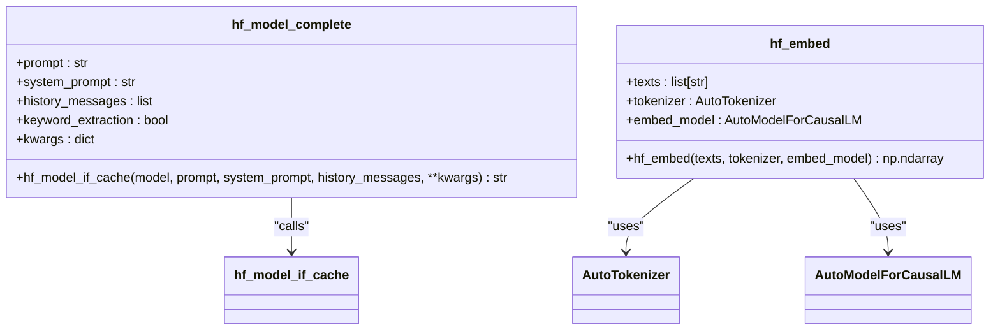
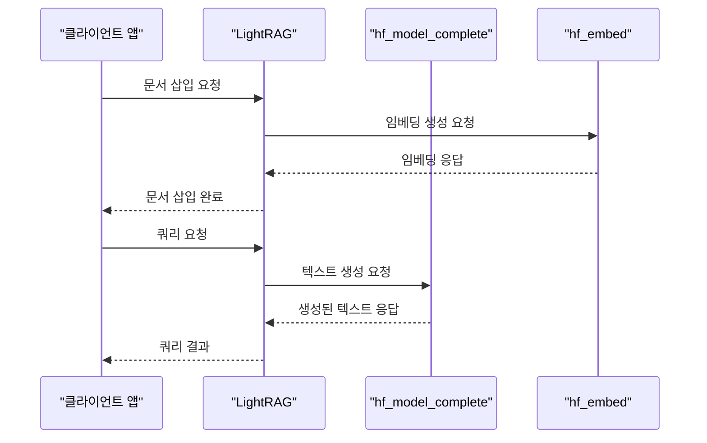
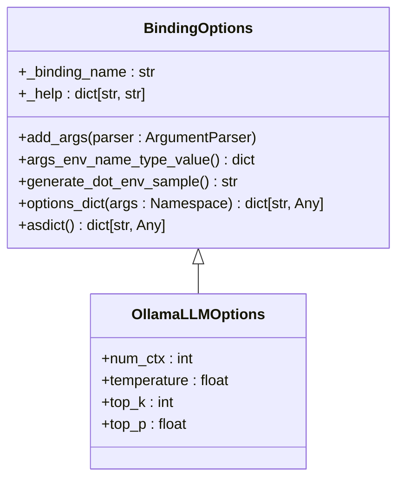

# Hugging Face 통합

<cite>
**이 문서에서 참조한 파일**
- [hf.py](file://lightrag/llm/hf.py)
- [lightrag_hf_demo.py](file://examples/unofficial-sample/lightrag_hf_demo.py)
- [binding_options.py](file://lightrag/llm/binding_options.py)
- [constants.py](file://lightrag/constants.py)
</cite>

## 목차
1. [소개](#소개)
2. [Hugging Face 통합 개요](#hugging-face-통합-개요)
3. [hf.py 모듈 분석](#hfpy-모듈-분석)
4. [lightrag_hf_demo.py 예제 분석](#lightrag_hf_demopy-예제-분석)
5. [binding_options.py를 사용한 바인딩 생성](#binding_optionspy를-사용한-바인딩-생성)
6. [자체 호스팅 모델과의 통합](#자체-호스팅-모델과의-통합)
7. [성능 최적화 및 대기열 지연 문제 해결](#성능-최적화-및-대기열-지연-문제-해결)
8. [결론](#결론)

## 소개
이 문서는 LightRAG에 Hugging Face 모델을 통합하는 방법에 대해 설명합니다. 특히 Inference API 또는 자체 호스팅 모델을 사용하는 경우의 통합 방법을 다룹니다. hf.py 모듈의 구현을 분석하고, 인증 토큰 설정, 모델 ID 지정, 요청 형식(JSON 페이로드) 처리 방식을 안내합니다. lightrag_hf_demo.py 예제를 기반으로 텍스트 생성 및 임베딩 요청 흐름을 설명하고, rate limit 및 대기열 지연 문제에 대한 대응 전략을 제시합니다. binding_options.py를 사용한 바인딩 생성 시, Hugging Face의 토큰 제한과 응답 형식을 고려한 설정 방법을 포함합니다. 자체 호스팅 모델과의 통합 시, 로컬 GPU 리소스 활용 방안과 성능 최적화 전략을 설명합니다.

## Hugging Face 통합 개요
LightRAG는 Hugging Face의 다양한 모델을 통합하여 사용할 수 있도록 설계되었습니다. 이 통합은 두 가지 주요 방식으로 이루어질 수 있습니다: Hugging Face Inference API를 사용하는 경우와 자체 호스팅 모델을 사용하는 경우입니다. 두 경우 모두 hf.py 모듈을 통해 구현되며, 이 모듈은 Hugging Face 모델과의 상호작용을 위한 핵심 기능을 제공합니다.

Hugging Face 통합의 주요 목적은 LightRAG의 RAG(Retrieval-Augmented Generation) 기능을 강화하는 것입니다. 이를 통해 사용자는 다양한 언어 모델을 활용하여 더 정확하고 풍부한 응답을 생성할 수 있습니다. 또한, 자체 호스팅 모델을 사용하면 데이터 프라이버시와 보안을 더욱 강화할 수 있습니다.

## hf.py 모듈 분석
hf.py 모듈은 Hugging Face 모델과의 상호작용을 위한 핵심 기능을 제공합니다. 이 모듈은 주로 두 가지 주요 함수로 구성되어 있습니다: `hf_model_complete`과 `hf_embed`.

### hf_model_complete 함수
`hf_model_complete` 함수는 Hugging Face 모델을 사용하여 텍스트 생성을 수행합니다. 이 함수는 다음과 같은 매개변수를 받습니다:
- `prompt`: 생성할 텍스트의 프롬프트
- `system_prompt`: 시스템 프롬프트
- `history_messages`: 이전 대화 기록
- `keyword_extraction`: 키워드 추출 여부

이 함수는 내부적으로 `hf_model_if_cache` 함수를 호출하여 모델을 초기화하고, 캐시를 사용하여 성능을 최적화합니다. `hf_model_if_cache` 함수는 `tenacity` 라이브러리를 사용하여 재시도 로직을 구현하며, rate limit 및 연결 오류에 대응합니다.

### hf_embed 함수
`hf_embed` 함수는 Hugging Face 모델을 사용하여 텍스트 임베딩을 생성합니다. 이 함수는 다음과 같은 매개변수를 받습니다:
- `texts`: 임베딩을 생성할 텍스트 목록
- `tokenizer`: 토크나이저
- `embed_model`: 임베딩 모델

이 함수는 입력 텍스트를 토큰화하고, 모델을 사용하여 임베딩을 생성한 후, NumPy 배열로 반환합니다. 이 함수는 GPU, Apple Silicon(MPS), CPU 등 다양한 장치를 자동으로 감지하여 최적의 성능을 제공합니다.



**다이어그램 출처**
- [hf.py](file://lightrag/llm/hf.py#L115-L130)

**섹션 출처**
- [hf.py](file://lightrag/llm/hf.py#L115-L160)

## lightrag_hf_demo.py 예제 분석
lightrag_hf_demo.py 예제는 Hugging Face 모델을 LightRAG에 통합하는 방법을 보여줍니다. 이 예제는 다음과 같은 주요 단계로 구성되어 있습니다:

### LightRAG 초기화
예제는 `initialize_rag` 함수를 통해 LightRAG를 초기화합니다. 이 함수는 다음과 같은 설정을 포함합니다:
- `working_dir`: 작업 디렉토리
- `llm_model_func`: 텍스트 생성을 위한 LLM 모델 함수
- `llm_model_name`: Hugging Face 모델 이름
- `embedding_func`: 임베딩 생성을 위한 함수

```python
async def initialize_rag():
    rag = LightRAG(
        working_dir=WORKING_DIR,
        llm_model_func=hf_model_complete,
        llm_model_name="meta-llama/Llama-3.1-8B-Instruct",
        embedding_func=EmbeddingFunc(
            embedding_dim=384,
            max_token_size=5000,
            func=lambda texts: hf_embed(
                texts,
                tokenizer=AutoTokenizer.from_pretrained(
                    "sentence-transformers/all-MiniLM-L6-v2"
                ),
                embed_model=AutoModel.from_pretrained(
                    "sentence-transformers/all-MiniLM-L6-v2"
                ),
            ),
        ),
    )

    await rag.initialize_storages()
    await initialize_pipeline_status()

    return rag
```

### 문서 삽입 및 쿼리
초기화 후, 예제는 `insert` 메서드를 사용하여 문서를 삽입하고, `query` 메서드를 사용하여 다양한 검색 모드(naive, local, global, hybrid)로 쿼리를 수행합니다.



**다이어그램 출처**
- [lightrag_hf_demo.py](file://examples/unofficial-sample/lightrag_hf_demo.py#L22-L27)

**섹션 출처**
- [lightrag_hf_demo.py](file://examples/unofficial-sample/lightrag_hf_demo.py#L1-L82)

## binding_options.py를 사용한 바인딩 생성
binding_options.py 모듈은 다양한 LLM 바인딩을 위한 컨테이너를 제공합니다. 이 모듈을 사용하면 Hugging Face 모델의 설정을 쉽게 관리할 수 있습니다.

### 바인딩 옵션 정의
binding_options.py 모듈은 `BindingOptions` 클래스를 기반으로 다양한 바인딩 옵션을 정의합니다. Hugging Face 모델의 경우, 다음과 같은 옵션을 설정할 수 있습니다:
- `num_ctx`: 컨텍스트 윈도우 크기
- `temperature`: 생성의 무작위성 제어
- `top_k`: Top-k 샘플링 파라미터
- `top_p`: Top-p (nucleus) 샘플링 파라미터

이러한 옵션은 환경 변수 또는 명령줄 인수를 통해 설정할 수 있으며, `generate_dot_env_sample` 메서드를 사용하여 `.env` 파일의 샘플을 생성할 수 있습니다.



**다이어그램 출처**
- [binding_options.py](file://lightrag/llm/binding_options.py#L245-L489)

**섹션 출처**
- [binding_options.py](file://lightrag/llm/binding_options.py#L1-L651)

## 자체 호스팅 모델과의 통합
자체 호스팅 모델을 사용하면 데이터 프라이버시와 보안을 더욱 강화할 수 있습니다. 이 경우, 로컬 GPU 리소스를 활용하여 성능을 최적화할 수 있습니다.

### 로컬 GPU 리소스 활용
자체 호스팅 모델을 사용할 때는 로컬 GPU 리소스를 최대한 활용하는 것이 중요합니다. hf.py 모듈은 `device_map="auto"`를 사용하여 GPU를 자동으로 감지하고, 모델을 GPU에 로드합니다. 또한, `torch.cuda.is_available()`을 사용하여 GPU 사용 가능 여부를 확인하고, 적절한 장치를 선택합니다.

### 성능 최적화 전략
자체 호스팅 모델의 성능을 최적화하기 위해 다음과 같은 전략을 사용할 수 있습니다:
- **배치