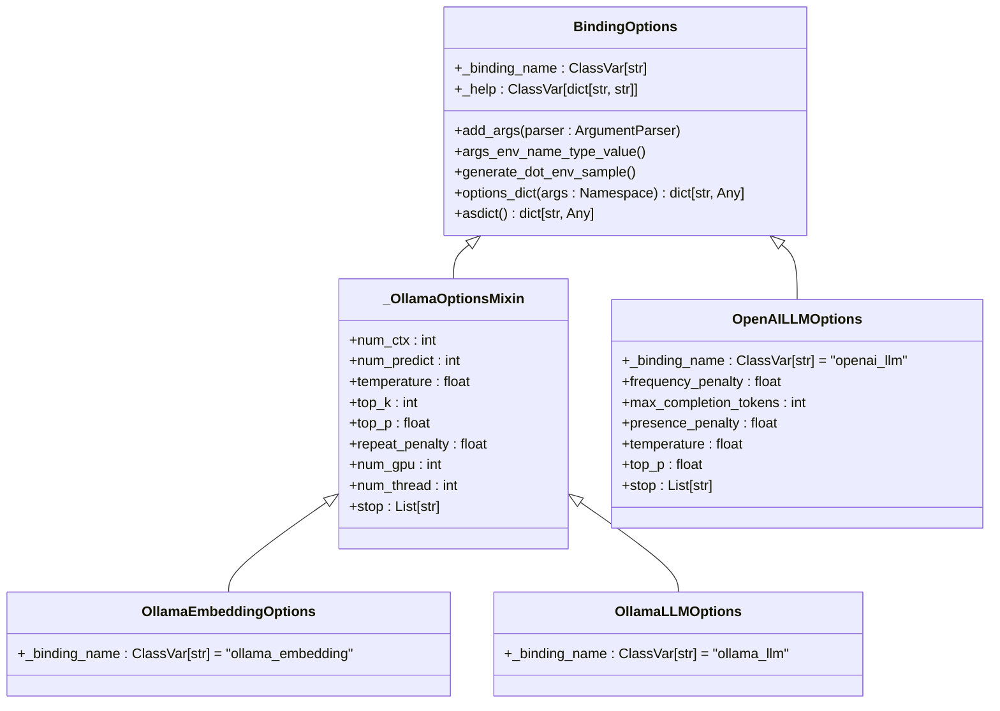

# LLM 통합

<cite>
**이 문서에서 참조된 파일**
- [binding_options.py](file://lightrag/llm/binding_options.py)
- [openai.py](file://lightrag/llm/openai.py)
- [azure_openai.py](file://lightrag/llm/azure_openai.py)
- [ollama.py](file://lightrag/llm/ollama.py)
- [hf.py](file://lightrag/llm/hf.py)
- [anthropic.py](file://lightrag/llm/anthropic.py)
- [bedrock.py](file://lightrag/llm/bedrock.py)
- [lightrag_openai_compatible_demo.py](file://examples/lightrag_openai_compatible_demo.py)
- [Readme.md](file://lightrag/llm/Readme.md)
- [README.md](file://README.md)
</cite>

## 목차
1. [소개](#소개)
2. [지원되는 LLM 공급자](#지원되는-llm-공급자)
3. [LLM 바인딩 메커니즘](#llm-바인딩-메커니즘)
4. [의존성 주입 패턴](#의존성-주입-패턴)
5. [로컬 및 클라우드 LLM 설정](#로컬-및-클라우드-llm-설정)
6. [OpenAI 호환 API 통합](#openai-호환-api-통합)
7. [성능 고려사항 및 폴백 전략](#성능-고려사항-및-폴백-전략)

## 소개
LightRAG는 다양한 LLM(Large Language Model) 공급자와 통합되어 유연한 AI 기반 검색 및 생성 기능을 제공합니다. 이 문서는 OpenAI, Azure OpenAI, Ollama, Hugging Face, Anthropic, Bedrock 등 다양한 LLM 공급자의 통합 방식, 인증 설정 방법, 바인딩 메커니즘, 의존성 주입 패턴, 로컬 및 클라우드 LLM의 설정 차이점, OpenAI 호환 API 통합 방법, 성능 고려사항 및 폴백 전략에 대해 설명합니다.

## 지원되는 LLM 공급자
LightRAG는 다양한 LLM 공급자와 통합되어 있으며, 각 공급자별로 전용 모듈을 제공합니다. 주요 지원 공급자로는 OpenAI, Azure OpenAI, Ollama, Hugging Face, Anthropic, Bedrock 등이 있습니다. 각 공급자는 전용 Python 모듈을 통해 구현되며, `lightrag/llm` 디렉터리 내에서 관리됩니다.

### OpenAI 및 Azure OpenAI
OpenAI 및 Azure OpenAI는 `openai.py` 및 `azure_openai.py` 모듈을 통해 통합됩니다. OpenAI는 표준 OpenAI API를 사용하며, Azure OpenAI는 Azure 전용 엔드포인트와 인증 방식을 사용합니다.

**Section sources**
- [openai.py](file://lightrag/llm/openai.py)
- [azure_openai.py](file://lightrag/llm/azure_openai.py)

### Ollama
Ollama는 로컬에서 실행되는 LLM 서버로, `ollama.py` 모듈을 통해 통합됩니다. Ollama는 로컬 GPU 및 CPU 리소스를 활용하여 모델을 실행하며, 다양한 하드웨어 최적화 옵션을 제공합니다.

**Section sources**
- [ollama.py](file://lightrag/llm/ollama.py)

### Hugging Face
Hugging Face는 `hf.py` 모듈을 통해 통합되며, Hugging Face Hub에서 제공하는 다양한 모델을 사용할 수 있습니다. 이 모듈은 로컬에서 모델을 로드하고 실행하는 기능을 제공합니다.

**Section sources**
- [hf.py](file://lightrag/llm/hf.py)

### Anthropic 및 Bedrock
Anthropic 및 AWS Bedrock은 각각 `anthropic.py` 및 `bedrock.py` 모듈을 통해 통합됩니다. Anthropic은 자체 API를 사용하며, Bedrock은 AWS의 전용 서비스를 통해 모델을 제공합니다.

**Section sources**
- [anthropic.py](file://lightrag/llm/anthropic.py)
- [bedrock.py](file://lightrag/llm/bedrock.py)

## LLM 바인딩 메커니즘
LLM 바인딩 메커니즘은 `binding_options.py` 파일에서 정의되며, 각 LLM 공급자의 설정을 관리합니다. 이 메커니즘은 `BindingOptions` 클래스를 기반으로 하며, 모든 LLM 공급자에 대해 일관된 설정 구조를 제공합니다.

### BindingOptions 클래스
`BindingOptions` 클래스는 모든 LLM 공급자 설정의 기본 클래스로, 설정 관리, 환경 변수 통합, 명령줄 인터페이스, 확장성을 제공합니다. 이 클래스는 데이터클래스를 사용하여 설정을 정의하며, 각 설정은 기본값, 유형, 도움말 텍스트를 포함합니다.



**Diagram sources**
- [binding_options.py](file://lightrag/llm/binding_options.py)

**Section sources**
- [binding_options.py](file://lightrag/llm/binding_options.py)

## 의존성 주입 패턴
LightRAG는 의존성 주입 패턴을 사용하여 LLM 함수를 런타임 시 주입합니다. 이 패턴은 `LightRAG` 클래스 초기화 시 `llm_model_func` 및 `embedding_func` 매개변수를 통해 구현됩니다.

### LLM 함수 주입
LLM 함수는 `llm_model_func` 매개변수를 통해 주입되며, 이 함수는 LLM에 쿼리를 전송하고 응답을 반환합니다. 예를 들어, OpenAI를 사용할 경우 `openai_complete_if_cache` 함수를 주입할 수 있습니다.

```python
async def llm_model_func(prompt, system_prompt=None, history_messages=[], **kwargs):
    return await openai_complete_if_cache(
        "gpt-4",
        prompt,
        system_prompt=system_prompt,
        history_messages=history_messages,
        api_key="your-openai-key",
        **kwargs
    )
```

### 임베딩 함수 주입
임베딩 함수는 `embedding_func` 매개변수를 통해 주입되며, 이 함수는 텍스트를 임베딩 벡터로 변환합니다. 예를 들어, OpenAI 임베딩을 사용할 경우 `openai_embed` 함수를 주입할 수 있습니다.

```python
embedding_func = EmbeddingFunc(
    embedding_dim=1536,
    func=lambda texts: openai_embed(
        texts,
        model="text-embedding-3-large",
        api_key="your-openai-key"
    )
)
```

**Section sources**
- [openai.py](file://lightrag/llm/openai.py)
- [README.md](file://README.md)

## 로컬 및 클라우드 LLM 설정
로컬 LLM(Ollama)과 클라우드 LLM(OpenAI, Azure)은 설정 방식과 성능 특성이 다릅니다.

### 로컬 LLM (Ollama)
Ollama는 로컬에서 실행되며, 하드웨어 리소스를 직접 활용합니다. 설정 시 `num_ctx` (컨텍스트 윈도우 크기), `num_gpu` (사용할 GPU 수), `num_thread` (CPU 스레드 수) 등의 하드웨어 최적화 옵션을 설정할 수 있습니다. 또한, `use_mmap` (메모리 매핑 사용) 및 `use_mlock` (메모리 잠금 사용) 옵션을 통해 메모리 사용을 최적화할 수 있습니다.

### 클라우드 LLM (OpenAI, Azure)
OpenAI 및 Azure OpenAI는 클라우드 기반 서비스로, API 키와 엔드포인트를 통해 접근합니다. 설정 시 `temperature`, `top_p`, `frequency_penalty` 등의 생성 매개변수를 조정할 수 있습니다. Azure OpenAI는 추가로 `api_version` 및 `deployment` 설정을 필요로 합니다.

**Section sources**
- [binding_options.py](file://lightrag/llm/binding_options.py)
- [ollama.py](file://lightrag/llm/ollama.py)
- [azure_openai.py](file://lightrag/llm/azure_openai.py)

## OpenAI 호환 API 통합
OpenAI 호환 API를 지원하는 모델은 `lightrag_openai_compatible_demo.py` 예제를 참고하여 통합할 수 있습니다. 이 방식은 `base_url` 및 `api_key`를 사용하여 OpenAI와 유사한 API를 호출합니다.

### 통합 예제
```python
async def llm_model_func(prompt, system_prompt=None, history_messages=[], **kwargs):
    return await openai_complete_if_cache(
        os.getenv("LLM_MODEL", "deepseek-chat"),
        prompt,
        system_prompt=system_prompt,
        history_messages=history_messages,
        api_key=os.getenv("LLM_BINDING_API_KEY") or os.getenv("OPENAI_API_KEY"),
        base_url=os.getenv("LLM_BINDING_HOST", "https://api.deepseek.com"),
        **kwargs
    )
```

이 방식은 Upstage, DeepSeek 등 OpenAI와 유사한 API를 제공하는 서비스와의 통합에 유용합니다.

**Section sources**
- [lightrag_openai_compatible_demo.py](file://examples/lightrag_openai_compatible_demo.py)
- [openai.py](file://lightrag/llm/openai.py)

## 성능 고려사항 및 폴백 전략
LLM 통합 시 성능과 신뢰성을 고려한 설정이 필요합니다.

### 토큰 제한 및 비용
- **OpenAI**: 모델별로 다른 토큰 제한이 있으며, gpt-4는 8,192 토큰, gpt-4-turbo는 128,000 토큰을 지원합니다. 비용은 입력 및 출력 토큰 수에 따라 달라집니다.
- **Ollama**: 로컬에서 실행되므로 비용이 발생하지 않지만, 하드웨어 리소스 소모가 큽니다. `num_ctx`를 조정하여 메모리 사용을 최적화할 수 있습니다.
- **Azure OpenAI**: OpenAI와 유사한 요금 구조를 따르며, 엔터프라이즈급 보안 및 규정 준수 기능을 제공합니다.

### 지연 시간
- **로컬 LLM**: 네트워크 지연이 없으나, 하드웨어 성능에 따라 처리 속도가 달라질 수 있습니다.
- **클라우드 LLM**: 네트워크 지연이 추가되지만, 고성능 인프라를 통해 빠른 응답을 제공합니다.

### 폴백 전략
실패 시 폴백 전략은 `tenacity` 라이브러리를 사용하여 구현됩니다. `@retry` 데코레이터를 통해 재시도 로직을 정의하며, `RateLimitError`, `APIConnectionError`, `APITimeoutError` 등의 예외 발생 시 재시도합니다.

```python
@retry(
    stop=stop_after_attempt(3),
    wait=wait_exponential(multiplier=1, min=4, max=10),
    retry=(
        retry_if_exception_type(RateLimitError)
        | retry_if_exception_type(APIConnectionError)
        | retry_if_exception_type(APITimeoutError)
    ),
)
async def openai_complete_if_cache(...):
    # API 호출 로직
```

이 전략은 API 호출의 신뢰성을 높이며, 일시적인 오류에 대응할 수 있습니다.

**Section sources**
- [openai.py](file://lightrag/llm/openai.py)
- [azure_openai.py](file://lightrag/llm/azure_openai.py)
- [bedrock.py](file://lightrag/llm/bedrock.py)