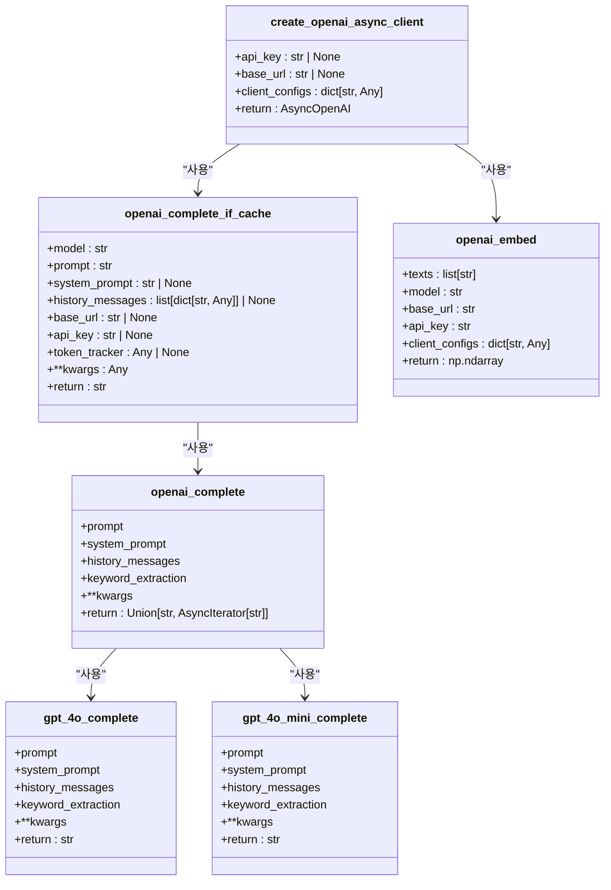
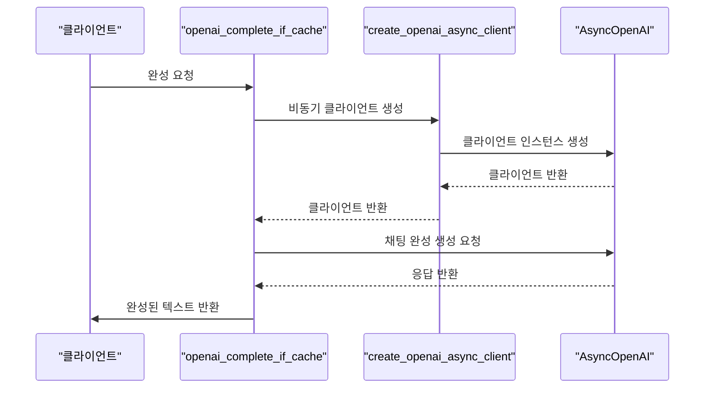
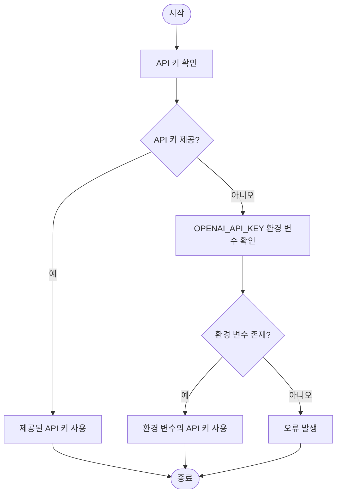
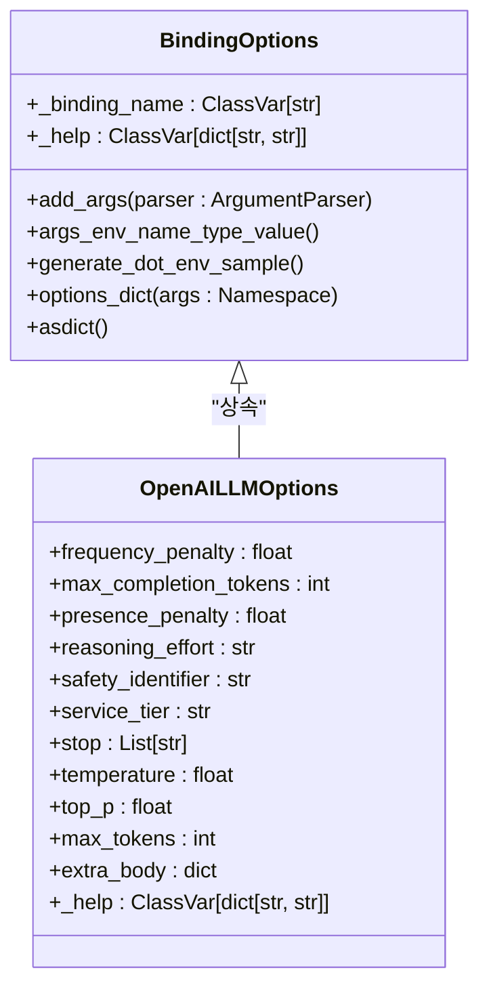
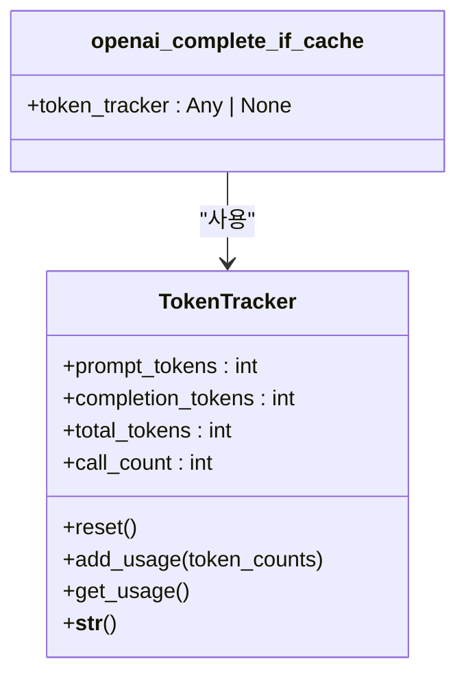
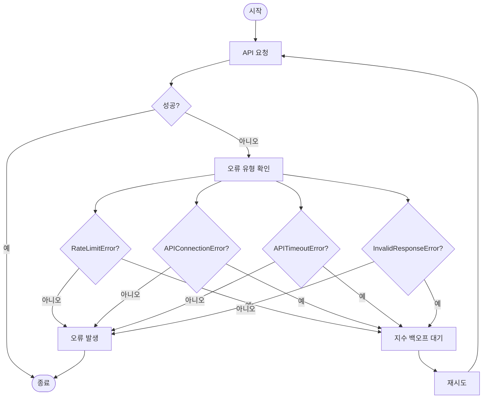
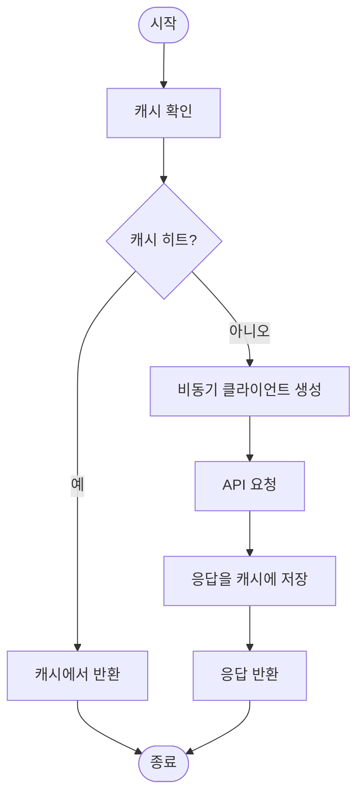
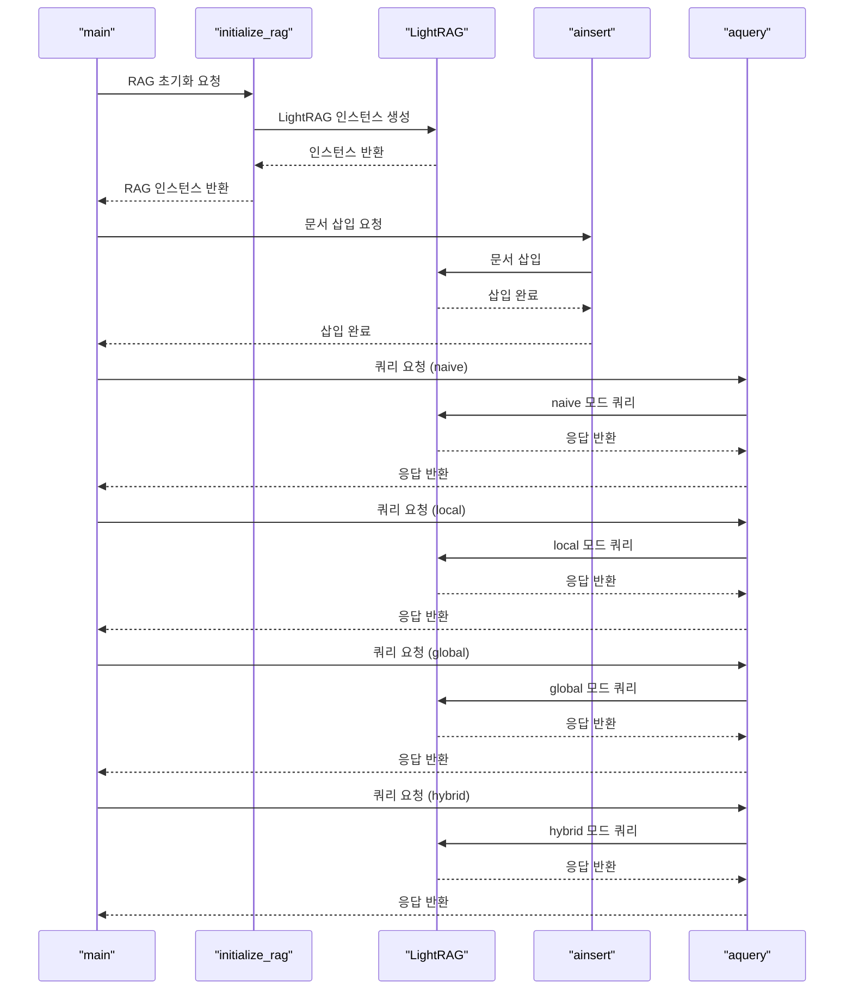

# OpenAI 통합

<cite>
**이 문서에서 참조된 파일**  
- [openai.py](file://lightrag/llm/openai.py)
- [binding_options.py](file://lightrag/llm/binding_options.py)
- [lightrag_openai_demo.py](file://examples/lightrag_openai_demo.py)
- [utils.py](file://lightrag/utils.py)
</cite>

## 목차
1. [소개](#소개)
2. [OpenAI 모듈 구조](#openai-모듈-구조)
3. [비동기 요청 처리](#비동기-요청-처리)
4. [API 키 및 설정 구성](#api-키-및-설정-구성)
5. [LLM 바인딩 생성 및 주입](#llm-바인딩-생성-및-주입)
6. [토큰 사용량 추적](#토큰-사용량-추적)
7. [오류 처리 및 재시도 로직](#오류-처리-및-재시도-로직)
8. [성능 최적화 전략](#성능-최적화-전략)
9. [실제 사용 사례](#실제-사용-사례)
10. [응답 지연 시간과 비용 간의 트레이드오프](#응답-지연-시간과-비용-간의-트레이드오프)

## 소개

LightRAG는 OpenAI의 다양한 모델(GPT-3.5, GPT-4 등)을 통합하여 고급 RAG(Retrieval-Augmented Generation) 기능을 제공하는 프레임워크입니다. 이 문서는 OpenAI 모델을 LightRAG에 통합하는 방법을 상세히 설명하며, 핵심 구성 요소인 `openai.py` 모듈의 구현 구조, 비동기 요청 처리 방식, API 키 및 기본 설정 구성 절차, LLM 바인딩 생성 및 주입 방법, 토큰 사용량 추적, rate limit 처리, 오류 재시도 로직, 성능 최적화 전략 등을 다룹니다. 또한 `lightrag_openai_demo.py` 예제를 기반으로 실제 사용 사례를 시연하고, 응답 지연 시간과 비용 간의 트레이드오프를 논의합니다.

## OpenAI 모듈 구조

`openai.py` 모듈은 OpenAI API와의 상호 작용을 위한 핵심 구성 요소를 제공합니다. 이 모듈은 비동기 클라이언트 생성, 완성 요청 처리, 임베딩 생성 등의 기능을 포함합니다.

**Diagram sources**
- [openai.py](file://lightrag/llm/openai.py#L49-L90)
- [openai.py](file://lightrag/llm/openai.py#L108-L346)
- [openai.py](file://lightrag/llm/openai.py#L449-L487)

**Section sources**
- [openai.py](file://lightrag/llm/openai.py#L1-L488)

## 비동기 요청 처리

`openai.py` 모듈은 `AsyncOpenAI` 클라이언트를 사용하여 비동기적으로 OpenAI API에 요청을 보냅니다. `openai_complete_if_cache` 함수는 캐싱을 지원하며, 모델, 프롬프트, 시스템 프롬프트, 이전 메시지 등을 인자로 받아 완성된 텍스트를 반환합니다. 이 함수는 `tenacity` 라이브러리를 사용하여 재시도 로직을 구현하며, `RateLimitError`, `APIConnectionError`, `APITimeoutError` 등의 예외가 발생할 경우 자동으로 재시도합니다.

**Diagram sources**
- [openai.py](file://lightrag/llm/openai.py#L108-L346)
- [openai.py](file://lightrag/llm/openai.py#L49-L90)

**Section sources**
- [openai.py](file://lightrag/llm/openai.py#L108-L346)

## API 키 및 설정 구성

OpenAI API 키는 환경 변수 또는 런타임 인자로 구성할 수 있습니다. `create_openai_async_client` 함수는 `api_key` 인자가 None인 경우 `OPENAI_API_KEY` 환경 변수를 사용합니다. 또한 `base_url` 인자가 None인 경우 `OPENAI_API_BASE` 환경 변수를 사용하거나 기본 OpenAI API URL을 사용합니다.

**Diagram sources**
- [openai.py](file://lightrag/llm/openai.py#L61-L71)

**Section sources**
- [openai.py](file://lightrag/llm/openai.py#L61-L71)

## LLM 바인딩 생성 및 주입

`binding_options.py` 모듈은 다양한 LLM 바인딩을 위한 컨테이너를 제공합니다. `OpenAILLMOptions` 클래스는 OpenAI LLM에 대한 구성 옵션을 정의하며, `add_args` 메서드를 사용하여 명령줄 인자와 환경 변수를 지원합니다. `options_dict` 메서드는 파싱된 인자에서 특정 바인딩의 옵션을 추출합니다.

**Diagram sources**
- [binding_options.py](file://lightrag/llm/binding_options.py#L445-L477)

**Section sources**
- [binding_options.py](file://lightrag/llm/binding_options.py#L445-L477)

## 토큰 사용량 추적

`TokenTracker` 클래스는 LLM 호출의 토큰 사용량을 추적합니다. `add_usage` 메서드는 각 LLM 호출의 토큰 사용량을 추가하며, `get_usage` 메서드는 현재 사용량 통계를 반환합니다. `openai_complete_if_cache` 함수는 `token_tracker` 인자를 사용하여 토큰 사용량을 추적합니다.

**Diagram sources**
- [utils.py](file://lightrag/utils.py#L1882-L1936)
- [openai.py](file://lightrag/llm/openai.py#L108-L346)

**Section sources**
- [utils.py](file://lightrag/utils.py#L1882-L1936)
- [openai.py](file://lightrag/llm/openai.py#L108-L346)

## 오류 처리 및 재시도 로직

`openai_complete_if_cache` 함수는 `tenacity` 라이브러리를 사용하여 재시도 로직을 구현합니다. `RateLimitError`, `APIConnectionError`, `APITimeoutError`, `InvalidResponseError` 등의 예외가 발생할 경우 자동으로 재시도합니다. 재시도 간격은 지수 백오프 방식으로 증가합니다.

**Diagram sources**
- [openai.py](file://lightrag/llm/openai.py#L108-L346)

**Section sources**
- [openai.py](file://lightrag/llm/openai.py#L108-L346)

## 성능 최적화 전략

`openai.py` 모듈은 연결 풀링 및 캐싱 전략을 통해 성능을 최적화합니다. `create_openai_async_client` 함수는 `client_configs` 인자를 사용하여 추가 구성 옵션을 전달할 수 있으며, 이는 연결 풀링과 같은 고급 기능을 가능하게 합니다. 또한 `openai_complete_if_cache` 함수는 캐싱을 지원하여 반복적인 요청의 응답 시간을 단축합니다.

**Diagram sources**
- [openai.py](file://lightrag/llm/openai.py#L108-L346)
- [openai.py](file://lightrag/llm/openai.py#L49-L90)

**Section sources**
- [openai.py](file://lightrag/llm/openai.py#L108-L346)

## 실제 사용 사례

`lightrag_openai_demo.py` 예제는 OpenAI 모델을 사용하는 LightRAG 인스턴스를 초기화하고, 문서를 삽입한 후 다양한 쿼리 모드(naive, local, global, hybrid)로 검색하는 방법을 보여줍니다. 이 예제는 `gpt_4o_mini_complete` 함수를 LLM 모델 함수로 사용하며, `openai_embed` 함수를 임베딩 함수로 사용합니다.

**Diagram sources**
- [lightrag_openai_demo.py](file://examples/lightrag_openai_demo.py#L1-L190)

**Section sources**
- [lightrag_openai_demo.py](file://examples/lightrag_openai_demo.py#L1-L190)

## 응답 지연 시간과 비용 간의 트레이드오프

OpenAI 모델을 사용할 때 응답 지연 시간과 비용 간에는 트레이드오프가 존재합니다. 더 큰 모델(GPT-4)은 더 정확하고 복잡한 응답을 제공하지만, 더 비싸고 응답 시간이 더 길 수 있습니다. 반면, 더 작은 모델(GPT-3.5-turbo)은 더 저렴하고 빠르지만, 응답 품질이 낮을 수 있습니다. LightRAG는 이러한 트레이드오프를 고려하여 적절한 모델을 선택하고, 캐싱과 같은 성능 최적화 전략을 통해 비용과 지연 시간을 최소화할 수 있습니다.