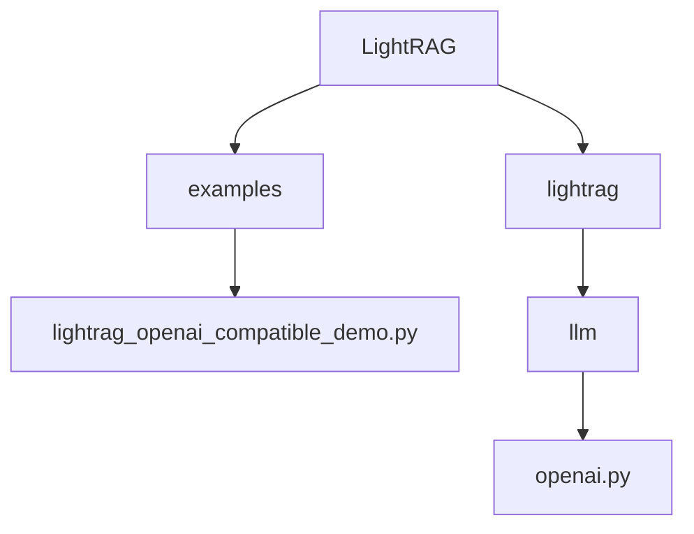
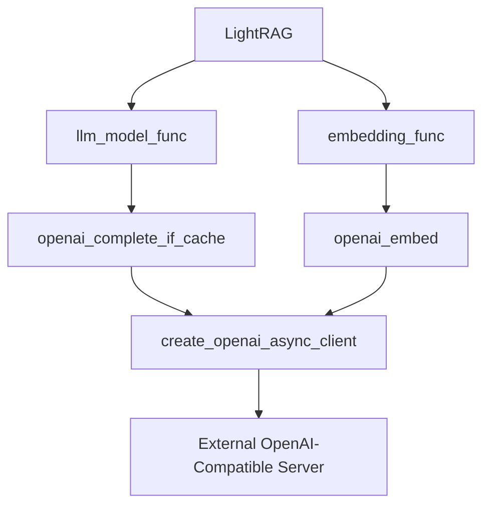
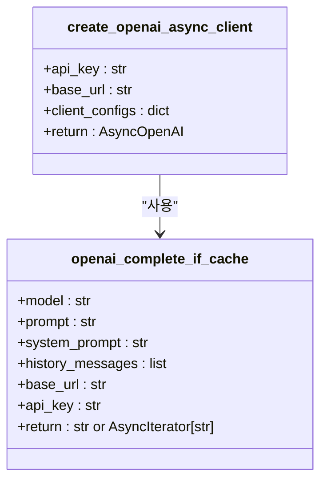
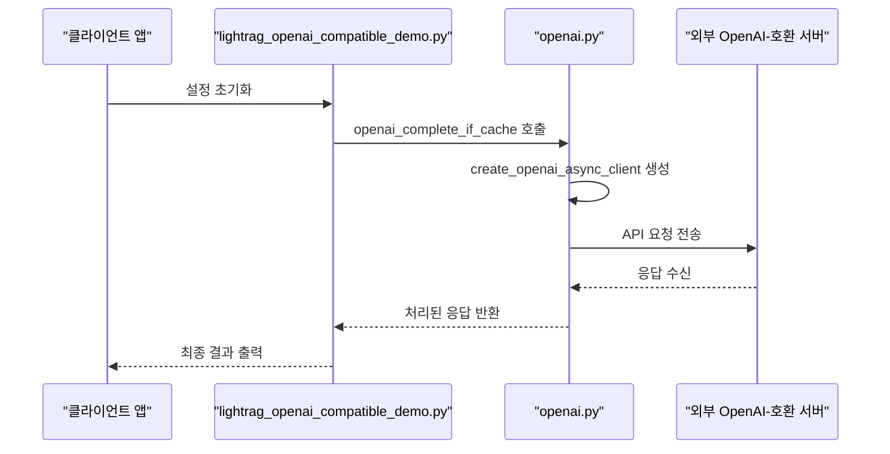
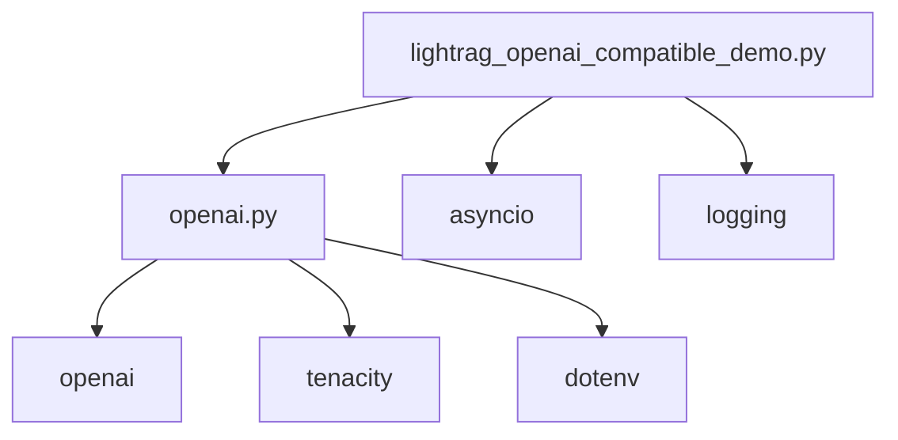

# OpenAI 호환 API 통합

<cite>
**이 문서에서 참조한 파일**
- [lightrag_openai_compatible_demo.py](file://examples/lightrag_openai_compatible_demo.py)
- [openai.py](file://lightrag/llm/openai.py)
</cite>

## 목차
1. [소개](#소개)
2. [프로젝트 구조](#프로젝트-구조)
3. [핵심 구성 요소](#핵심-구성-요소)
4. [아키텍처 개요](#아키텍처-개요)
5. [상세 구성 요소 분석](#상세-구성-요소-분석)
6. [의존성 분석](#의존성-분석)
7. [성능 고려 사항](#성능-고려-사항)
8. [문제 해결 가이드](#문제-해결-가이드)
9. [결론](#결론)

## 소개
이 문서는 OpenAI API 사양을 따르는 호환 가능한 LLM 서비스(예: LocalAI, vLLM, Ollama with OpenAI wrapper)를 LightRAG에 통합하는 방법을 설명합니다. 특히 `openai.py` 모듈이 커스텀 엔드포인트를 지원하는 방식을 분석하고, `base_url` 파라미터를 사용하여 외부 OpenAI-호환 서버를 지정하는 방법을 안내합니다. `lightrag_openai_compatible_demo.py` 예제를 기반으로 설정 절차와 인증 방식을 설명하고, 응답 형식 및 오류 코드 호환성 문제를 해결하는 방법을 제시합니다. 또한 토큰 제한, 컨텍스트 길이, 스트리밍 지원 여부를 테스트하는 검증 절차를 포함하며, 폴백 전략 및 다중 백엔드 오케스트레이션을 위한 모범 사례를 제공합니다.

## 프로젝트 구조
LightRAG 프로젝트는 다양한 LLM 백엔드와의 통합을 지원하기 위해 모듈화된 구조를 가지고 있습니다. 핵심적인 LLM 통합 기능은 `lightrag/llm` 디렉터리에 위치하며, 각 LLM 제공자별로 별도의 모듈이 존재합니다. OpenAI 호환 API 통합은 `openai.py` 파일에서 처리되며, 이는 OpenAI의 공식 API 사양을 따르는 모든 서비스와의 호환성을 제공합니다. 예제 코드는 `examples` 디렉터리에 위치하며, `lightrag_openai_compatible_demo.py` 파일은 OpenAI-호환 서버와의 통합을 위한 구체적인 설정과 사용법을 보여줍니다.

**다이어그램 출처**
- [lightrag_openai_compatible_demo.py](file://examples/lightrag_openai_compatible_demo.py)
- [openai.py](file://lightrag/llm/openai.py)

**섹션 출처**
- [lightrag_openai_compatible_demo.py](file://examples/lightrag_openai_compatible_demo.py)
- [openai.py](file://lightrag/llm/openai.py)

## 핵심 구성 요소
LightRAG의 OpenAI 호환 API 통합은 두 가지 핵심 구성 요소로 이루어져 있습니다. 첫째, `openai.py` 모듈은 OpenAI의 비동기 클라이언트를 사용하여 다양한 OpenAI-호환 서비스와의 통신을 처리합니다. 이 모듈은 `base_url` 파라미터를 통해 커스텀 엔드포인트를 지정할 수 있도록 설계되어 있으며, 이를 통해 LocalAI, vLLM, Ollama 등의 서비스와의 통합이 가능합니다. 둘째, `lightrag_openai_compatible_demo.py` 예제 파일은 이러한 통합을 실제로 구현하는 방법을 보여주며, 환경 변수를 통해 API 키와 호스트 주소를 설정하는 방법을 포함합니다.

**섹션 출처**
- [lightrag_openai_compatible_demo.py](file://examples/lightrag_openai_compatible_demo.py#L0-L227)
- [openai.py](file://lightrag/llm/openai.py#L0-L487)

## 아키텍처 개요
LightRAG의 OpenAI 호환 API 통합 아키텍처는 모듈화된 설계를 기반으로 하며, LLM 백엔드와의 분리된 인터페이스를 제공합니다. 이 아키텍처는 `LightRAG` 클래스가 `llm_model_func`과 `embedding_func`을 통해 LLM 및 임베딩 서비스와 상호작용하는 방식으로 작동합니다. `openai.py` 모듈은 `openai_complete_if_cache` 함수를 통해 OpenAI-호환 API와의 통신을 처리하며, `create_openai_async_client` 함수는 `base_url`과 `api_key`를 사용하여 커스텀 클라이언트를 생성합니다. 이 구조는 다양한 OpenAI-호환 서비스와의 유연한 통합을 가능하게 합니다.

**다이어그램 출처**
- [openai.py](file://lightrag/llm/openai.py#L49-L90)
- [openai.py](file://lightrag/llm/openai.py#L152-L188)

## 상세 구성 요소 분석
### openai.py 모듈 분석
`openai.py` 모듈은 OpenAI-호환 API와의 통합을 위한 핵심 기능을 제공합니다. 이 모듈은 `AsyncOpenAI` 클라이언트를 사용하여 비동기 방식으로 API 요청을 처리하며, `tenacity` 라이브러리를 통해 재시도 메커니즘을 구현합니다. `create_openai_async_client` 함수는 `api_key`와 `base_url`을 매개변수로 받아 커스텀 클라이언트를 생성하며, 이는 OpenAI-호환 서비스의 엔드포인트를 지정하는 데 사용됩니다. `openai_complete_if_cache` 함수는 캐싱 기능을 포함하여 LLM 완성 요청을 처리하며, 스트리밍 응답을 지원합니다.

**다이어그램 출처**
- [openai.py](file://lightrag/llm/openai.py#L49-L90)
- [openai.py](file://lightrag/llm/openai.py#L108-L346)

### lightrag_openai_compatible_demo.py 예제 분석
`lightrag_openai_compatible_demo.py` 예제는 OpenAI-호환 서비스와의 통합을 위한 구체적인 설정과 사용법을 보여줍니다. 이 예제는 환경 변수를 통해 `LLM_BINDING_API_KEY`와 `LLM_BINDING_HOST`를 설정하며, 이를 통해 외부 OpenAI-호환 서버의 API 키와 엔드포인트를 지정합니다. `llm_model_func`은 `openai_complete_if_cache` 함수를 래핑하여 사용하며, `base_url` 매개변수를 통해 커스텀 엔드포인트를 전달합니다. 이 예제는 다양한 검색 모드(naive, local, global, hybrid)를 통해 RAG 파이프라인의 기능을 검증합니다.

**다이어그램 출처**
- [lightrag_openai_compatible_demo.py](file://examples/lightrag_openai_compatible_demo.py#L96)
- [openai.py](file://lightrag/llm/openai.py#L152-L188)

**섹션 출처**
- [lightrag_openai_compatible_demo.py](file://examples/lightrag_openai_compatible_demo.py#L0-L227)
- [openai.py](file://lightrag/llm/openai.py#L0-L487)

## 의존성 분석
LightRAG의 OpenAI 호환 API 통합은 여러 외부 의존성에 기반하고 있습니다. 핵심 의존성은 `openai` Python 패키지이며, 이는 `pipmaster`를 통해 동적으로 설치됩니다. `tenacity` 패키지는 재시도 메커니즘을 제공하며, `dotenv` 패키지는 환경 변수 관리를 담당합니다. 이러한 의존성은 `openai.py` 모듈 내에서 명시적으로 관리되며, `lightrag_openai_compatible_demo.py` 예제는 이러한 의존성들을 활용하여 OpenAI-호환 서비스와의 통합을 구현합니다.

**다이어그램 출처**
- [openai.py](file://lightrag/llm/openai.py#L0-L55)
- [lightrag_openai_compatible_demo.py](file://examples/lightrag_openai_compatible_demo.py#L0-L37)

**섹션 출처**
- [openai.py](file://lightrag/llm/openai.py#L0-L487)
- [lightrag_openai_compatible_demo.py](file://examples/lightrag_openai_compatible_demo.py#L0-L227)

## 성능 고려 사항
OpenAI 호환 API 통합 시 성능을 최적화하기 위해 몇 가지 고려 사항이 있습니다. 첫째, `openai_complete_if_cache` 함수는 캐싱 기능을 제공하여 반복적인 요청에 대한 응답 시간을 단축합니다. 둘째, 비동기 처리를 통해 여러 요청을 동시에 처리할 수 있으며, 이는 RAG 파이프라인의 전반적인 처리 속도를 향상시킵니다. 셋째, `base_url`을 통해 로컬 또는 근접한 서버를 사용하면 네트워크 지연을 최소화할 수 있습니다. 마지막으로, 스트리밍 응답을 활용하면 사용자에게 더 빠른 피드백을 제공할 수 있습니다.

## 문제 해결 가이드
OpenAI 호환 API 통합 시 발생할 수 있는 문제와 그 해결 방법은 다음과 같습니다. 첫째, `APIConnectionError`는 네트워크 연결 문제를 나타내며, `base_url`이 올바르게 설정되었는지 확인해야 합니다. 둘째, `RateLimitError`는 요청 제한을 초과했음을 의미하며, 재시도 메커니즘을 통해 자동으로 처리됩니다. 셋째, `InvalidResponseError`는 응답 형식이 올바르지 않을 때 발생하며, 외부 서버의 응답이 OpenAI API 사양과 호환되는지 확인해야 합니다. 마지막으로, 빈 응답은 모델의 생성 문제가 원인일 수 있으며, 프롬프트를 검토하고 조정해야 합니다.

**섹션 출처**
- [openai.py](file://lightrag/llm/openai.py#L108-L346)
- [lightrag_openai_compatible_demo.py](file://examples/lightrag_openai_compatible_demo.py#L0-L227)

## 결론
LightRAG은 `openai.py` 모듈을 통해 OpenAI API 사양을 따르는 다양한 LLM 서비스와의 통합을 지원합니다. `base_url` 매개변수를 사용하여 커스텀 엔드포인트를 지정함으로써, LocalAI, vLLM, Ollama 등의 서비스와의 유연한 통합이 가능합니다. `lightrag_openai_compatible_demo.py` 예제는 이러한 통합을 위한 구체적인 설정과 사용법을 제공하며, 환경 변수를 통해 API 키와 호스트 주소를 쉽게 관리할 수 있습니다. 이 문서는 응답 형식 및 오류 코드 호환성 문제를 해결하는 방법과 토큰 제한, 컨텍스트 길이, 스트리밍 지원 여부를 테스트하는 검증 절차를 포함하여, 폴백 전략 및 다중 백엔드 오케스트레이션을 위한 모범 사례를 제공합니다.