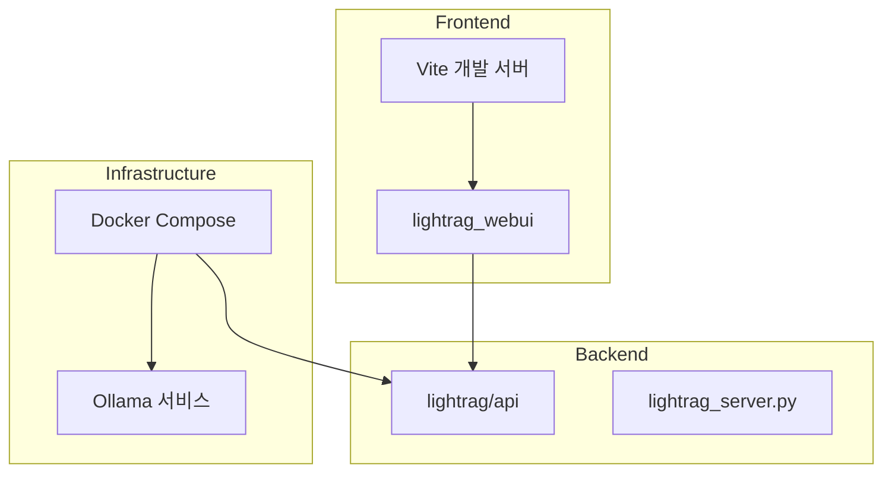
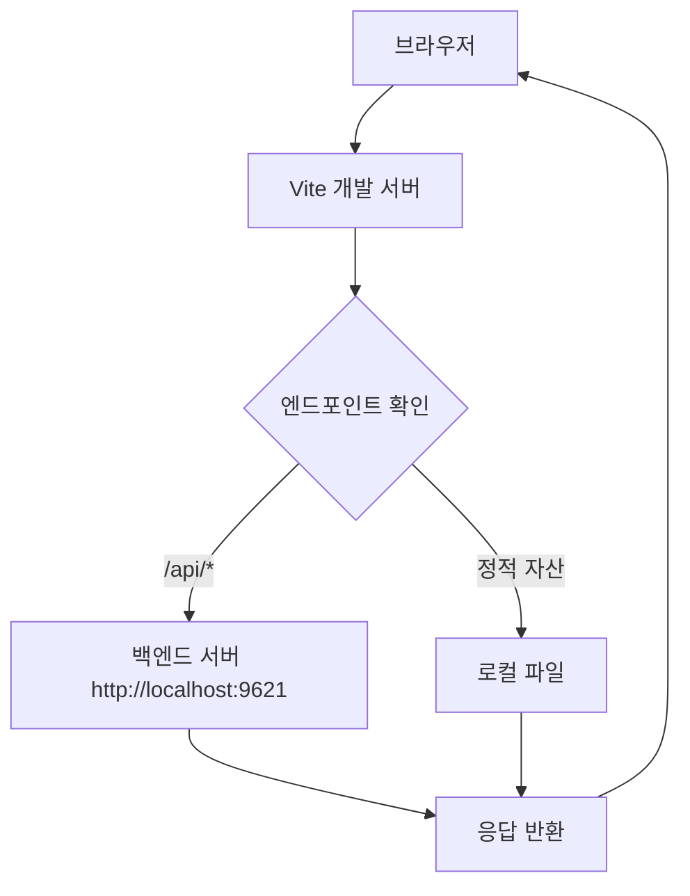
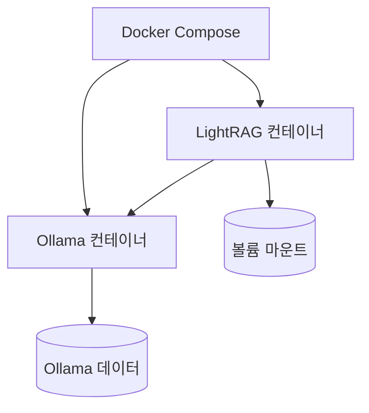

# 개발 환경 설정

<cite>
**이 문서에서 참조한 파일**  
- [pyproject.toml](file://pyproject.toml)
- [setup.py](file://setup.py)
- [docker-compose.yml](file://docker-compose.yml)
- [lightrag_server.py](file://lightrag/api/lightrag_server.py)
- [vite.config.ts](file://lightrag_webui/vite.config.ts)
- [package.json](file://lightrag_webui/package.json)
- [gunicorn_config.py](file://lightrag/api/gunicorn_config.py)
- [config.py](file://lightrag/api/config.py)
</cite>

## 목차
1. [소개](#소개)  
2. [프로젝트 구조](#프로젝트-구조)  
3. [개발 모드 설치](#개발-모드-설치)  
4. [프론트엔드 종속성 설치](#프론트엔드-종속성-설치)  
5. [백엔드 서버 실행](#백엔드-서버-실행)  
6. [프론트엔드 개발 서버 실행](#프론트엔드-개발-서버-실행)  
7. [통합 개발 환경 구성](#통합-개발-환경-구성)  
8. [결론](#결론)

## 소개
이 문서는 LightRAG 프로젝트의 로컬 개발 환경을 설정하는 단계별 절차를 안내합니다. 개발 모드 설치, 프론트엔드 및 백엔드 서버 실행, 그리고 Docker를 통한 통합 개발 환경 구성 방법을 포함합니다. 이 설정을 통해 개발자는 코드 변경 사항을 실시간으로 반영하며 애플리케이션을 개발하고 테스트할 수 있습니다.

## 프로젝트 구조
LightRAG 프로젝트는 다음과 같은 주요 구성 요소로 이루어져 있습니다:

- `lightrag/`: 백엔드 API 및 핵심 RAG 로직
- `lightrag_webui/`: Vite 기반 프론트엔드 UI
- `docker-compose.yml`: 컨테이너 기반 통합 개발 환경 정의
- `pyproject.toml`: Python 패키지 및 종속성 관리



**Diagram sources**  
- [lightrag_webui](file://lightrag_webui)
- [lightrag/api](file://lightrag/api)
- [docker-compose.yml](file://docker-compose.yml)

**Section sources**  
- [lightrag_webui](file://lightrag_webui)
- [lightrag/api](file://lightrag/api)
- [docker-compose.yml](file://docker-compose.yml)

## 개발 모드 설치
Python 패키지를 개발 모드로 설치하여 코드 변경 시 재설치 없이 바로 반영할 수 있습니다.

```bash
pip install -e .
```

이 명령어는 `pyproject.toml` 또는 `setup.py`에 정의된 패키지를 현재 디렉터리에 링크하여 설치합니다. 이후 `lightrag` 패키지의 코드를 수정하면 즉시 반영됩니다.

**Section sources**  
- [pyproject.toml](file://pyproject.toml#L0-L105)
- [setup.py](file://setup.py#L0-L6)

## 프론트엔드 종속성 설치
프론트엔드 종속성을 설치하려면 `lightrag_webui` 디렉터리로 이동한 후 다음 명령어를 실행합니다:

```bash
cd lightrag_webui
npm install
```

또는 `bun`을 사용할 수 있습니다:

```bash
bun install
```

`package.json` 파일에는 React, Tailwind CSS, Radix UI, Sigma.js 등 다양한 UI 및 그래프 시각화 라이브러리가 정의되어 있습니다.

**Section sources**  
- [package.json](file://lightrag_webui/package.json#L0-L100)

## 백엔드 서버 실행
백엔드 서버는 `lightrag_server.py`를 통해 실행할 수 있습니다.

```bash
python -m lightrag.api.lightrag_server --host 0.0.0.0 --port 9621
```

또는 `pyproject.toml`에 정의된 스크립트를 사용할 수 있습니다:

```bash
lightrag-server --host 0.0.0.0 --port 9621
```

서버는 FastAPI 기반으로, `/api` 엔드포인트를 통해 REST API를 제공하며, `/webui` 경로를 통해 프론트엔드를 제공합니다.

**Section sources**  
- [lightrag_server.py](file://lightrag/api/lightrag_server.py#L0-L799)
- [config.py](file://lightrag/api/config.py#L0-L424)
- [pyproject.toml](file://pyproject.toml#L45-L48)

## 프론트엔드 개발 서버 실행
Vite 기반 프론트엔드 개발 서버를 실행하여 실시간 리로딩 기능을 사용할 수 있습니다.

```bash
cd lightrag_webui
npm run dev
```

또는 `bun`을 사용:

```bash
bunx --bun vite
```

`vite.config.ts` 파일은 프록시 설정을 통해 백엔드 API 요청을 자동으로 `http://localhost:9621`로 전달하도록 구성되어 있습니다. 이는 프론트엔드와 백엔드를 분리된 서버에서 실행하더라도 API 호출이 원활하게 이루어지도록 합니다.



**Diagram sources**  
- [vite.config.ts](file://lightrag_webui/vite.config.ts#L0-L75)

**Section sources**  
- [vite.config.ts](file://lightrag_webui/vite.config.ts#L0-L75)
- [package.json](file://lightrag_webui/package.json#L5-L10)

## 통합 개발 환경 구성
`docker-compose.yml` 파일을 사용하여 Ollama 및 LightRAG 백엔드를 포함한 통합 개발 환경을 구성할 수 있습니다.

```bash
docker-compose up --build
```

이 명령어는 다음을 수행합니다:

- `ollama` 컨테이너를 포트 9622(호스트) → 11434(컨테이너)로 실행
- `lightrag` 컨테이너를 `.env` 파일과 설정을 기반으로 빌드 및 실행
- 볼륨 마운트를 통해 데이터 영속성 보장
- Ollama 서비스 종료 후 LightRAG 시작 (의존성 관리)

환경 변수는 `.env` 파일 또는 `docker-compose.yml`에서 설정할 수 있으며, `PORT`, `WORKING_DIR`, `LLM_MODEL` 등의 설정이 가능합니다.



**Diagram sources**  
- [docker-compose.yml](file://docker-compose.yml#L0-L49)

**Section sources**  
- [docker-compose.yml](file://docker-compose.yml#L0-L49)

## 결론
이 문서는 LightRAG 프로젝트의 로컬 개발 환경 설정을 위한 포괄적인 안내를 제공합니다. 개발 모드 설치, 프론트엔드 및 백엔드 서버 실행, 그리고 Docker를 통한 통합 환경 구성까지 모든 핵심 절차를 다루었습니다. 이 설정을 통해 개발자는 효율적으로 기능을 개발하고 테스트할 수 있습니다.