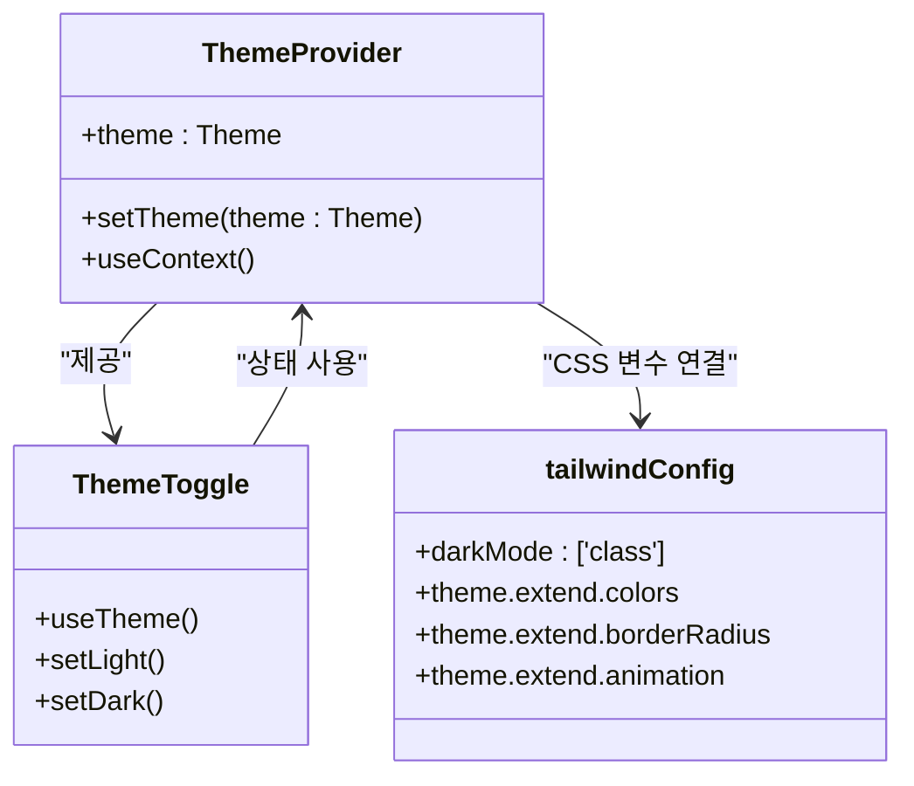
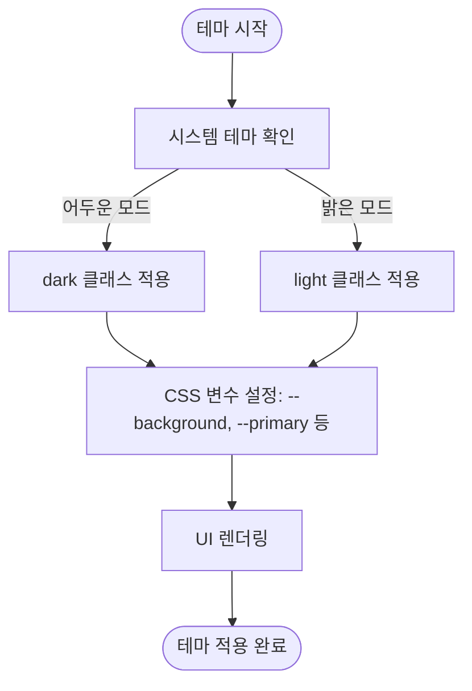
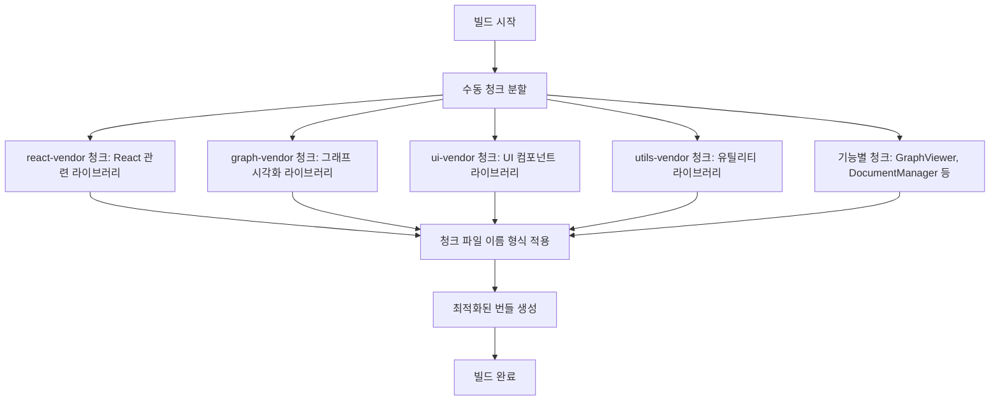
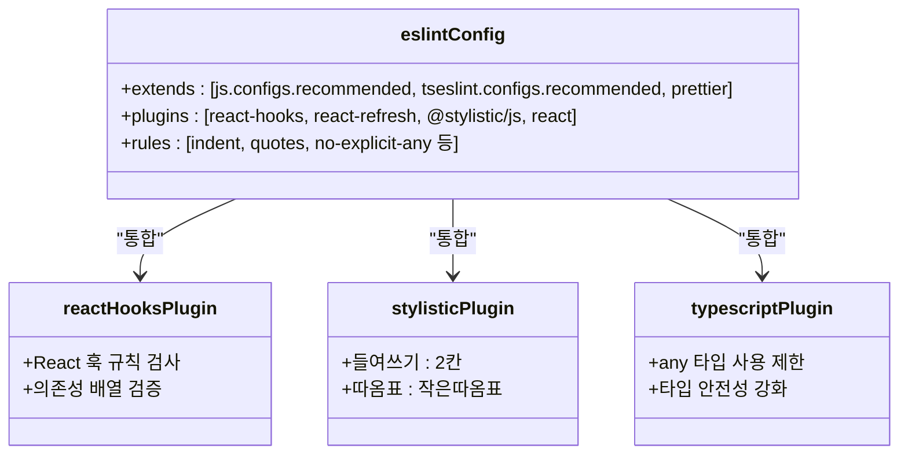
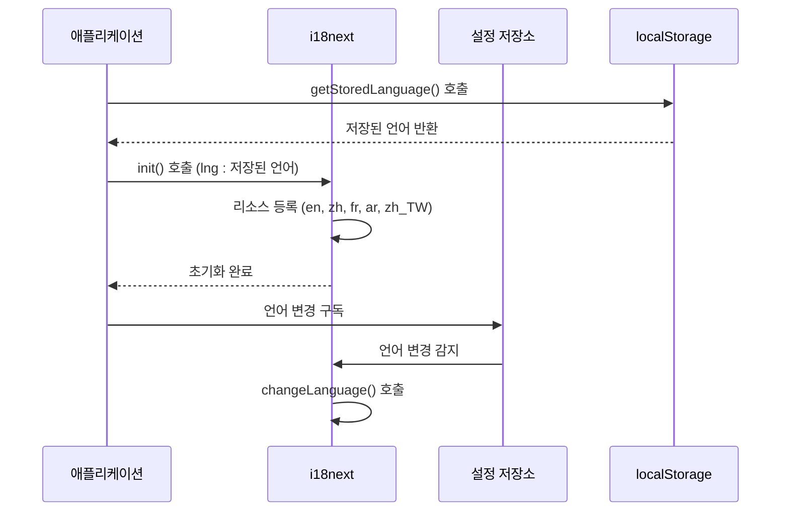
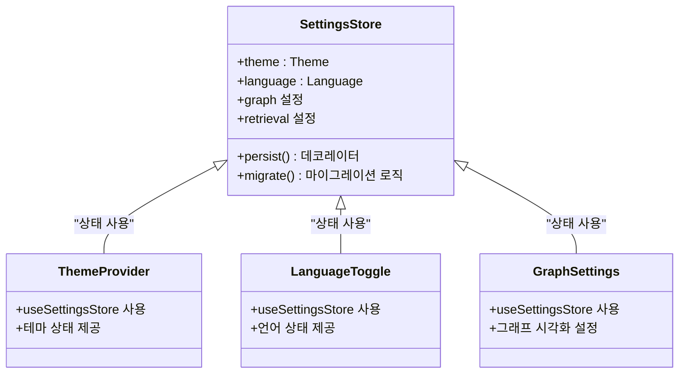

# 프론트엔드 구성 커스터마이징

<cite>
**이 문서에서 참조한 파일**  
- [tailwind.config.js](file://lightrag_webui/tailwind.config.js)
- [vite.config.ts](file://lightrag_webui/vite.config.ts)
- [eslint.config.js](file://lightrag_webui/eslint.config.js)
- [i18n.ts](file://lightrag_webui/src/i18n.ts)
- [ThemeProvider.tsx](file://lightrag_webui/src/components/ThemeProvider.tsx)
- [ThemeToggle.tsx](file://lightrag_webui/src/components/ThemeToggle.tsx)
- [LanguageToggle.tsx](file://lightrag_webui/src/components/LanguageToggle.tsx)
- [settings.ts](file://lightrag_webui/src/stores/settings.ts)
- [index.css](file://lightrag_webui/src/index.css)
- [constants.ts](file://lightrag_webui/src/lib/constants.ts)
</cite>

## 목차
1. [소개](#소개)
2. [Tailwind CSS를 통한 테마 및 스타일 확장](#tailwind-css를-통한-테마-및-스타일-확장)
3. [Vite 구성 및 빌드 최적화](#vite-구성-및-빌드-최적화)
4. [ESLint을 통한 코드 품질 규칙 커스터마이징](#eslint을-통한-코드-품질-규칙-커스터마이징)
5. [다국어(i18n) 지원 전략](#다국어i18n-지원-전략)
6. [UI 컴포넌트 확장 및 커스터마이징](#ui-컴포넌트-확장-및-커스터마이징)
7. [결론](#결론)

## 소개
이 문서는 `lightrag_webui` 디렉터리의 구성 파일을 기반으로 프론트엔드 사용자 인터페이스를 커스터마이징하는 방법을 설명합니다. Tailwind CSS, Vite, ESLint 구성 파일을 활용하여 테마, 빌드 최적화, 코드 품질을 제어하는 방법과 다국어 지원 및 UI 컴포넌트 확장 전략을 안내합니다.

**Section sources**
- [tailwind.config.js](file://lightrag_webui/tailwind.config.js)
- [vite.config.ts](file://lightrag_webui/vite.config.ts)
- [eslint.config.js](file://lightrag_webui/eslint.config.js)

## Tailwind CSS를 통한 테마 및 스타일 확장

### 테마 구성 구조
`tailwind.config.js` 파일은 어두운 모드 지원, 색상 팔레트, 반응형 디자인 및 애니메이션을 위한 확장 가능한 테마 시스템을 제공합니다. 이 구성은 CSS 변수 기반의 동적 테마 전환을 가능하게 합니다.



**Diagram sources**
- [tailwind.config.js](file://lightrag_webui/tailwind.config.js#L1-L273)
- [ThemeProvider.tsx](file://lightrag_webui/src/components/ThemeProvider.tsx#L1-L59)
- [ThemeToggle.tsx](file://lightrag_webui/src/components/ThemeToggle.tsx#L1-L41)

### 색상 및 테마 확장
Tailwind 구성은 `hsl(var(--color))` 패턴을 사용하여 CSS 변수 기반의 색상 시스템을 구현합니다. `--background`, `--foreground`, `--primary` 등의 변수는 `src/index.css`에서 정의되며, 어두운 모드와 밝은 모드 모두에서 일관된 시각적 경험을 제공합니다.



**Diagram sources**
- [tailwind.config.js](file://lightrag_webui/tailwind.config.js#L1-L273)
- [index.css](file://lightrag_webui/src/index.css#L1-L170)
- [ThemeProvider.tsx](file://lightrag_webui/src/components/ThemeProvider.tsx#L1-L59)

### 사용자 정의 확장
`tailwind.config.js`의 `extend` 섹션을 통해 다음과 같은 사용자 정의 확장이 가능합니다:
- **색상**: `primary`, `secondary`, `destructive` 등 컴포넌트별 색상 정의
- **테두리 반경**: `lg`, `md`, `sm` 크기의 반올림된 모서리
- **애니메이션**: 아코디언 열기/닫기 애니메이션
- **타이포그래피**: 링크, 제목, 인용문 등에 대한 세부 스타일링

**Section sources**
- [tailwind.config.js](file://lightrag_webui/tailwind.config.js#L1-L273)
- [index.css](file://lightrag_webui/src/index.css#L1-L170)

## Vite 구성 및 빌드 최적화

### 플러그인 구성
`vite.config.ts` 파일은 프로젝트의 핵심 빌드 및 개발 서버 구성을 정의합니다. 주요 플러그인으로는 React SWC, Tailwind CSS 통합이 포함됩니다.

```mermaid
classDiagram
class viteConfig {
+plugins : [react(), tailwindcss()]
+resolve.alias : {'@' : './src'}
+build.outDir : '../lightrag/api/webui'
+server.proxy : API 엔드포인트 매핑
}
class reactPlugin {
+JSX 변환
+HMR 지원
}
class tailwindPlugin {
+JIT 컴파일
+스타일 생성
}
class buildOptimizer {
+manualChunks
+chunkSizeWarningLimit
}
viteConfig --> reactPlugin : "사용"
viteConfig --> tailwindPlugin : "사용"
viteConfig --> buildOptimizer : "빌드 최적화"
```

**Diagram sources**
- [vite.config.ts](file://lightrag_webui/vite.config.ts#L1-L76)

### 빌드 최적화 전략
Vite 구성은 수동 청크 분할(manual chunking)을 통해 빌드 성능을 최적화합니다. 이 전략은 자주 변경되지 않는 라이브러리를 별도의 청크로 분리하여 브라우저 캐싱을 극대화합니다.



**Diagram sources**
- [vite.config.ts](file://lightrag_webui/vite.config.ts#L1-L76)

### 개발 서버 프록시
Vite 개발 서버는 백엔드 API 엔드포인트에 대한 프록시를 구성하여 CORS 문제를 해결합니다. `VITE_API_ENDPOINTS` 환경 변수를 통해 프록시할 엔드포인트를 지정할 수 있습니다.

**Section sources**
- [vite.config.ts](file://lightrag_webui/vite.config.ts#L1-L76)

## ESLint을 통한 코드 품질 규칙 커스터마이징

### ESLint 구성 구조
`eslint.config.js` 파일은 TypeScript 및 React 프로젝트를 위한 포괄적인 코드 품질 규칙을 정의합니다. 이 구성은 여러 ESLint 플러그인을 통합하여 일관된 코딩 스타일을 유지합니다.



**Diagram sources**
- [eslint.config.js](file://lightrag_webui/eslint.config.js#L1-L37)

### 사용자 정의 규칙
ESLint 구성은 다음과 같은 사용자 정의 규칙을 포함합니다:
- **들여쓰기**: 2칸 공백 사용
- **따옴표**: 작은따옴표(') 사용
- **TypeScript**: `any` 타입 사용 비활성화
- **React**: 훅 규칙 및 JSX 런타임 활성화

**Section sources**
- [eslint.config.js](file://lightrag_webui/eslint.config.js#L1-L37)

## 다국어(i18n) 지원 전략

### i18n 초기화 및 구성
`i18n.ts` 파일은 다국어 지원을 위한 초기화 로직을 포함합니다. 이 파일은 저장된 언어 설정을 기반으로 i18next를 초기화하며, 지원되는 언어 리소스를 등록합니다.



**Diagram sources**
- [i18n.ts](file://lightrag_webui/src/i18n.ts#L1-L53)
- [settings.ts](file://lightrag_webui/src/stores/settings.ts#L1-L306)

### 언어 전환 컴포넌트
`LanguageToggle` 컴포넌트는 현재 언어에 따라 다른 텍스트와 툴팁을 표시하며, 클릭 시 언어를 전환합니다. 이 컴포넌트는 zustand 저장소와 i18next를 통합하여 상태를 동기화합니다.

```mermaid
flowchart TD
A[LanguageToggle 렌더링] --> B{현재 언어 확인}
B --> |zh| C["EN 버튼 표시"]
B --> |en| D["중 버튼 표시"]
C --> E[영어로 전환 클릭]
D --> F[중국어로 전환 클릭]
E --> G[i18n.changeLanguage('en')]
F --> H[i18n.changeLanguage('zh')]
G --> I[setLanguage('en')]
H --> J[setLanguage('zh')]
I --> K[저장소 상태 업데이트]
J --> K
K --> L[UI 재렌더링]
```

**Diagram sources**
- [LanguageToggle.tsx](file://lightrag_webui/src/components/LanguageToggle.tsx#L1-L50)
- [i18n.ts](file://lightrag_webui/src/i18n.ts#L1-L53)
- [settings.ts](file://lightrag_webui/src/stores/settings.ts#L1-L306)

### 지원 언어
현재 프로젝트는 다음 언어를 지원합니다:
- 영어(en)
- 중국어 간체(zh)
- 프랑스어(fr)
- 아랍어(ar)
- 중국어 번체(zh_TW)

언어 리소스는 `src/locales` 디렉터리에 JSON 파일로 저장되어 있으며, 각 언어별로 번역된 문자열을 포함합니다.

**Section sources**
- [i18n.ts](file://lightrag_webui/src/i18n.ts#L1-L53)
- [LanguageToggle.tsx](file://lightrag_webui/src/components/LanguageToggle.tsx#L1-L50)
- [locales](file://lightrag_webui/src/locales)

## UI 컴포넌트 확장 및 커스터마이징

### 상태 관리 아키텍처
UI 컴포넌트는 zustand 기반의 상태 관리 시스템을 사용하여 설정과 상태를 중앙에서 관리합니다. `settings.ts` 파일은 애플리케이션의 모든 설정을 정의하며, localStorage에 지속적으로 저장됩니다.



**Diagram sources**
- [settings.ts](file://lightrag_webui/src/stores/settings.ts#L1-L306)
- [ThemeProvider.tsx](file://lightrag_webui/src/components/ThemeProvider.tsx#L1-L59)
- [LanguageToggle.tsx](file://lightrag_webui/src/components/LanguageToggle.tsx#L1-L50)

### 컴포넌트 확장 전략
UI 컴포넌트는 다음과 같은 전략을 통해 확장 및 커스터마이징할 수 있습니다:
- **별칭 경로**: `@` 별칭을 사용하여 `src` 디렉터리의 파일을 간편하게 참조
- **상수 정의**: `constants.ts` 파일에 UI 관련 상수 정의
- **테마 통합**: Tailwind CSS와 CSS 변수를 통한 일관된 시각적 디자인
- **지속성**: localStorage를 통한 사용자 설정 유지

**Section sources**
- [settings.ts](file://lightrag_webui/src/stores/settings.ts#L1-L306)
- [constants.ts](file://lightrag_webui/src/lib/constants.ts#L1-L77)
- [ThemeProvider.tsx](file://lightrag_webui/src/components/ThemeProvider.tsx#L1-L59)

## 결론
`lightrag_webui` 프로젝트는 Tailwind CSS, Vite, ESLint, i18next를 효과적으로 통합하여 확장 가능한 프론트엔드 아키텍처를 제공합니다. 테마 및 스타일 확장, 빌드 최적화, 코드 품질 관리, 다국어 지원, UI 컴포넌트 확장 전략을 통해 사용자 정의 요구사항에 맞게 프론트엔드를 유연하게 조정할 수 있습니다. 이러한 구성은 유지보수성과 확장성을 극대화하며, 다양한 사용자 환경에서 일관된 경험을 제공합니다.