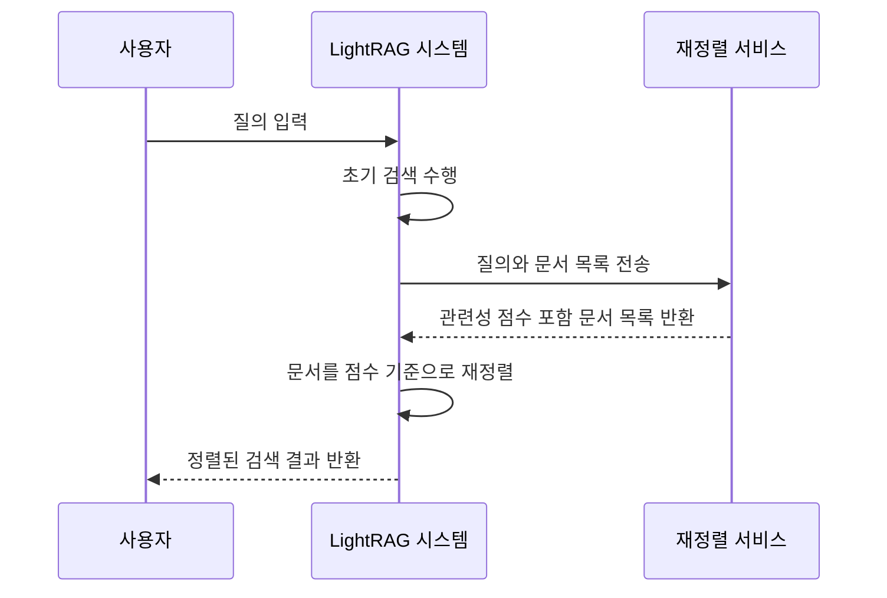
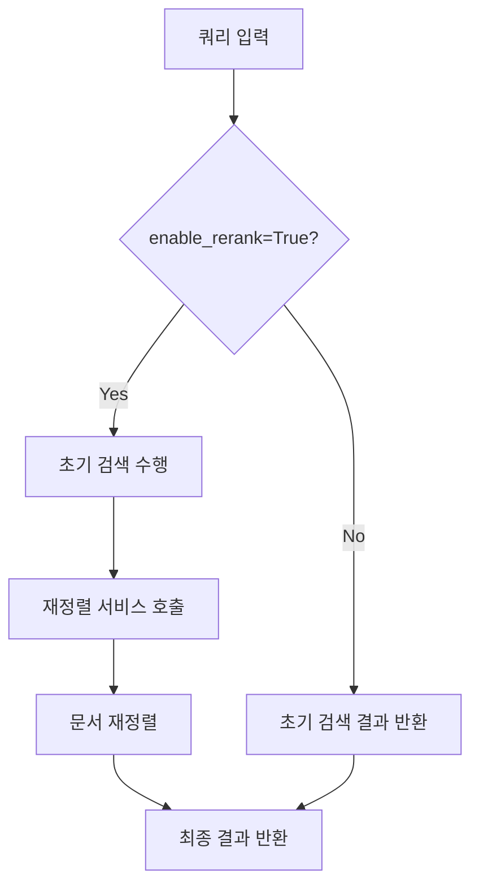
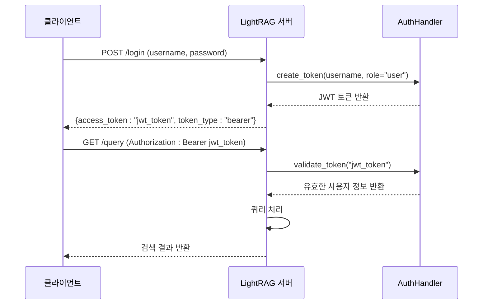

# 고급 기능

<cite>
**이 문서에서 참조된 파일**   
- [rerank.py](file://lightrag/rerank.py)
- [rerank_example.py](file://examples/rerank_example.py)
- [insert_custom_kg.py](file://examples/insert_custom_kg.py)
- [auth.py](file://lightrag/api/auth.py)
- [check_initialization.py](file://lightrag/tools/check_initialization.py)
- [lightrag.py](file://lightrag/lightrag.py)
- [shared_storage.py](file://lightrag/kg/shared_storage.py)
- [lightrag_server.py](file://lightrag/api/lightrag_server.py)
- [config.py](file://lightrag/api/config.py)
</cite>

## 목차
1. [재정렬 기능 원리 및 사용법](#재정렬-기능-원리-및-사용법)
2. [사용자 지정 지식 그래프 삽입](#사용자-지정-지식-그래프-삽입)
3. [API 인증 및 보안 설정](#api-인증-및-보안-설정)
4. [초기화 검사 및 요구사항](#초기화-검사-및-요구사항)
5. [성능 최적화 팁](#성능-최적화-팁)

## 재정렬 기능 원리 및 사용법

LightRAG의 재정렬(reranking) 기능은 검색된 문서의 관련성을 재평가하여 검색 품질을 향상시키는 핵심 기능입니다. 이 기능은 `rerank.py` 파일에 구현되어 있으며, Cohere, Jina AI, Aliyun(DashScope) 등의 다양한 재정렬 모델을 지원합니다.

재정렬 프로세스는 사용자가 질의를 입력하면, 초기 검색 단계에서 반환된 문서 목록을 재정렬 서비스에 전달합니다. 이 서비스는 질의와 각 문서 간의 의미적 관련성을 분석하여 관련성 점수를 계산하고, 문서를 점수에 따라 재정렬합니다. 이로 인해 가장 관련성 높은 문서가 결과 목록의 상단에 위치하게 되어, 최종 사용자에게 더 정확한 정보를 제공할 수 있습니다.

`rerank.py`는 `generic_rerank_api`라는 핵심 함수를 제공하여, 다양한 재정렬 서비스의 API 형식 차이를 추상화합니다. 이 함수는 Jina/Cohere의 표준 형식과 Aliyun의 특수 형식을 모두 처리할 수 있도록 설계되어 있으며, HTTP 오류(예: 502 Bad Gateway, 503 Service Unavailable)에 대한 재시도 로직과 함께 안정적인 서비스 통신을 보장합니다.



**다이어그램 소스**
- [rerank.py](file://lightrag/rerank.py#L1-L354)

**섹션 소스**
- [rerank.py](file://lightrag/rerank.py#L1-L354)

## reranker 통합 방법과 성능 향상 효과

`rerank_example.py` 예제를 통해 재정렬 기능을 LightRAG에 통합하는 방법을 확인할 수 있습니다. 통합은 주로 두 단계로 이루어집니다.

첫째, 재정렬 함수를 설정합니다. 이 예제에서는 `functools.partial`을 사용하여 `cohere_rerank` 함수에 환경 변수에서 가져온 모델 이름, API 키, 호스트 주소 등의 설정을 미리 적용합니다. 이렇게 생성된 `rerank_model_func`는 LightRAG 인스턴스 생성 시 `rerank_model_func` 매개변수로 전달됩니다.

```python
rerank_model_func = partial(
    cohere_rerank,
    model=os.getenv("RERANK_MODEL"),
    api_key=os.getenv("RERANK_BINDING_API_KEY"),
    base_url=os.getenv("RERANK_BINDING_HOST"),
)

rag = LightRAG(
    working_dir=WORKING_DIR,
    llm_model_func=llm_model_func,
    embedding_func=EmbeddingFunc(...),
    rerank_model_func=rerank_model_func, # 재정렬 함수 통합
)
```

둘째, 쿼리 시 재정렬 기능을 활성화 또는 비활성화할 수 있습니다. `QueryParam` 객체의 `enable_rerank` 매개변수를 통해 이 기능을 제어할 수 있습니다. 예제에서는 동일한 질의에 대해 재정렬을 활성화한 경우와 비활성화한 경우의 결과를 비교하여, 재정렬이 검색 품질에 미치는 긍정적인 영향을 명확히 보여줍니다. 일반적으로 재정렬을 사용하면 관련성 높은 문서가 상위에 배치되어 더 정확한 요약을 생성할 수 있습니다.



**다이어그램 소스**
- [rerank_example.py](file://examples/rerank_example.py#L0-L232)
- [lightrag.py](file://lightrag/lightrag.py#L1977-L2010)

**섹션 소스**
- [rerank_example.py](file://examples/rerank_example.py#L0-L232)

## 사용자 지정 지식 그래프 삽입

`insert_custom_kg.py` 스크립트는 기존 문서 파이프라인을 우회하여 사용자 지정 지식 그래프를 직접 삽입하는 고급 사용 사례를 제공합니다. 이 방법은 구조화된 데이터베이스나 기존의 지식 그래프를 LightRAG에 통합할 때 매우 유용합니다.

이 스크립트는 `custom_kg`라는 사전 구조를 정의합니다. 이 구조는 세 가지 핵심 요소를 포함합니다:
1.  **엔터티(entities)**: 조직, 제품, 사람, 위치 등 지식 그래프의 노드를 정의합니다.
2.  **관계(relationships)**: 엔터티 간의 연결을 설명하며, `src_id`(소스), `tgt_id`(대상), `description`(설명) 등을 포함합니다.
3.  **청크(chunks)**: 검색 시 반환될 원본 텍스트 조각입니다.

이러한 구조화된 데이터는 `LightRAG` 인스턴스의 `insert_custom_kg` 메서드를 통해 직접 삽입됩니다. 이 과정은 일반적인 `ainsert` 메서드가 텍스트를 파싱하고 엔터티를 추출하는 것과 달리, 사용자가 정의한 정확한 지식 구조를 보존합니다. 이는 추출 과정에서 발생할 수 있는 오류를 피하고, 기존의 정제된 지식을 그대로 활용할 수 있게 해줍니다.

```python
custom_kg = {
    "entities": [...],
    "relationships": [...],
    "chunks": [...],
}

rag = LightRAG(working_dir=WORKING_DIR, llm_model_func=gpt_4o_mini_complete)
rag.insert_custom_kg(custom_kg) # 사용자 지정 지식 그래프 삽입
```

**섹션 소스**
- [insert_custom_kg.py](file://examples/insert_custom_kg.py#L0-L115)

## API 인증 및 보안 설정

`auth.py` 모듈은 LightRAG 서버의 API 인증과 보안을 위한 JWT(JSON Web Token) 기반 접근 제어 시스템을 구현합니다. 이 시스템은 `AuthHandler` 클래스를 중심으로 작동하며, 토큰의 생성과 검증을 담당합니다.

보안 설정은 주로 `.env` 환경 변수 파일을 통해 관리됩니다. 핵심 설정은 다음과 같습니다:
-   `AUTH_ACCOUNTS`: `username:password` 형식으로 정의된 사용자 계정 목록입니다.
-   `TOKEN_SECRET`: JWT 토큰을 서명하는 데 사용되는 비밀 키입니다. 기본값은 보안상 변경해야 합니다.
-   `TOKEN_EXPIRE_HOURS`: 일반 사용자 토큰의 만료 시간(시간 단위)입니다.
-   `GUEST_TOKEN_EXPIRE_HOURS`: 인증이 비활성화된 경우 발급되는 게스트 토큰의 만료 시간입니다.

`create_token` 메서드는 사용자 이름, 역할(role), 만료 시간 등을 기반으로 JWT 토큰을 생성합니다. 반면, `validate_token` 메서드는 클라이언트가 요청 헤더에 포함한 토큰을 검증하여, 토큰이 유효하고 만료되지 않았는지 확인합니다. 이 메커니즘은 `/login` 엔드포인트를 통해 사용자 인증을 수행하고, 성공 시 액세스 토큰을 발급함으로써, 인증된 사용자만 API에 접근할 수 있도록 합니다.



**다이어그램 소스**
- [auth.py](file://lightrag/api/auth.py#L0-L109)
- [lightrag_server.py](file://lightrag/api/lightrag_server.py#L572-L640)

**섹션 소스**
- [auth.py](file://lightrag/api/auth.py#L0-L109)

## 초기화 검사 및 요구사항

LightRAG 인스턴스는 사용하기 전에 반드시 초기화 절차를 거쳐야 합니다. 이는 `check_initialization.py` 도구가 진단하는 핵심 요구사항입니다. 초기화되지 않은 상태에서 작업을 수행하면 예기치 않은 오류가 발생할 수 있습니다.

주요 초기화 요구사항은 두 가지입니다:
1.  **스토리지 초기화**: `await rag.initialize_storages()`를 호출하여 모든 내부 스토리지(문서, 청크, 벡터 DB, 그래프 DB 등)를 초기화해야 합니다.
2.  **파이프라인 상태 초기화**: `from lightrag.kg.shared_storage import initialize_pipeline_status`을 임포트한 후 `await initialize_pipeline_status()`를 호출하여 전역 파이프라인 상태를 설정해야 합니다.

`check_initialization.py` 도구는 `check_lightrag_setup` 함수를 제공하여, LightRAG 인스턴스의 초기화 상태를 진단합니다. 이 도구는 스토리지 상태, 개별 스토리지 구성 요소의 준비 상태, 파이프라인 상태 등을 점검하고, 문제가 발견되면 구체적인 해결 방법을 안내합니다. 이 도구는 개발 및 디버깅 과정에서 초기화 관련 문제를 신속하게 식별하고 해결하는 데 매우 유용합니다.

```python
from lightrag.tools.check_initialization import check_lightrag_setup

# 초기화 전 상태 점검
await check_lightrag_setup(rag, verbose=True) # ❌ 초기화되지 않음

# 초기화 수행
await rag.initialize_storages()
await initialize_pipeline_status()

# 초기화 후 상태 점검
await check_lightrag_setup(rag, verbose=True) # ✅ 성공적으로 초기화됨
```

**섹션 소스**
- [check_initialization.py](file://lightrag/tools/check_initialization.py#L0-L180)
- [shared_storage.py](file://lightrag/kg/shared_storage.py#L73-L109)

## 성능 최적화 팁

LightRAG의 성능을 극대화하기 위해 다음과 같은 고급 최적화 팁을 활용할 수 있습니다.

**병렬 삽입**: `MAX_PARALLEL_INSERT` 환경 변수를 설정하여 문서 삽입 작업의 병렬성을 제어할 수 있습니다. 이 값을 높이면 여러 문서를 동시에 처리할 수 있어 대량의 데이터를 빠르게 인덱싱할 수 있습니다. 그러나 시스템 리소스(CPU, 메모리)를 과도하게 소비할 수 있으므로, 시스템 사양에 맞게 적절한 값을 설정하는 것이 중요합니다.

**캐싱 전략**: LightRAG은 LLM 응답 캐싱과 임베딩 캐싱을 지원합니다.
-   **LLM 캐싱**: `enable_llm_cache=True` 및 `enable_llm_cache_for_entity_extract=True` 설정을 통해 반복적인 LLM 호출을 방지할 수 있습니다. 이는 특히 동일한 텍스트에서 엔터티를 추출하거나 요약을 생성할 때 큰 성능 향상을 가져옵니다.
-   **임베딩 캐싱**: `embedding_cache_config`을 통해 임베딩 계산 결과를 캐싱할 수 있습니다. 이는 동일한 텍스트 청크에 대한 임베딩 요청을 캐시에서 빠르게 제공함으로써, 임베딩 모델에 대한 API 호출 비용과 지연을 줄입니다.

이러한 최적화 기법들은 `lightrag.py`의 `LightRAG` 클래스 초기화 매개변수와 환경 변수를 통해 설정할 수 있으며, 시스템의 전반적인 처리 속도와 효율성을 크게 개선할 수 있습니다.

**섹션 소스**
- [lightrag.py](file://lightrag/lightrag.py#L551-L586)
- [config.py](file://lightrag/api/config.py#L44-L73)