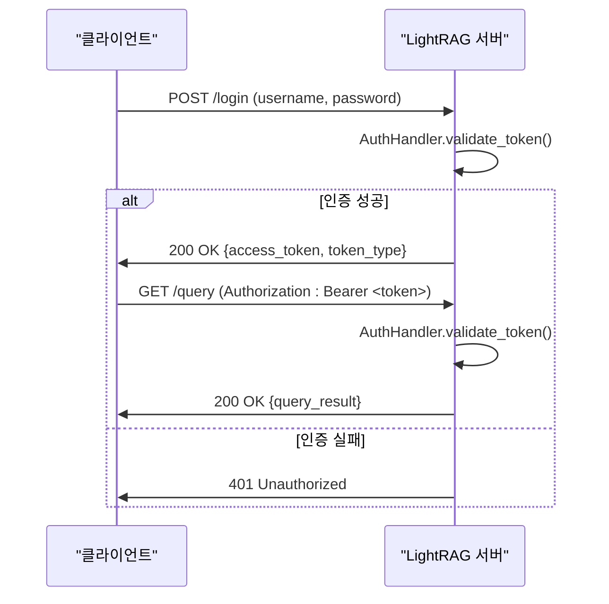
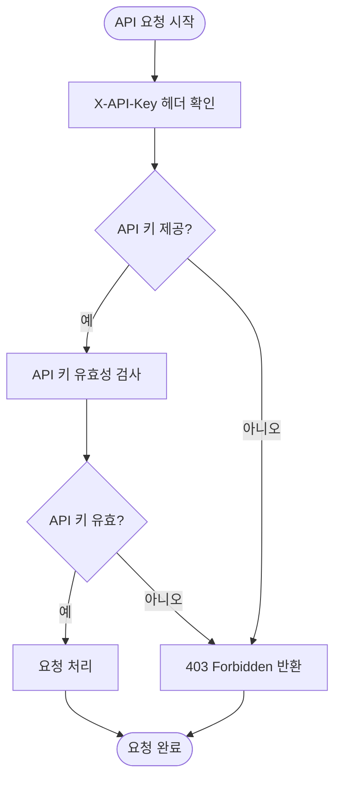
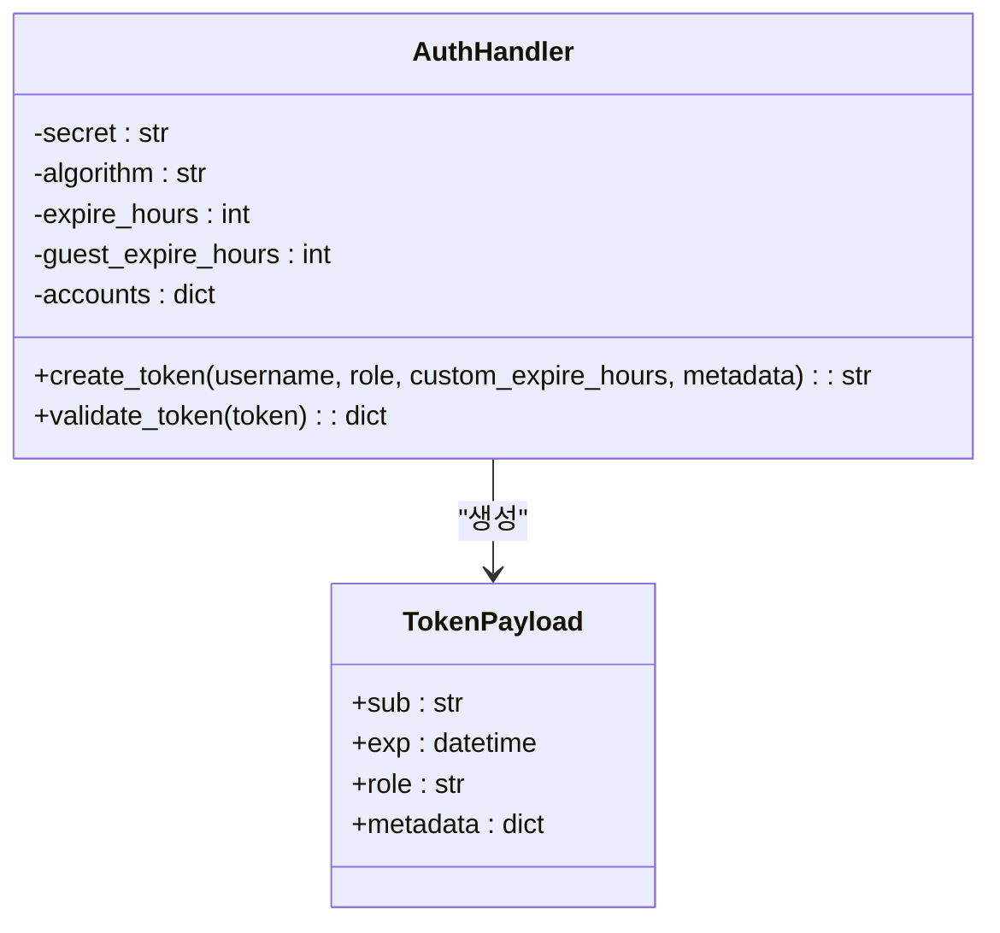

# 인증 및 보안

<cite>
**이 문서에서 참조된 파일**  
- [auth.py](file://lightrag/api/auth.py)
- [lightrag_openai_mongodb_graph_demo.py](file://examples/lightrag_openai_mongodb_graph_demo.py)
- [SECURITY.md](file://SECURITY.md)
- [config.py](file://lightrag/api/config.py)
- [utils_api.py](file://lightrag/api/utils_api.py)
- [lightrag_server.py](file://lightrag/api/lightrag_server.py)
</cite>

## 목차
1. [소개](#소개)
2. [인증 메커니즘](#인증-메커니즘)
3. [보안 설정 구성](#보안-설정-구성)
4. [API 호출 방법](#api-호출-방법)
5. [보안 모범 사례](#보안-모범-사례)
6. [로그 및 감사 추적](#로그-및-감사-추적)
7. [결론](#결론)

## 소개

LightRAG API는 강력한 보안 기능을 제공하여 시스템에 대한 무단 접근을 방지합니다. 이 문서는 JWT 및 API 키 기반의 인증 시스템, 보안 구성 방법, 실제 API 호출 예제, 그리고 보안 모범 사례를 상세히 설명합니다. LightRAG는 다양한 인증 방법을 지원하며, 환경 변수를 통해 유연하게 보안 정책을 구성할 수 있습니다.

**Section sources**
- [auth.py](file://lightrag/api/auth.py#L1-L110)
- [config.py](file://lightrag/api/config.py#L1-L425)

## 인증 메커니즘

LightRAG API는 두 가지 주요 인증 메커니즘을 제공합니다: JWT(JSON Web Token) 기반 인증과 API 키 기반 인증. 이 두 가지 방법은 독립적으로 또는 동시에 사용할 수 있으며, 시스템의 보안 수준을 높이는 데 도움이 됩니다.

### JWT 기반 인증

JWT 기반 인증은 `AuthHandler` 클래스를 통해 구현됩니다. 이 클래스는 사용자 인증을 처리하고, 유효한 자격 증명이 제공되면 JWT 토큰을 생성합니다. 토큰은 HS256 알고리즘을 사용하여 서명되며, 만료 시간과 사용자 역할 정보를 포함합니다.



**Diagram sources**
- [auth.py](file://lightrag/api/auth.py#L22-L105)
- [lightrag_server.py](file://lightrag/api/lightrag_server.py#L603-L640)

`AuthHandler` 클래스는 다음과 같은 주요 메서드를 제공합니다:
- `create_token()`: 사용자 이름, 역할, 만료 시간 등을 기반으로 JWT 토큰을 생성합니다.
- `validate_token()`: 제공된 토큰의 유효성을 검사하고, 만료되었거나 서명이 잘못된 경우 예외를 발생시킵니다.

**Section sources**
- [auth.py](file://lightrag/api/auth.py#L22-L105)

### API 키 기반 인증

API 키 기반 인증은 모든 요청에 `X-API-Key` 헤더를 포함시켜야 합니다. 이 방법은 간단하면서도 효과적인 보안 수단으로, 특정 API 키를 가진 클라이언트만 시스템에 접근할 수 있도록 제한합니다.



**Diagram sources**
- [utils_api.py](file://lightrag/api/utils_api.py#L84)
- [utils_api.py](file://lightrag/api/utils_api.py#L334)

**Section sources**
- [utils_api.py](file://lightrag/api/utils_api.py#L133-L174)

## 보안 설정 구성

LightRAG의 보안 설정은 환경 변수를 통해 구성할 수 있습니다. 이러한 설정은 `.env` 파일이나 시스템 환경 변수를 통해 지정할 수 있으며, 시스템의 보안 정책을 유연하게 조정할 수 있습니다.

### 환경 변수 구성

다음은 주요 보안 관련 환경 변수입니다:

| 환경 변수 | 설명 | 기본값 |
|----------|------|-------|
| `AUTH_ACCOUNTS` | 인증 계정 정보 (username:password 형식) | 없음 |
| `TOKEN_SECRET` | JWT 토큰 서명에 사용되는 비밀 키 | `lightrag-jwt-default-secret` |
| `TOKEN_EXPIRE_HOURS` | 일반 사용자 토큰 만료 시간(시간 단위) | 48 |
| `GUEST_TOKEN_EXPIRE_HOURS` | 게스트 토큰 만료 시간(시간 단위) | 24 |
| `JWT_ALGORITHM` | JWT 서명 알고리즘 | `HS256` |
| `LIGHTRAG_API_KEY` | API 키 인증에 사용되는 키 | 없음 |
| `WHITELIST_PATHS` | 인증이 필요 없는 경로 목록 | `/health,/api/*` |

**Section sources**
- [config.py](file://lightrag/api/config.py#L359-L362)

### 토큰 만료 정책

LightRAG은 두 가지 유형의 토큰 만료 정책을 지원합니다:
- **일반 사용자 토큰**: `TOKEN_EXPIRE_HOURS` 환경 변수로 설정된 시간 후에 만료됩니다.
- **게스트 토큰**: `GUEST_TOKEN_EXPIRE_HOURS` 환경 변수로 설정된 시간 후에 만료됩니다.

이러한 정책은 시스템의 보안을 강화하고, 장기간 유효한 토큰으로 인한 잠재적 위험을 줄이는 데 도움이 됩니다.

### 역할 기반 접근 제어(RBAC)

현재 LightRAG은 간단한 역할 기반 접근 제어를 지원합니다. 사용자는 `user` 또는 `guest` 역할을 가질 수 있으며, 이 정보는 JWT 토큰의 페이로드에 포함됩니다. 향후 버전에서는 더 복잡한 RBAC 시스템이 도입될 예정입니다.



**Diagram sources**
- [auth.py](file://lightrag/api/auth.py#L10-L20)
- [auth.py](file://lightrag/api/auth.py#L22-L105)

**Section sources**
- [auth.py](file://lightrag/api/auth.py#L10-L105)

## API 호출 방법

보안이 활성화된 환경에서 LightRAG API를 호출하는 방법을 예제 코드를 통해 설명합니다.

### 예제 코드 분석

`lightrag_openai_mongodb_graph_demo.py` 파일은 LightRAG의 기본 사용법을 보여줍니다. 이 코드는 MongoDB를 사용하여 그래프 저장소를 구성하고, OpenAI 모델을 사용하여 쿼리를 처리합니다.

```python
# 환경 변수 설정
os.environ["OPENAI_API_KEY"] = "sk-"
os.environ["MONGO_URI"] = "mongodb://0.0.0.0:27017/?directConnection=true"
os.environ["MONGO_DATABASE"] = "LightRAG"
os.environ["MONGO_KG_COLLECTION"] = "MDB_KG"
```

이 코드는 OpenAI API 키와 MongoDB 연결 정보를 설정합니다. 보안이 활성화된 환경에서는 추가적으로 인증 정보를 설정해야 합니다.

### 보안 활성화 환경에서의 API 호출

보안이 활성화된 환경에서 API를 호출하려면, 먼저 인증을 통해 토큰을 획득해야 합니다. 다음은 Python을 사용한 예제입니다:

```python
import requests

# 1. 로그인하여 토큰 획득
login_response = requests.post(
    "http://localhost:9621/login",
    data={"username": "admin", "password": "admin123"}
)
token = login_response.json()["access_token"]

# 2. 인증 헤더 포함하여 API 호출
headers = {"Authorization": f"Bearer {token}"}
response = requests.get(
    "http://localhost:9621/query",
    params={"query": "What are the top themes in this story?"},
    headers=headers
)
```

또는 API 키를 사용하는 경우:

```python
import requests

# API 키 포함하여 API 호출
headers = {"X-API-Key": "your-secure-api-key-here"}
response = requests.get(
    "http://localhost:9621/query",
    params={"query": "What are the top themes in this story?"},
    headers=headers
)
```

**Section sources**
- [lightrag_openai_mongodb_graph_demo.py](file://examples/lightrag_openai_mongodb_graph_demo.py#L1-L108)

## 보안 모범 사례

LightRAG의 보안을 최적화하기 위한 모범 사례를 설명합니다.

### 알려진 취약점

`SECURITY.md` 파일에 따르면, LightRAG 팀은 보안 문제를 진지하게 받아들이며, 책임감 있는 공개를 통해 보안 취약점을 보고할 것을 권장합니다. 현재 지원되는 버전은 1.3.x이며, 이전 버전은 보안 업데이트가 제공되지 않습니다.

### 보안 모범 사례

1. **강력한 비밀 키 사용**: `TOKEN_SECRET` 환경 변수에 강력한 비밀 키를 설정하여 JWT 토큰의 보안을 강화하세요.
2. **API 키 보호**: `LIGHTRAG_API_KEY` 환경 변수를 안전한 위치에 저장하고, 소스 코드에 직접 포함하지 마세요.
3. **HTTPS 사용**: 프로덕션 환경에서는 반드시 HTTPS를 사용하여 데이터 전송의 보안을 확보하세요.
4. **정기적인 업데이트**: 항상 최신 버전의 LightRAG를 사용하여 알려진 취약점으로부터 보호하세요.

**Section sources**
- [SECURITY.md](file://SECURITY.md#L1-L19)

## 로그 및 감사 추적

LightRAG은 시스템의 보안과 성능을 모니터링하기 위한 포괄적인 로깅 기능을 제공합니다.

### 로깅 구성

로그는 콘솔과 파일에 동시에 기록되며, `LOG_DIR` 환경 변수를 통해 로그 파일의 위치를 지정할 수 있습니다. 로그 파일은 지정된 크기(`LOG_MAX_BYTES`)를 초과하면 회전되며, 최대 백업 수(`LOG_BACKUP_COUNT`)를 설정할 수 있습니다.

```python
logging.config.dictConfig({
    "version": 1,
    "disable_existing_loggers": False,
    "formatters": {
        "detailed": {
            "format": "%(asctime)s - %(name)s - %(levelname)s - %(message)s",
        },
    },
    "handlers": {
        "file": {
            "formatter": "detailed",
            "class": "logging.handlers.RotatingFileHandler",
            "filename": log_file_path,
            "maxBytes": log_max_bytes,
            "backupCount": log_backup_count,
            "encoding": "utf-8",
        },
    },
    "loggers": {
        "lightrag": {
            "handlers": ["console", "file"],
            "level": "INFO",
            "propagate": False,
        },
    },
})
```

### 감사 추적

모든 API 요청은 로그에 기록되며, 이를 통해 시스템의 접근 패턴을 분석하고 잠재적인 보안 위협을 탐지할 수 있습니다. 특히, 인증 실패와 같은 중요한 이벤트는 상세히 기록되어 감사 추적에 활용할 수 있습니다.

**Section sources**
- [utils.py](file://lightrag/utils.py#L162-L274)

## 결론

LightRAG API는 JWT 및 API 키 기반의 강력한 인증 시스템을 제공하여 시스템의 보안을 보장합니다. 환경 변수를 통해 유연하게 보안 정책을 구성할 수 있으며, 로깅과 감사 추적 기능을 통해 시스템의 상태를 지속적으로 모니터링할 수 있습니다. 책임감 있는 보안 관행을 따르고, 최신 버전을 유지함으로써 LightRAG 시스템의 보안을 극대화할 수 있습니다.