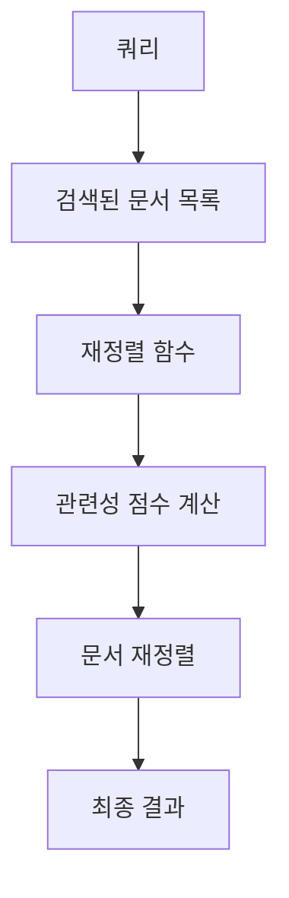

# 재정렬(Reranking) 기능

<cite>
**이 문서에서 참조된 파일**   
- [rerank.py](file://lightrag/rerank.py)
- [rerank_example.py](file://examples/rerank_example.py)
- [lightrag.py](file://lightrag/lightrag.py)
- [utils.py](file://lightrag/utils.py)
- [lightrag_server.py](file://lightrag/api/lightrag_server.py)
- [api/README.md](file://lightrag/api/README.md)
</cite>

## 목차
1. [소개](#소개)
2. [재정렬 기능의 내부 작동 원리](#재정렬-기능의-내부-작동-원리)
3. [재정렬 파이프라인 아키텍처](#재정렬-파이프라인-아키텍처)
4. [재정렬 모델 통합 방법](#재정렬-모델-통합-방법)
5. [검색 정확도 향상 효과](#검색-정확도-향상-효과)
6. [재정렬 선택 기준 및 성능 최적화](#재정렬-선택-기준-및-성능-최적화)
7. [API 및 라이브러리 사용 방법](#api-및-라이브러리-사용-방법)
8. [일반적인 오류 해결 방법](#일반적인-오류-해결-방법)
9. [결론](#결론)

## 소개
재정렬(Reranking) 기능은 LightRAG 시스템에서 검색된 문서의 관련성을 재평가하여 검색 품질을 향상시키는 핵심 기능입니다. 이 문서는 `rerank.py`를 기반으로 한 재정렬 기능의 내부 작동 원리와 아키텍처를 설명하고, `rerank_example.py`를 참조하여 다양한 재정렬 모델(LLM 기반, 임베딩 기반)의 통합 방법을 단계별로 안내합니다. 또한 검색 정확도 향상에 미치는 영향을 구체적인 예시와 함께 제시하며, 재정렬 선택 기준, 성능 오버헤드 최소화 전략, 캐싱 활용법을 포함합니다.

**Section sources**
- [rerank.py](file://lightrag/rerank.py#L1-L354)
- [rerank_example.py](file://examples/rerank_example.py#L1-L232)

## 재정렬 기능의 내부 작동 원리
재정렬 기능은 검색된 문서 목록을 입력으로 받아 쿼리와의 관련성을 기반으로 재정렬합니다. 이 과정은 다음과 같은 단계로 이루어집니다:

1. **쿼리와 문서 목록 입력**: 사용자는 쿼리와 함께 검색된 문서 목록을 입력합니다.
2. **재정렬 함수 호출**: `rerank_model_func`를 사용하여 재정렬 함수를 호출합니다.
3. **관련성 점수 계산**: 재정렬 함수는 쿼리와 각 문서의 관련성을 평가하여 점수를 계산합니다.
4. **문서 재정렬**: 계산된 점수를 기반으로 문서 목록을 재정렬합니다.

이 과정은 `rerank.py` 파일의 `generic_rerank_api` 함수를 통해 구현되며, 다양한 재정렬 모델(Cohere, Jina AI, Aliyun)을 지원합니다.

**Section sources**
- [rerank.py](file://lightrag/rerank.py#L1-L354)

## 재정렬 파이프라인 아키텍처
재정렬 파이프라인은 다음과 같은 아키텍처를 따릅니다:



**Diagram sources**
- [rerank.py](file://lightrag/rerank.py#L1-L354)

## 재정렬 모델 통합 방법
다양한 재정렬 모델을 통합하는 방법은 다음과 같습니다:

### Cohere 재정렬 모델 통합
1. `rerank_example.py` 파일에서 `cohere_rerank` 함수를 가져옵니다.
2. `partial` 함수를 사용하여 재정렬 함수를 생성합니다.
3. `LightRAG` 인스턴스를 생성할 때 `rerank_model_func` 매개변수에 재정렬 함수를 전달합니다.

```python
from functools import partial
from lightrag.rerank import cohere_rerank

rerank_model_func = partial(
    cohere_rerank,
    model=os.getenv("RERANK_MODEL"),
    api_key=os.getenv("RERANK_BINDING_API_KEY"),
    base_url=os.getenv("RERANK_BINDING_HOST"),
)

rag = LightRAG(
    working_dir=WORKING_DIR,
    llm_model_func=llm_model_func,
    embedding_func=EmbeddingFunc(
        embedding_dim=embedding_dim,
        max_token_size=8192,
        func=embedding_func,
    ),
    rerank_model_func=rerank_model_func,
)
```

### Jina AI 재정렬 모델 통합
Jina AI 재정렬 모델을 통합하는 방법은 Cohere와 유사합니다. `jina_rerank` 함수를 사용하여 재정렬 함수를 생성하고, `LightRAG` 인스턴스를 생성할 때 전달합니다.

### Aliyun 재정렬 모델 통합
Aliyun 재정렬 모델을 통합하는 방법도 유사합니다. `ali_rerank` 함수를 사용하여 재정렬 함수를 생성하고, `LightRAG` 인스턴스를 생성할 때 전달합니다.

**Section sources**
- [rerank_example.py](file://examples/rerank_example.py#L1-L232)

## 검색 정확도 향상 효과
재정렬 기능은 검색 정확도를 크게 향상시킵니다. 예를 들어, `rerank_example.py` 파일의 예제를 통해 확인할 수 있습니다:

```python
query = "How does reranking improve retrieval quality?"
result_with_rerank = await rag.aquery(
    query,
    param=QueryParam(
        mode="naive",
        top_k=10,
        chunk_top_k=5,
        enable_rerank=True,
    ),
)
```

이 예제에서는 재정렬 기능을 활성화하여 검색 결과의 정확도를 향상시킵니다. 재정렬을 사용하면 관련성이 높은 문서가 상위에 위치하게 되어, 사용자가 원하는 정보를 더 쉽게 찾을 수 있습니다.

**Section sources**
- [rerank_example.py](file://examples/rerank_example.py#L1-L232)

## 재정렬 선택 기준 및 성능 최적화
재정렬 모델을 선택할 때는 다음과 같은 기준을 고려해야 합니다:

1. **성능**: 모델의 정확도와 속도를 고려합니다.
2. **비용**: API 호출 비용을 고려합니다.
3. **지원되는 언어**: 모델이 지원하는 언어를 고려합니다.

성능 오버헤드를 최소화하기 위한 전략으로는 캐싱을 활용하는 방법이 있습니다. 캐싱을 통해 동일한 쿼리에 대한 재정렬 결과를 저장하여, 이후 동일한 쿼리에 대해 재정렬을 수행하지 않고 캐시된 결과를 사용할 수 있습니다.

**Section sources**
- [rerank.py](file://lightrag/rerank.py#L1-L354)
- [rerank_example.py](file://examples/rerank_example.py#L1-L232)

## API 및 라이브러리 사용 방법
API를 통한 재정렬 파이프라인 호출 방법과 Python 라이브러리에서의 직접 사용 사례를 비교 설명합니다.

### API를 통한 재정렬 파이프라인 호출
API를 통해 재정렬 파이프라인을 호출하는 방법은 다음과 같습니다:

1. `/query` 또는 `/query/stream` API 엔드포인트를 사용합니다.
2. `enable_rerank` 매개변수를 `true`로 설정하여 재정렬 기능을 활성화합니다.

### Python 라이브러리에서의 직접 사용
Python 라이브러리를 통해 재정렬 기능을 직접 사용하는 방법은 다음과 같습니다:

1. `LightRAG` 인스턴스를 생성할 때 `rerank_model_func` 매개변수에 재정렬 함수를 전달합니다.
2. `aquery` 메서드를 호출할 때 `enable_rerank` 매개변수를 `true`로 설정합니다.

**Section sources**
- [rerank.py](file://lightrag/rerank.py#L1-L354)
- [rerank_example.py](file://examples/rerank_example.py#L1-L232)

## 일반적인 오류 해결 방법
일반적인 오류와 그 해결 방법은 다음과 같습니다:

### 모델 로딩 실패
- **원인**: API 키가 잘못되었거나, 모델 이름이 잘못되었을 수 있습니다.
- **해결 방법**: `.env` 파일에서 `RERANK_BINDING_API_KEY`와 `RERANK_MODEL` 환경 변수를 확인하고, 올바른 값을 설정합니다.

### 응답 지연
- **원인**: 네트워크 지연이나 서버 과부하일 수 있습니다.
- **해결 방법**: `RERANK_BY_DEFAULT=False` 환경 변수를 설정하여 재정렬 기능을 기본적으로 비활성화하고, 필요할 때만 활성화합니다.

**Section sources**
- [rerank.py](file://lightrag/rerank.py#L1-L354)
- [api/README.md](file://lightrag/api/README.md#L448-L459)

## 결론
재정렬 기능은 LightRAG 시스템에서 검색 품질을 향상시키는 중요한 기능입니다. 다양한 재정렬 모델을 통합하고, 성능 오버헤드를 최소화하며, 일반적인 오류를 해결하는 방법을 이해함으로써, 더 나은 검색 결과를 제공할 수 있습니다.