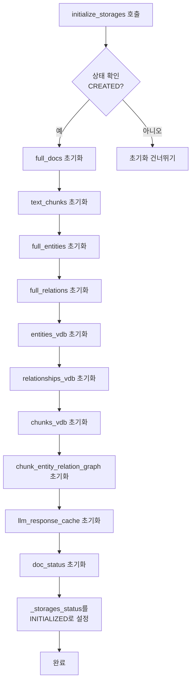

# 초기화 검사 도구

<cite>
**이 문서에서 참조된 파일**  
- [check_initialization.py](file://lightrag/tools/check_initialization.py)
- [lightrag.py](file://lightrag/lightrag.py)
- [shared_storage.py](file://lightrag/kg/shared_storage.py)
- [base.py](file://lightrag/base.py)
</cite>

## 목차
1. [소개](#소개)
2. [도구의 목적과 중요성](#도구의-목적과-중요성)
3. [사용 방법 및 명령줄 예시](#사용-방법-및-명령줄-예시)
4. [출력 결과 해석](#출력-결과-해석)
5. [initialize_storages 함수와의 관계](#initialize_storages-함수와의-관계)
6. [운영상의 중요성: 초기화 누락 시 발생 가능한 오류](#운영상의-중요성-초기화-누락-시-발생-가능한-오류)
7. [CI/CD 파이프라인 통합 방법](#cicd-파이프라인-통합-방법)
8. [결론](#결론)

## 소개

`check_initialization.py`는 LightRAG 시스템의 초기화 상태를 진단하고 검사하기 위한 도구입니다. 이 도구는 시스템이 정상적으로 작동하기 전에 필요한 초기화 절차가 올바르게 수행되었는지 확인함으로써, 개발자와 운영자가 초기화 관련 오류를 사전에 방지할 수 있도록 돕습니다. 본 문서는 이 도구의 목적, 사용법, 출력 결과 해석 방법, 그리고 `initialize_storages` 함수와의 관계를 명확히 설명합니다.

**Section sources**
- [check_initialization.py](file://lightrag/tools/check_initialization.py#L1-L20)

## 도구의 목적과 중요성

`check_initialization.py`의 주요 목적은 LightRAG 인스턴스가 사용 준비 상태인지 여부를 진단하는 것입니다. LightRAG는 여러 저장소(Storage) 컴포넌트와 파이프라인 상태를 비동기적으로 초기화해야 하는 복잡한 시스템입니다. 초기화 절차를 누락하면 런타임 오류가 발생할 수 있습니다.

이 도구는 다음과 같은 핵심 검사를 수행합니다:
- **저장소 상태 검사**: 모든 저장소 컴포넌트(`full_docs`, `text_chunks`, `entities_vdb` 등)가 올바르게 초기화되었는지 확인합니다.
- **파이프라인 상태 검사**: 문서 처리 파이프라인의 상태를 관리하는 공유 데이터가 초기화되었는지 확인합니다.
- **상태 속성 검사**: LightRAG 인스턴스 내부의 `_storages_status` 속성이 `INITIALIZED` 상태인지 확인합니다.

이러한 검사를 통해 시스템 실행 전에 잠재적인 문제를 식별하고, 안정적인 운영을 보장할 수 있습니다.

**Section sources**
- [check_initialization.py](file://lightrag/tools/check_initialization.py#L47-L107)
- [base.py](file://lightrag/base.py#L759-L765)

## 사용 방법 및 명령줄 예시

`check_initialization.py` 도구는 명령줄에서 직접 실행하거나, Python 코드 내에서 함수를 호출하여 사용할 수 있습니다.

### 명령줄에서 실행하기

가장 간단한 사용법은 `--demo` 옵션과 함께 실행하는 것입니다. 이 옵션은 테스트용 LightRAG 인스턴스를 생성하고, 초기화 전후의 상태를 비교하여 도구의 동작을 시연합니다.

```bash
python -m lightrag.tools.check_initialization --demo
```

또는, 이미 생성된 LightRAG 인스턴스의 상태를 검사하려면, 도구를 Python 모듈로 임포트하여 `check_lightrag_setup` 함수를 호출합니다.

```python
from lightrag import LightRAG
from lightrag.tools.check_initialization import check_lightrag_setup
import asyncio

async def main():
    # LightRAG 인스턴스 생성
    rag = LightRAG(
        working_dir="./my_rag_storage",
        embedding_func=openai_embed,
        llm_model_func=gpt_4o_mini_complete,
    )
    
    # 초기화 전 상태 검사
    is_ready = await check_lightrag_setup(rag, verbose=True)
    print(f"초기화 전 준비 상태: {is_ready}")

    # 초기화 수행
    await rag.initialize_storages()
    from lightrag.kg.shared_storage import initialize_pipeline_status
    await initialize_pipeline_status()

    # 초기화 후 상태 검사
    is_ready = await check_lightrag_setup(rag, verbose=True)
    print(f"초기화 후 준비 상태: {is_ready}")

asyncio.run(main())
```

`--verbose` 또는 `-v` 옵션을 사용하면 각 저장소 컴포넌트의 상세한 상태 정보를 출력합니다.

**Section sources**
- [check_initialization.py](file://lightrag/tools/check_initialization.py#L149-L179)
- [lightrag.py](file://lightrag/lightrag.py#L562-L582)

## 출력 결과 해석

도구의 출력은 초기화 상태를 명확하게 진단합니다.

### 초기화 전 출력 예시
```
🔍 Checking LightRAG initialization status...

❌ Issues found:

  • Storages not initialized (status: created)
  • Pipeline status not initialized - call initialize_pipeline_status()

📝 To fix, run this initialization sequence:

  await rag.initialize_storages()
  from lightrag.kg.shared_storage import initialize_pipeline_status
  await initialize_pipeline_status()
```
이 출력은 저장소와 파이프라인 상태가 모두 초기화되지 않았음을 나타냅니다. 제안된 초기화 시퀀스를 따라야 합니다.

### 초기화 후 출력 예시
```
🔍 Checking LightRAG initialization status...

✅ Storage status: INITIALIZED
✅ Pipeline status: INITIALIZED

==================================================
✅ LightRAG is properly initialized and ready to use!
```
이 출력은 모든 검사 항목이 성공했음을 의미하며, 시스템이 사용 준비 상태임을 나타냅니다.

**Section sources**
- [check_initialization.py](file://lightrag/tools/check_initialization.py#L108-L153)

## initialize_storages 함수와의 관계

`check_initialization.py` 도구와 `initialize_storages` 함수는 밀접한 관계를 가지고 있습니다. `initialize_storages`는 초기화를 수행하는 **액션** 함수라면, `check_initialization.py`는 그 결과를 검증하는 **검사** 도구입니다.

### initialize_storages 함수의 역할
`initialize_storages` 함수는 LightRAG 인스턴스 내부의 모든 저장소 컴포넌트를 순차적으로 초기화합니다. 이 함수는 `_storages_status`가 `CREATED` 상태일 때만 실행되며, 성공적으로 완료되면 상태를 `INITIALIZED`로 변경합니다. 초기화 순서는 교착 상태(Deadlock)를 방지하기 위해 중요합니다.



**Diagram sources**
- [lightrag.py](file://lightrag/lightrag.py#L562-L582)

### 상호작용 관계
`check_initialization.py` 도구는 `initialize_storages` 함수의 실행 여부를 `_storages_status` 속성과 개별 저장소의 `_storage_lock` 존재 여부를 통해 간접적으로 확인합니다. 즉, `initialize_storages` 함수가 올바르게 호출되지 않으면, `check_initialization.py` 도구는 이를 감지하고 오류를 보고합니다. 두 도구는 초기화 프로세스의 "수행"과 "검증"이라는 두 가지 핵심 단계를 담당합니다.

**Section sources**
- [lightrag.py](file://lightrag/lightrag.py#L562-L582)
- [check_initialization.py](file://lightrag/tools/check_initialization.py#L75-L85)

## 운영상의 중요성: 초기화 누락 시 발생 가능한 오류

`check_initialization.py` 도구를 사용하는 것은 단순한 편의를 넘어 운영상 필수적인 절차입니다. 초기화를 누락하면 다음과 같은 심각한 오류가 발생할 수 있습니다.

### 저장소 연결 실패
초기화되지 않은 저장소 컴포넌트에 접근하려고 하면 `AttributeError` 또는 `KeyError`가 발생합니다. 예를 들어, `initialize_storages`를 호출하지 않고 `rag.insert()`를 실행하면, `full_docs` 저장소가 `None`이거나 초기화되지 않아 데이터 삽입에 실패합니다. 이는 데이터 유실로 이어질 수 있으며, 시스템의 신뢰성을 크게 저하시킵니다.

### 데이터 손실
초기화 과정은 저장소 간의 상태 일관성을 확립하는 데 중요합니다. 일부 저장소만 초기화된 상태에서 시스템을 사용하면, 데이터가 일부 저장소에는 기록되었지만 다른 저장소에는 기록되지 않는 불일치 상태가 발생할 수 있습니다. 이후 시스템이 재시작되거나 오류가 발생하면, 이 불일치된 데이터는 복구하기 어려운 상태가 되어 사실상 데이터 손실로 간주될 수 있습니다.

### 시스템 불안정성
`initialize_pipeline_status`를 호출하지 않으면, 문서 처리 파이프라인의 상태를 추적하는 공유 데이터가 생성되지 않습니다. 이로 인해 `KeyError: 'history_messages'`와 같은 예기치 않은 오류가 발생하며, 시스템이 불안정한 상태에서 동작하게 됩니다. 이는 CI/CD 파이프라인에서 빌드를 실패시키거나, 프로덕션 환경에서 서비스 중단을 초래할 수 있습니다.

따라서, `check_initialization.py` 도구를 사용하여 초기화 상태를 사전에 검증하는 것은 이러한 운영상의 위험을 사전에