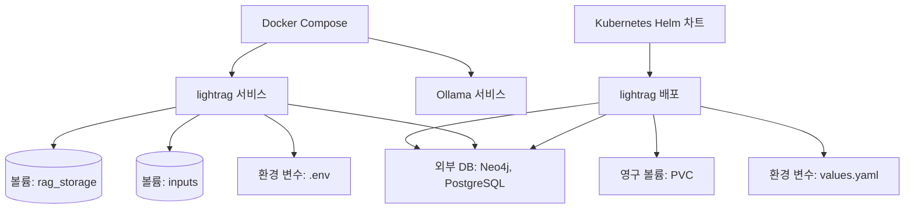

# 기술 스택 및 종속성

<cite>
**이 문서에서 참조된 파일**  
- [pyproject.toml](file://pyproject.toml)
- [setup.py](file://setup.py)
- [Dockerfile](file://Dockerfile)
- [docker-compose.yml](file://docker-compose.yml)
- [config.py](file://lightrag/api/config.py)
- [package.json](file://lightrag_webui/package.json)
- [values.yaml](file://k8s-deploy/lightrag/values.yaml)
</cite>

## 목차
1. [백엔드 스택 (Python)](#백엔드-스택-python)  
2. [프론트엔드 스택 (TypeScript/React)](#프론트엔드-스택-typescriptreact)  
3. [인프라 구성 (Docker/Kubernetes)](#인프라-구성-dockerkubernetes)  
4. [패키징 및 종속성 관리](#패키징-및-종속성-관리)  
5. [버전 호환성 및 외부 서비스 종속성](#버전-호환성-및-외부-서비스-종속성)

## 백엔드 스택 (Python)

LightRAG의 백엔드는 Python 기반으로 구축되어 있으며, 주로 RAG(Retrieval-Augmented Generation) 처리, API 서버 운영, LLM 통합, 그래프 기반 정보 저장 및 검색을 담당한다. 핵심 종속성은 `pyproject.toml`에 정의되어 있으며, 주요 라이브러리의 목적과 역할은 다음과 같다.

- **fastapi**: RESTful API 서버를 구축하기 위한 고성능 웹 프레임워크로, 비동기 처리를 지원하여 빠른 응답을 보장한다.
- **pydantic**: 설정 및 요청/응답 데이터의 유효성 검사를 위한 라이브러리로, 환경 변수 및 API 입력 처리에 사용된다.
- **networkx**: 그래프 기반 지식 저장소(Graph Storage)로 사용되며, 엔티티와 관계를 노드와 엣지로 표현하여 구조화된 정보를 관리한다.
- **nano-vectordb**: 경량 벡터 데이터베이스로, 문서 청크의 임베딩을 저장하고 유사도 기반 검색을 수행한다.
- **aiohttp**: 비동기 HTTP 클라이언트로, 외부 LLM 서비스(예: OpenAI, Ollama)와의 통신에 사용된다.
- **tiktoken**: OpenAI의 토크나이저를 사용하여 토큰 수를 정확히 계산하며, LLM의 컨텍스트 길이 제한을 관리하는 데 필수적이다.
- **tenacity**: 네트워크 요청 실패 시 재시도 로직을 제공하여 외부 서비스 호출의 안정성을 높인다.
- **python-jose[cryptography]**: JWT 기반 인증을 구현하며, 사용자 세션과 API 키 인증을 처리한다.
- **uvicorn**: ASGI 서버로, FastAPI 애플리케이션을 실행하며 비동기 요청을 효율적으로 처리한다.

LLM 통합은 `lightrag/llm/` 디렉터리 내 다양한 바인딩 모듈(예: `openai.py`, `ollama.py`, `azure_openai.py`)을 통해 구현되며, 각 외부 서비스에 맞는 인터페이스를 제공한다.

**Section sources**
- [pyproject.toml](file://pyproject.toml)
- [lightrag/llm/openai.py](file://lightrag/llm/openai.py)
- [lightrag/llm/ollama.py](file://lightrag/llm/ollama.py)
- [lightrag/llm/azure_openai.py](file://lightrag/llm/azure_openai.py)

## 프론트엔드 스택 (TypeScript/React)

LightRAG의 프론트엔드는 `lightrag_webui` 디렉터리에 위치하며, React 기반의 SPA(Single Page Application)으로 구성되어 있다. 주요 기술 스택은 다음과 같다.

- **React**: UI 구성 요소를 선언적으로 작성하며, 상태 관리와 라우팅을 통해 사용자 인터페이스를 동적으로 구성한다.
- **Vite**: 빠른 개발 서버와 효율적인 빌드를 제공하는 모던 프론트엔드 빌드 도구로, 개발 생산성을 극대화한다.
- **Tailwind CSS**: 유틸리티 우선 방식의 CSS 프레임워크로, 반응형 디자인과 일관된 테마를 쉽게 구현한다.
- **TypeScript**: 정적 타입 검사를 통해 코드의 안정성과 유지보수성을 향상시킨다.

UI 라이브러리로는 Radix UI와 Lucide React를 사용하여 접근성 높은 컴포넌트와 아이콘을 제공하며, 상태 관리는 Zustand를 통해 간결하게 처리한다. 그래프 시각화는 Sigma.js와 React-Sigma를 활용하여 노드와 엣지를 대화형으로 렌더링한다.

**Section sources**
- [lightrag_webui/package.json](file://lightrag_webui/package.json)
- [lightrag_webui/src/components/graph/GraphControl.tsx](file://lightrag_webui/src/components/graph/GraphControl.tsx)
- [lightrag_webui/src/App.tsx](file://lightrag_webui/src/App.tsx)

## 인프라 구성 (Docker/Kubernetes)

### Docker 및 docker-compose.yml

`Dockerfile`은 Python 3.12 기반 멀티스테이지 빌드를 사용하여 최종 이미지를 최적화한다. 빌드 단계에서 Rust 및 빌드 도구를 설치하고, 종속성을 미리 컴파일한 후 최종 이미지에 복사하여 크기를 줄인다. 주요 종속성은 다음과 같이 설치된다.

- 기본 저장소: `nano-vectordb`, `networkx`
- 기본 LLM: `openai`, `ollama`, `tiktoken`
- 문서 로더: `pypdf2`, `python-docx`, `openpyxl`

`docker-compose.yml`은 두 개의 서비스를 정의한다.

- **ollama**: 로컬 LLM 서버로, 포트 9622에서 실행되며 GPU 지원을 위한 옵션을 포함한다.
- **lightrag**: 메인 애플리케이션 컨테이너로, `ghcr.io/hkuds/lightrag:latest` 이미지를 사용하거나 로컬 `Dockerfile`로 빌드한다. 볼륨 마운트를 통해 입력 문서, RAG 저장소, 설정 파일을 외부와 공유한다.

환경 변수는 `.env` 파일과 `env_file`을 통해 주입되며, `TIKTOKEN_CACHE_DIR` 등은 볼륨으로 지정되어 영구 저장된다.

### Kubernetes와의 관계

`k8s-deploy/` 디렉터리는 Helm 차트를 포함하여 Kubernetes 환경에서 LightRAG를 배포할 수 있도록 구성되어 있다.

- `lightrag/Chart.yaml` 및 `values.yaml`: 애플리케이션의 배포 설정을 정의한다.
- `databases/`: PostgreSQL, Neo4j, Qdrant 등 외부 데이터베이스를 위한 Helm 차트를 제공한다.

`values.yaml`에서는 컨테이너 이미지, 리소스 제한, 영구 볼륨(PVC), 환경 변수 등을 설정하며, 프로덕션 환경에서의 확장성과 안정성을 보장한다. 예를 들어, `PGVectorStorage`와 `Neo4JStorage`를 사용하도록 설정할 수 있다.

**Diagram sources**
- [docker-compose.yml](file://docker-compose.yml)
- [k8s-deploy/lightrag/values.yaml](file://k8s-deploy/lightrag/values.yaml)

**Diagram sources**
- [docker-compose.yml](file://docker-compose.yml)
- [k8s-deploy/lightrag/values.yaml](file://k8s-deploy/lightrag/values.yaml)

## 패키징 및 종속성 관리

### pyproject.toml vs setup.py

- **pyproject.toml**: 주요 패키징 구성 파일로, `setuptools`를 백엔드로 사용하며 프로젝트 메타데이터, 종속성, 스크립트 등을 정의한다. `api` 옵션 종속성 그룹은 FastAPI 서버 실행에 필요한 모든 패키지를 포함한다.
- **setup.py**: 하위 호환성을 위한 최소한의 파일로, `pyproject.toml`의 설정을 참조하여 빌드를 수행한다. 실제 구성은 `pyproject.toml`에 집중되어 있다.

### 개발 및 프로덕션 환경

- **개발 환경**: `pip install -e .[api]`를 사용하여 로컬 패키지를 편집 가능 모드로 설치하며, `dev` 종속성은 별도로 관리되지 않지만 `pyproject.toml`의 `optional-dependencies`를 활용할 수 있다.
- **프로덕션 환경**: `Dockerfile`에서 `pip install --user --no-cache-dir .[api]`를 통해 최소한의 종속성만 설치하며, 빌드 캐시를 제거하여 이미지 크기를 최적화한다.

**Section sources**
- [pyproject.toml](file://pyproject.toml)
- [setup.py](file://setup.py)
- [Dockerfile](file://Dockerfile)

## 버전 호환성 및 외부 서비스 종속성

LightRAG은 다양한 외부 LLM 및 벡터 DB 서비스와의 호환성을 제공한다.

- **OpenAI**: `openai` 바인딩을 통해 GPT 모델과 텍스트 임베딩을 사용한다. `tiktoken`은 토큰 수 계산에 필수적이며, `OPENAI_API_KEY`가 필요하다.
- **Ollama**: 로컬에서 실행되는 LLM 서버로, `ollama` 바인딩을 통해 `mistral`, `llama3` 등 다양한 모델을 지원한다. `http://localhost:11434`에 연결된다.
- **Hugging Face**: `jina` 바인딩을 통해 임베딩 모델을 사용할 수 있으며, `jina-embeddings-v2` 등과 통합된다.
- **Azure OpenAI**: `azure_openai` 모듈을 통해 Microsoft Azure의 OpenAI 서비스를 사용하며, 엔드포인트와 API 키가 필요하다.
- **기타**: `anthropic`, `bedrock`, `siliconcloud` 등도 지원되며, 각각 전용 바인딩 모듈이 존재한다.

모든 외부 서비스는 환경 변수 또는 명령줄 인수를 통해 설정되며, `config.py`의 `parse_args()` 함수에서 통합적으로 처리된다.

**Section sources**
- [lightrag/api/config.py](file://lightrag/api/config.py)
- [lightrag/llm/openai.py](file://lightrag/llm/openai.py)
- [lightrag/llm/ollama.py](file://lightrag/llm/ollama.py)
- [lightrag/llm/jina.py](file://lightrag/llm/jina.py)