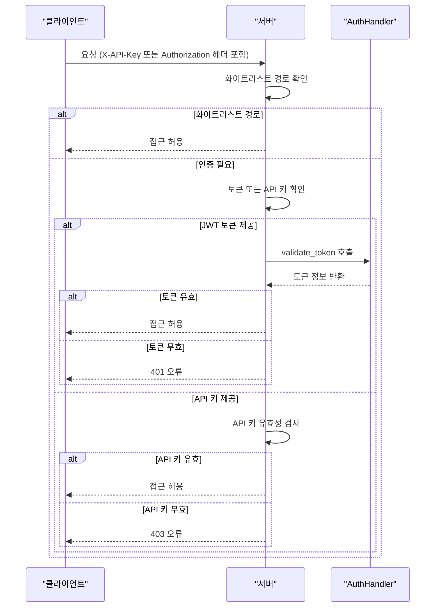
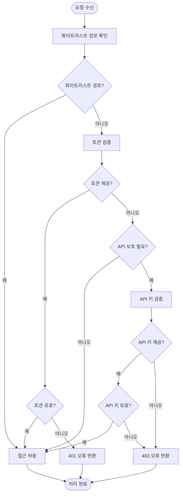

# API 오류 및 인증 문제

<cite>
**이 문서에서 참조한 파일**  
- [utils_api.py](file://lightrag/api/utils_api.py)
- [auth.py](file://lightrag/api/auth.py)
- [exceptions.py](file://lightrag/exceptions.py)
- [config.py](file://lightrag/api/config.py)
- [lightrag_server.py](file://lightrag/api/lightrag_server.py)
- [SECURITY.md](file://SECURITY.md)
</cite>

## 목차
1. [소개](#소개)
2. [인증 아키텍처 개요](#인증-아키텍처-개요)
3. [get_combined_auth_dependency 함수 분석](#get_combined_auth_dependency-함수-분석)
4. [인증 및 권한 오류 유형](#인증-및-권한-오류-유형)
5. [401/403 오류 발생 원인 및 해결 방법](#401403-오류-발생-원인-및-해결-방법)
6. [보안 권고사항](#보안-권고사항)
7. [결론](#결론)

## 소개
LightRAG API는 API 키(X-API-Key)와 JWT 기반 인증을 통해 보안을 강화하고 있습니다. 본 문서는 인증 및 권한 관련 오류를 심층적으로 분석하고, `get_combined_auth_dependency` 함수를 중심으로 API 키 및 JWT 인증 흐름을 설명하며, 다양한 예외 발생 조건과 해결 방법을 제시합니다. 또한 인증이 필요한 엔드포인트 접근 시 발생하는 401/403 오류의 원인을 분석하고, 올바른 헤더 설정 방법을 안내합니다.

**Section sources**
- [utils_api.py](file://lightrag/api/utils_api.py#L1-L344)
- [auth.py](file://lightrag/api/auth.py#L1-L109)

## 인증 아키텍처 개요

**Diagram sources**
- [utils_api.py](file://lightrag/api/utils_api.py#L103-L137)
- [auth.py](file://lightrag/api/auth.py#L50-L85)

## get_combined_auth_dependency 함수 분석

`get_combined_auth_dependency` 함수는 API 키, OAuth2 토큰, 화이트리스트 경로를 기반으로 인증 로직을 구현하는 종합적인 인증 의존성을 생성합니다. 이 함수는 다음과 같은 순서로 인증을 처리합니다:

1. 요청 경로가 화이트리스트에 포함되어 있는지 확인합니다.
2. 제공된 토큰을 검증합니다.
3. API 보호가 필요하지 않은 경우 접근을 허용합니다.
4. API 키를 검증합니다.

**Diagram sources**
- [utils_api.py](file://lightrag/api/utils_api.py#L71-L105)
- [utils_api.py](file://lightrag/api/utils_api.py#L35-L72)

**Section sources**
- [utils_api.py](file://lightrag/api/utils_api.py#L103-L137)

## 인증 및 권한 오류 유형

### AuthenticationError
`AuthenticationError`는 인증이 실패했을 때 발생하며, HTTP 상태 코드 401을 반환합니다. 이 오류는 다음 조건에서 발생합니다:

- 유효하지 않은 JWT 토큰을 제공한 경우
- 토큰이 만료된 경우
- 인증이 구성되어 있지만 자격 증명을 제공하지 않은 경우

### PermissionDeniedError
`PermissionDeniedError`는 권한이 거부되었을 때 발생하며, HTTP 상태 코드 403을 반환합니다. 이 오류는 다음 조건에서 발생합니다:

- 잘못된 API 키를 제공한 경우
- API 키는 구성되어 있지만 제공하지 않은 경우
- 인증이 실패한 후 접근을 시도한 경우

### RateLimitError
`RateLimitError`는 요청 제한을 초과했을 때 발생하며, HTTP 상태 코드 429를 반환합니다. 이 오류는 특정 시간 내에 너무 많은 요청을 보낸 경우 발생합니다.

**Section sources**
- [exceptions.py](file://lightrag/exceptions.py#L33-L54)

## 401/403 오류 발생 원인 및 해결 방법

### 401 오류 발생 원인
- JWT 토큰이 제공되지 않았거나 유효하지 않은 경우
- 인증이 구성되어 있지만 로그인하지 않은 경우
- 토큰이 만료된 경우

### 403 오류 발생 원인
- 잘못된 API 키를 제공한 경우
- API 키는 구성되어 있지만 요청에 포함하지 않은 경우
- 인증이 실패한 후 접근을 시도한 경우

### 해결 방법
1. **API 키 설정**: `X-API-Key` 헤더에 올바른 API 키를 포함하여 요청합니다.
2. **JWT 토큰 획득**: `/login` 엔드포인트를 사용하여 유효한 JWT 토큰을 획득합니다.
3. **Authorization 헤더 설정**: `Authorization` 헤더에 `Bearer <토큰>` 형식으로 JWT 토큰을 포함합니다.
4. **화이트리스트 경로 확인**: 인증이 필요 없는 화이트리스트 경로를 확인하고, 필요한 경우 해당 경로를 사용합니다.

**Section sources**
- [utils_api.py](file://lightrag/api/utils_api.py#L71-L105)
- [lightrag_server.py](file://lightrag/api/lightrag_server.py#L572-L605)

## 보안 권고사항

### 인증 정보 관리
- API 키와 JWT 비밀 키는 안전한 위치에 저장하고, 소스 코드에 직접 포함하지 마십시오.
- `.env` 파일을 사용하여 환경 변수를 관리하고, 이 파일을 버전 관리 시스템에 포함하지 마십시오.
- 정기적으로 API 키와 비밀 키를 교체하십시오.

### 취약점 방지 전략
- 모든 요청에 대해 입력 검증을 수행하십시오.
- HTTPS를 사용하여 데이터 전송을 암호화하십시오.
- 불필요한 엔드포인트는 비활성화하거나 접근 제한을 설정하십시오.
- 정기적으로 보안 업데이트를 적용하십시오.

**Section sources**
- [SECURITY.md](file://SECURITY.md#L1-L18)
- [config.py](file://lightrag/api/config.py#L35-L72)

## 결론
LightRAG API의 인증 및 권한 시스템은 API 키와 JWT를 결합하여 강력한 보안을 제공합니다. `get_combined_auth_dependency` 함수는 다양한 인증 방법을 통합하여 유연한 접근 제어를 가능하게 합니다. 401/403 오류는 주로 인증 정보 누락 또는 무효한 인증 정보에서 발생하므로, 올바른 헤더 설정과 토큰 관리가 중요합니다. 보안 권고사항을 준수하여 시스템의 보안을 강화하고, 정기적인 보안 점검을 통해 잠재적인 취약점을 사전에 방지해야 합니다.