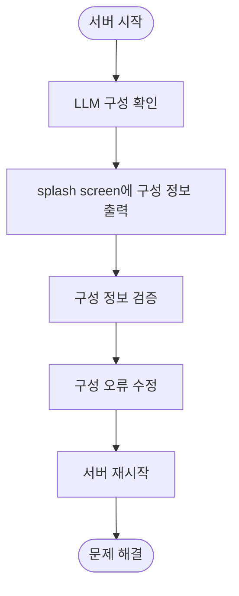

# LLM 통합 및 연결 문제

<cite>
**이 문서에서 참조한 파일**
- [openai.py](file://lightrag/llm/openai.py)
- [azure_openai.py](file://lightrag/llm/azure_openai.py)
- [ollama.py](file://lightrag/llm/ollama.py)
- [utils_api.py](file://lightrag/api/utils_api.py)
- [exceptions.py](file://lightrag/exceptions.py)
- [binding_options.py](file://lightrag/llm/binding_options.py)
- [config.py](file://lightrag/api/config.py)
</cite>

## 목차
1. [소개](#소개)
2. [LLM 연결 오류 유형](#llm-연결-오류-유형)
3. [LLM 구성 및 설정 요구사항](#llm-구성-및-설정-요구사항)
4. [프록시 및 네트워크 문제 해결](#프록시-및-네트워크-문제-해결)
5. [요청 제한(rate limit) 문제 해결](#요청-제한rate-limit-문제-해결)
6. [문제 진단을 위한 LLM 구성 출력](#문제-진단을-위한-llm-구성-출력)
7. [결론](#결론)

## 소개
이 문서는 LightRAG 프로젝트에서 OpenAI, Ollama, Azure OpenAI 등 다양한 LLM 공급자와의 통합 시 발생할 수 있는 연결 및 요청 오류를 해결하는 방법을 설명합니다. 각 LLM 구현 파일의 설정 요구사항을 기반으로 올바른 구성 방법을 안내하고, 프록시 환경, 네트워크 방화벽, 요청 제한으로 인한 문제 해결 전략을 포함합니다. 또한 `utils_api.py`의 LLM 구성 출력 정보를 활용한 문제 진단 방법도 설명합니다.

## LLM 연결 오류 유형
LLM 통합 시 발생할 수 있는 주요 오류 유형은 다음과 같습니다:

- **APIConnectionError**: API 연결 오류. 네트워크 문제, 잘못된 엔드포인트 URL, 방화벽 차단 등으로 인해 발생할 수 있습니다.
- **APITimeoutError**: API 요청 시간 초과 오류. 서버 응답이 지연되거나 네트워크 지연이 심할 경우 발생합니다.
- **BadRequestError**: 잘못된 요청 오류. 잘못된 요청 형식, 누락된 필수 매개변수, 유효하지 않은 데이터 등으로 인해 발생합니다.
- **RateLimitError**: 요청 제한 초과 오류. LLM 공급자의 요청 제한을 초과한 경우 발생합니다.
- **AuthenticationError**: 인증 오류. 잘못된 API 키, 만료된 토큰, 권한 부족 등으로 인해 발생합니다.

이러한 오류는 `lightrag/exceptions.py` 파일에서 정의되며, 각 LLM 구현 파일에서 적절한 예외 처리를 통해 재시도 메커니즘을 제공합니다.

**Section sources**
- [exceptions.py](file://lightrag/exceptions.py#L22-L57)

## LLM 구성 및 설정 요구사항
각 LLM 공급자별 구성 및 설정 요구사항은 다음과 같습니다:

### OpenAI
- **엔드포인트 URL**: `https://api.openai.com/v1` 또는 사용자 정의 엔드포인트
- **API 키**: `OPENAI_API_KEY` 환경 변수 또는 `api_key` 매개변수
- **모델 이름**: `gpt-4o`, `gpt-4o-mini`, `text-embedding-3-small` 등
- **추가 구성**: `openai_client_configs`를 통해 추가 클라이언트 구성 가능

### Azure OpenAI
- **엔드포인트 URL**: `AZURE_OPENAI_ENDPOINT` 환경 변수 또는 `base_url` 매개변수
- **API 키**: `AZURE_OPENAI_API_KEY` 환경 변수 또는 `api_key` 매개변수
- **배포 이름**: `AZURE_OPENAI_DEPLOYMENT` 환경 변수 또는 `deployment` 매개변수
- **API 버전**: `AZURE_OPENAI_API_VERSION` 환경 변수 또는 `api_version` 매개변수

### Ollama
- **호스트**: `host` 매개변수 또는 `LLM_BINDING_HOST` 환경 변수
- **모델 이름**: `llm_model_name` 구성 또는 `model` 매개변수
- **API 키**: 필요 시 `api_key` 매개변수
- **추가 옵션**: `OllamaLLMOptions` 및 `OllamaEmbeddingOptions`를 통해 다양한 옵션 구성 가능

이러한 설정은 `lightrag/llm/binding_options.py` 파일에서 정의되며, 환경 변수 또는 명령줄 인자를 통해 구성할 수 있습니다.

**Section sources**
- [openai.py](file://lightrag/llm/openai.py#L100-L150)
- [azure_openai.py](file://lightrag/llm/azure_openai.py#L30-L60)
- [ollama.py](file://lightrag/llm/ollama.py#L50-L80)
- [binding_options.py](file://lightrag/llm/binding_options.py#L300-L400)

## 프록시 및 네트워크 문제 해결
프록시 환경이나 네트워크 방화벽으로 인한 연결 문제를 해결하기 위한 전략은 다음과 같습니다:

1. **프록시 설정 확인**: 프록시 환경에서는 `HTTP_PROXY` 및 `HTTPS_PROXY` 환경 변수를 올바르게 설정해야 합니다.
2. **방화벽 규칙 확인**: LLM 공급자 엔드포인트에 대한 아웃바운드 연결이 허용되어 있는지 확인합니다.
3. **네트워크 연결 테스트**: `ping` 또는 `curl` 명령어를 사용하여 LLM 공급자 엔드포인트에 대한 연결을 테스트합니다.
4. **타임아웃 설정 조정**: `timeout` 매개변수를 통해 요청 타임아웃을 적절히 조정합니다.

이러한 설정은 `lightrag/api/config.py` 파일에서 처리되며, `global_args`를 통해 전역적으로 구성할 수 있습니다.

**Section sources**
- [config.py](file://lightrag/api/config.py#L250-L300)

## 요청 제한(rate limit) 문제 해결
LLM 공급자의 요청 제한으로 인한 문제를 해결하기 위한 전략은 다음과 같습니다:

1. **재시도 메커니즘**: `tenacity` 라이브러리를 사용하여 자동 재시도를 구현합니다. `@retry` 데코레이터를 통해 재시도 횟수, 대기 시간 등을 구성할 수 있습니다.
2. **비동기 처리**: `llm_model_max_async` 설정을 통해 최대 동시 LLM 호출 수를 조정하여 요청 부하를 분산합니다.
3. **캐싱 전략**: `enable_llm_cache` 설정을 통해 LLM 응답을 캐싱하여 중복 요청을 줄입니다.
4. **요청 배치 처리**: 여러 요청을 배치하여 처리함으로써 요청 수를 줄입니다.

이러한 전략은 각 LLM 구현 파일에서 `@retry` 데코레이터를 통해 구현되며, `lightrag/llm/openai.py` 및 `lightrag/llm/azure_openai.py` 파일에서 확인할 수 있습니다.

**Section sources**
- [openai.py](file://lightrag/llm/openai.py#L180-L220)
- [azure_openai.py](file://lightrag/llm/azure_openai.py#L35-L50)

## 문제 진단을 위한 LLM 구성 출력
`utils_api.py` 파일의 `display_splash_screen` 함수를 통해 LLM 구성 정보를 출력하여 문제를 진단할 수 있습니다. 이 함수는 서버 시작 시 LLM 구성 정보를 콘솔에 출력하며, 다음과 같은 정보를 포함합니다:

- **LLM 바인딩**: 사용 중인 LLM 공급자 (예: openai, azure_openai, ollama)
- **호스트**: LLM 공급자 엔드포인트 URL
- **모델**: 사용 중인 모델 이름
- **최대 비동기 호출 수**: `max_async` 설정 값
- **LLM 캐시 활성화 여부**: `enable_llm_cache` 설정 값

이 정보를 통해 LLM 구성이 올바르게 설정되었는지 확인하고, 문제 원인을 진단할 수 있습니다.

**Diagram sources**
- [utils_api.py](file://lightrag/api/utils_api.py#L200-L250)

**Section sources**
- [utils_api.py](file://lightrag/api/utils_api.py#L200-L250)

## 결론
이 문서는 LightRAG 프로젝트에서 다양한 LLM 공급자와의 통합 시 발생할 수 있는 연결 및 요청 오류를 해결하는 방법을 설명했습니다. 각 LLM 공급자별 구성 요구사항을 이해하고, 프록시 환경, 네트워크 방화벽, 요청 제한으로 인한 문제를 해결하기 위한 전략을 적용함으로써 안정적인 LLM 통합을 구현할 수 있습니다. 또한 `utils_api.py`의 LLM 구성 출력 정보를 활용하여 문제를 효과적으로 진단하고 해결할 수 있습니다.