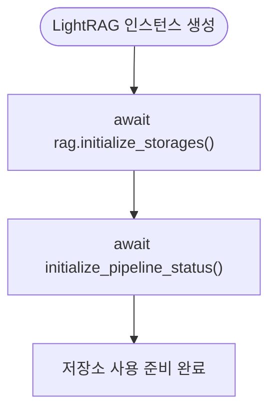
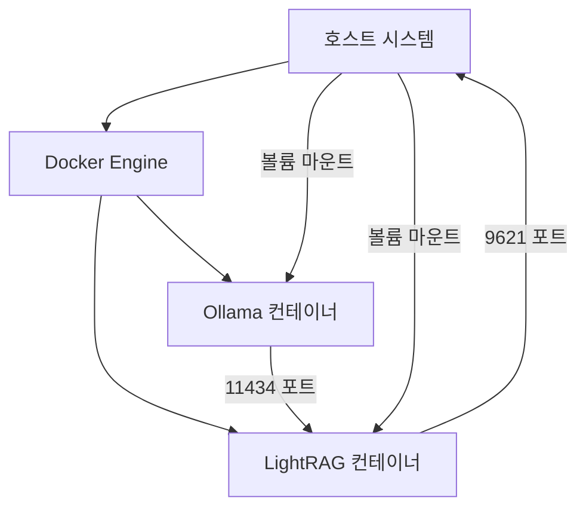
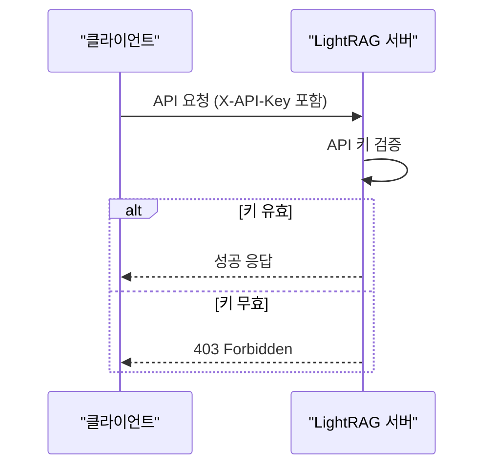
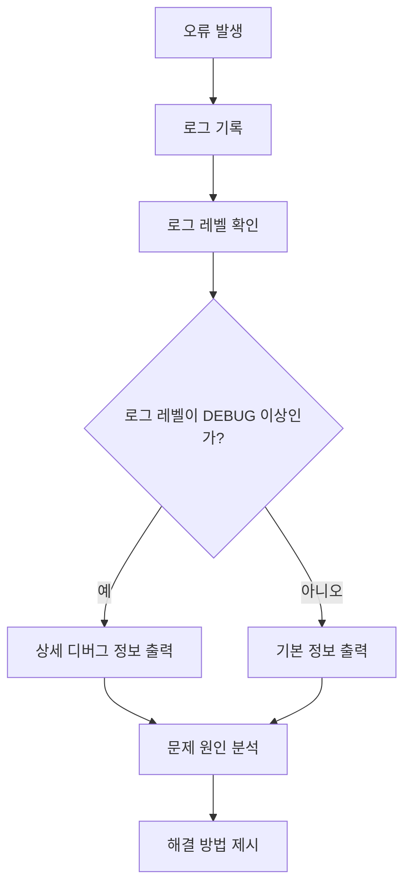

# 문제 해결

<cite>
**이 문서에서 참조한 파일**  
- [exceptions.py](file://lightrag/exceptions.py)
- [docker-compose.yml](file://docker-compose.yml)
- [k8s-deploy/lightrag/values.yaml](file://k8s-deploy/lightrag/values.yaml)
- [lightrag/api/utils_api.py](file://lightrag/api/utils_api.py)
- [SECURITY.md](file://SECURITY.md)
- [lightrag/api/auth.py](file://lightrag/api/auth.py)
- [lightrag/llm/openai.py](file://lightrag/llm/openai.py)
- [lightrag/kg/shared_storage.py](file://lightrag/kg/shared_storage.py)
- [lightrag/api/config.py](file://lightrag/api/config.py)
</cite>

## 목차
1. [소개](#소개)
2. [주요 예외 유형 및 해결 방법](#주요-예외-유형-및-해결-방법)
3. [설치 및 배포 문제](#설치-및-배포-문제)
4. [네트워크 및 구성 오류](#네트워크-및-구성-오류)
5. [로깅을 통한 문제 진단](#로깅을-통한-문제-진단)
6. [보안 관련 문제 예방](#보안-관련-문제-예방)
7. [디버깅 도구 및 모니터링 전략](#디버깅-도구-및-모니터링-전략)
8. [결론](#결론)

## 소개
LightRAG은 그래프 기반의 경량 RAG(Retrieval-Augmented Generation) 시스템으로, 다양한 LLM 및 벡터 저장소와 통합되어 있습니다. 이 문서는 LightRAG 사용 중 발생할 수 있는 일반적인 오류와 그 해결 방법을 체계적으로 정리합니다. 예외 처리, 배포 설정 오류, 인증 실패, 저장소 접근 문제 등을 다루며, 로깅과 보안 권고사항을 기반으로 한 문제 해결 전략을 제공합니다.

## 주요 예외 유형 및 해결 방법

LightRAG은 다양한 예외를 정의하여 오류 상황을 명확히 구분하고 처리합니다. `lightrag/exceptions.py` 파일에서 정의된 주요 예외 유형과 그 원인, 해결 방법을 설명합니다.

### APIStatusError 및 파생 예외
`APIStatusError`는 API 응답 상태 코드가 4xx 또는 5xx일 때 발생합니다. 이 클래스는 다음과 같은 파생 예외를 포함합니다:
- `BadRequestError`: 요청이 잘못된 경우 (400)
- `AuthenticationError`: 인증이 필요한 경우 (401)
- `PermissionDeniedError`: 권한이 없는 경우 (403)
- `NotFoundError`: 요청한 리소스가 없는 경우 (404)
- `ConflictError`: 충돌이 발생한 경우 (409)
- `UnprocessableEntityError`: 요청이 처리할 수 없는 경우 (422)
- `RateLimitError`: 요청 제한을 초과한 경우 (429)

이러한 예외는 주로 외부 서비스(LightRAG API, LLM 서비스 등)와의 통신에서 발생합니다. 해결 방법은 다음과 같습니다:
- 요청 내용을 확인하고 올바른 형식인지 검증합니다.
- 필요한 인증 정보(API 키, JWT 토큰 등)를 포함했는지 확인합니다.
- 요청 제한을 초과하지 않았는지 확인하고, 필요시 재시도 전에 대기합니다.

**Section sources**
- [exceptions.py](file://lightrag/exceptions.py#L0-L44)

### APIConnectionError 및 APITimeoutError
`APIConnectionError`는 API 연결 오류가 발생했을 때, `APITimeoutError`는 요청이 타임아웃되었을 때 발생합니다. 이러한 오류는 네트워크 문제, 서비스 다운, 방화벽 설정 등으로 인해 발생할 수 있습니다. 해결 방법은 다음과 같습니다:
- 네트워크 연결 상태를 확인합니다.
- 대상 서비스가 정상적으로 실행 중인지 확인합니다.
- 방화벽 또는 보안 그룹 설정에서 필요한 포트가 열려 있는지 확인합니다.
- 타임아웃 시간을 늘려 재시도합니다.

**Section sources**
- [exceptions.py](file://lightrag/exceptions.py#L45-L58)

### StorageNotInitializedError
`StorageNotInitializedError`는 저장소 초기화 전에 저장소 작업을 시도할 때 발생합니다. 이 오류는 LightRAG 인스턴스를 생성한 후 `initialize_storages()` 메서드를 호출하지 않았을 때 발생합니다. 해결 방법은 다음과 같습니다:
- LightRAG 인스턴스를 생성한 후 반드시 `await rag.initialize_storages()`를 호출하여 저장소를 초기화합니다.
- 파이프라인 상태를 사용하려면 `await initialize_pipeline_status()`도 호출해야 합니다.

**Diagram sources**
- [exceptions.py](file://lightrag/exceptions.py#L62-L76)
- [kg/shared_storage.py](file://lightrag/kg/shared_storage.py#L0-L799)

### PipelineNotInitializedError
`PipelineNotInitializedError`는 파이프라인 상태에 접근하기 전에 초기화하지 않았을 때 발생합니다. 이 오류는 `initialize_pipeline_status()` 함수를 호출하지 않았을 때 발생합니다. 해결 방법은 다음과 같습니다:
- 저장소 초기화 후 `from lightrag.kg.shared_storage import initialize_pipeline_status`를 임포트하고, `await initialize_pipeline_status()`를 호출합니다.

**Section sources**
- [exceptions.py](file://lightrag/exceptions.py#L79-L97)

## 설치 및 배포 문제

LightRAG는 Docker와 Kubernetes를 통해 배포할 수 있습니다. 이 섹션에서는 `docker-compose.yml`과 `k8s-deploy` 설정에서 발생할 수 있는 문제와 해결 방법을 설명합니다.

### Docker 배포 문제
`docker-compose.yml` 파일은 LightRAG와 Ollama 서비스를 정의합니다. 주요 설정 오류와 해결 방법은 다음과 같습니다:

- **Ollama 컨테이너 연결 오류**: LightRAG 컨테이너가 Ollama 컨테이너에 연결할 수 없는 경우, `depends_on` 설정을 확인하고, 네트워크 설정이 올바른지 검증합니다.
- **볼륨 마운트 오류**: 데이터 디렉터리가 올바르게 마운트되지 않는 경우, 호스트의 디렉터리 경로가 존재하고 올바른지 확인합니다.
- **환경 변수 누락**: `.env` 파일이 존재하지 않거나 필요한 환경 변수가 정의되지 않은 경우, `.env` 파일을 생성하고 필요한 변수를 설정합니다.

**Diagram sources**
- [docker-compose.yml](file://docker-compose.yml#L0-L49)

### Kubernetes 배포 문제
`k8s-deploy/lightrag/values.yaml` 파일은 Helm 차트의 설정을 정의합니다. 주요 설정 오류와 해결 방법은 다음과 같습니다:

- **리소스 제한 초과**: `resources.limits` 설정이 너무 낮아 파드가 OOMKilled 상태가 되는 경우, CPU 및 메모리 제한을 적절히 조정합니다.
- **영구 볼륨 크기 부족**: `persistence.ragStorage.size` 및 `persistence.inputs.size` 설정이 너무 작아 데이터 저장이 불가능한 경우, 크기를 늘립니다.
- **환경 변수 오류**: `env` 섹션에서 데이터베이스 또는 LLM 서비스의 인증 정보가 누락된 경우, 해당 값을 올바르게 설정합니다.

**Section sources**
- [k8s-deploy/lightrag/values.yaml](file://k8s-deploy/lightrag/values.yaml#L0-L58)

## 네트워크 및 구성 오류

LightRAG는 다양한 외부 서비스와 통신하므로, 네트워크 및 구성 오류가 자주 발생할 수 있습니다. 이 섹션에서는 API 인증 실패, LLM 연결 오류, 저장소 접근 문제 등을 다룹니다.

### API 인증 실패
API 인증 실패는 주로 `AuthenticationError` 또는 `PermissionDeniedError`로 나타납니다. 원인과 해결 방법은 다음과 같습니다:
- **API 키 누락 또는 오류**: 요청 헤더에 `X-API-Key`를 포함했는지, 키 값이 올바른지 확인합니다.
- **JWT 토큰 만료 또는 오류**: 토큰이 만료되지 않았는지, 서명이 유효한지 확인합니다. 필요시 로그인하여 새 토큰을 발급받습니다.

**Diagram sources**
- [lightrag/api/utils_api.py](file://lightrag/api/utils_api.py#L103-L137)
- [lightrag/api/auth.py](file://lightrag/api/auth.py#L0-L109)

### LLM 연결 오류
LLM 서비스에 연결할 수 없는 경우, `APIConnectionError` 또는 `APITimeoutError`가 발생합니다. 원인과 해결 방법은 다음과 같습니다:
- **LLM 서비스 호스트 및 포트 확인**: `LLM_BINDING_HOST` 환경 변수가 올바른지 확인합니다.
- **API 키 확인**: `LLM_BINDING_API_KEY` 환경 변수가 올바르게 설정되었는지 확인합니다.
- **네트워크 연결 확인**: LLM 서비스가 실행 중인지, 네트워크 방화벽이 연결을 차단하지 않는지 확인합니다.

**Section sources**
- [lightrag/llm/openai.py](file://lightrag/llm/openai.py#L0-L487)

### 저장소 접근 문제
벡터 저장소, 그래프 저장소 등에 접근할 수 없는 경우, 해당 저장소의 설정을 확인해야 합니다. 예를 들어, Neo4j 저장소를 사용할 경우 `NEO4J_URI`, `NEO4J_USERNAME`, `NEO4J_PASSWORD` 환경 변수를 올바르게 설정해야 합니다.

**Section sources**
- [k8s-deploy/lightrag/values.yaml](file://k8s-deploy/lightrag/values.yaml#L0-L58)

## 로깅을 통한 문제 진단

LightRAG은 `lightrag/api/utils_api.py` 파일에서 로깅 설정을 제공합니다. 로깅을 통해 문제를 진단하는 방법은 다음과 같습니다:

- **로그 레벨 설정**: `--log-level` 인자 또는 `LOG_LEVEL` 환경 변수를 통해 로그 레벨을 설정합니다. 디버그 정보가 필요할 경우 `DEBUG`로 설정합니다.
- **상세 디버그 출력**: `--verbose` 인자 또는 `VERBOSE` 환경 변수를 설정하여 상세한 디버그 출력을 활성화합니다.
- **로그 메시지 분석**: 로그 메시지를 통해 오류 발생 위치와 원인을 파악합니다. 예를 들어, `StorageNotInitializedError` 발생 시 초기화 누락을 확인할 수 있습니다.

**Diagram sources**
- [lightrag/api/utils_api.py](file://lightrag/api/utils_api.py#L0-L344)

## 보안 관련 문제 예방

`SECURITY.md` 파일은 LightRAG의 보안 취약점을 보고하는 방법을 안내합니다. 보안 관련 문제를 예방하기 위한 권고사항은 다음과 같습니다:

- **API 키 보호**: `LIGHTRAG_API_KEY` 환경 변수를 통해 API 키를 설정하고, 키가 노출되지 않도록 주의합니다.
- **JWT 인증 활성화**: `AUTH_ACCOUNTS` 환경 변수를 설정하여 JWT 인증을 활성화하고, 인증되지 않은 접근을 방지합니다.
- **HTTPS 사용**: `--ssl` 인자 또는 `SSL` 환경 변수를 설정하여 HTTPS를 활성화하고, 통신을 암호화합니다.
- **지원되는 버전 유지**: 현재 보안 업데이트가 제공되는 1.3.x 버전을 사용하고, 오래된 버전은 업데이트합니다.

**Section sources**
- [SECURITY.md](file://SECURITY.md#L0-L18)
- [lightrag/api/config.py](file://lightrag/api/config.py#L0-L424)

## 디버깅 도구 및 모니터링 전략

LightRAG의 문제를 효과적으로 디버깅하고 모니터링하기 위한 도구와 전략을 제안합니다:

- **Splunk 또는 ELK 스택**: 로그를 중앙 집중식으로 수집하고 분석하여 문제를 신속히 진단합니다.
- **Prometheus 및 Grafana**: 시스템 메트릭을 모니터링하고, 알림을 설정하여 이상 징후를 조기에 감지합니다.
- **Distributed Tracing**: OpenTelemetry 등을 사용하여 요청의 흐름을 추적하고, 병목 지점을 식별합니다.

## 결론
이 문서는 LightRAG 사용 중 발생할 수 있는 다양한 오류와 그 해결 방법을 체계적으로 정리하였습니다. 예외 유형, 배포 설정, 네트워크 오류, 로깅, 보안 등 다양한 측면에서 문제 해결 전략을 제공합니다. 이를 통해 LightRAG 시스템의 안정성과 신뢰성을 높일 수 있습니다.