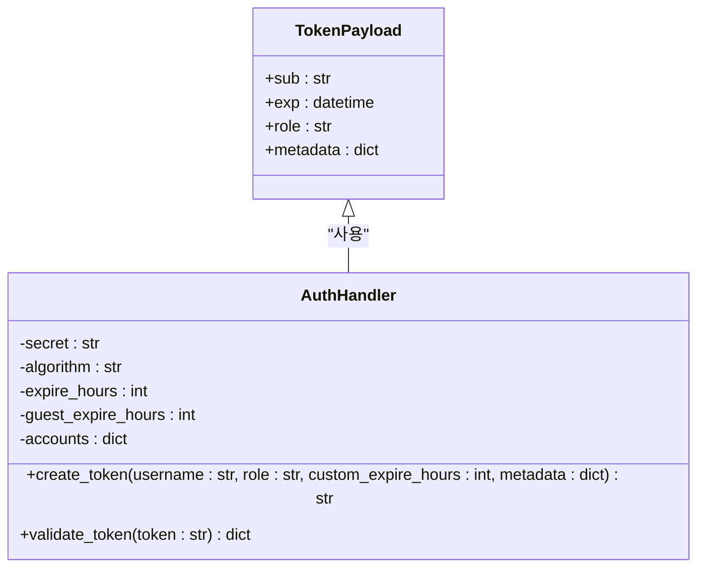
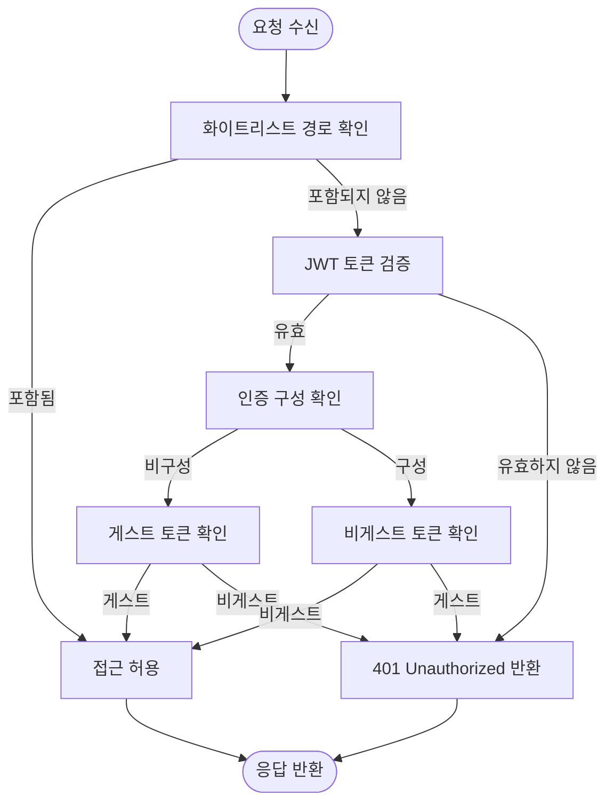

# 보안 문제 예방 및 모범 사례

<cite>
**이 문서에서 참조한 파일**  
- [SECURITY.md](file://SECURITY.md)
- [auth.py](file://lightrag/api/auth.py)
- [utils_api.py](file://lightrag/api/utils_api.py)
- [config.py](file://lightrag/api/config.py)
- [lightrag_server.py](file://lightrag/api/lightrag_server.py)
- [document_routes.py](file://lightrag/api/routers/document_routes.py)
</cite>

## 목차
1. [소개](#소개)
2. [민감한 정보 보호](#민감한-정보-보호)
3. [인증 및 접근 제어](#인증-및-접근-제어)
4. [외부 공격 방어](#외부-공격-방어)
5. [모니터링 및 로깅](#모니터링-및-로깅)
6. **책임 있는 공개 절차**
7. [프로덕션 환경 보안 강화](#프로덕션-환경-보안-강화)
8. [결론](#결론)

## 소개

LightRAG 시스템은 민감한 정보를 처리하고 외부 공격에 노출될 수 있는 웹 기반 RAG(Retrieval-Augmented Generation) 서버입니다. 이 문서는 `SECURITY.md`에 명시된 보안 정책을 기반으로 시스템의 보안 취약점을 예방하기 위한 종합적인 가이드를 제공합니다. 주요 내용으로는 민감한 정보의 안전한 관리, 인증 메커니즘을 활용한 접근 제어 전략, SQL 인젝션 및 XSS와 같은 외부 공격으로부터의 보호, 보안 취약점 발견 시 책임 있는 공개(responsible disclosure) 절차, 그리고 프로덕션 환경에서의 SSL 설정, CORS 정책, 로그 관리 등의 모범 사례를 포함합니다.

**Section sources**
- [SECURITY.md](file://SECURITY.md#L1-L18)

## 민감한 정보 보호

### .env 파일 관리

LightRAG 시스템은 `.env` 파일을 통해 민감한 구성 정보를 관리합니다. 이 파일은 API 키, JWT 시크릿, 데이터베이스 연결 정보 등 중요한 민감 정보를 포함할 수 있으므로, 철저한 보호가 필요합니다.

- **파일 위치**: `.env` 파일은 서버 시작 디렉토리에 위치해야 하며, 이는 다중 인스턴스 지원을 가능하게 합니다.
- **환경 변수 우선순위**: 운영체제 환경 변수는 `.env` 파일의 설정보다 우선합니다. 이는 개발 및 배포 환경에서 보다 유연한 구성 관리를 가능하게 합니다.
- **존재 여부 확인**: 서버 시작 시 `.env` 파일의 존재 여부를 확인합니다. 파일이 없으면 경고 메시지를 표시하고, 대화형 터미널에서 실행 중인 경우 사용자에게 계속할지 여부를 묻습니다.

```python
def check_env_file():
    """
    Check if .env file exists and handle user confirmation if needed.
    Returns True if should continue, False if should exit.
    """
    if not os.path.exists(".env"):
        warning_msg = "Warning: Startup directory must contain .env file for multi-instance support."
        ASCIIColors.yellow(warning_msg)

        # Check if running in interactive terminal
        if sys.stdin.isatty():
            response = input("Do you want to continue? (yes/no): ")
            if response.lower() != "yes":
                ASCIIColors.red("Server startup cancelled")
                return False
    return True
```

**Section sources**
- [utils_api.py](file://lightrag/api/utils_api.py#L10-L38)

### API 키 및 JWT 시크릿 관리

API 키와 JWT 시크릿은 시스템의 핵심 보안 요소입니다. 이들은 `.env` 파일 또는 명령줄 인자를 통해 설정되며, 적절한 보안 조치가 필요합니다.

- **API 키**: `LIGHTRAG_API_KEY` 환경 변수 또는 `--key` 명령줄 인자를 통해 설정됩니다. 이 키는 서버에 대한 무단 접근을 방지하는 데 사용됩니다.
- **JWT 시크릿**: `TOKEN_SECRET` 환경 변수 또는 `--token-secret` 명령줄 인자를 통해 설정됩니다. 기본값은 `lightrag-jwt-default-secret`이지만, 프로덕션 환경에서는 반드시 강력한 임의의 문자열로 변경해야 합니다.
- **기본값 경고**: 기본 시크릿 값을 사용하는 것은 심각한 보안 위험을 초래하므로, 프로덕션 배포 시 반드시 변경해야 합니다.

**Section sources**
- [config.py](file://lightrag/api/config.py#L300-L305)
- [config.py](file://lightrag/api/config.py#L350-L353)

## 인증 및 접근 제어

### 인증 메커니즘

LightRAG 시스템은 `auth.py` 모듈을 통해 JWT(JSON Web Token) 기반의 인증 메커니즘을 구현합니다. 이 메커니즘은 사용자 신원을 확인하고, 세션을 안전하게 관리하는 데 사용됩니다.

#### AuthHandler 클래스

`AuthHandler` 클래스는 JWT 토큰의 생성 및 검증을 담당합니다. 이 클래스는 다음과 같은 주요 기능을 제공합니다.

- **초기화**: `__init__` 메서드는 토큰 시크릿, 알고리즘, 만료 시간 등을 설정합니다. 또한, `AUTH_ACCOUNTS` 환경 변수에서 사용자 계정 정보를 로드하여 내부 딕셔너리에 저장합니다.
- **토큰 생성**: `create_token` 메서드는 사용자 이름, 역할, 만료 시간 등을 기반으로 JWT 토큰을 생성합니다. 역할에 따라 일반 사용자 토큰과 게스트 토큰의 만료 시간을 다르게 설정할 수 있습니다.
- **토큰 검증**: `validate_token` 메서드는 제공된 JWT 토큰을 검증하고, 만료 여부를 확인합니다. 유효한 토큰의 경우 사용자 정보를 포함한 딕셔너리를 반환합니다.



**Diagram sources**
- [auth.py](file://lightrag/api/auth.py#L15-L109)

**Section sources**
- [auth.py](file://lightrag/api/auth.py#L15-L109)

### 접근 제어 전략

`utils_api.py` 모듈의 `get_combined_auth_dependency` 함수는 다중 인증 방식을 결합하여 유연한 접근 제어를 제공합니다. 이 함수는 API 키, OAuth2 토큰, 그리고 화이트리스트 경로를 기반으로 접근을 허용하거나 거부합니다.

#### 인증 흐름

1. **화이트리스트 경로 확인**: 요청 경로가 `WHITELIST_PATHS` 환경 변수에 정의된 화이트리스트에 포함되어 있는지 확인합니다. `/health`, `/api/*`와 같은 경로는 인증 없이 접근이 허용됩니다.
2. **토큰 검증**: 요청에 포함된 JWT 토큰을 검증합니다. 토큰이 유효하고, 인증이 구성되어 있지 않으면 게스트 토큰을 허용합니다. 인증이 구성되어 있으면 비게스트 토큰만 허용합니다.
3. **API 키 검증**: API 키가 구성되어 있고, 요청 헤더에 올바른 API 키가 포함되어 있는지 확인합니다.
4. **접근 거부**: 위의 모든 조건을 충족하지 못하면 401(Unauthorized) 또는 403(Forbidden) 오류를 반환합니다.



**Diagram sources**
- [utils_api.py](file://lightrag/api/utils_api.py#L60-L180)

**Section sources**
- [utils_api.py](file://lightrag/api/utils_api.py#L60-L180)
- [config.py](file://lightrag/api/config.py#L370-L372)

## 외부 공격 방어

### SQL 인젝션 방어

LightRAG 시스템은 SQL 인젝션 공격에 대한 직접적인 취약점이 제한적이지만, 백엔드 데이터베이스 구현(예: PostgreSQL)을 통해 간접적으로 영향을 받을 수 있습니다. 따라서 다음과 같은 방어 전략이 필요합니다.

- **입력 검증 및 정규화**: 사용자 입력은 항상 검증되고 정규화되어야 합니다. 특히, `document_routes.py`에서 파일 업로드를 처리할 때 파일 이름에 대한 경로 탐색 공격(Path Traversal)을 방지하기 위해 `sanitize_filename` 함수를 사용합니다.
- **파라미터화된 쿼리**: 백엔드 데이터베이스에서 SQL 쿼리를 실행할 때는 항상 파라미터화된 쿼리 또는 준비된 문을 사용해야 합니다. 이는 사용