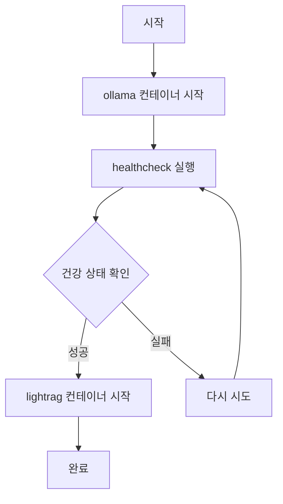
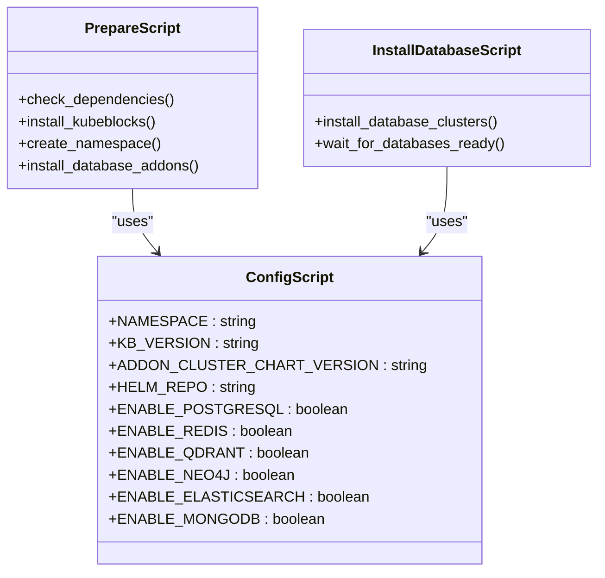
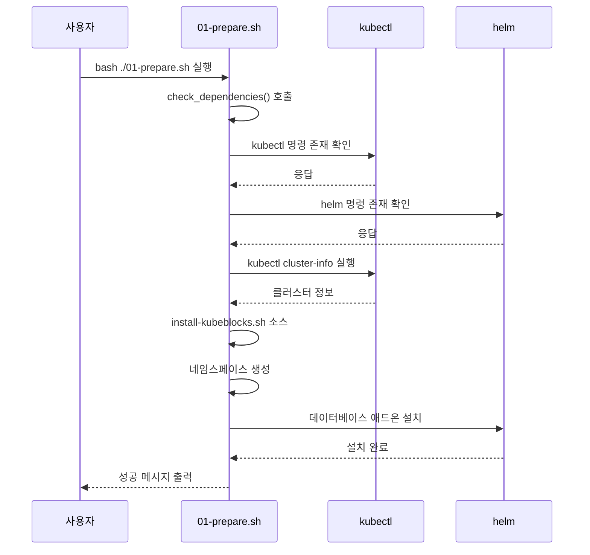
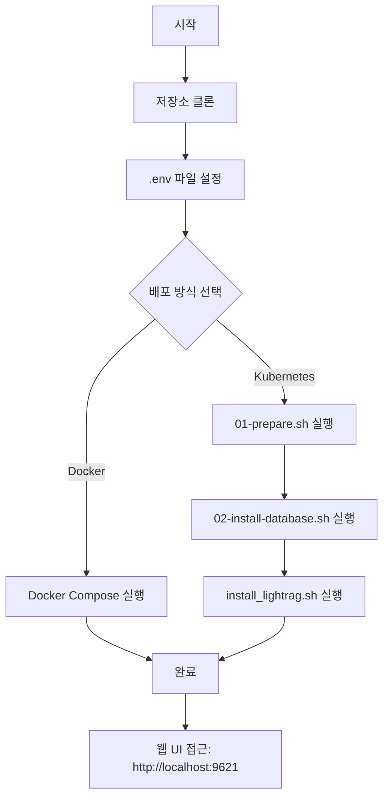

# 설치 및 배포 문제

<cite>
**이 문서에서 참조한 파일**
- [docker-compose.yml](file://docker-compose.yml)
- [00-config.sh](file://k8s-deploy/databases/00-config.sh)
- [01-prepare.sh](file://k8s-deploy/databases/01-prepare.sh)
- [02-install-database.sh](file://k8s-deploy/databases/02-install-database.sh)
- [install_lightrag.sh](file://k8s-deploy/install_lightrag.sh)
- [common.sh](file://k8s-deploy/databases/scripts/common.sh)
- [README.md](file://k8s-deploy/README.md)
- [.env](file://.env)
</cite>

## 목차
1. [소개](#소개)
2. [Docker Compose 설치 문제 해결](#docker-compose-설치-문제-해결)
3. [Kubernetes 및 Helm 배포 문제 해결](#kubernetes-및-helm-배포-문제-해결)
4. [스크립트 실행 실패 문제 해결](#스크립트-실행-실패-문제-해결)
5. [일반적인 설치 오류 및 해결 방안](#일반적인-설치-오류-및-해결-방안)
6. [정상 설치 절차 안내](#정상-설치-절차-안내)

## 소개
LightRAG는 검색 증강 생성(RAG) 기능을 제공하는 시스템으로, Docker 및 Kubernetes를 통해 배포할 수 있습니다. 본 문서는 Docker Compose와 Kubernetes 기반 설치 및 배포 과정에서 발생할 수 있는 다양한 문제를 체계적으로 해결하는 방법을 제공합니다. 컨테이너 연결 오류, 볼륨 마운트 실패, 포트 충돌, Helm 차트 설정 오류, 리소스 제약, 네트워크 정책 문제, 스크립트 실행 실패 원인 및 해결 방안을 다루며, .env 파일 누락, 의존성 충돌, 파이썬 버전 호환성 문제 등 일반적인 설치 오류도 포함합니다.

## Docker Compose 설치 문제 해결

### 컨테이너 연결 오류
Docker Compose에서 `lightrag` 서비스가 `ollama` 서비스에 의존하도록 `depends_on`을 설정했지만, 컨테이너 간 네트워크 연결이 실패할 수 있습니다. 이는 `ollama` 서비스가 완전히 준비되기 전에 `lightrag` 서비스가 시작되면서 발생할 수 있습니다.

**진단 방법**:
- `docker-compose logs lightrag` 명령으로 로그 확인
- `lightrag` 컨테이너 내부에서 `curl http://ollama:11434`로 연결 테스트

**해결 절차**:
1. `ollama` 서비스에 `healthcheck` 설정을 통해 건강 상태를 모니터링하도록 구성
2. `lightrag` 서비스가 `ollama`의 건강 상태를 확인한 후 시작되도록 `depends_on` 조건을 강화

**Diagram sources**
- [docker-compose.yml](file://docker-compose.yml#L25-L49)

**Section sources**
- [docker-compose.yml](file://docker-compose.yml#L1-L49)

### 볼륨 마운트 실패
`docker-compose.yml`에서 정의된 볼륨 경로가 호스트 시스템에 존재하지 않거나 권한 문제가 발생할 수 있습니다.

**진단 방법**:
- `docker-compose config`으로 볼륨 설정 확인
- 호스트 시스템에서 `ls -la ./data/`로 디렉터리 존재 및 권한 확인

**해결 절차**:
1. 필요한 디렉터리 생성: `mkdir -p ./data/ollama ./data/rag_storage ./data/inputs ./data/tiktoken`
2. 적절한 권한 설정: `chmod -R 755 ./data`
3. `.env` 파일이 존재하는지 확인

### 포트 충돌 문제
`lightrag` 서비스의 포트 9621 또는 `ollama` 서비스의 포트 9622가 이미 사용 중일 수 있습니다.

**진단 방법**:
- `netstat -an | grep 9621` 또는 `lsof -i :9621`로 포트 사용 확인

**해결 절차**:
1. 다른 포트로 변경: `docker-compose.yml`에서 `"${PORT:-9621}:9621"`을 `"9623:9621"`로 수정
2. 충돌하는 프로세스 종료

## Kubernetes 및 Helm 배포 문제 해결

### Helm 차트 설정 오류
`k8s-deploy` 디렉터리의 Helm 차트 설정에서 데이터베이스 선택 및 구성이 올바르지 않을 수 있습니다.

**진단 방법**:
- `k8s-deploy/databases/00-config.sh` 파일 내용 확인
- 설정된 데이터베이스가 실제 설치 가능한지 확인

**해결 절차**:
1. `00-config.sh` 파일에서 필요한 데이터베이스를 `true`로 설정
2. `ENABLE_POSTGRESQL=true` 및 `ENABLE_NEO4J=true`가 기본으로 설정되어 있음

**Diagram sources**
- [00-config.sh](file://k8s-deploy/databases/00-config.sh#L1-L22)
- [01-prepare.sh](file://k8s-deploy/databases/01-prepare.sh#L1-L34)
- [02-install-database.sh](file://k8s-deploy/databases/02-install-database.sh#L1-L63)

**Section sources**
- [00-config.sh](file://k8s-deploy/databases/00-config.sh#L1-L22)
- [01-prepare.sh](file://k8s-deploy/databases/01-prepare.sh#L1-L34)
- [02-install-database.sh](file://k8s-deploy/databases/02-install-database.sh#L1-L63)

### 리소스 제약 문제
Kubernetes 클러스터의 리소스(CPU, 메모리)가 부족하여 파드가 실행되지 않을 수 있습니다.

**진단 방법**:
- `kubectl describe pod <pod-name> -n rag`로 이벤트 로그 확인
- `kubectl get nodes`로 노드 리소스 확인

**해결 절차**:
1. 클러스터 리소스 확장
2. `values.yaml`에서 리소스 요청 및 제한 조정

### 네트워크 정책 문제
네트워크 정책이 설정되어 있어 컨테이너 간 통신이 차단될 수 있습니다.

**진단 방법**:
- `kubectl get networkpolicies -n rag`로 네트워크 정책 확인
- `kubectl logs <pod-name> -n rag`로 연결 오류 로그 확인

**해결 절차**:
1. 필요한 네트워크 정책 추가
2. 일시적으로 네트워크 정책 비활성화하여 테스트

## 스크립트 실행 실패 문제 해결

### 00-config.sh 실행 실패 원인
환경 변수 설정 오류 또는 스크립트 권한 문제로 인해 `00-config.sh` 스크립트가 실행되지 않을 수 있습니다.

**진단 방법**:
- `bash -x 00-config.sh`로 디버그 모드 실행
- `ls -la 00-config.sh`로 실행 권한 확인

**해결 방안**:
1. 실행 권한 부여: `chmod +x 00-config.sh`
2. 필요한 환경 변수 확인 및 설정

### 01-prepare.sh 실행 실패 원인
의존성 검사에서 `kubectl` 또는 `helm`이 설치되어 있지 않거나, Kubernetes 클러스터에 접근할 수 없는 경우 실패합니다.

**진단 방법**:
- `kubectl cluster-info`로 클러스터 상태 확인
- `helm version`으로 Helm 설치 확인

**해결 방안**:
1. `kubectl` 및 `helm` 설치
2. kubeconfig 설정 확인
3. 클러스터 접근 권한 확인

**Diagram sources**
- [01-prepare.sh](file://k8s-deploy/databases/01-prepare.sh#L1-L34)
- [common.sh](file://k8s-deploy/databases/scripts/common.sh#L1-L43)

**Section sources**
- [01-prepare.sh](file://k8s-deploy/databases/01-prepare.sh#L1-L34)
- [common.sh](file://k8s-deploy/databases/scripts/common.sh#L1-L43)

## 일반적인 설치 오류 및 해결 방안

### .env 파일 누락
`.env` 파일이 존재하지 않거나 필요한 환경 변수가 정의되어 있지 않은 경우 오류가 발생합니다.

**해결 방안**:
1. `env.example` 파일을 복사하여 `.env` 생성: `cp env.example .env`
2. 필요한 API 키 설정: `OPENAI_API_KEY=your_key`

### 의존성 충돌
Python 패키지 의존성 충돌로 인해 설치가 실패할 수 있습니다.

**해결 방안**:
1. 가상 환경 사용: `python -m venv venv && source venv/bin/activate`
2. 의존성 재설치: `pip install --force-reinstall -e ".[api]"`

### 파이썬 버전 호환성 문제
LightRAG는 Python 3.10을 요구하지만, 시스템에 다른 버전이 설치된 경우 문제가 발생할 수 있습니다.

**진단 방법**:
- `python --version`으로 버전 확인

**해결 방안**:
1. Python 3.10 설치
2. pyenv를 사용하여 Python 버전 관리

## 정상 설치 절차 안내

### Docker Compose를 통한 설치
1. 저장소 클론: `git clone https://github.com/HKUDS/LightRAG.git`
2. `.env` 파일 생성: `cp env.example .env`
3. 환경 변수 설정: `.env` 파일에 `OPENAI_API_KEY` 설정
4. 컨테이너 실행: `docker compose up`

### Kubernetes를 통한 설치
1. 저장소 클론 및 디렉터리 이동
2. 환경 변수 설정
3. 데이터베이스 준비: `bash ./databases/01-prepare.sh`
4. 데이터베이스 설치: `bash ./databases/02-install-database.sh`
5. LightRAG 설치: `bash ./install_lightrag.sh`
6. 포트 포워딩: `kubectl --namespace rag port-forward svc/lightrag 9621:9621`

**Diagram sources**
- [docker-compose.yml](file://docker-compose.yml#L1-L49)
- [01-prepare.sh](file://k8s-deploy/databases/01-prepare.sh#L1-L34)
- [02-install-database.sh](file://k8s-deploy/databases/02-install-database.sh#L1-L63)
- [install_lightrag.sh](file://k8s-deploy/install_lightrag.sh#L1-L96)

**Section sources**
- [docker-compose.yml](file://docker-compose.yml#L1-L49)
- [01-prepare.sh](file://k8s-deploy/databases/01-prepare.sh#L1-L34)
- [02-install-database.sh](file://k8s-deploy/databases/02-install-database.sh#L1-L63)
- [install_lightrag.sh](file://k8s-deploy/install_lightrag.sh#L1-L96)
- [.env](file://.env)