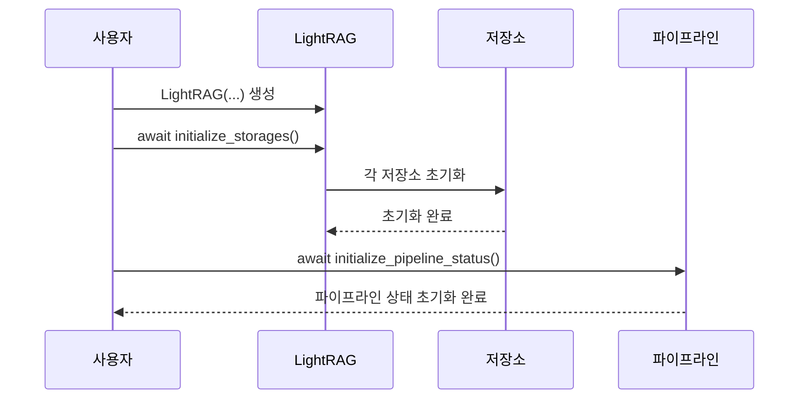

# 저장소 연결 및 초기화 문제

<cite>
**이 문서에서 참조한 파일**  
- [exceptions.py](file://lightrag/exceptions.py)
- [lightrag.py](file://lightrag/lightrag.py)
- [shared_storage.py](file://lightrag/kg/shared_storage.py)
- [lightrag_openai_demo.py](file://examples/lightrag_openai_demo.py)
- [lightrag_azure_openai_demo.py](file://examples/lightrag_azure_openai_demo.py)
- [lightrag_openai_neo4j_milvus_redis_demo.py](file://examples/unofficial-sample/lightrag_openai_neo4j_milvus_redis_demo.py)
</cite>

## 목차
1. [소개](#소개)
2. [StorageNotInitializedError 및 PipelineNotInitializedError의 근본 원인](#storagenotinitializederror-및-pipelinenotinitializederror의-근본-원인)
3. [초기화 워크플로 분석](#초기화-워크플로-분석)
4. [저장소 백엔드 연결 문제 해결](#저장소-백엔드-연결-문제-해결)
5. [실제 예제 분석](#실제-예제-분석)
6. [결론](#결론)

## 소개
이 문서는 LightRAG 프레임워크에서 발생하는 저장소 관련 예외, 특히 `StorageNotInitializedError`와 `PipelineNotInitializedError`의 근본 원인과 해결 방법을 상세히 설명합니다. 예외 메시지를 기반으로 초기화 누락 시스템의 작동 원리를 분석하고, 올바른 초기화 순서를 안내하며, 다양한 저장소 백엔드(PostgreSQL, Neo4j, Redis 등)의 연결 설정 팁을 제공합니다.

## StorageNotInitializedError 및 PipelineNotInitializedError의 근본 원인

`StorageNotInitializedError`는 저장소 작업을 초기화하기 전에 시도할 때 발생하는 런타임 오류입니다. 이 예외는 `exceptions.py` 파일에 정의되어 있으며, 사용자에게 올바른 초기화 절차를 안내하는 자세한 오류 메시지를 포함하고 있습니다. 이 오류는 `initialize_storages()` 메서드를 호출하지 않고 저장소에 접근하려 할 때 발생합니다.

`PipelineNotInitializedError`는 파이프라인 상태에 접근하기 전에 초기화되지 않았을 때 발생하는 키 오류입니다. 이 예외는 `shared_storage.py` 파일에 정의되어 있으며, `initialize_pipeline_status()` 함수가 호출되지 않았을 때 발생합니다. 이 오류는 파이프라인 관련 작업을 수행하기 전에 파이프라인 상태를 초기화해야 함을 나타냅니다.

**구성 요소 소스**
- [exceptions.py](file://lightrag/exceptions.py#L62-L76)
- [exceptions.py](file://lightrag/exceptions.py#L78-L98)

## 초기화 워크플로 분석

LightRAG 프레임워크에서는 저장소와 파이프라인 상태를 올바르게 초기화하는 것이 중요합니다. 초기화 순서는 다음과 같습니다:

1. `LightRAG` 인스턴스를 생성합니다.
2. `initialize_storages()` 메서드를 비동기적으로 호출하여 모든 저장소를 초기화합니다.
3. `initialize_pipeline_status()` 함수를 비동기적으로 호출하여 파이프라인 상태를 초기화합니다.

이 순서는 `lightrag.py` 파일의 `__post_init__` 메서드와 `initialize_storages()` 메서드에서 확인할 수 있습니다. `initialize_storages()` 메서드는 모든 저장소를 순차적으로 초기화하여 데드락을 방지합니다.



**다이어그램 소스**
- [lightrag.py](file://lightrag/lightrag.py#L700-L720)
- [shared_storage.py](file://lightrag/kg/shared_storage.py#L100-L120)

**구성 요소 소스**
- [lightrag.py](file://lightrag/lightrag.py#L700-L720)
- [shared_storage.py](file://lightrag/kg/shared_storage.py#L100-L120)

## 저장소 백엔드 연결 문제 해결

각 저장소 백엔드에 연결할 때 발생할 수 있는 문제를 해결하기 위한 설정 팁을 제공합니다.

### 연결 실패
- **PostgreSQL**: 데이터베이스 서버가 실행 중인지 확인하고, 연결 문자열이 올바른지 확인합니다.
- **Neo4j**: Neo4j 서버가 실행 중인지 확인하고, URI, 사용자 이름, 비밀번호가 올바른지 확인합니다.
- **Redis**: Redis 서버가 실행 중인지 확인하고, URI가 올바른지 확인합니다.

### 인증 오류
- 모든 백엔드에 대해 올바른 인증 정보를 제공해야 합니다. 예를 들어, Neo4j의 경우 `NEO4J_USERNAME` 및 `NEO4J_PASSWORD` 환경 변수를 설정해야 합니다.

### 네트워크 타임아웃
- 네트워크 연결이 안정적인지 확인하고, 필요시 타임아웃 값을 조정합니다.

**구성 요소 소스**
- [lightrag_openai_neo4j_milvus_redis_demo.py](file://examples/unofficial-sample/lightrag_openai_neo4j_milvus_redis_demo.py#L10-L30)

## 실제 예제 분석

`examples` 디렉터리의 실제 코드를 참조하여 올바른 초기화 워크플로를 보여주는 실용적인 예제를 포함합니다.

### OpenAI 데모 예제
`lightrag_openai_demo.py` 파일은 OpenAI를 사용하는 예제를 보여줍니다. 이 예제에서는 `initialize_rag()` 함수를 통해 `LightRAG` 인스턴스를 생성하고, `initialize_storages()` 및 `initialize_pipeline_status()`를 호출하여 초기화합니다.

```mermaid
flowchart TD
A[LightRAG 인스턴스 생성] --> B[initialize_storages() 호출]
B --> C[initialize_pipeline_status() 호출]
C --> D[문서 삽입]
D --> E[쿼리 수행]
```

**다이어그램 소스**
- [lightrag_openai_demo.py](file://examples/lightrag_openai_demo.py#L50-L70)

**구성 요소 소스**
- [lightrag_openai_demo.py](file://examples/lightrag_openai_demo.py#L50-L70)

### Azure OpenAI 데모 예제
`lightrag_azure_openai_demo.py` 파일은 Azure OpenAI를 사용하는 예제를 보여줍니다. 이 예제도 `initialize_rag()` 함수를 통해 초기화 순서를 따릅니다.

**구성 요소 소스**
- [lightrag_azure_openai_demo.py](file://examples/lightrag_azure_openai_demo.py#L80-L100)

## 결론
`StorageNotInitializedError` 및 `PipelineNotInitializedError`는 저장소와 파이프라인 상태를 올바르게 초기화하지 않았을 때 발생하는 예외입니다. 올바른 초기화 순서를 따르고, 각 저장소 백엔드의 연결 설정을 올바르게 구성하면 이러한 오류를 방지할 수 있습니다. 예제 코드를 참조하여 실제 환경에서 올바른 초기화 워크플로를 구현할 수 있습니다.