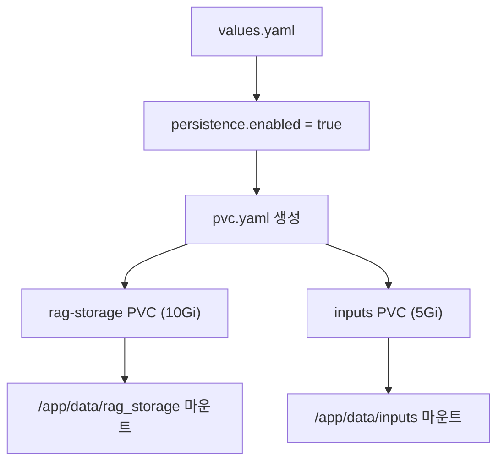
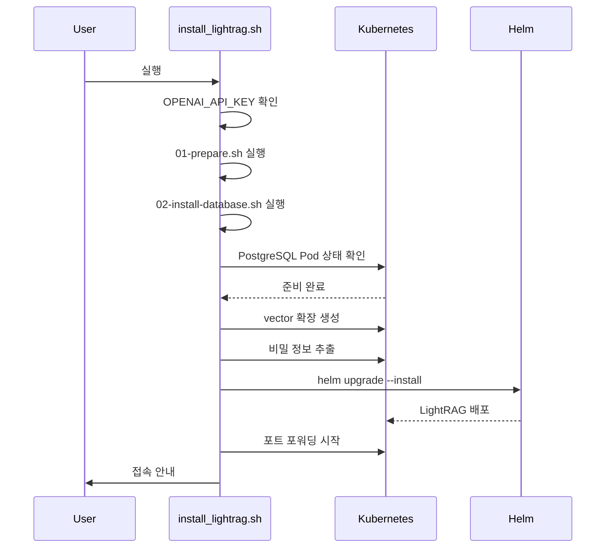
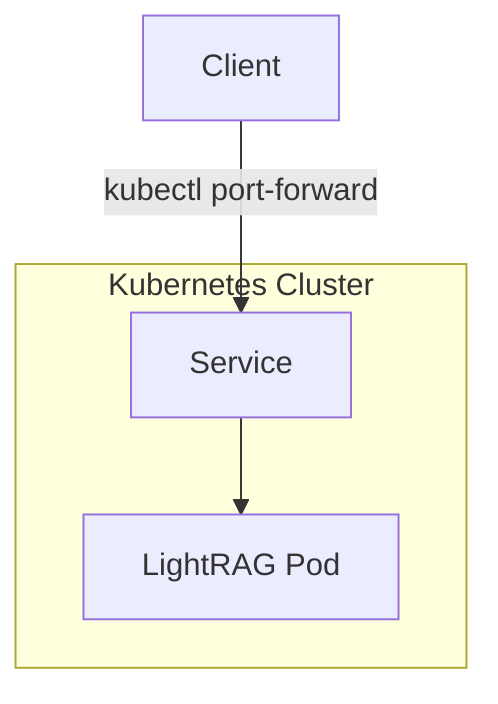

# Kubernetes를 통한 배포

<cite>
**이 문서에서 참조한 파일**
- [Chart.yaml](file://k8s-deploy/lightrag/Chart.yaml)
- [values.yaml](file://k8s-deploy/lightrag/values.yaml)
- [deployment.yaml](file://k8s-deploy/lightrag/templates/deployment.yaml)
- [pvc.yaml](file://k8s-deploy/lightrag/templates/pvc.yaml)
- [service.yaml](file://k8s-deploy/lightrag/templates/service.yaml)
- [install_lightrag.sh](file://k8s-deploy/install_lightrag.sh)
- [01-prepare.sh](file://k8s-deploy/databases/01-prepare.sh)
- [02-install-database.sh](file://k8s-deploy/databases/02-install-database.sh)
- [00-config.sh](file://k8s-deploy/databases/00-config.sh)
- [neo4j/values.yaml](file://k8s-deploy/databases/neo4j/values.yaml)
- [postgresql/values.yaml](file://k8s-deploy/databases/postgresql/values.yaml)
- [qdrant/values.yaml](file://k8s-deploy/databases/qdrant/values.yaml)
</cite>

## 목차
1. [소개](#소개)
2. [Helm 차트 메타데이터 분석](#helm-차트-메타데이터-분석)
3. [values.yaml 구성 항목 분석](#valuesyaml-구성-항목-분석)
4. [데이터베이스 연결 환경 변수 설정](#데이터베이스-연결-환경-변수-설정)
5. [영구 스토리지 및 리소스 제한](#영구-스토리지-및-리소스-제한)
6. [설치 스크립트 내부 동작](#설치-스크립트-내부-동작)
7. [Helm 명령어 사용법](#helm-명령어-사용법)
8. [네트워크 및 서비스 구성](#네트워크-및-서비스-구성)
9. [배포 후 상태 확인 및 로그 분석](#배포-후-상태-확인-및-로그-분석)
10. [결론](#결론)

## 소개
LightRAG는 효율적이고 경량화된 그래프 기반 RAG(Retrieval-Augmented Generation) 시스템으로, Kubernetes 환경에서 Helm 차트를 통해 배포할 수 있습니다. 본 문서는 `k8s-deploy/lightrag` 디렉터리 내 Helm 차트를 활용한 LightRAG의 Kubernetes 배포 절차를 상세히 설명합니다. Helm 차트의 메타데이터, 구성 파일의 주요 항목, 데이터베이스 연결 설정, 영구 스토리지 및 리소스 관리, 설치 스크립트의 동작 원리, Helm 명령어 사용법, 네트워크 구성 및 배포 후 모니터링 방법을 다룹니다.

## Helm 차트 메타데이터 분석
`Chart.yaml` 파일은 Helm 차트의 메타데이터를 정의합니다. LightRAG Helm 차트는 다음과 같은 주요 메타데이터를 포함하고 있습니다:
- **name**: `lightrag` — 차트의 이름으로, Helm 설치 시 사용됩니다.
- **version**: `0.1.0` — Helm 차트 자체의 버전입니다.
- **appVersion**: `"1.0.0"` — 배포되는 애플리케이션의 버전을 나타냅니다.
- **type**: `application` — 이 차트가 애플리케이션임을 명시합니다.
- **maintainers**: 유지보수자 정보로, LightRAG 팀과 개인 유지보수자(earayu)가 포함되어 있습니다.

이 메타데이터는 Helm이 차트를 식별하고 관리하는 데 사용되며, 버전 관리 및 배포 추적에 중요합니다.

**Section sources**
- [Chart.yaml](file://k8s-deploy/lightrag/Chart.yaml#L1-L10)

## values.yaml 구성 항목 분석
`values.yaml` 파일은 Helm 차트의 기본 구성 값을 정의합니다. 주요 구성 항목은 다음과 같습니다:

### 레플리카 및 이미지 설정
- **replicaCount**: `1` — 배포할 Pod의 수를 지정합니다.
- **image.repository**: `ghcr.io/hkuds/lightrag` — 컨테이너 이미지 저장소 위치입니다.
- **image.tag**: `latest` — 사용할 이미지 태그입니다.

### 서비스 구성
- **service.type**: `ClusterIP` — 서비스 접근 유형으로, 클러스터 내부에서만 접근 가능합니다.
- **service.port**: `9621` — 서비스가 노출할 포트 번호입니다.

### 리소스 제한
- **resources.limits**: CPU 1000m, 메모리 2Gi — 최대 리소스 사용량을 제한합니다.
- **resources.requests**: CPU 500m, 메모리 1Gi — 최소 리소스 보장량을 요청합니다.

### 영구 스토리지
- **persistence.enabled**: `true` — PVC 기반 영구 스토리지 사용 여부.
- **persistence.ragStorage.size**: `10Gi` — RAG 데이터 저장소 크기.
- **persistence.inputs.size**: `5Gi` — 입력 데이터 저장소 크기.

### 환경 변수
`env` 섹션은 애플리케이션 실행에 필요한 다양한 환경 변수를 정의합니다. 이는 LLM, 임베딩, 스토리지 백엔드 및 데이터베이스 연결 정보를 포함합니다.

**Section sources**
- [values.yaml](file://k8s-deploy/lightrag/values.yaml#L1-L58)

## 데이터베이스 연결 환경 변수 설정
LightRAG는 PostgreSQL, Neo4j, Qdrant 등 다양한 외부 데이터베이스와 통합됩니다. `values.yaml` 파일 내 `env` 섹션에서 각 데이터베이스 연결 정보를 설정합니다.

### PostgreSQL 설정
- **POSTGRES_HOST**: `pg-cluster-postgresql-postgresql` — PostgreSQL 서비스 호스트명.
- **POSTGRES_PORT**: `5432` — 포트 번호.
- **POSTGRES_USER**: `postgres` — 사용자 이름.
- **POSTGRES_PASSWORD**: 비밀 값으로, 설치 스크립트에서 쿠버네티스 Secret에서 추출됩니다.
- **POSTGRES_DATABASE**: `postgres` — 사용할 데이터베이스 이름.

### Neo4j 설정
- **NEO4J_URI**: `neo4j://neo4j-cluster-neo4j:7687` — Neo4j 클러스터 URI.
- **NEO4J_USERNAME**: `neo4j` — 사용자 이름.
- **NEO4J_PASSWORD**: 비밀 값으로, 설치 시 자동 추출됩니다.

### Qdrant 설정
- **QDRANT_URL**: `http://qdrant-cluster-qdrant-qdrant:6333` — Qdrant 서비스 URL.

이러한 환경 변수는 `deployment.yaml`에서 Secret으로 마운트되어 안전하게 전달됩니다.

**Section sources**
- [values.yaml](file://k8s-deploy/lightrag/values.yaml#L30-L58)
- [deployment.yaml](file://k8s-deploy/lightrag/templates/deployment.yaml#L40-L44)

## 영구 스토리지 및 리소스 제한
### PVC를 통한 영구 스토리지 설정
`pvc.yaml` 템플릿은 `persistence.enabled`가 `true`일 경우 두 개의 PVC를 생성합니다:
- **ragStorage**: `/app/data/rag_storage`에 마운트되어 지식 그래프 및 상태 정보 저장.
- **inputs**: `/app/data/inputs`에 마운트되어 입력 문서 저장.

각 PVC는 `values.yaml`에서 정의한 크기(10Gi 및 5Gi)로 요청됩니다.

### 리소스 제한의 중요성
리소스 제한(`resources.limits`)은 노드 리소스 과다 사용을 방지하고, 리소스 요청(`resources.requests`)은 스케줄러가 적절한 노드에 Pod를 할당하도록 보장합니다. 이는 시스템 안정성과 성능 최적화에 필수적입니다.



**Diagram sources**
- [values.yaml](file://k8s-deploy/lightrag/values.yaml#L20-L28)
- [pvc.yaml](file://k8s-deploy/lightrag/templates/pvc.yaml#L1-L28)

**Section sources**
- [values.yaml](file://k8s-deploy/lightrag/values.yaml#L20-L28)
- [pvc.yaml](file://k8s-deploy/lightrag/templates/pvc.yaml#L1-L28)
- [deployment.yaml](file://k8s-deploy/lightrag/templates/deployment.yaml#L50-L58)

## 설치 스크립트 내부 동작
`install_lightrag.sh` 스크립트는 전체 배포 프로세스를 자동화합니다.

### 주요 동작 단계
1. **환경 변수 확인**: `OPENAI_API_KEY` 및 `OPENAI_API_BASE` 존재 여부 확인.
2. **KubeBlocks 설치 준비**: `01-prepare.sh` 실행으로 KubeBlocks 헬름 저장소 추가 및 애드온 설치.
3. **데이터베이스 클러스터 설치**: `02-install-database.sh` 실행으로 PostgreSQL, Neo4j 등 클러스터 배포.
4. **벡터 확장 생성**: PostgreSQL에 `vector` 확장 자동 생성.
5. **비밀 정보 추출**: 쿠버네티스 Secret에서 `POSTGRES_PASSWORD`, `NEO4J_PASSWORD` 추출.
6. **LightRAG Helm 설치**: `helm upgrade --install` 명령어로 LightRAG 배포, 환경 변수 주입.
7. **포트 포워딩**: 로컬에서 `http://localhost:9621`로 접근 가능하도록 설정.



**Diagram sources**
- [install_lightrag.sh](file://k8s-deploy/install_lightrag.sh#L1-L95)
- [01-prepare.sh](file://k8s-deploy/databases/01-prepare.sh#L1-L33)
- [02-install-database.sh](file://k8s-deploy/databases/02-install-database.sh#L1-L62)

**Section sources**
- [install_lightrag.sh](file://k8s-deploy/install_lightrag.sh#L1-L95)

## Helm 명령어 사용법
### 설치
```bash
helm upgrade --install lightrag ./lightrag --namespace rag
```

### 업그레이드
```bash
helm upgrade lightrag ./lightrag --namespace rag --set replicaCount=2
```

### 제거
```bash
helm uninstall lightrag --namespace rag
```

이 명령어들은 `install_lightrag.sh` 및 `uninstall_lightrag.sh` 스크립트 내부에서 사용됩니다.

**Section sources**
- [install_lightrag.sh](file://k8s-deploy/install_lightrag.sh#L85-L90)

## 네트워크 및 서비스 구성
### 서비스 타입
`service.yaml`은 `ClusterIP` 타입의 서비스를 생성하여, 클러스터 내부에서만 LightRAG에 접근할 수 있도록 합니다. 외부 접근이 필요한 경우, Ingress 또는 LoadBalancer 타입으로 수정해야 합니다.

### 포트 노출
- 서비스 포트: `9621`
- 대상 포트: 환경 변수 `PORT` 값인 `9621`
- 프로토콜: TCP



**Diagram sources**
- [service.yaml](file://k8s-deploy/lightrag/templates/service.yaml#L1-L15)

**Section sources**
- [service.yaml](file://k8s-deploy/lightrag/templates/service.yaml#L1-L15)
- [values.yaml](file://k8s-deploy/lightrag/values.yaml#L10-L12)

## 배포 후 상태 확인 및 로그 분석
### 포드 상태 확인
```bash
kubectl get pods -n rag
```
또는 설치 스크립트 내에서 자동으로 실행:
```bash
kubectl wait --for=condition=ready pod -l app.kubernetes.io/instance=lightrag --timeout=300s -n rag
```

### 로그 분석
```bash
kubectl logs -n rag -l app.kubernetes.io/instance=lightrag --tail=50
```
오류 발생 시, 로그에서 `ERROR`, `Exception`, `failed` 키워드를 검색하여 문제 원인을 파악할 수 있습니다.

**Section sources**
- [install_lightrag.sh](file://k8s-deploy/install_lightrag.sh#L92-L95)

## 결론
LightRAG의 Kubernetes 배포는 Helm 차트와 자동화 스크립트를 통해 간편하고 안정적으로 수행할 수 있습니다. `Chart.yaml`과 `values.yaml`을 통해 구성이 명확히 분리되어 있으며, `install_lightrag.sh` 스크립트는 데이터베이스 준비, 비밀 관리, Helm 설치, 포트 포워딩까지 일괄 처리합니다. PVC를 통한 영구 스토리지와 리소스 제한 설정은 프로덕션 환경에서의 안정성을 보장합니다. 배포 후에는 표준 쿠버네티스 명령어로 상태 모니터링과 로그 분석이 가능합니다.