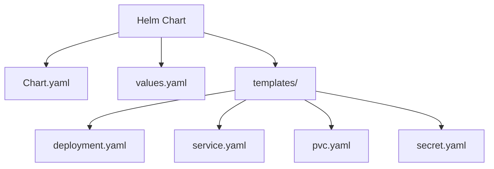

# 설치 및 설정

<cite>
**이 문서에서 참조한 파일**  
- [Dockerfile](file://Dockerfile)
- [docker-compose.yml](file://docker-compose.yml)
- [pyproject.toml](file://pyproject.toml)
- [setup.py](file://setup.py)
- [k8s-deploy/README.md](file://k8s-deploy/README.md)
- [k8s-deploy/lightrag/Chart.yaml](file://k8s-deploy/lightrag/Chart.yaml)
- [k8s-deploy/lightrag/values.yaml](file://k8s-deploy/lightrag/values.yaml)
- [k8s-deploy/install_lightrag.sh](file://k8s-deploy/install_lightrag.sh)
- [k8s-deploy/uninstall_lightrag.sh](file://k8s-deploy/uninstall_lightrag.sh)
- [k8s-deploy/databases/00-config.sh](file://k8s-deploy/databases/00-config.sh)
- [k8s-deploy/databases/02-install-database.sh](file://k8s-deploy/databases/02-install-database.sh)
- [k8s-deploy/databases/03-uninstall-database.sh](file://k8s-deploy/databases/03-uninstall-database.sh)
- [README.md](file://README.md)
</cite>

## 목차
1. [소개](#소개)
2. [로컬 설치](#로컬-설치)
3. [Docker를 통한 설치](#docker를-통한-설치)
4. [Kubernetes를 통한 설치](#kubernetes를-통한-설치)
5. [각 설치 방법의 비교](#각-설치-방법의-비교)
6. [설치 후 상태 확인](#설치-후-상태-확인)
7. [결론](#결론)

## 소개
LightRAG는 간단하고 빠른 그래프 기반 검색 증강 생성(RAG) 시스템으로, 다양한 환경에서 설치 및 배포할 수 있습니다. 본 문서는 로컬 설치, Docker, Kubernetes를 통한 설치 방법을 단계별로 설명하며, 각 방법의 장단점과 권장 사용 사례를 비교하고, 설치 후 상태 확인 방법을 안내합니다.

## 로컬 설치

로컬 설치는 개발 및 테스트 환경에서 가장 간단한 방법입니다. Python 환경을 설정하고, 필요한 종속성을 설치하며, 환경 변수를 구성하는 절차를 포함합니다.

### Python 환경 설정
1. Python 3.10 이상 버전을 설치합니다.
2. 가상 환경을 생성하고 활성화합니다:
   ```bash
   python -m venv lightrag-env
   source lightrag-env/bin/activate  # Linux/Mac
   # 또는
   lightrag-env\Scripts\activate  # Windows
   ```

### 종속성 설치
LightRAG를 PyPI에서 설치하거나 소스 코드에서 설치할 수 있습니다.

- **PyPI에서 설치**:
  ```bash
  pip install "lightrag-hku[api]"
  ```

- **소스 코드에서 설치**:
  ```bash
  git clone https://github.com/HKUDS/LightRAG.git
  cd LightRAG
  pip install -e ".[api]"
  ```

### 환경 변수 구성
`.env` 파일을 생성하고 필요한 환경 변수를 설정합니다. 예시 파일 `env.example`을 복사하여 사용할 수 있습니다:
```bash
cp env.example .env
```
`.env` 파일에서 LLM 및 임베딩 설정을 수정합니다. 예를 들어, OpenAI API 키와 기본 URL을 설정합니다:
```
OPENAI_API_KEY=your_openai_api_key
OPENAI_API_BASE=https://api.openai.com/v1
```

### 서버 실행
설치 후, LightRAG 서버를 실행합니다:
```bash
lightrag-server
```

**Section sources**
- [README.md](file://README.md#L100-L150)
- [pyproject.toml](file://pyproject.toml#L1-L10)
- [setup.py](file://setup.py#L1-L10)

## Docker를 통한 설치

Docker를 사용하면 컨테이너화된 환경에서 LightRAG를 쉽게 실행할 수 있습니다. 포트 매핑과 볼륨 마운트를 통해 외부와의 통신 및 데이터 영속성을 보장할 수 있습니다.

### Docker 이미지 빌드
프로젝트 루트 디렉토리에서 Docker 이미지를 빌드합니다:
```bash
docker build -t lightrag .
```

### 컨테이너 실행
`docker run` 명령어를 사용하여 컨테이너를 실행합니다. 포트 9621을 호스트의 9621 포트에 매핑하고, `.env` 파일을 볼륨으로 마운트합니다:
```bash
docker run -d -p 9621:9621 -v $(pwd)/.env:/app/.env lightrag
```

### docker-compose 사용
`docker-compose.yml` 파일을 사용하면 여러 서비스를 쉽게 관리할 수 있습니다. 예제 파일은 프로젝트 루트에 있습니다:
```bash
cp env.example .env
docker compose up
```
이 명령어는 `.env` 파일의 설정을 기반으로 LightRAG 서비스를 시작합니다.

**Section sources**
- [Dockerfile](file://Dockerfile#L1-L20)
- [docker-compose.yml](file://docker-compose.yml#L1-L15)
- [README.md](file://README.md#L151-L170)

## Kubernetes를 통한 설치

Kubernetes를 사용하면 LightRAG를 프로덕션 환경에서 안정적으로 배포할 수 있습니다. Helm 차트를 사용하여 설치 및 관리합니다.

### Helm 차트 구조
Helm 차트는 `k8s-deploy/lightrag` 디렉토리에 위치하며, 다음과 같은 파일들로 구성됩니다:
- `Chart.yaml`: 차트의 메타데이터를 포함합니다.
- `values.yaml`: 설치 시 사용되는 기본 설정을 포함합니다.
- `templates/`: Kubernetes 리소스를 정의하는 템플릿 파일들.



**Diagram sources**
- [k8s-deploy/lightrag/Chart.yaml](file://k8s-deploy/lightrag/Chart.yaml#L1-L11)
- [k8s-deploy/lightrag/values.yaml](file://k8s-deploy/lightrag/values.yaml#L1-L59)
- [k8s-deploy/lightrag/templates](file://k8s-deploy/lightrag/templates#L1-L50)

### values.yaml의 주요 설정 항목
`values.yaml` 파일은 다음과 같은 주요 설정 항목을 포함합니다:
- **replicaCount**: 레플리카 수.
- **resources**: CPU 및 메모리 리소스 제한.
- **persistence**: 영속 볼륨 설정.
- **env**: 환경 변수 설정 (LLM, 임베딩, 스토리지 등).

예시:
```yaml
replicaCount: 1
resources:
  limits:
    cpu: 1000m
    memory: 2Gi
  requests:
    cpu: 500m
    memory: 1Gi
env:
  LLM_BINDING: openai
  LLM_MODEL: gpt-4o-mini
  EMBEDDING_BINDING: openai
  EMBEDDING_MODEL: text-embedding-ada-002
```

### 설치 및 제거 스크립트 사용법
- **설치**:
  ```bash
  export OPENAI_API_KEY=your_openai_api_key
  export OPENAI_API_BASE=https://api.openai.com/v1
  bash ./k8s-deploy/install_lightrag.sh
  ```
  이 스크립트는 KubeBlocks를 사용하여 데이터베이스를 설치하고, LightRAG를 Helm으로 배포합니다.

- **제거**:
  ```bash
  bash ./k8s-deploy/uninstall_lightrag.sh
  ```
  이 스크립트는 Helm을 사용하여 LightRAG를 제거합니다.

**Section sources**
- [k8s-deploy/README.md](file://k8s-deploy/README.md#L1-L191)
- [k8s-deploy/lightrag/values.yaml](file://k8s-deploy/lightrag/values.yaml#L1-L59)
- [k8s-deploy/install_lightrag.sh](file://k8s-deploy/install_lightrag.sh#L1-L96)
- [k8s-deploy/uninstall_lightrag.sh](file://k8s-deploy/uninstall_lightrag.sh#L1-L5)

## 각 설치 방법의 비교

| 설치 방법 | 장점 | 단점 | 권장 사용 사례 |
|----------|------|------|----------------|
| 로컬 설치 | 간단하고 빠르게 시작 가능 | 환경 설정이 복잡할 수 있음 | 개발 및 테스트 |
| Docker | 환경 독립성 보장 | 리소스 오버헤드 | 개발, 테스트, 프로덕션 |
| Kubernetes | 확장성과 안정성 우수 | 설정이 복잡함 | 프로덕션 환경 |

**Section sources**
- [README.md](file://README.md#L100-L170)
- [k8s-deploy/README.md](file://k8s-deploy/README.md#L1-L191)

## 설치 후 상태 확인

설치 후, LightRAG가 정상적으로 동작하는지 확인합니다. API 엔드포인트를 테스트하여 상태를 확인할 수 있습니다.

### API 엔드포인트 테스트
1. 포트 포워딩을 설정합니다:
   ```bash
   kubectl --namespace rag port-forward svc/lightrag 9621:9621
   ```
2. 브라우저에서 `http://localhost:9621`에 접속하여 Web UI를 확인합니다.
3. API를 직접 테스트합니다:
   ```bash
   curl http://localhost:9621/health
   ```
   응답이 `{"status": "ok"}`이면 정상입니다.

**Section sources**
- [k8s-deploy/README.md](file://k8s-deploy/README.md#L100-L120)
- [README.md](file://README.md#L171-L180)

## 결론
LightRAG는 다양한 환경에서 설치 및 배포할 수 있으며, 각 방법은 사용 목적에 따라 선택할 수 있습니다. 로컬 설치는 개발 및 테스트에 적합하며, Docker는 환경 독립성을 제공하고, Kubernetes는 프로덕션 환경에서의 안정성과 확장성을 보장합니다. 설치 후에는 API 엔드포인트를 통해 상태를 확인하여 정상 동작을 검증할 수 있습니다.