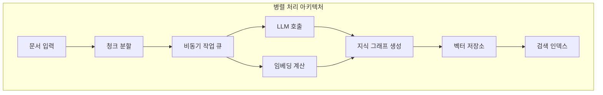
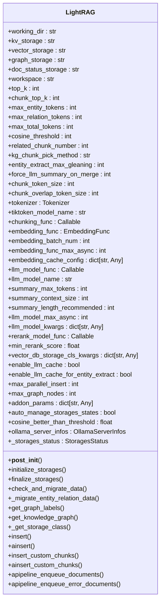
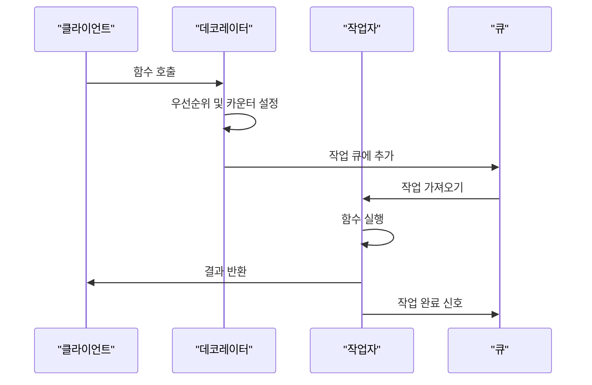
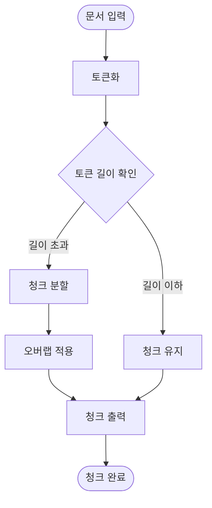
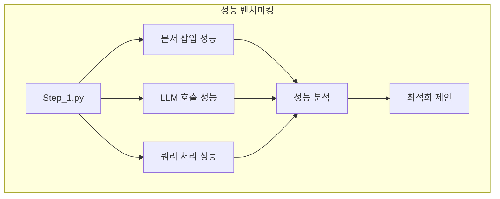

# 병렬 처리 최적화

<cite>
**이 문서에서 참조한 파일**
- [lightrag.py](file://lightrag/lightrag.py)
- [operate.py](file://lightrag/operate.py)
- [utils.py](file://lightrag/utils.py)
- [Step_1.py](file://reproduce/Step_1.py)
- [Step_2.py](file://reproduce/Step_2.py)
- [Step_3.py](file://reproduce/Step_3.py)
</cite>

## 목차
1. [소개](#소개)
2. [병렬 처리 아키텍처 개요](#병렬-처리-아키텍처-개요)
3. [LightRAG 클래스의 병렬 처리 설정](#lightrag-클래스의-병렬-처리-설정)
4. [비동기 작업 큐 관리 메커니즘](#비동기-작업-큐-관리-메커니즘)
5. [청크 분할과 병렬 처리 통합](#청크-분할과-병렬-처리-통합)
6. [비동기 I/O 처리 전략](#비동기-io-처리-전략)
7. [성능 벤치마킹 방법](#성능-벤치마킹-방법)
8. [결론](#결론)

## 소개
LightRAG은 대규모 문서 처리와 검색 증강 생성(RAG)을 위한 고성능 프레임워크로, 병렬 처리를 통해 성능을 극대화하도록 설계되었습니다. 이 문서는 LightRAG의 병렬 처리 메커니즘을 심층적으로 분석하며, 특히 `max_parallel_insert` 및 `llm_model_max_async` 설정이 문서 삽입 및 LLM 호출에 미치는 영향을 설명합니다. 또한 `utils.py`의 `priority_limit_async_func_call` 데코레이터가 비동기 작업 큐를 관리하는 방법과 `operate.py`의 `chunking_by_token_size` 함수와의 통합 방식을 자세히 설명합니다. 마지막으로, `reproduce` 폴더의 벤치마크 스크립트를 사용하여 병렬 처리 성능을 측정하는 방법을 안내합니다.

**Section sources**
- [lightrag.py](file://lightrag/lightrag.py#L1-L50)
- [operate.py](file://lightrag/operate.py#L1-L50)
- [utils.py](file://lightrag/utils.py#L1-L50)

## 병렬 처리 아키텍처 개요
LightRAG의 병렬 처리 아키텍처는 비동기 I/O, 작업 큐 관리, 병렬 삽입 처리의 세 가지 핵심 요소로 구성됩니다. 이 아키텍처는 문서 처리 파이프라인의 각 단계에서 병렬성을 극대화하여 전체 처리 시간을 단축합니다. 시스템은 `aiohttp` 기반 비동기 I/O 처리를 통해 I/O 병목 현상을 해결하며, `priority_limit_async_func_call` 데코레이터를 사용하여 비동기 작업 큐를 효율적으로 관리합니다. 이 구조는 대규모 문서 집합을 신속하게 처리할 수 있도록 하며, LLM 호출과 벡터 임베딩 계산과 같은 계산 집약적인 작업의 성능을 최적화합니다.

**Diagram sources**
- [lightrag.py](file://lightrag/lightrag.py#L1-L100)
- [utils.py](file://lightrag/utils.py#L1-L100)

## LightRAG 클래스의 병렬 처리 설정
LightRAG 클래스는 `max_parallel_insert` 및 `llm_model_max_async`와 같은 설정을 통해 병렬 처리를 제어합니다. `max_parallel_insert`는 문서 삽입 시 병렬로 처리할 수 있는 최대 문서 수를 정의하며, 기본값은 2입니다. 이 설정은 문서 인덱싱 파이프라인에서 병렬로 처리되는 문서의 수를 제어하며, 성능 병목이 LLM 처리에 있기 때문에 10 이하로 설정하는 것이 권장됩니다. 반면, `llm_model_max_async`는 동시 LLM 호출의 최대 수를 제어하며, 기본값은 4입니다. 이 설정은 LLM 모델 함수에 `priority_limit_async_func_call` 데코레이터를 적용하여 비동기 호출의 동시성을 제한합니다.

**Diagram sources**
- [lightrag.py](file://lightrag/lightrag.py#L1-L1000)

**Section sources**
- [lightrag.py](file://lightrag/lightrag.py#L1-L1000)

## 비동기 작업 큐 관리 메커니즘
`utils.py`의 `priority_limit_async_func_call` 데코레이터는 비동기 작업 큐를 관리하는 핵심 메커니즘입니다. 이 데코레이터는 지정된 최대 크기(`max_size`)와 큐 크기(`max_queue_size`)를 가진 우선순위 큐를 사용하여 함수 호출을 제어합니다. 작업은 우선순위에 따라 처리되며, 낮은 우선순위 값이 더 높은 우선순위를 가집니다. 이 메커니즘은 `llm_model_max_async` 설정을 통해 LLM 호출의 동시성을 제한하며, `embedding_func_max_async` 설정을 통해 임베딩 함수 호출의 동시성을 제한합니다. 데코레이터는 초기화 락, 작업자 건강 상태 확인, 큐 완료 신호와 같은 고급 기능을 포함하여 작업 큐의 안정성과 효율성을 보장합니다.

**Diagram sources**
- [utils.py](file://lightrag/utils.py#L1-L1000)

**Section sources**
- [utils.py](file://lightrag/utils.py#L1-L1000)

## 청크 분할과 병렬 처리 통합
`operate.py`의 `chunking_by_token_size` 함수는 문서를 토큰 크기에 따라 청크로 분할하는 역할을 합니다. 이 함수는 `LightRAG` 클래스의 `chunking_func` 설정을 통해 통합되며, 문서 처리 파이프라인의 초기 단계에서 실행됩니다. 청크 분할은 병렬 처리와 밀접하게 통합되어 있으며, 각 청크는 독립적으로 처리될 수 있습니다. 이는 LLM 호출과 임베딩 계산과 같은 후속 단계에서 병렬성을 극대화할 수 있도록 합니다. `chunking_by_token_size` 함수는 토큰화기, 내용, 분할 문자, 분할 전용 여부, 오버랩 토큰 크기 및 최대 토큰 크기와 같은 매개변수를 사용하여 유연한 청크 분할을 제공합니다.

**Diagram sources**
- [operate.py](file://lightrag/operate.py#L1-L1000)

**Section sources**
- [operate.py](file://lightrag/operate.py#L1-L1000)

## 비동기 I/O 처리 전략
LightRAG은 `aiohttp` 기반 비동기 I/O 처리를 통해 I/O 병목 현상을 해결합니다. 이 전략은 네트워크 요청과 파일 I/O와 같은 I/O 작업이 블로킹되지 않도록 하여, 시스템 리소스를 효율적으로 활용합니다. 비동기 I/O는 문서 삽입, LLM 호출, 벡터 임베딩 계산과 같은 다양한 작업에서 사용되며, 전체 처리 시간을 단축합니다. `priority_limit_async_func_call` 데코레이터는 비동기 작업 큐를 관리하여, 작업의 우선순위와 동시성을 제어합니다. 이는 시스템이 다양한 작업 유형을 효율적으로 처리할 수 있도록 하며, 성능을 최적화합니다.

**Diagram sources**
- [lightrag.py](file://lightrag/lightrag.py#L1-L1000)
- [utils.py](file://lightrag/utils.py#L1-L1000)

## 성능 벤치마킹 방법
`reproduce` 폴더의 벤치마크 스크립트는 병렬 처리 성능을 측정하는 데 사용됩니다. `Step_1.py` 스크립트는 문서 삽입 성능을 테스트하며, `Step_2.py` 스크립트는 LLM 호출 성능을 테스트합니다. `Step_3.py` 스크립트는 쿼리 처리 성능을 테스트합니다. 이 스크립트들은 실제 사용 사례를 시뮬레이션하여, 다양한 설정에서의 성능을 평가합니다. 예를 들어, `max_parallel_insert` 값을 조정하여 문서 삽입 성능에 미치는 영향을 측정할 수 있습니다. 이러한 벤치마크는 시스템 최적화와 성능 향상을 위한 귀중한 정보를 제공합니다.

**Diagram sources**
- [Step_1.py](file://reproduce/Step_1.py#L1-L52)
- [Step_2.py](file://reproduce/Step_2.py#L1-L79)
- [Step_3.py](file://reproduce/Step_3.py#L1-L67)

**Section sources**
- [Step_1.py](file://reproduce/Step_1.py#L1-L52)
- [Step_2.py](file://reproduce/Step_2.py#L1-L79)
- [Step_3.py](file://reproduce/Step_3.py#L1-L67)

## 결론
LightRAG의 병렬 처리 메커니즘은 `max_parallel_insert` 및 `llm_model_max_async` 설정과 `priority_limit_async_func_call` 데코레이터를 통해 문서 삽입 및 LLM 호출의 성능을 극대화합니다. `chunking_by_token_size` 함수는 청크 분할을 통해 후속 처리 단계에서 병렬성을 극대화하며, `aiohttp` 기반 비동기 I/O 처리는 I/O 병목 현상을 해결합니다. `reproduce` 폴더의 벤치마크 스크립트는 이러한 메커니즘의 성능을 측정하고 최적화하는 데 중요한 역할을 합니다. 이 문서는 LightRAG의 병렬 처리 아키텍처를 심층적으로 분석하여, 개발자와 연구자가 시스템을 효과적으로 활용하고 최적화할 수 있도록 지원합니다.