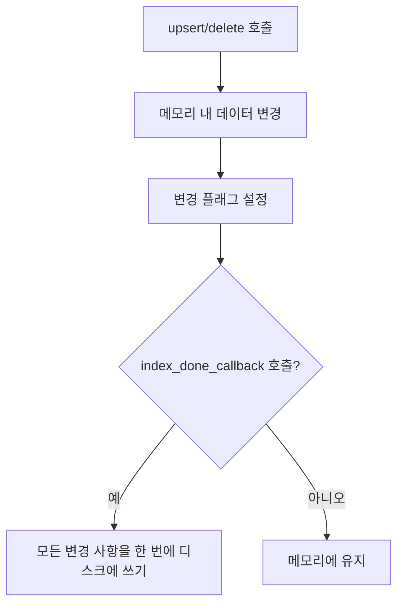

# JSON 기반 KV 저장소 최적화

<cite>
**이 문서에서 참조된 파일**  
- [json_kv_impl.py](file://lightrag/kg/json_kv_impl.py)
- [shared_storage.py](file://lightrag/kg/shared_storage.py)
- [utils.py](file://lightrag/utils.py)
</cite>

## 목차
1. [소개](#소개)
2. [성능 최적화 전략](#성능-최적화-전략)
3. [대규모 문서 삽입 성능 분석](#대규모-문서-삽입-성능-분석)
4. [디스크 사용량과 읽기 지연 간 트레이드오프](#디스크-사용량과-읽기-지연-간-트레이드오프)
5. [원자성 쓰기, 파일 잠금 및 백업 전략](#원자성-쓰기-파일-잠금-및-백업-전략)
6. [개발 및 테스트 환경에서의 사용 사례](#개발-및-테스트-환경에서의-사용-사례)
7. [프로덕션 환경 제한 사항 및 마이그레이션 가이드](#프로덕션-환경-제한-사항-및-마이그레이션-가이드)
8. [결론](#결론)

## 소개
JSON 기반 KV 저장소는 LightRAG 프로젝트에서 주요 데이터 저장 및 캐싱 메커니즘으로 사용되며, `lightrag/kg/json_kv_impl.py` 파일에 구현되어 있습니다. 이 저장소는 파일 시스템 기반의 단순한 구조를 가지며, 다양한 성능 최적화 기법과 안정성 보장 메커니즘을 포함하고 있습니다. 본 문서는 이 저장소의 성능 최적화 전략, 대규모 데이터 처리 시 병목 현상, 트레이드오프, 원자성 보장 및 프로덕션 환경에서의 제한 사항을 심층적으로 분석합니다.

## 성능 최적화 전략

### 파일 시스템 I/O 최적화
JSON 기반 KV 저장소는 파일 시스템 I/O를 최적화하기 위해 지연된 쓰기(lazy write) 전략을 채택하고 있습니다. 모든 데이터 변경은 메모리 내에서 수행되며, 디스크에의 영구 저장은 특정 시점에 집중적으로 이루어집니다.

- **지연된 영구 저장**: `upsert` 및 `delete` 작업은 메모리 내 데이터 구조를 변경하고, 변경 플래그(`storage_updated`)를 설정합니다. 실제 디스크 쓰기는 `index_done_callback` 메서드를 통해 비동기적으로 수행됩니다. 이는 빈번한 디스크 I/O를 방지하여 성능을 크게 향상시킵니다.
- **배치 쓰기**: 여러 개의 삽입/업데이트 작업 후 단일 `index_done_callback` 호출로 모든 변경 사항을 한 번에 디스크에 기록합니다. 이는 파일 열기/닫기 오버헤드를 최소화합니다.



**Diagram sources**
- [json_kv_impl.py](file://lightrag/kg/json_kv_impl.py#L130-L164)
- [json_kv_impl.py](file://lightrag/kg/json_kv_impl.py#L71-L105)

**Section sources**
- [json_kv_impl.py](file://lightrag/kg/json_kv_impl.py#L130-L164)
- [json_kv_impl.py](file://lightrag/kg/json_kv_impl.py#L71-L105)

### 직렬화/역직렬화 오버헤드 감소
JSON 직렬화/역직렬화는 성능에 큰 영향을 미칠 수 있습니다. 이 저장소는 이를 최소화하기 위해 다음과 같은 전략을 사용합니다.

- **역직렬화 최소화**: `initialize` 메서드에서 디스크에서 JSON 파일을 한 번만 읽고 역직렬화하여 메모리에 로드합니다. 이후 모든 조회 작업은 메모리 내 데이터를 직접 사용하므로, 반복적인 JSON 파싱 오버헤드가 발생하지 않습니다.
- **직렬화 최적화**: `index_done_callback`에서 메모리 내 데이터를 한 번만 직렬화하여 파일에 씁니다. 이는 쓰기 작업의 빈도를 줄이는 것과 함께 직렬화 오버헤드를 극도로 낮춥니다.

```mermaid
flowchart LR
A[애플리케이션 시작] --> B[initialize 호출]
B --> C[디스크에서 JSON 파일 읽기]
C --> D[JSON 역직렬화 (한 번만 수행)]
D --> E[메모리에 데이터 로드]
E --> F[모든 get_by_id, get_all 작업은 메모리에서 수행]
```

**Diagram sources**
- [json_kv_impl.py](file://lightrag/kg/json_kv_impl.py#L44-L73)
- [utils.py](file://lightrag/utils.py#L678-L680)

**Section sources**
- [json_kv_impl.py](file://lightrag/kg/json_kv_impl.py#L44-L73)

### 캐싱 메커니즘 도입
이 저장소는 본질적으로 메모리 기반 캐시를 제공합니다. 모든 데이터는 메모리에 상주하며, 디스크는 영구 저장소 역할만 합니다.

- **읽기 성능 향상**: `get_by_id`, `get_by_ids`, `get_all` 등의 모든 조회 메서드는 메모리 내 `self._data` 딕셔너리에 직접 접근합니다. 이는 디스크 I/O 없이 매우 빠른 읽기 성능을 제공합니다.
- **데이터 무결성 보장**: 메모리와 디스크 간의 상태 불일치를 방지하기 위해, `index_done_callback`이 호출되기 전까지는 디스크에 변경 사항이 반영되지 않습니다. 이는 캐시 일관성을 유지하는 데 중요합니다.

```mermaid
flowchart LR
A[get_by_id("key1")] --> B[메모리 내 self._data에서 "key1" 검색]
B --> C["key1" 데이터 반환]
D[upsert({"key2": {...}})] --> E[메모리 내 self._data 업데이트]
E --> F[변경 플래그 설정]
G[index_done_callback()] --> H[메모리 데이터를 JSON으로 직렬화]
H --> I[디스크에 파일 쓰기]
```

**Diagram sources**
- [json_kv_impl.py](file://lightrag/kg/json_kv_impl.py#L101-L131)
- [json_kv_impl.py](file://lightrag/kg/json_kv_impl.py#L71-L105)

**Section sources**
- [json_kv_impl.py](file://lightrag/kg/json_kv_impl.py#L101-L131)

## 대규모 문서 삽입 성능 분석

### 병목 현상 분석
대규모 문서 삽입 시 주요 병목 현상은 `index_done_callback` 메서드에서 발생합니다.

- **단일 쓰기 작업**: 수천 개의 문서를 삽입한 후 `index_done_callback`을 호출하면, 메모리에 있는 전체 데이터 세트를 한 번에 JSON으로 직렬화하고 디스크에 씁니다. 이 작업은 O(n)의 시간 복잡도를 가지며, 데이터 세트가 커질수록 쓰기 지연이 급격히 증가합니다.
- **메모리 사용량**: 모든 데이터가 메모리에 상주하므로, 대규모 데이터 세트는 상당한 양의 RAM을 소비합니다. 이는 메모리 부족(OOM) 오류로 이어질 수 있습니다.
- **직렬화 오버헤드**: 전체 데이터 세트를 직렬화하는 데 필요한 시간은 데이터 크기에 비례하여 증가합니다. 이는 특히 네트워크 스토리지나 느린 디스크에서 두드러집니다.

### 해결 방안
이러한 병목 현상을 완화하기 위한 전략은 다음과 같습니다.

- **작은 배치로 분할**: 대규모 삽입 작업을 작은 배치로 나누고, 각 배치 후에 `index_done_callback`을 호출합니다. 이는 메모리 사용량을 제한하고, 단일 쓰기 작업의 크기를 줄여 지연을 분산시킵니다.
- **백그라운드 스레드에서 쓰기**: `index_done_callback`을 메인 스레드가 아닌 백그라운드