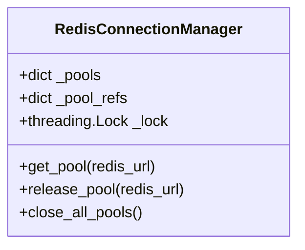
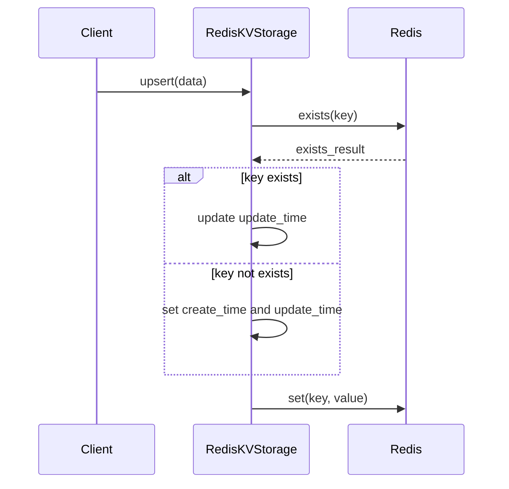
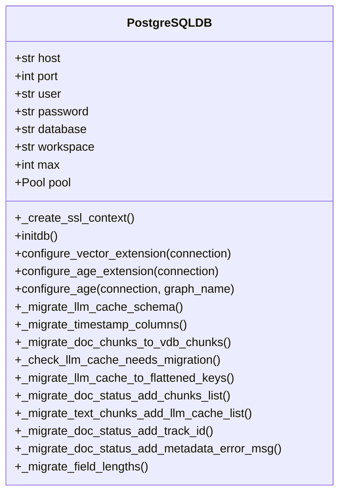
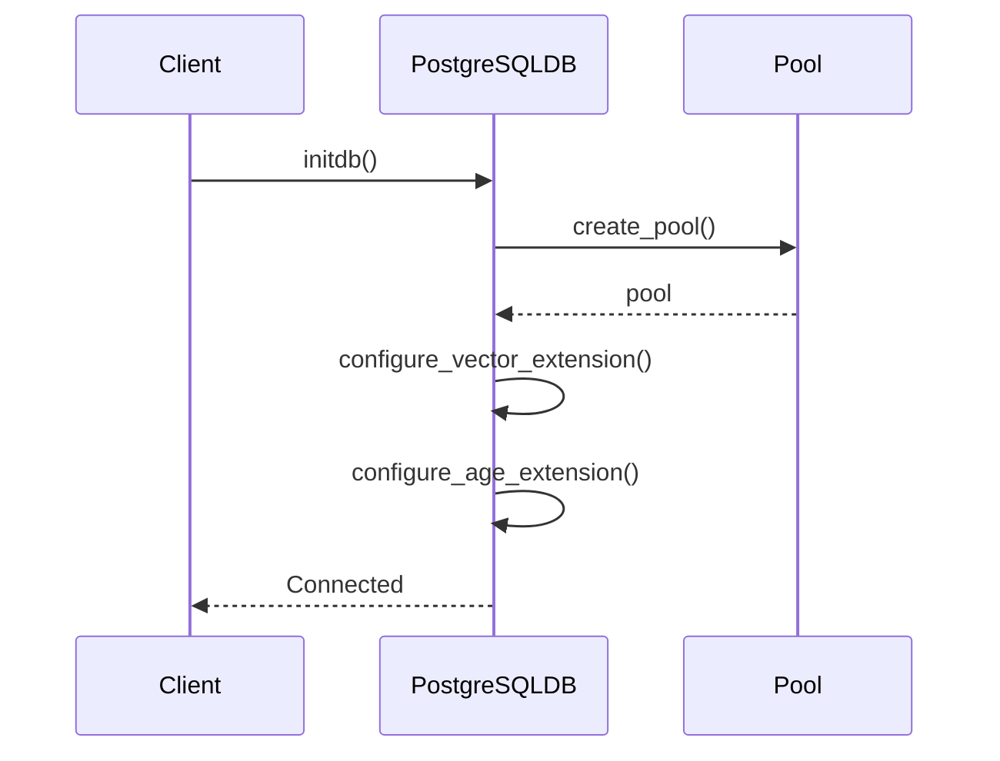
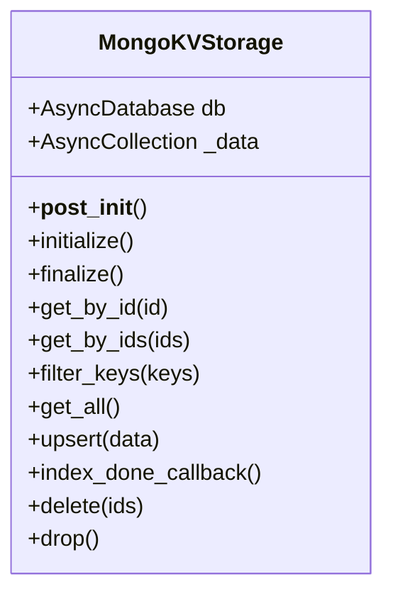
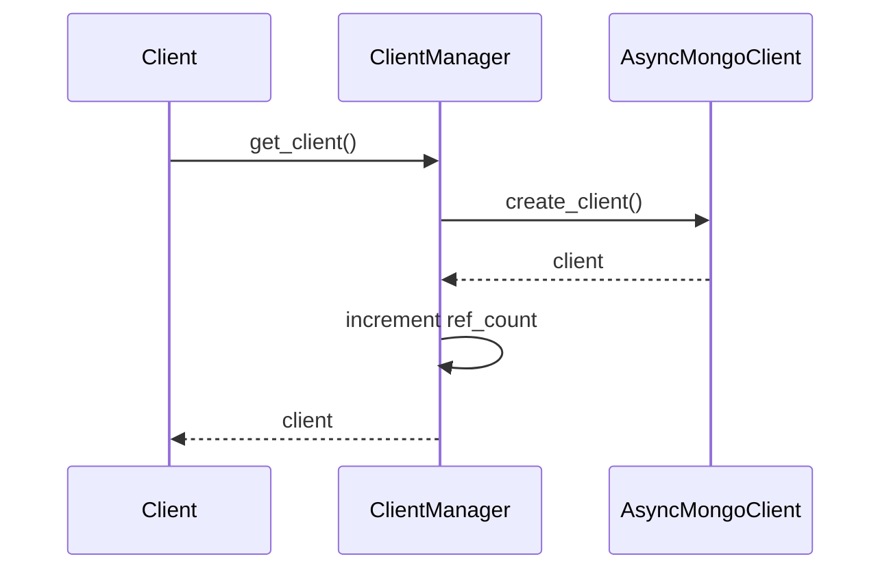
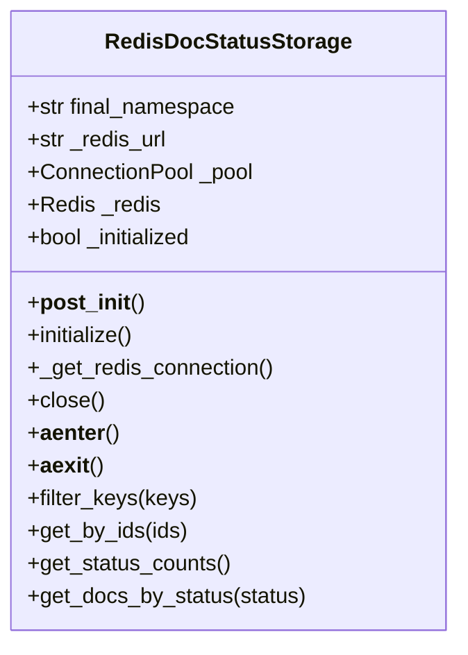
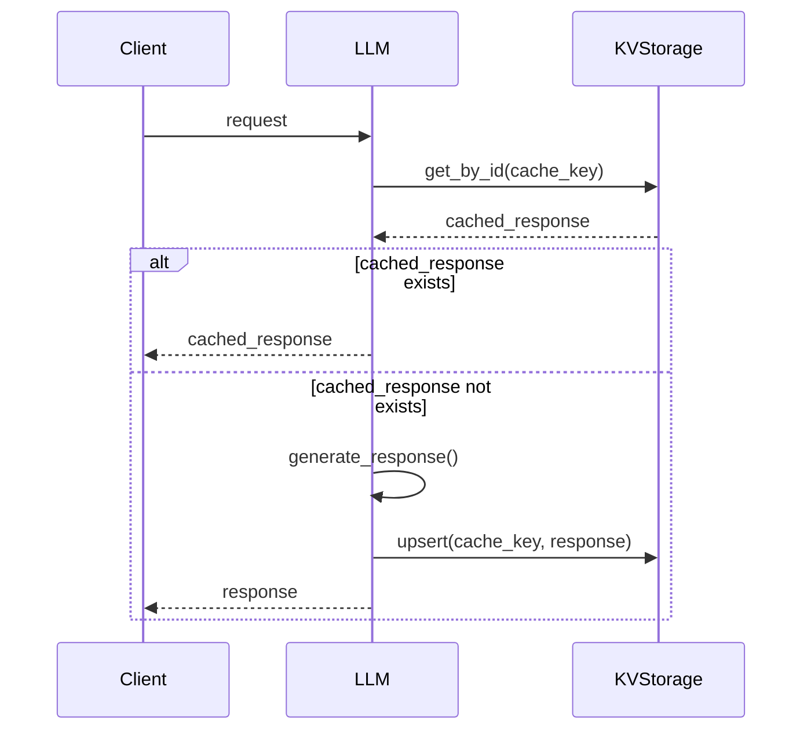

# KV 저장소 최적화

<cite>
**이 문서에서 참조한 파일**  
- [docker-compose.yml](file://docker-compose.yml)
- [redis_impl.py](file://lightrag/kg/redis_impl.py)
- [postgres_impl.py](file://lightrag/kg/postgres_impl.py)
- [mongo_impl.py](file://lightrag/kg/mongo_impl.py)
- [shared_storage.py](file://lightrag/kg/shared_storage.py)
</cite>

## 목차
1. [소개](#소개)
2. [Redis 성능 최적화 전략](#redis-성능-최적화-전략)
3. [PostgreSQL 성능 최적화 전략](#postgresql-성능-최적화-전략)
4. [MongoDB 성능 최적화 전략](#mongodb-성능-최적화-전략)
5. [Docker 리소스 제한 설정](#docker-리소스-제한-설정)
6. [KV 저장소의 문서 상태 추적 및 LLM 응답 캐싱 영향 분석](#kv-저장소의-문서-상태-추적-및-llm-응답-캐싱-영향-분석)
7. [고빈도 읽기/쓰기 작업에서의 성능 비교](#고빈도-읽기쓰기-작업에서의-성능-비교)
8. [사용 사례 기반 추천](#사용-사례-기반-추천)
9. [결론](#결론)

## 소개
이 문서는 Json, PostgreSQL, Redis, MongoDB 기반 KV 저장소의 성능 최적화 전략을 설명합니다. 각 데이터베이스의 특성에 맞는 최적화 방법을 제시하며, Docker 환경에서의 리소스 제한 설정 방법과 KV 저장소가 문서 상태 추적 및 LLM 응답 캐싱에 미치는 영향을 분석합니다. 또한 고빈도 읽기/쓰기 작업에서의 성능 비교와 사용 사례 기반 추천을 포함합니다.

## Redis 성능 최적화 전략

### 메모리 정책 조정
Redis는 메모리 기반 데이터 저장소로, 메모리 정책 조정이 성능에 큰 영향을 미칩니다. `redis_impl.py` 파일에서 Redis 연결 풀 관리자를 통해 메모리 사용을 최적화합니다. `MAX_CONNECTIONS` 환경 변수를 통해 최대 연결 수를 설정할 수 있으며, 기본값은 200입니다. 이 값을 적절히 조정하여 메모리 사용량과 성능 간의 균형을 맞출 수 있습니다.



**다이어그램 출처**  
- [redis_impl.py](file://lightrag/kg/redis_impl.py#L107-L138)

### 만료 전략
Redis는 키 만료 전략을 통해 메모리 사용을 효율적으로 관리할 수 있습니다. `RedisKVStorage` 클래스의 `upsert` 메서드에서 키의 존재 여부를 확인하고, 존재하지 않는 경우 `create_time`과 `update_time`을 설정합니다. 이는 키의 수명 주기를 관리하는 데 도움이 됩니다.



**다이어그램 출처**  
- [redis_impl.py](file://lightrag/kg/redis_impl.py#L353-L386)

### 지속성 설정
Redis는 지속성 설정을 통해 데이터 손실을 방지할 수 있습니다. `RedisKVStorage` 클래스는 `__post_init__` 메서드에서 Redis URI를 환경 변수 또는 설정 파일에서 가져와 연결을 초기화합니다. 이를 통해 지속성 설정을 유연하게 구성할 수 있습니다.

**섹션 출처**  
- [redis_impl.py](file://lightrag/kg/redis_impl.py#L136-L168)

## PostgreSQL 성능 최적화 전략

### 인덱스 전략
PostgreSQL은 인덱스 전략을 통해 쿼리 성능을 크게 향상시킬 수 있습니다. `postgres_impl.py` 파일에서 `_migrate_llm_cache_schema` 메서드를 통해 LLM 캐시 스키마를 마이그레이션하고, 필요한 인덱스를 추가합니다. 예를 들어, `chunk_id`, `cache_type`, `queryparam` 컬럼을 추가하여 쿼리 성능을 개선합니다.



**다이어그램 출처**  
- [postgres_impl.py](file://lightrag/kg/postgres_impl.py#L137-L172)

### 커넥션 풀링
PostgreSQL은 커넥션 풀링을 통해 데이터베이스 연결을 효율적으로 관리할 수 있습니다. `PostgreSQLDB` 클래스의 `initdb` 메서드에서 연결 풀을 생성하고, 최소 및 최대 연결 수를 설정합니다. 이를 통해 고빈도 요청에서도 안정적인 성능을 유지할 수 있습니다.



**다이어그램 출처**  
- [postgres_impl.py](file://lightrag/kg/postgres_impl.py#L171-L198)

### VACUUM 설정
PostgreSQL은 VACUUM 설정을 통해 데이터베이스의 성능을 유지할 수 있습니다. `postgres_impl.py` 파일에서 `_migrate_timestamp_columns` 메서드를 통해 타임스탬프 컬럼을 마이그레이션하고, 필요에 따라 VACUUM 작업을 수행합니다. 이를 통해 데이터베이스의 성능을 지속적으로 유지할 수 있습니다.

**섹션 출처**  
- [postgres_impl.py](file://lightrag/kg/postgres_impl.py#L1340-L1377)

## MongoDB 성능 최적화 전략

### 인덱스 전략
MongoDB는 인덱스 전략을 통해 쿼리 성능을 크게 향상시킬 수 있습니다. `mongo_impl.py` 파일에서 `create_and_migrate_indexes_if_not_exists` 메서드를 통해 필요한 인덱스를 생성하고, 기존 인덱스와 충돌하는 경우 마이그레이션합니다. 예를 들어, `status_updated_at`, `status_created_at`, `updated_at`, `created_at`, `id`, `track_id` 인덱스를 생성하여 쿼리 성능을 개선합니다.



**다이어그램 출처**  
- [mongo_impl.py](file://lightrag/kg/mongo_impl.py#L134-L169)

### 커넥션 풀링
MongoDB는 커넥션 풀링을 통해 데이터베이스 연결을 효율적으로 관리할 수 있습니다. `ClientManager` 클래스의 `get_client` 메서드에서 클라이언트를 가져오고, 참조 카운트를 증가시킵니다. 이를 통해 고빈도 요청에서도 안정적인 성능을 유지할 수 있습니다.



**다이어그램 출처**  
- [mongo_impl.py](file://lightrag/kg/mongo_impl.py#L42-L80)

### 쓰기 우도 설정
MongoDB는 쓰기 우도 설정을 통해 데이터 일관성을 보장할 수 있습니다. `MongoKVStorage` 클래스의 `upsert` 메서드에서 `bulk_write`를 사용하여 대량의 데이터를 효율적으로 삽입합니다. 이를 통해 고빈도 쓰기 작업에서도 안정적인 성능을 유지할 수 있습니다.

**섹션 출처**  
- [mongo_impl.py](file://lightrag/kg/mongo_impl.py#L134-L169)

## Docker 리소스 제한 설정

### 메모리 및 CPU 제한
`docker-compose.yml` 파일에서 각 컨테이너의 메모리 및 CPU 제한을 설정할 수 있습니다. 예를 들어, `ollama` 서비스의 경우 `deploy` 섹션을 사용하여 GPU 장치를 예약하고, 메모리 및 CPU 제한을 설정할 수 있습니다. 그러나 이 예제에서는 `deploy` 섹션이 주석 처리되어 있으므로, 실제 설정은 사용자 환경에 따라 조정되어야 합니다.

```yaml
services:
  ollama:
    container_name: ollama
    image: ollama/ollama:latest
    ports:
      - "9622:11434"
    volumes:
      - ./data/ollama:/root/.ollama
    restart: unless-stopped
    # deploy:
    #   resources:
    #     reservations:
    #       devices:
    #         - driver: nvidia
    #           count: all
    #           capabilities: [gpu]
    # GPU가 없는 경우 위의 deploy 섹션을 주석 처리하세요
    healthcheck:
      test: ["CMD", "ollama", "list"]
      interval: 30s
      timeout: 10s
      retries: 5
      start_period: 20s

  lightrag:
    container_name: lightrag
    image: ghcr.io/hkuds/lightrag:latest
    build:
      context: .
      dockerfile: Dockerfile
      tags:
        - ghcr.io/hkuds/lightrag:latest
    ports:
      - "${PORT:-9621}:9621"
    volumes:
      - ./data/rag_storage:/app/data/rag_storage
      - ./data/inputs:/app/data/inputs
      - ./data/tiktoken:/app/data/tiktoken
      - ./config.ini:/app/config.ini
      - ./.env:/app/.env
    env_file:
      - .env
    environment:
      - TIKTOKEN_CACHE_DIR=/app/data/tiktoken
    restart: unless-stopped
    depends_on:
      - ollama
    extra_hosts:
      - "host.docker.internal:host-gateway"
```

**섹션 출처**  
- [docker-compose.yml](file://docker-compose.yml#L1-L50)

## KV 저장소의 문서 상태 추적 및 LLM 응답 캐싱 영향 분석

### 문서 상태 추적
KV 저장소는 문서 상태 추적에 중요한 역할을 합니다. `RedisDocStatusStorage` 및 `MongoDocStatusStorage` 클래스는 문서 상태를 저장하고 관리합니다. `get_status_counts` 메서드를 통해 각 상태별 문서 수를 조회할 수 있으며, `get_docs_by_status` 메서드를 통해 특정 상태의 문서를 조회할 수 있습니다.



**다이어그램 출처**  
- [redis_impl.py](file://lightrag/kg/redis_impl.py#L536-L568)

### LLM 응답 캐싱
KV 저장소는 LLM 응답 캐싱에 중요한 역할을 합니다. `RedisKVStorage` 및 `MongoKVStorage` 클래스는 LLM 응답을 캐싱하여 반복적인 요청에 대한 응답 시간을 단축합니다. `upsert` 메서드를 통해 캐시 데이터를 삽입하고, `get_by_id` 및 `get_by_ids` 메서드를 통해 캐시 데이터를 조회합니다.



**다이어그램 출처**  
- [redis_impl.py](file://lightrag/kg/redis_impl.py#L260-L293)

## 고빈도 읽기/쓰기 작업에서의 성능 비교

### Redis
Redis는 메모리 기반 데이터 저장소로, 고빈도 읽기/쓰기 작업에서 매우 뛰어난 성능을 보입니다. `RedisKVStorage` 클래스의 `get_by_id` 및 `get_by_ids` 메서드는 파이프라인을 사용하여 다수의 키를 한 번에 조회할 수 있어, 고빈도 읽기 작업에서 효율적입니다. 또한, `upsert` 메서드는 파이프라인을 사용하여 다수의 키를 한 번에 삽입할 수 있어, 고빈도 쓰기 작업에서 효율적입니다.

### PostgreSQL
PostgreSQL은 디스크 기반 데이터 저장소로, 고빈도 읽기/쓰기 작업에서 상대적으로 낮은 성능을 보입니다. 그러나 인덱스 전략과 커넥션 풀링을 통해 성능을 크게 향상시킬 수 있습니다. `PostgreSQLDB` 클래스의 `initdb` 메서드에서 연결 풀을 생성하고, 최소 및 최대 연결 수를 설정하여 고빈도 요청에서도 안정적인 성능을 유지할 수 있습니다.

### MongoDB
MongoDB는 문서 기반 데이터 저장소로, 고빈도 읽기/쓰기 작업에서 뛰어난 성능을 보입니다. `MongoKVStorage` 클래스의 `get_by_id` 및 `get_by_ids` 메서드는 커서를 사용하여 다수의 문서를 한 번에 조회할 수 있어, 고빈도 읽기 작업에서 효율적입니다. 또한, `upsert` 메서드는 `bulk_write`를 사용하여 다수의 문서를 한 번에 삽입할 수 있어, 고빈도 쓰기 작업에서 효율적입니다.

## 사용 사례 기반 추천

### 고성능 캐싱
고성능 캐싱을 위해 Redis를 추천합니다. Redis는 메모리 기반 데이터 저장소로, 고빈도 읽기/쓰기 작업에서 매우 뛰어난 성능을 보입니다. `RedisKVStorage` 클래스를 사용하여 LLM 응답 캐싱을 구현할 수 있습니다.

### 대규모 데이터 저장
대규모 데이터 저장을 위해 MongoDB를 추천합니다. MongoDB는 문서 기반 데이터 저장소로, 대규모 데이터를 효율적으로 저장하고 관리할 수 있습니다. `MongoKVStorage` 클래스를 사용하여 문서 상태 추적을 구현할 수 있습니다.

### 트랜잭션 처리
트랜잭션 처리를 위해 PostgreSQL을 추천합니다. PostgreSQL은 디스크 기반 데이터 저장소로, 트랜잭션 처리에 강점을 가지고 있습니다. `PostgreSQLDB` 클래스를 사용하여 안정적인 데이터 저장을 구현할 수 있습니다.

## 결론
이 문서는 Json, PostgreSQL, Redis, MongoDB 기반 KV 저장소의 성능 최적화 전략을 설명하였습니다. 각 데이터베이스의 특성에 맞는 최적화 방법을 제시하였으며, Docker 환경에서의 리소스 제한 설정 방법과 KV 저장소가 문서 상태 추적 및 LLM 응답 캐싱에 미치는 영향을 분석하였습니다. 또한, 고빈도 읽기/쓰기 작업에서의 성능 비교와 사용 사례 기반 추천을 포함하였습니다. 이를 통해 각 사용 사례에 맞는 최적의 KV 저장소를 선택할 수 있습니다.