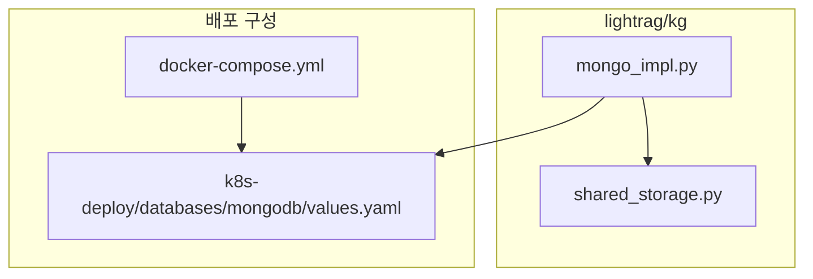
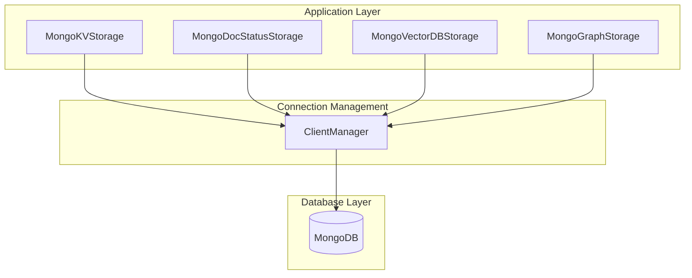
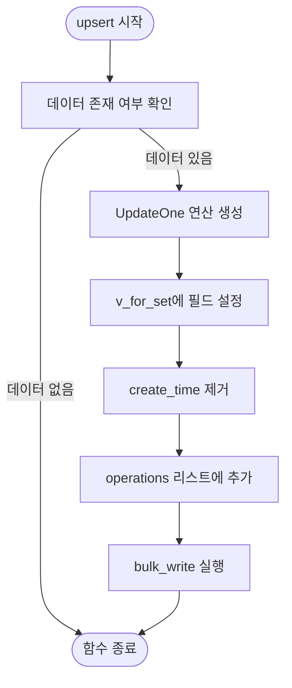
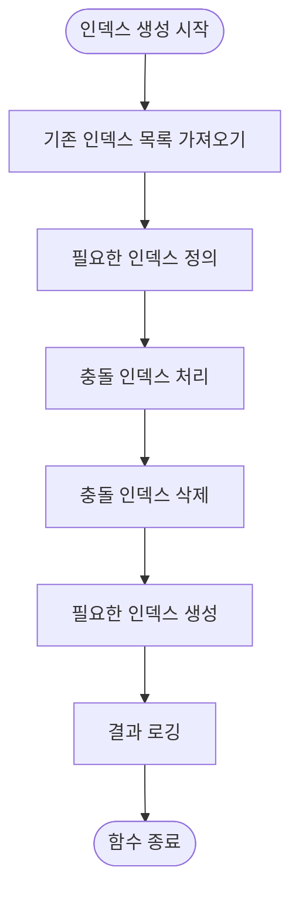
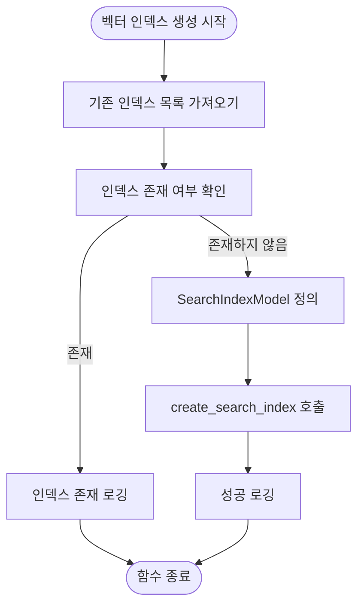
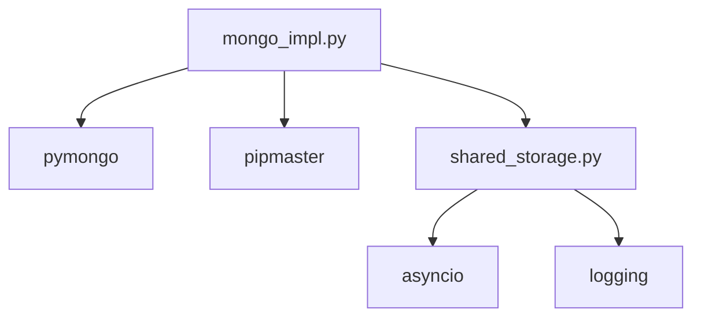

# MongoDB 기반 KV 저장소 최적화

<cite>
**이 문서에서 참조된 파일**   
- [mongo_impl.py](file://lightrag/kg/mongo_impl.py)
- [docker-compose.yml](file://docker-compose.yml)
- [values.yaml](file://k8s-deploy/databases/mongodb/values.yaml)
</cite>

## 목차
1. [소개](#소개)
2. [프로젝트 구조](#프로젝트-구조)
3. [핵심 구성 요소](#핵심-구성-요소)
4. [아키텍처 개요](#아키텍처-개요)
5. [상세 구성 요소 분석](#상세-구성-요소-분석)
6. [의존성 분석](#의존성-분석)
7. [성능 고려 사항](#성능-고려-사항)
8. [문제 해결 가이드](#문제-해결-가이드)
9. [결론](#결론)
10. [부록](#부록) (필요 시)

## 소개
이 문서는 LightRAG 프로젝트 내 MongoDB 기반 KV 저장소의 성능 최적화 전략을 설명합니다. 인덱스 설계, 쿼리 최적화, 컬렉션 스키마 설계, 커넥션 풀링 설정 방법을 포함하며, 비동기 I/O 처리, bulk write 연산, 오류 처리 메커니즘을 분석합니다. 또한 docker-compose.yml에서의 리소스 할당과의 통합을 제시하고, 대규모 문서 상태 저장 및 고속 캐싱 시나리오에서의 성능 튜닝 가이드를 제공합니다. WiredTiger 스토리지 엔진 설정, 메모리 매핑, 지속성 보장 전략을 다루며, 샤딩 및 복제 세트 구성에 대한 개요도 포함합니다.

## 프로젝트 구조
LightRAG 프로젝트는 다양한 저장소 구현을 포함하며, MongoDB 관련 구현은 `lightrag/kg/` 디렉터리에 위치합니다. 주요 파일로는 `mongo_impl.py`가 있으며, 이 파일은 MongoDB를 기반으로 한 KV 저장소, 문서 상태 저장소, 벡터 저장소, 그래프 저장소를 구현합니다. `docker-compose.yml` 파일은 MongoDB 서비스를 포함하지 않지만, 별도의 `k8s-deploy/databases/mongodb/values.yaml` 파일을 통해 MongoDB의 리소스 할당을 확인할 수 있습니다.

**Diagram sources**
- [mongo_impl.py](file://lightrag/kg/mongo_impl.py)
- [docker-compose.yml](file://docker-compose.yml)
- [values.yaml](file://k8s-deploy/databases/mongodb/values.yaml)

**Section sources**
- [mongo_impl.py](file://lightrag/kg/mongo_impl.py)
- [docker-compose.yml](file://docker-compose.yml)
- [values.yaml](file://k8s-deploy/databases/mongodb/values.yaml)

## 핵심 구성 요소
MongoDB 기반 KV 저장소의 핵심 구성 요소는 `MongoKVStorage`, `MongoDocStatusStorage`, `MongoVectorDBStorage`, `MongoGraphStorage` 클래스로 구성됩니다. 이들은 각각 키-값 저장, 문서 상태 저장, 벡터 저장, 그래프 저장을 담당합니다. `ClientManager` 클래스는 MongoDB 클라이언트의 싱글톤 인스턴스를 관리하며, 커넥션 풀링을 통해 성능을 최적화합니다.

**Section sources**
- [mongo_impl.py](file://lightrag/kg/mongo_impl.py#L50-L100)

## 아키텍처 개요
MongoDB 기반 저장소는 비동기 I/O를 사용하여 높은 동시성을 지원합니다. `AsyncMongoClient`를 사용하여 비동기적으로 데이터베이스에 연결하며, `bulk_write` 연산을 통해 대량의 데이터를 효율적으로 처리합니다. `ClientManager`는 클라이언트 인스턴스를 공유하여 커넥션 풀링을 구현하며, `get_or_create_collection` 함수를 통해 컬렉션을 동적으로 생성합니다.

**Diagram sources**
- [mongo_impl.py](file://lightrag/kg/mongo_impl.py#L50-L200)

## 상세 구성 요소 분석

### MongoKVStorage 분석
`MongoKVStorage` 클래스는 키-값 저장을 위한 핵심 기능을 제공합니다. `upsert` 메서드는 `bulk_write` 연산을 사용하여 대량의 데이터를 효율적으로 삽입하거나 업데이트합니다. `UpdateOne` 연산을 사용하여 각 문서를 업sert하며, `$set`과 `$setOnInsert` 연산자를 통해 `update_time`과 `create_time` 필드를 관리합니다.

**Diagram sources**
- [mongo_impl.py](file://lightrag/kg/mongo_impl.py#L190-L240)

**Section sources**
- [mongo_impl.py](file://lightrag/kg/mongo_impl.py#L150-L300)

### MongoDocStatusStorage 분석
`MongoDocStatusStorage` 클래스는 문서 상태 저장을 위한 인덱스를 관리합니다. `create_and_migrate_indexes_if_not_exists` 메서드는 상태 및 업데이트 시간 필드에 대한 인덱스를 생성하며, 중국어 정렬을 위한 collation 설정도 포함합니다. 이는 페이징 쿼리의 성능을 최적화합니다.

**Diagram sources**
- [mongo_impl.py](file://lightrag/kg/mongo_impl.py#L470-L590)

**Section sources**
- [mongo_impl.py](file://lightrag/kg/mongo_impl.py#L350-L600)

### MongoVectorDBStorage 분석
`MongoVectorDBStorage` 클래스는 벡터 검색을 위한 Atlas Vector Search 인덱스를 관리합니다. `create_vector_index_if_not_exists` 메서드는 벡터 필드에 대한 인덱스를 생성하며, 코사인 유사도를 기반으로 검색을 수행합니다. `query` 메서드는 `$vectorSearch` 파이프라인을 사용하여 벡터 검색을 실행합니다.

**Diagram sources**
- [mongo_impl.py](file://lightrag/kg/mongo_impl.py#L1750-L1800)

**Section sources**
- [mongo_impl.py](file://lightrag/kg/mongo_impl.py#L1700-L1850)

## 의존성 분석
MongoDB 저장소 구현은 `pymongo` 라이브러리에 의존하며, `pipmaster`를 통해 동적으로 설치됩니다. `ClientManager`는 클라이언트 인스턴스를 공유하여 의존성을 관리하며, `get_or_create_collection` 함수는 컬렉션 생성을 추상화합니다. `shared_storage` 모듈은 데이터 초기화 및 저장소 잠금을 위한 유틸리티 함수를 제공합니다.

**Diagram sources**
- [mongo_impl.py](file://lightrag/kg/mongo_impl.py#L1-L50)

**Section sources**
- [mongo_impl.py](file://lightrag/kg/mongo_impl.py#L1-L100)

## 성능 고려 사항
MongoDB 기반 KV 저장소의 성능을 최적화하기 위해 다음과 같은 전략을 사용합니다.

### 인덱스 설계
- 상태 및 업데이트 시간 필드에 대한 복합 인덱스를 생성하여 페이징 쿼리의 성능을 향상시킵니다.
- 중국어 정렬을 위한 collation 설정을 포함하여 다국어 지원을 강화합니다.
- `_id` 필드에 대한 인덱스를 기본적으로 생성하여 키 조회 성능을 보장합니다.

### 쿼리 최적화
- `bulk_write` 연산을 사용하여 대량의 데이터를 효율적으로 처리합니다.
- `$vectorSearch` 파이프라인을 사용하여 벡터 검색의 성능을 최적화합니다.
- `allowDiskUse=True` 옵션을 사용하여 메모리 제한을 초과하는 집계 연산을 지원합니다.

### 컬렉션 스키마 설계
- `final_namespace`에 워크스페이스 접두사를 추가하여 데이터 격리를 구현합니다.
- `create_time` 및 `update_time` 필드를 사용하여 문서의 수명 주기를 관리합니다.
- `source_ids` 필드를 사용하여 청크 ID와 노드/에지를 연결합니다.

### 커넥션 풀링 설정
- `ClientManager`는 클라이언트 인스턴스를 공유하여 커넥션 풀링을 구현합니다.
- `ref_count`를 사용하여 클라이언트 참조를 추적하고, 참조가 0이 되면 클라이언트를 해제합니다.
- `asyncio.Lock`을 사용하여 클라이언트 생성 및 해제를 동기화합니다.

### 비동기 I/O 처리
- `AsyncMongoClient`를 사용하여 비동기적으로 데이터베이스에 연결합니다.
- `async`/`await` 키워드를 사용하여 비동기 함수를 구현합니다.
- `asyncio.gather`를 사용하여