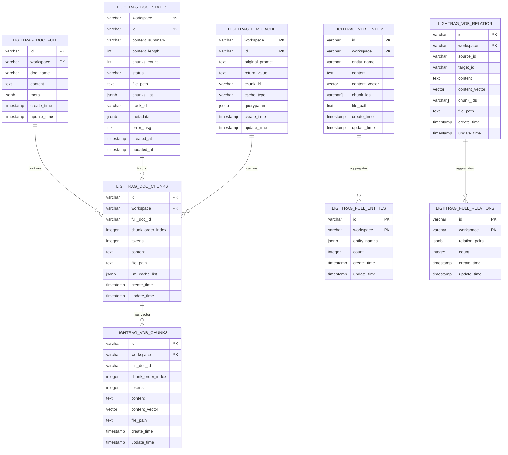
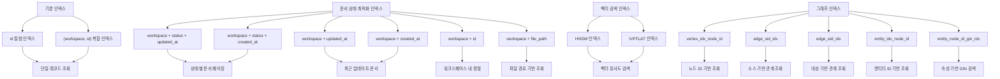
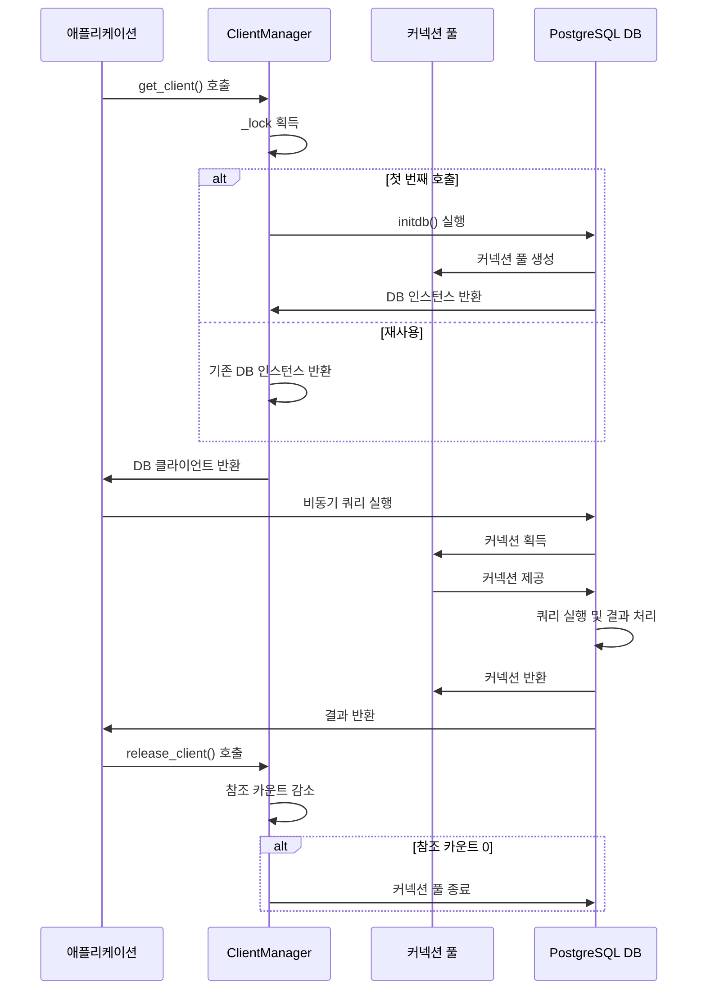

# PostgreSQL 기반 KV 저장소 최적화

<cite>
**이 문서에서 참조한 파일**
- [postgres_impl.py](file://lightrag/kg/postgres_impl.py)
- [docker-compose.yml](file://docker-compose.yml)
</cite>

## 목차
1. [소개](#소개)
2. [테이블 스키마 및 인덱스 설계](#테이블-스키마-및-인덱스-설계)
3. [비동기 쿼리 및 트랜잭션 관리](#비동기-쿼리-및-트랜잭션-관리)
4. [커넥션 풀링 및 리소스 제한](#커넥션-풀링-및-리소스-제한)
5. [고빈도 쓰기 작업 최적화](#고빈도-쓰기-작업-최적화)
6. [클러스터링 및 백업 전략](#클러스터링-및-백업-전략)

## 소개
이 문서는 LightRAG 프로젝트의 `postgres_impl.py` 구현을 기반으로 PostgreSQL 기반 KV 저장소의 성능 최적화 전략을 심층적으로 설명합니다. 코드 분석을 통해 테이블 스키마 설계, 인덱스 활용, 비동기 처리, 커넥션 풀링, 고성능 쓰기 작업 최적화, 클러스터링 및 백업 전략까지 포괄적인 가이드를 제공합니다.

**Section sources**
- [postgres_impl.py](file://lightrag/kg/postgres_impl.py#L51-L1289)

## 테이블 스키마 및 인덱스 설계

### 테이블 스키마 설계
PostgreSQL 기반 KV 저장소는 다양한 목적에 맞는 전문화된 테이블 구조를 사용합니다. 각 테이블은 `workspace`와 `id`를 복합 기본 키로 사용하여 데이터 격리를 보장합니다.



**Diagram sources**
- [postgres_impl.py](file://lightrag/kg/postgres_impl.py#L4320-L4446)

### B-Tree 및 GIN 인덱스 활용
시스템은 다양한 쿼리 패턴을 최적화하기 위해 포괄적인 인덱스 전략을 구현합니다.



**Diagram sources**
- [postgres_impl.py](file://lightrag/kg/postgres_impl.py#L51-L1289)

**Section sources**
- [postgres_impl.py](file://lightrag/kg/postgres_impl.py#L51-L1289)

## 비동기 쿼리 및 트랜잭션 관리

### 비동기 쿼리 실행
시스템은 `asyncpg` 라이브러리를 사용하여 완전한 비동기 쿼리 실행을 구현합니다. 이 접근 방식은 I/O 대기 시간을 최소화하고 동시 처리 능력을 극대화합니다.



**Diagram sources**
- [postgres_impl.py](file://lightrag/kg/postgres_impl.py#L51-L1289)

### 트랜잭션 관리 및 오류 재시도
시스템은 견고한 트랜잭션 관리와 오류 재시도 메커니즘을 구현하여 데이터 무결성과 신뢰성을 보장합니다.

```mermaid
flowchart TD
    A[업서트 작업 시작] --> B{작업 유형 확인}
    B -->|노드 업서트| C[upsert_node 메서드 호출]
    B -->|관계 업서트| D[upsert_edge 메서드 호출]
    B -->|일반 데이터| E[upsert 메서드 호출]
    
    C --> F[노드 데이터 유효성 검사]
    F --> G[노드 ID 정규화]
    G --> H[속성 포맷팅]
    H --> I[MERGE Cypher 쿼리 생성]
    I --> J[쿼리 실행]
    J --> K{실패?}
    K -->|예| L[재시도 정책 적용]
    L --> M[지수 백오프: 4s, 8s, 16s]
    M --> N[최대 3회 재시도]
    N --> J
    K -->|아니오| O[성공 로깅]
    O --> P[작업 완료]
    
    D --> Q[소스/대상 ID 정규화]
    Q --> R[관계 속성 포맷팅]
    R --> S[MERGE Cypher 쿼리 생성]
    S --> T[쿼리 실행]
    T --> U{실패?}
    U -->|예| V[재시도 정책 적용]
    V --> W[지수 백오프: 4s, 8s, 16s]
    W --> X[최대 3회 재시도]
    X --> T
    U -->|아니오| Y[성공 로깅]
    Y --> P
    
    E --> Z[데이터 유효성 검사]
    Z --> AA[작업 유형별 처리]
    AA --> AB[문서 청크 업서트]
    AA --> AC[LLM 캐시 업서트]
    AA --> AD[벡터 데이터 업서트]
    AB --> AE[업서트 SQL 실행]
    AE --> AF{실패?}
    AF -->|예| AG[예외 처리 및 로깅]
    AF -->|