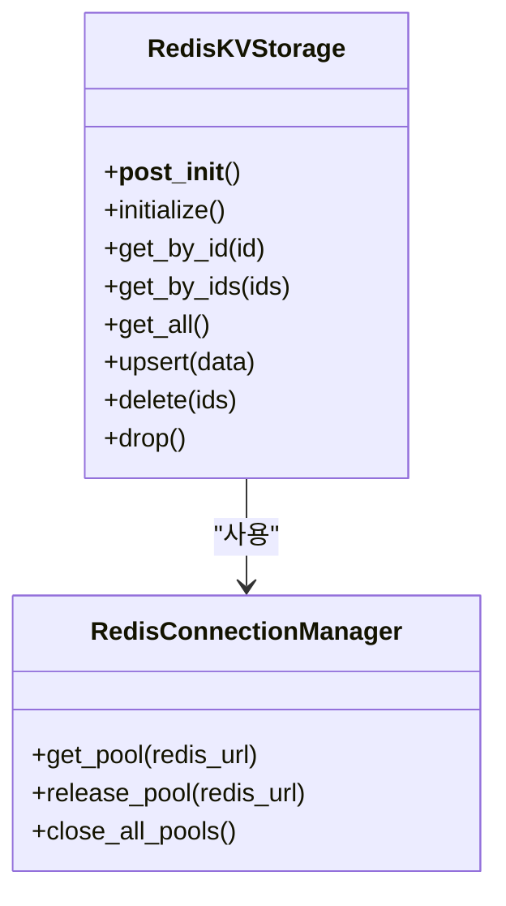

# Redis 기반 KV 저장소 최적화

<cite>
**이 문서에서 참조한 파일**
- [redis_impl.py](file://lightrag/kg/redis_impl.py)
- [docker-compose.yml](file://docker-compose.yml)
- [values.yaml](file://k8s-deploy/databases/redis/values.yaml)
- [README-zh.md](file://README-zh.md)
</cite>

## 목차
1. [소개](#소개)
2. [Redis 구성 최적화](#redis-구성-최적화)
3. [비동기 처리 및 파이프라이닝](#비동기-처리-및-파이프라이닝)
4. [도커 메모리 제한과의 연계](#도커-메모리-제한과의-연계)
5. [고성능 활용 사례](#고성능-활용-사례)
6. [클러스터링, 복제, 지속성과 성능 간 트레이드오프](#클러스터링-복제-지속성과-성능-간-트레이드오프)
7. [메모리 누수 방지 및 키 관리 전략](#메모리-누수-방지-및-키-관리-전략)
8. [결론](#결론)

## 소개
이 문서는 LightRAG 프로젝트 내에서 Redis 기반 키-값(KV) 저장소의 성능 최적화 전략을 상세히 설명합니다. LightRAG는 검색 증강 생성(RAG) 시스템으로, Redis를 LLM 응답 캐싱, 문서 상태 추적, 텍스트 청크 저장 등 다양한 핵심 기능에 활용합니다. 본 문서는 메모리 정책, 만료 전략, 지속성 설정 조정 방법을 포함하여, `lightrag/kg/redis_impl.py`의 구현을 기반으로 한 비동기 접근, 파이프라이닝, 배치 작업 처리 방식을 분석합니다. 또한 `docker-compose.yml`에서의 메모리 제한 설정과의 연계를 제시하고, 고성능 요구 시나리오에서의 활용 사례를 제시하며, 클러스터링, 복제, 지속성과 성능 간의 트레이드오프를 분석합니다.

## Redis 구성 최적화

### 메모리 정책(maxmemory-policy)
Redis의 메모리 사용량을 제어하기 위해 `maxmemory` 설정을 사용합니다. LightRAG의 `README-zh.md` 문서에서는 `maxmemory 4gb`를 권장하고 있습니다. 이 설정은 Redis 인스턴스가 사용할 수 있는 최대 메모리 양을 정의합니다. 메모리가 한계에 도달하면 `maxmemory-policy`에 따라 키를 제거하는 전략이 실행됩니다. LightRAG에서는 `maxmemory-policy noeviction`을 권장합니다. 이 정책은 메모리가 가득 찼을 때 새로운 데이터를 저장하지 않고 오류를 반환합니다. 이는 캐시 무결성을 유지하고, 예기치 않은 데이터 손실을 방지하는 데 유리합니다. 다른 정책들인 `allkeys-lru`, `volatile-lru` 등은 가장 덜 사용된 키를 제거하지만, LightRAG의 캐시 데이터는 재생성 비용이 높을 수 있으므로 `noeviction`이 더 안전한 선택입니다.

**Section sources**
- [README-zh.md](file://README-zh.md#L878-L879)

### 만료 전략(TTL)
LightRAG은 Redis를 캐시로 활용할 때 키의 수명을 관리하기 위해 TTL(Time-To-Live)을 사용합니다. `lightrag/utils.py` 파일의 `generate_cache_key` 함수는 캐시 키를 생성할 때 `mode`, `cache_type`, `hash_value`를 조합하여 고유한 키를 만듭니다. 이 키들은 내부적으로 TTL을 설정하여 일정 시간이 지나면 자동으로 만료되도록 할 수 있습니다. 예를 들어, LLM 응답 캐시는 `handle_cache` 함수를 통해 저장되며, 이 함수는 캐시 키를 생성하고 저장합니다. TTL을 적절히 설정함으로써 오래된 캐시 데이터가 메모리를 차지하는 것을 방지하고, 항상 최신 정보를 제공할 수 있습니다.

**Section sources**
- [redis_impl.py](file://lightrag/kg/redis_impl.py#L565-L596)
- [utils.py](file://lightrag/utils.py#L200-L208)

### 지속성 설정(RDB/AOF)
Redis는 데이터의 영속성을 보장하기 위해 RDB(Redis Database)와 AOF(Append-Only File) 두 가지 지속성 메커니즘을 제공합니다. LightRAG의 `README-zh.md` 문서에서는 다음과 같은 RDB 설정을 권장합니다:
```
save 900 1
save 300 10
save 60 1000
stop-writes-on-bgsave-error yes
```
이 설정은 900초(15분) 동안 1개 이상의 키가 변경되면, 300초(5분) 동안 10개 이상의 키가 변경되면, 또는 60초 동안 1000개 이상의 키가 변경되면 RDB 스냅샷을 생성하도록 지정합니다. `stop-writes-on-bgsave-error yes`는 백그라운드 저장(bgrewriteaof)이 실패할 경우 쓰기를 중지하여 데이터 손실을 방지합니다. AOF는 모든 쓰기 명령을 로그 파일에 기록하여, 서버 재시작 시 로그를 재생하여 데이터를 복구합니다. AOF는 RDB보다 더 높은 데이터 안정성을 제공하지만, 성능에 더 큰 영향을 미칠 수 있습니다. LightRAG에서는 RDB 설정을 주로 권장하며, AOF는 필요에 따라 추가로 구성할 수 있습니다.

**Section sources**
- [README-zh.md](file://README-zh.md#L874-L877)

## 비동기 처리 및 파이프라이닝

### 비동기 접근
`lightrag/kg/redis_impl.py` 파일은 Redis와의 비동기 통신을 위해 `redis.asyncio` 라이브러리를 사용합니다. `RedisKVStorage` 클래스는 `async` 키워드를 사용하여 `get_by_id`, `get_by_ids`, `upsert`, `delete` 등의 메서드를 비동기적으로 구현하고 있습니다. 이는 I/O 대기 시간을 줄이고, 여러 데이터베이스 작업을 동시에 수행할 수 있도록 하여 전체 시스템의 처리량을 크게 향상시킵니다. `RedisConnectionManager` 클래스는 연결 풀을 관리하여 연결 생성 오버헤드를 최소화하고, `tenacity` 라이브러리를 사용하여 네트워크 오류 시 자동 재시도를 수행합니다.



**Diagram sources**
- [redis_impl.py](file://lightrag/kg/redis_impl.py#L107-L138)
- [redis_impl.py](file://lightrag/kg/redis_impl.py#L167-L198)

### 파이프라이닝 및 배치 작업
Redis의 파이프라이닝 기능은 여러 명령을 하나의 네트워크 패킷으로 묶어 전송함으로써 네트워크 왕복 시간(RTT)을 크게 줄입니다. `RedisKVStorage` 클래스는 `get_by_ids` 및 `upsert` 메서드에서 `pipeline()`을 사용하여 배치 작업을 수행합니다. 예를 들어, `get_by_ids` 메서드는 여러 ID에 대한 `GET` 명령을 파이프라인에 추가한 후 `execute()`를 호출하여 한 번의 네트워크 요청으로 모든 결과를 가져옵니다. 마찬가지로 `upsert` 메서드는 여러 키의 존재 여부를 확인하기 위해 `EXISTS` 명령을 파이프라인으로 묶고, 이후 `SET` 명령도 파이프라인으로 묶어 저장합니다. 이는 단일 키 작업보다 훨씬 높은 처리량을 제공합니다.

**Section sources**
- [redis_impl.py](file://lightrag/kg/redis_impl.py#L353-L386)

## 도커 메모리 제한과의 연계
`docker-compose.yml` 파일은 LightRAG 애플리케이션을 위한 도커 컨테이너를 정의합니다. 이 파일은 `lightrag` 서비스를 정의하지만, 직접적으로 Redis 서비스를 정의하지는 않습니다. 그러나 `k8s-deploy/databases/redis/values.yaml` 파일은 Kubernetes를 통해 Redis를 배포할 때 사용되는 Helm 차트의 설정을 포함하고 있습니다. 여기서 `memory: 1`로 설정되어 있어, Redis 컨테이너에 1GiB의 메모리가 할당됨을 의미합니다. 이는 도커의 `--memory` 옵션과 유사한 역할을 합니다. 애플리케이션의 `maxmemory` 설정(예: 4gb)은 컨테이너의 메모리 제한보다 작아야 합니다. 그렇지 않으면 컨테이너가 OOM(Out of Memory) 종료될 위험이 있습니다. 따라서 도커 또는 쿠버네티스에서 Redis 컨테이너의 메모리 제한을 설정할 때, `maxmemory` 값에 여유를 두고 충분한 오버헤드 메모리를 확보해야 합니다.

**Section sources**
- [docker-compose.yml](file://docker-compose.yml#L30-L49)
- [values.yaml](file://k8s-deploy/databases/redis/values.yaml#L25-L27)

## 고성능 활용 사례

### LLM 응답 캐싱
LLM은 응답 생성에 많은 시간과 컴퓨팅 리소스가 소요됩니다. LightRAG은 `RedisKVStorage`를 사용하여 LLM의 응답을 캐싱합니다. `handle_cache` 함수는 입력 인수의 해시를 기반으로 캐시 키를 생성하고, `get_by_id`를 사용하여 캐시된 응답이 있는지 확인합니다. 만약 캐시에 존재하면, 비용이 높은 LLM 호출을 생략하고 즉시 응답을 반환할 수 있습니다. 이는 반복적인 쿼리나 동일한 입력에 대한 응답 시간을 극적으로 단축시킵니다. 비동기 처리와 파이프라이닝을 통해 캐시 조회 및 저장 작업이 빠르게 수행되므로, 캐시 오버헤드가 최소화됩니다.

**Section sources**
- [redis_impl.py](file://lightrag/kg/redis_impl.py#L565-L596)
- [utils.py](file://lightrag/utils.py#L210-L215)

### 문서 상태 추적
대규모 문서를 처리할 때 각 문서의 처리 상태를 실시간으로 추적하는 것은 중요합니다. `RedisDocStatusStorage` 클래스는 `DocStatusStorage` 인터페이스를 구현하여 문서의 상태(`pending`, `processing`, `success`, `failed`)를 저장하고 관리합니다. `get_status_counts` 메서드는 `SCAN` 명령과 파이프라이닝을 사용하여 모든 키를 반복하면서 각 상태별 문서 수를 집계합니다. 이는 대량의 문서 상태를 효율적으로 조회할 수 있게 하며, 사용자 인터페이스에서 처리 진행 상황을 시각화하는 데 활용됩니다.

**Section sources**
- [redis_impl.py](file://lightrag/kg/redis_impl.py#L565-L596)

## 클러스터링, 복제, 지속성과 성능 간 트레이드오프

### 클러스터링과 복제
`k8s-deploy/databases/redis/values.yaml` 파일은 Redis의 `mode: standalone`으로 설정되어 있어, 단일 노드 구성임을 나타냅니다. 이는 가장 간단한 구성으로, 성능은 뛰어나지만 가용성