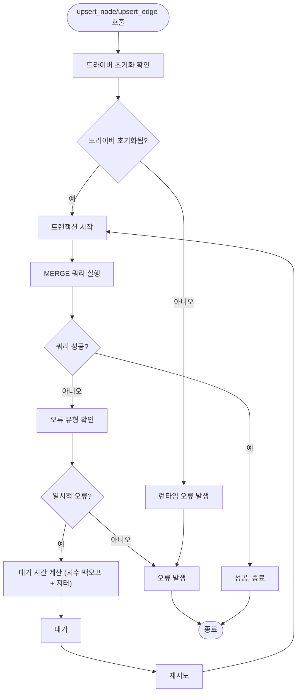

# Memgraph 최적화

<cite>
**이 문서에서 참조된 파일**   
- [memgraph_impl.py](file://lightrag/kg/memgraph_impl.py)
</cite>

## 목차
1. [소개](#소개)
2. [연결 설정 및 초기화](#연결-설정-및-초기화)
3. [인덱스 생성 전략](#인덱스-생성-전략)
4. [트랜잭션 재시도 로직](#트랜잭션-재시도-로직)
5. [upsert_node 및 upsert_edge 메서드의 수동 트랜잭션 레벨 재시도 메커니즘](#upsert_node-및-upsert_edge-메서드의-수동-트랜잭션-레벨-재시도-메커니즘)
6. [고성능 실시간 그래프 처리를 위한 Memgraph 내부 동작 원리](#고성능-실시간-그래프-처리를-위한-memgraph-내부-동작-원리)
7. [비동기 처리 최적화 가이드](#비동기-처리-최적화-가이드)

## 소개
Memgraph 기반 그래프 저장소의 실시간 처리 성능 최적화 전략에 대해 설명합니다. 이 문서는 연결 설정, 인덱스 생성, 트랜잭션 재시도 로직을 통한 충돌 해결 방법을 제시하며, upsert_node 및 upsert_edge 메서드에서의 수동 트랜잭션 레벨 재시도 메커니즘을 자세히 설명합니다. 또한 고성능 실시간 그래프 처리를 위한 Memgraph의 내부 동작 원리와 비동기 처리 최적화 가이드를 포함합니다.

## 연결 설정 및 초기화
Memgraph에 연결하기 위해 `initialize` 메서드는 환경 변수 또는 구성 파일에서 URI, 사용자 이름, 비밀번호 및 데이터베이스 정보를 가져옵니다. 이후 비동기 드라이버를 초기화하고, 워크스페이스 레이블에 대한 인덱스를 생성합니다. 이 과정은 데이터베이스 연결을 안정적으로 설정하고, 후속 작업을 위한 기반을 마련합니다.

**Section sources**
- [memgraph_impl.py](file://lightrag/kg/memgraph_impl.py#L60-L103)

## 인덱스 생성 전략
초기화 과정 중, `CREATE INDEX ON :{workspace_label}(entity_id)` 쿼리를 사용하여 엔티티 ID에 대한 인덱스를 생성합니다. 이 인덱스는 노드 존재 여부 확인, 노드 가져오기, 엣지 가져오기 등의 작업에서 성능을 크게 향상시킵니다. 인덱스는 워크스페이스 레이블을 기반으로 하며, 각 노드의 고유 식별자인 entity_id를 기준으로 합니다.

**Section sources**
- [memgraph_impl.py](file://lightrag/kg/memgraph_impl.py#L75-L85)

## 트랜잭션 재시도 로직
Memgraph은 트랜잭션 충돌 시 TransientError를 발생시킬 수 있습니다. 이를 해결하기 위해 지수 백오프와 재시도 메커니즘을 구현합니다. 재시도는 최대 100회까지 수행되며, 초기 대기 시간은 0.2초이고 백오프 팩터는 1.1입니다. 또한 재시도 간에 무작위 지터를 추가하여 동시 재시도로 인한 추가 충돌을 방지합니다.

**Section sources**
- [memgraph_impl.py](file://lightrag/kg/memgraph_impl.py#L477-L531)
- [memgraph_impl.py](file://lightrag/kg/memgraph_impl.py#L570-L633)

## upsert_node 및 upsert_edge 메서드의 수동 트랜잭션 레벨 재시도 메커니즘
`upsert_node` 및 `upsert_edge` 메서드는 수동 트랜잭션 레벨 재시도 메커니즘을 사용하여 일시적인 오류를 처리합니다. 각 메서드는 최대 100회의 재시도를 수행하며, 지수 백오프와 지터를 적용합니다. 이 메커니즘은 MERGE 쿼리를 사용하여 노드 또는 엣지를 삽입하거나 업데이트하며, 트랜잭션 충돌이 발생할 경우 지수적으로 증가하는 대기 시간 후에 재시도합니다.

**Diagram sources **
- [memgraph_impl.py](file://lightrag/kg/memgraph_impl.py#L477-L531)
- [memgraph_impl.py](file://lightrag/kg/memgraph_impl.py#L570-L633)

**Section sources**
- [memgraph_impl.py](file://lightrag/kg/memgraph_impl.py#L477-L531)
- [memgraph_impl.py](file://lightrag/kg/memgraph_impl.py#L570-L633)

## 고성능 실시간 그래프 처리를 위한 Memgraph 내부 동작 원리
Memgraph은 실시간 처리를 위해 비동기 드라이버를 사용하여 높은 동시성을 지원합니다. 각 작업은 독립적인 세션에서 실행되며, 읽기 작업은 READ 모드, 쓰기 작업은 WRITE 모드로 분리됩니다. 또한, MERGE 쿼리는 노드 또는 엣지가 존재하지 않을 경우에만 생성하고, 존재할 경우 속성을 업데이트하여 효율적인 upsert 작업을 가능하게 합니다.

**Section sources**
- [memgraph_impl.py](file://lightrag/kg/memgraph_impl.py#L477-L531)
- [memgraph_impl.py](file://lightrag/kg/memgraph_impl.py#L570-L633)

## 비동기 처리 최적화 가이드
비동기 처리를 최적화하기 위해, 모든 데이터베이스 작업은 `async with` 문을 사용하여 적절한 세션 범위 내에서 실행되어야 합니다. 또한, 결과 소비를 보장하기 위해 `consume()` 메서드를 호출해야 하며, 예외 발생 시에도 리소스 누수를 방지하기 위해 `finally` 블록에서 소비를 수행해야 합니다. 이러한 관행은 안정적인 비동기 처리를 보장합니다.

**Section sources**
- [memgraph_impl.py](file://lightrag/kg/memgraph_impl.py#L120-L125)
- [memgraph_impl.py](file://lightrag/kg/memgraph_impl.py#L150-L155)
- [memgraph_impl.py](file://lightrag/kg/memgraph_impl.py#L498-L503)
- [memgraph_impl.py](file://lightrag/kg/memgraph_impl.py#L609-L614)