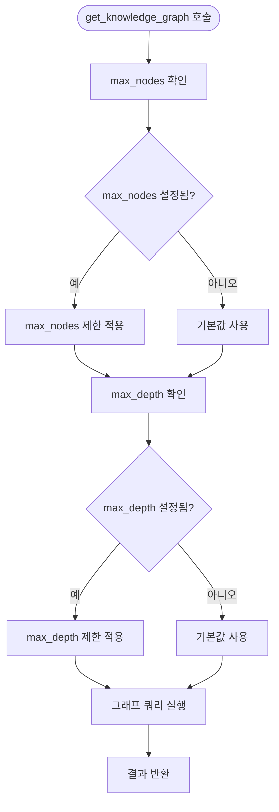
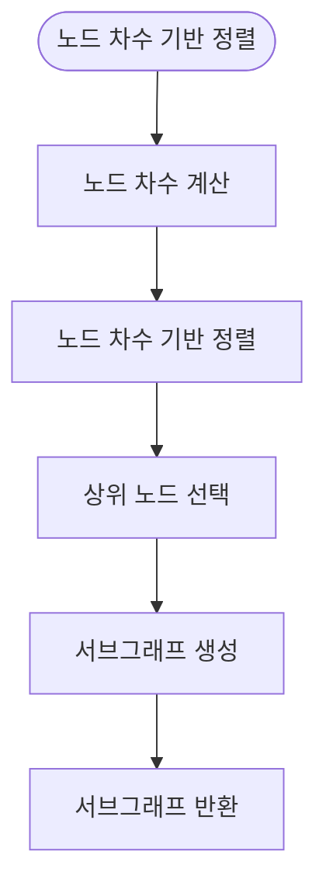
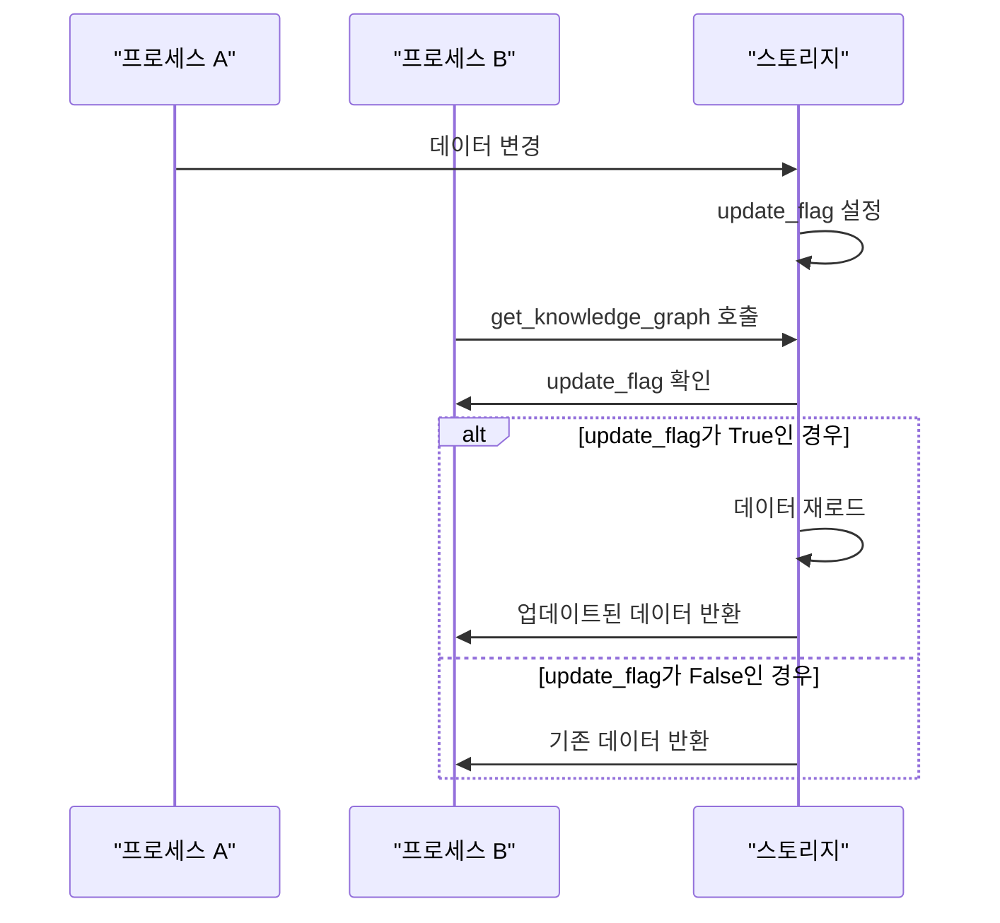
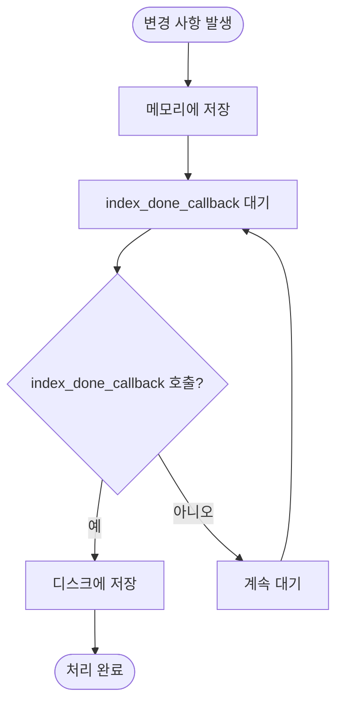

# NetworkX 최적화

<cite>
**참조된 문서**   
- [networkx_impl.py](file://lightrag/kg/networkx_impl.py)
- [shared_storage.py](file://lightrag/kg/shared_storage.py)
- [lightrag.py](file://lightrag/lightrag.py)
- [constants.py](file://lightrag/constants.py)
</cite>

## 목차
1. [소개](#소개)
2. [메모리 기반 처리 한계](#메모리-기반-처리-한계)
3. [성능 최적화 전략](#성능-최적화-전략)
4. [다중 프로세스 환경에서의 데이터 일관성](#다중-프로세스-환경에서의-데이터-일관성)
5. [지연된 영속성 처리](#지연된-영속성-처리)
6. [결론](#결론)

## 소개
NetworkX는 파이썬 기반의 강력한 그래프 분석 라이브러리로, LightRAG 프로젝트에서 지식 그래프 저장소로 활용되고 있습니다. 이 문서는 NetworkX 기반 그래프 저장소의 메모리 기반 처리 한계와 성능 최적화 전략을 설명합니다. 특히 `get_knowledge_graph` 메서드에서 최대 노드 수(max_nodes) 및 탐색 깊이(max_depth) 제한을 통한 메모리 사용 최적화, 노드 차수(degree) 기반 정렬을 활용한 중요 노드 우선 탐색 전략을 제시합니다. 또한 다중 프로세스 환경에서의 데이터 일관성 유지 및 index_done_callback을 통한 지연된 영속성 처리 최적화 가이드를 포함합니다.

**참조된 문서**
- [lightrag.py](file://lightrag/lightrag.py#L1-L50)
- [constants.py](file://lightrag/constants.py#L1-L10)

## 메모리 기반 처리 한계
NetworkX는 메모리 기반 그래프 처리를 수행하며, 대규모 그래프 데이터를 처리할 때 메모리 사용량이 급격히 증가할 수 있습니다. 이는 특히 그래프 탐색 및 분석 작업에서 중요한 제약 요소가 됩니다. LightRAG에서는 이러한 한계를 극복하기 위해 다양한 최적화 전략을 적용하고 있습니다.

**참조된 문서**
- [networkx_impl.py](file://lightrag/kg/networkx_impl.py#L1-L50)

## 성능 최적화 전략
### 최대 노드 수 및 탐색 깊이 제한
`get_knowledge_graph` 메서드는 최대 노드 수(max_nodes) 및 탐색 깊이(max_depth) 제한을 통해 메모리 사용을 최적화합니다. 이는 다음과 같은 방식으로 작동합니다:

- **max_nodes**: 반환할 최대 노드 수를 제한하여 메모리 사용량을 제어합니다.
- **max_depth**: 그래프 탐색의 최대 깊이를 제한하여 탐색 범위를 제어합니다.

**참조된 문서**
- [networkx_impl.py](file://lightrag/kg/networkx_impl.py#L226-L257)
- [constants.py](file://lightrag/constants.py#L40-L41)

### 노드 차수 기반 정렬
`get_knowledge_graph` 메서드는 노드 차수(degree) 기반 정렬을 활용하여 중요 노드를 우선적으로 탐색합니다. 이는 다음과 같은 방식으로 작동합니다:

- **노드 차수 계산**: 각 노드의 연결된 엣지 수를 계산합니다.
- **차수 기반 정렬**: 노드 차수를 기준으로 내림차순 정렬합니다.
- **중요 노드 우선 탐색**: 정렬된 노드 순서대로 탐색을 수행합니다.

**참조된 문서**
- [networkx_impl.py](file://lightrag/kg/networkx_impl.py#L255-L286)

## 다중 프로세스 환경에서의 데이터 일관성
### 데이터 일관성 유지
다중 프로세스 환경에서 데이터 일관성을 유지하기 위해 LightRAG는 다음과 같은 전략을 사용합니다:

- **공유 자원 관리**: `shared_storage.py`에서 공유 자원을 관리합니다.
- **업데이트 플래그**: `get_update_flag`와 `set_all_update_flags`를 사용하여 업데이트 플래그를 관리합니다.
- **데이터 재로드**: 다른 프로세스에서 데이터가 변경되었을 때, `index_done_callback`을 통해 데이터를 재로드합니다.

**참조된 문서**
- [shared_storage.py](file://lightrag/kg/shared_storage.py#L1-L50)
- [networkx_impl.py](file://lightrag/kg/networkx_impl.py#L1-L50)

## 지연된 영속성 처리
### index_done_callback을 통한 지연된 영속성 처리
`index_done_callback` 메서드는 변경 사항을 디스크에 지연 저장하여 성능을 최적화합니다. 이는 다음과 같은 방식으로 작동합니다:

- **변경 사항 저장**: 메모리에서 변경 사항을 저장합니다.
- **지연 저장**: `index_done_callback`이 호출될 때까지 디스크에 저장하지 않습니다.
- **영속성 처리**: `index_done_callback`이 호출되면 변경 사항을 디스크에 저장합니다.

**참조된 문서**
- [networkx_impl.py](file://lightrag/kg/networkx_impl.py#L400-L450)

## 결론
NetworkX 기반 그래프 저장소는 메모리 기반 처리의 한계를 극복하기 위해 다양한 성능 최적화 전략을 필요로 합니다. `get_knowledge_graph` 메서드에서 최대 노드 수(max_nodes) 및 탐색 깊이(max_depth) 제한을 통해 메모리 사용을 최적화하고, 노드 차수(degree) 기반 정렬을 활용하여 중요 노드를 우선적으로 탐색할 수 있습니다. 또한 다중 프로세스 환경에서의 데이터 일관성 유지 및 index_done_callback을 통한 지연된 영속성 처리를 통해 성능을 극대화할 수 있습니다. 이러한 전략들은 대규모 그래프 데이터를 효율적으로 처리하고 분석하는 데 중요한 역할을 합니다.

**참조된 문서**
- [lightrag.py](file://lightrag/lightrag.py#L1-L50)
- [networkx_impl.py](file://lightrag/kg/networkx_impl.py#L1-L50)
- [shared_storage.py](file://lightrag/kg/shared_storage.py#L1-L50)
- [constants.py](file://lightrag/constants.py#L1-L10)