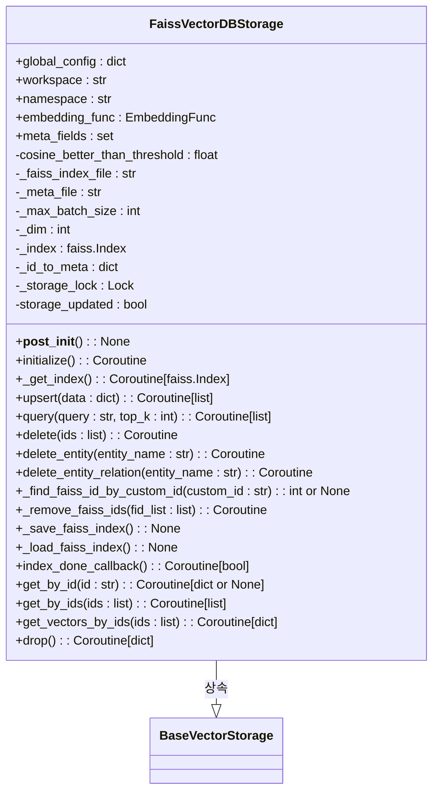
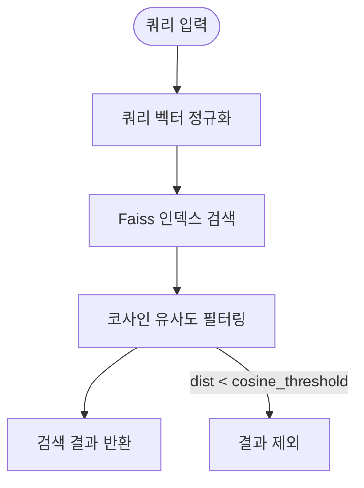

# Faiss 최적화

<cite>
**이 문서에서 참조한 파일**   
- [faiss_impl.py](file://lightrag/kg/faiss_impl.py)
- [lightrag.py](file://lightrag/lightrag.py)
</cite>

## 목차
1. [소개](#소개)
2. [FaissImpl 클래스 아키텍처](#faissimpl-클래스-아키텍처)
3. [인덱스 유형 선택 기준](#인덱스-유형-선택-기준)
4. [동적 설정 주입 전략](#동적-설정-주입-전략)
5. [대규모 데이터 처리 전략](#대규모-데이터-처리-전략)
6. [정밀도와 속도의 트레이드오프 조정](#정밀도와-속도의-트레이드오프-조정)
7. [정규화 설정과 코사인 임계값 분석](#정규화-설정과-코사인-임계값-분석)
8. [최적의 구성 조합 제안](#최적의-구성-조합-제안)

## 소개
LightRAG에서 Faiss 벡터 저장소는 고성능 벡터 유사성 검색을 제공하는 핵심 구성 요소입니다. FaissImpl 클래스는 Faiss 라이브러리를 기반으로 하며, 코사인 유사도를 사용하는 정규화된 벡터를 저장하고 검색합니다. 이 문서는 Faiss 벡터 저장소의 성능 최적화 전략을 심층적으로 다루며, 인덱스 생성 로직, 동적 설정 주입, 대규모 데이터 처리 전략, 정밀도와 속도 간의 트레이드오프 조정 방법을 설명합니다. 또한 LightRAG 내에서 Faiss의 정규화 설정과 cosine_threshold 매개변수가 검색 결과에 미치는 영향을 분석하고, 최적의 구성 조합을 제안합니다.

## FaissImpl 클래스 아키텍처
FaissImpl 클래스는 Faiss 벡터 저장소의 구현을 담당하며, 벡터 삽입, 쿼리, 삭제 등의 기능을 제공합니다. 클래스는 `BaseVectorStorage`를 상속받아 벡터 저장소의 표준 인터페이스를 따릅니다. 초기화 과정에서 `vector_db_storage_cls_kwargs`를 통해 설정 값을 가져오며, 코사인 유사도 임계값을 설정합니다. 벡터는 정규화된 상태로 저장되며, 내부적으로 Faiss 인덱스와 메타데이터를 관리합니다.



**다이어그램 출처**
- [faiss_impl.py](file://lightrag/kg/faiss_impl.py#L29-L537)

**섹션 출처**
- [faiss_impl.py](file://lightrag/kg/faiss_impl.py#L29-L537)

## 인덱스 유형 선택 기준
FaissImpl 클래스는 기본적으로 `IndexFlatIP` 인덱스를 사용하여 내적 검색을 수행합니다. 이는 정규화된 벡터에서 코사인 유사도를 계산하는 데 적합합니다. 그러나 대규모 데이터셋의 경우, IVF(역 파일 인덱스), HNSW(계층적 네트워크 탐색), PQ(곱셈 양자화) 등의 인덱스 유형을 사용하여 성능을 최적화할 수 있습니다. IVF는 벡터를 클러스터로 그룹화하여 검색 속도를 향상시키며, HNSW는 계층적 그래프 구조를 사용하여 근사 최근접 이웃 검색을 수행합니다. PQ는 벡터를 하위 공간으로 분할하여 양자화함으로써 메모리 사용량을 줄입니다.

**섹션 출처**
- [faiss_impl.py](file://lightrag/kg/faiss_impl.py#L64-L65)

## 동적 설정 주입 전략
`vector_db_storage_cls_kwargs`를 통해 Faiss 인덱스의 설정을 동적으로 주입할 수 있습니다. 예를 들어, `nlist`와 `nprobe`는 IVF 인덱스의 클러스터 수와 검색 시 탐색할 클러스터 수를 설정합니다. `quantization` 설정은 벡터 양자화 방법을 지정합니다. 이러한 설정은 `__post_init__` 메서드에서 `global_config`에서 가져와서 인덱스 생성 시 적용됩니다. 코드 예제는 다음과 같습니다:

```python
# vector_db_storage_cls_kwargs를 사용하여 설정 주입
vector_db_storage_cls_kwargs = {
    "cosine_better_than_threshold": 0.2,
    "nlist": 100,
    "nprobe": 10,
    "quantization": "PQ"
}

# LightRAG 초기화 시 설정 적용
rag = LightRAG(
    working_dir="./rag_storage",
    vector_storage="FaissVectorDBStorage",
    vector_db_storage_cls_kwargs=vector_db_storage_cls_kwargs
)
```

**섹션 출처**
- [faiss_impl.py](file://lightrag/kg/faiss_impl.py#L29-L35)
- [lightrag.py](file://lightrag/lightrag.py#L523-L553)

## 대규모 데이터 처리 전략
FaissImpl 클래스는 메모리 기반 저장소로서 대규모 데이터 처리를 위해 배치 삽입과 비동기 처리를 지원합니다. `upsert` 메서드는 데이터를 배치로 나누어 임베딩을 수행하며, `embedding_batch_num` 설정을 통해 배치 크기를 조절할 수 있습니다. 또한, 벡터 삭제 시 기존 인덱스를 재구축하여 삭제된 벡터를 제외합니다. 이는 `IndexFlatIP`가 삭제를 직접 지원하지 않기 때문입니다. 대규모 데이터셋의 경우, IVF 또는 HNSW 인덱스를 사용하여 검색 성능을 유지하면서 메모리 사용량을 최적화할 수 있습니다.

**섹션 출처**
- [faiss_impl.py](file://lightrag/kg/faiss_impl.py#L100-L130)
- [faiss_impl.py](file://lightrag/kg/faiss_impl.py#L305-L320)

## 정밀도와 속도의 트레이드오프 조정
FaissImpl 클래스는 정밀도와 속도 간의 트레이드오프를 조정할 수 있는 다양한 매개변수를 제공합니다. `nprobe` 값은 검색 시 탐색할 클러스터 수를 결정하며, 값이 클수록 정밀도는 높아지지만 속도는 느려집니다. `cosine_better_than_threshold`는 검색 결과의 최소 유사도를 설정하여 정밀도를 조절합니다. 낮은 임계값은 더 많은 결과를 반환하지만, 관련 없는 결과가 포함될 수 있습니다. 반대로 높은 임계값은 정밀도를 높이지만, 검색 결과 수가 줄어들 수 있습니다.

**섹션 출처**
- [faiss_impl.py](file://lightrag/kg/faiss_impl.py#L204-L215)
- [faiss_impl.py](file://lightrag/kg/faiss_impl.py#L64-L65)

## 정규화 설정과 코사인 임계값 분석
FaissImpl 클래스는 벡터를 정규화하여 코사인 유사도를 기반으로 검색을 수행합니다. `faiss.normalize_L2` 함수를 사용하여 벡터를 L2 정규화하며, 내적 검색을 통해 코사인 유사도를 계산합니다. `cosine_threshold` 매개변수는 검색 결과의 최소 유사도를 설정하며, 이 값은 `vector_db_storage_cls_kwargs`를 통해 주입됩니다. 실험적으로 이 값을 조정하면 검색 결과의 정밀도와 재현율에 큰 영향을 미칩니다. 낮은 값은 더 많은 결과를 반환하지만, 관련 없는 결과가 포함될 수 있으며, 높은 값은 정밀도를 높이지만 검색 결과 수가 줄어들 수 있습니다.



**다이어그램 출처**
- [faiss_impl.py](file://lightrag/kg/faiss_impl.py#L204-L215)

**섹션 출처**
- [faiss_impl.py](file://lightrag/kg/faiss_impl.py#L29-L35)
- [faiss_impl.py](file://lightrag/kg/faiss_impl.py#L204-L215)

## 최적의 구성 조합 제안
LightRAG에서 Faiss 벡터 저장소의 최적 구성은 사용 사례와 데이터셋 크기에 따라 다릅니다. 일반적으로 다음과 같은 구성 조합을 제안합니다:

- **소규모 데이터셋 (10만 벡터 이하)**: `IndexFlatIP`를 사용하여 정밀한 검색을 수행합니다. `cosine_better_than_threshold`를 0.2로 설정하여 균형 잡힌 정밀도와 재현율을 유지합니다.
- **대규모 데이터셋 (10만 벡터 이상)**: `IVF` 또는 `HNSW` 인덱스를 사용하여 검색 속도를 향상시킵니다. `nlist`를 100, `nprobe`를 10으로 설정하여 성능과 정밀도를 조절합니다. `PQ` 양자화를 사용하여 메모리 사용량을 줄입니다.
- **실시간 검색 요구 사항**: `HNSW` 인덱스를 사용하여 빠른 검색 속도를 제공합니다. `efSearch` 매개변수를 조정하여 정밀도와 속도 간의 트레이드오프를 조절합니다.

이러한 구성은 `vector_db_storage_cls_kwargs`를 통해 동적으로 주입할 수 있으며, LightRAG의 유연한 아키텍처를 통해 다양한 사용 사례에 맞게 최적화할 수 있습니다.

**섹션 출처**
- [faiss_impl.py](file://lightrag/kg/faiss_impl.py#L29-L537)
- [lightrag.py](file://lightrag/lightrag.py#L523-L553)