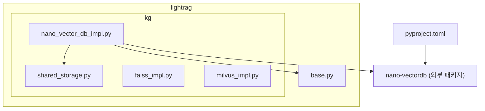
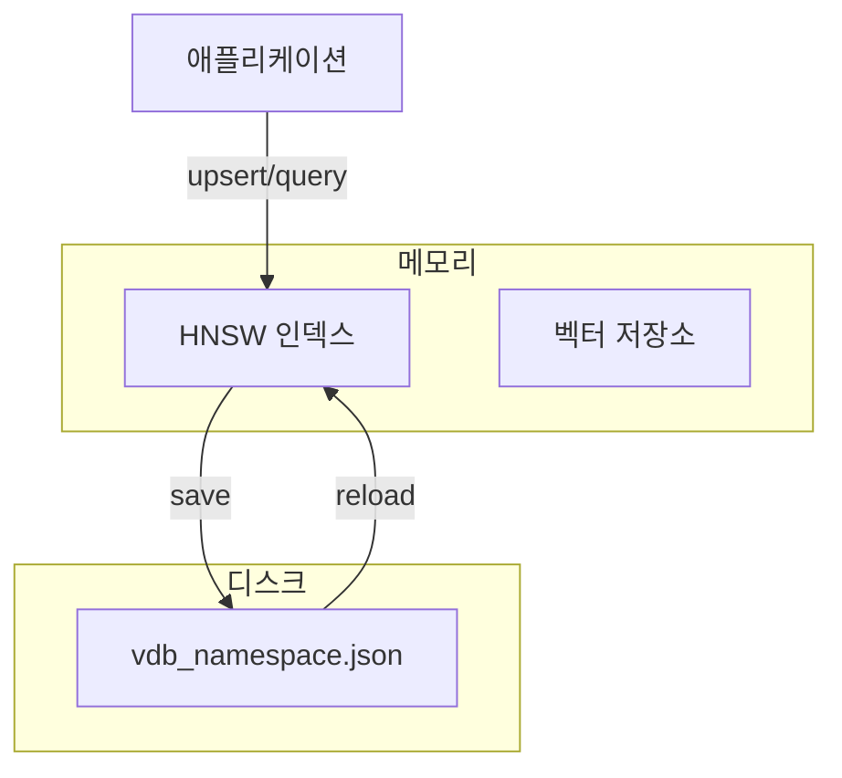
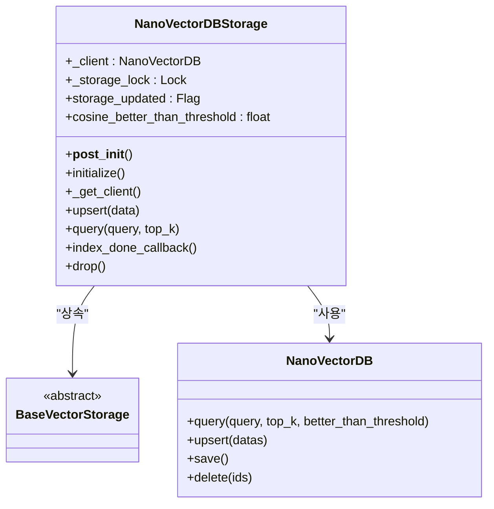
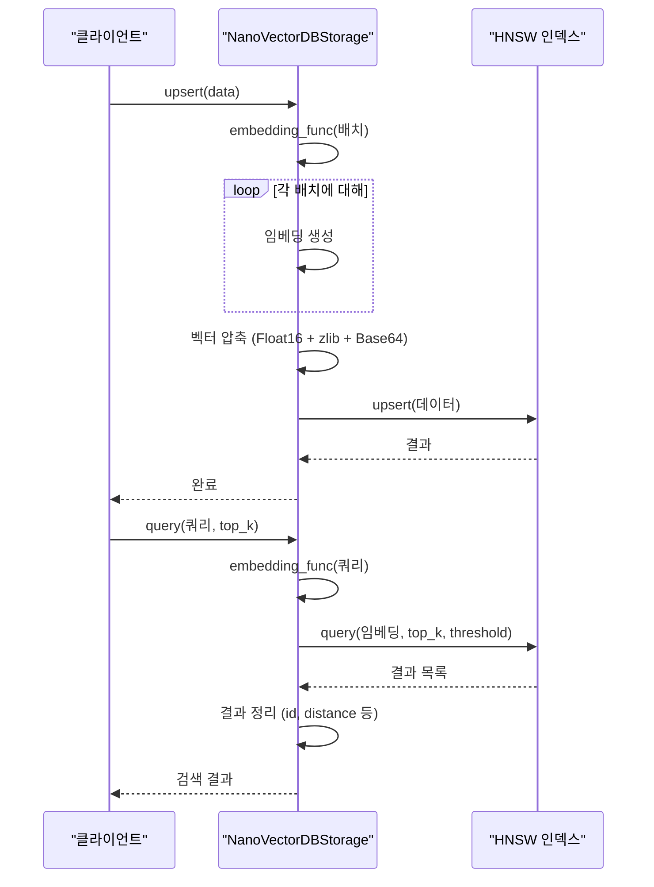
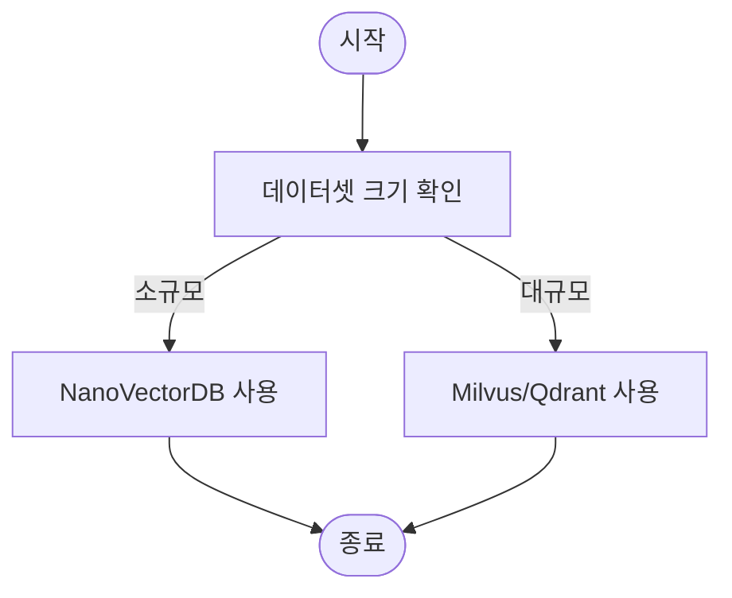
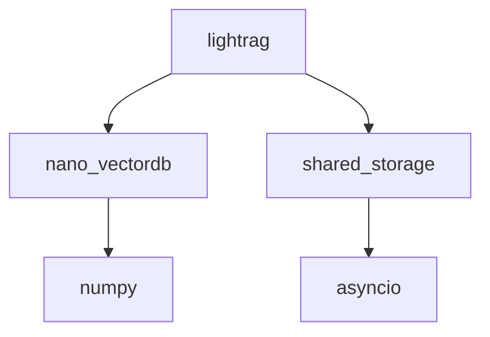

# NanoVectorDB 최적화

<cite>
**이 문서에서 참조한 파일**  
- [nano_vector_db_impl.py](file://lightrag/kg/nano_vector_db_impl.py)
- [pyproject.toml](file://pyproject.toml)
- [README.md](file://README.md)
</cite>

## 목차
1. [소개](#소개)
2. [프로젝트 구조](#프로젝트-구조)
3. [코어 컴포넌트](#코어-컴포넌트)
4. [아키텍처 개요](#아키텍처-개요)
5. [상세 컴포넌트 분석](#상세-컴포넌트-분석)
6. [의존성 분석](#의존성-분석)
7. [성능 고려사항](#성능-고려사항)
8. [문제 해결 가이드](#문제-해결-가이드)
9. [결론](#결론)

## 소개
LightRAG는 검색 증강 생성(RAG)을 위한 경량화된 프레임워크로, 빠르고 효율적인 정보 검색을 목표로 합니다. 이 문서는 LightRAG의 기본 내장 벡터 저장소인 NanoVectorDB의 성능 최적화 방법을 심층적으로 분석합니다. 특히 메모리 기반 HNSW(Hierarchical Navigable Small World) 인덱스의 작동 원리와, `vector_db_storage_cls_kwargs`를 통해 조정 가능한 `ef_construction`, `ef_search`, `max_elements` 등의 매개변수를 코드 수준에서 설명합니다. 또한 저지연 검색을 위한 메모리 사용 최적화 전략과, 대규모 데이터셋에서의 성능 한계를 극복하기 위한 샤딩 또는 외부 저장소 연동 가능성에 대해 탐색합니다. 마지막으로 `cosine_threshold` 설정이 검색 결과의 정밀도와 재현율에 미치는 영향을 분석하고, LightRAG의 다른 저장소와의 비교를 통해 사용 사례별 추천 기준을 제시합니다.

## 프로젝트 구조
LightRAG 프로젝트는 모듈화된 구조로 구성되어 있으며, 주요 기능별로 디렉터리가 분리되어 있습니다. 벡터 저장소 관련 구현은 `lightrag/kg/` 디렉터리에 위치하며, `nano_vector_db_impl.py` 파일이 NanoVectorDB의 핵심 구현을 담당합니다. 이 파일은 `BaseVectorStorage` 클래스를 상속받아 벡터 데이터의 삽입, 조회, 삭제 등의 기본 연산을 제공합니다. 프로젝트 루트에는 `pyproject.toml` 파일을 통해 의존성 관리가 이루어지며, `nano-vectordb` 패키지가 벡터 인덱싱의 핵심 라이브러리로 사용됩니다.

**도표 출처**  
- [nano_vector_db_impl.py](file://lightrag/kg/nano_vector_db_impl.py#L1-L400)
- [pyproject.toml](file://pyproject.toml#L1-L106)

**섹션 출처**  
- [nano_vector_db_impl.py](file://lightrag/kg/nano_vector_db_impl.py#L1-L400)
- [pyproject.toml](file://pyproject.toml#L1-L106)

## 코어 컴포넌트
NanoVectorDB의 핵심은 `NanoVectorDBStorage` 클래스입니다. 이 클래스는 `BaseVectorStorage`를 확장하여 벡터 데이터베이스의 표준 인터페이스를 구현합니다. 주요 메서드로는 `upsert`, `query`, `delete`, `index_done_callback` 등이 있습니다. `__post_init__` 메서드에서 `vector_db_storage_cls_kwargs`를 통해 전달된 `cosine_better_than_threshold` 값을 초기화하며, 이 값은 이후 검색 쿼리에서 유사도 임계값으로 사용됩니다. 또한, `working_dir`과 `workspace`를 기반으로 저장소 파일의 경로를 결정하며, 각 작업 공간별로 데이터를 격리합니다.

**섹션 출처**  
- [nano_vector_db_impl.py](file://lightrag/kg/nano_vector_db_impl.py#L15-L80)

## 아키텍처 개요
NanoVectorDB는 메모리 기반의 벡터 저장소로, HNSW 알고리즘을 사용하여 고차원 벡터 공간에서의 근사 근접 검색(ANN)을 수행합니다. 데이터는 메모리에 로드되며, 변경 사항은 `index_done_callback` 메서드를 통해 디스크에 지속됩니다. 이 과정에서 `shared_storage` 모듈의 락과 플래그를 사용하여 다중 프로세스 환경에서의 데이터 일관성을 보장합니다. 벡터는 `Float16`으로 압축된 후 `zlib`으로 압축되고, `Base64`로 인코딩되어 저장되므로 메모리 사용량을 최적화합니다.

**도표 출처**  
- [nano_vector_db_impl.py](file://lightrag/kg/nano_vector_db_impl.py#L1-L400)

## 상세 컴포넌트 분석

### NanoVectorDBStorage 분석
`NanoVectorDBStorage` 클래스는 벡터 데이터의 삽입과 조회를 담당합니다. `upsert` 메서드는 입력 데이터를 배치로 나누어 임베딩을 수행한 후, 결과 벡터를 압축하여 HNSW 인덱스에 삽입합니다. `query` 메서드는 쿼리 문자열을 임베딩한 후, `better_than_threshold` 매개변수를 사용하여 유사도 임계값을 초과하는 결과만 반환합니다. 이는 검색 결과의 품질을 보장하는 데 중요한 역할을 합니다.

#### 객체 지향 컴포넌트

**도표 출처**  
- [nano_vector_db_impl.py](file://lightrag/kg/nano_vector_db_impl.py#L15-L400)

#### API/서비스 컴포넌트

**도표 출처**  
- [nano_vector_db_impl.py](file://lightrag/kg/nano_vector_db_impl.py#L132-L171)

### 개념적 개요
NanoVectorDB는 경량화된 벡터 검색을 위해 설계되었습니다. 메모리 기반의 HNSW 인덱스는 빠른 검색 속도를 제공하지만, 모든 데이터가 메모리에 적재되어야 하므로 대규모 데이터셋에서는 메모리 한계에 직면할 수 있습니다. 이를 해결하기 위해 데이터를 샤딩하거나, Milvus, Qdrant 등의 외부 벡터 저장소와 연동하는 것이 가능합니다.

[이 도표는 개념적인 워크플로우를 보여주며, 특정 소스 파일에 직접 연결되지 않습니다.]

[이 섹션은 특정 파일을 분석하지 않으므로 출처가 필요하지 않습니다.]

## 의존성 분석
NanoVectorDB는 `nano-vectordb`라는 외부 패키지에 의존합니다. 이 패키지는 HNSW 알고리즘을 구현하여 고성능의 근사 근접 검색을 제공합니다. `pyproject.toml` 파일을 통해 이 의존성이 명시되어 있으며, LightRAG 설치 시 자동으로 설치됩니다. 또한, `shared_storage` 모듈을 통해 다중 프로세스 간의 데이터 일관성을 유지하기 위한 락과 플래그 메커니즘을 사용합니다.

**도표 출처**  
- [pyproject.toml](file://pyproject.toml#L1-L106)
- [nano_vector_db_impl.py](file://lightrag/kg/nano_vector_db_impl.py#L1-L400)

**섹션 출처**  
- [pyproject.toml](file://pyproject.toml#L1-L106)
- [nano_vector_db_impl.py](file://lightrag/kg/nano_vector_db_impl.py#L1-L400)

## 성능 고려사항
NanoVectorDB는 메모리 기반 저장소이므로, 데이터셋 크기가 메모리 용량을 초과할 경우 성능이 급격히 저하될 수 있습니다. 이를 완화하기 위해 벡터를 `Float16`으로 압축하고, `zlib`으로 추가 압축하여 저장 공간을 절약합니다. 그러나 이는 CPU 오버헤드를 증가시킬 수 있습니다. 대규모 데이터셋의 경우, `vector_storage` 설정을 `MilvusVectorDBStorage`나 `QdrantVectorDBStorage`로 변경하여 외부 벡터 데이터베이스를 사용하는 것이 권장됩니다. 이는 디스크 기반 저장과 분산 처리를 통해 훨씬 더 큰 데이터셋을 처리할 수 있게 합니다.

[이 섹션은 일반적인 성능 지침을 제공하므로 출처가 필요하지 않습니다.]

## 문제 해결 가이드
NanoVectorDB 사용 중 발생할 수 있는 주요 문제는 메모리 부족과 데이터 일관성 문제입니다. 메모리 부족은 대규모 데이터 삽입 시 발생할 수 있으며, 이 경우 외부 저장소로 마이그레이션하는 것이 가장 효과적인 해결책입니다. 데이터 일관성 문제는 다중 프로세스 환경에서 발생할 수 있으며, `shared_storage` 모듈의 락 메커니즘을 통해 해결됩니다. `index_done_callback` 메서드는 변경 사항을 디스크에 저장할 때 다른 프로세스의 업데이트를 감지하고, 필요시 데이터를 다시 로드하여 일관성을 유지합니다.

**섹션 출처**  
- [nano_vector_db_impl.py](file://lightrag/kg/nano_vector_db_impl.py#L260-L292)

## 결론
NanoVectorDB는 소규모에서 중규모 데이터셋에 적합한 경량화된 벡터 저장소입니다. `cosine_better_than_threshold` 매개변수를 적절히 조정하면 검색 결과의 정밀도와 재현율 사이의 균형을 맞출 수 있습니다. 그러나 대규모 데이터셋에서는 메모리 한계로 인해 외부 벡터 저장소로의 전환이 필요합니다. LightRAG는 `vector_storage` 설정을 통해 다양한 벡터 저장소를 유연하게 교체할 수 있도록 설계되어 있으므로, 사용 사례에 따라 최적의 저장소를 선택할 수 있습니다. 소규모 애플리케이션의 경우 NanoVectorDB가 간편하고 빠른 선택이 될 수 있으며, 대규모 시스템의 경우 Milvus나 Qdrant와 같은 전문 벡터 데이터베이스가 더 나은 성능과 확장성을 제공합니다.

[이 섹션은 요약이므로 출처가 필요하지 않습니다.]