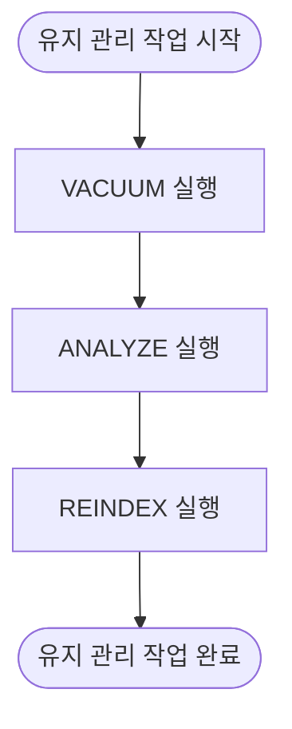

# PostgreSQL 최적화

<cite>
**이 문서에서 참조한 파일**   
- [postgres_impl.py](file://lightrag/kg/postgres_impl.py)
- [lightrag.py](file://lightrag/lightrag.py)
</cite>

## 목차
1. [소개](#소개)
2. [벡터 인덱스 생성 및 파라미터 설정](#벡터-인덱스-생성-및-파라미터-설정)
3. [대규모 데이터 삽입 시 트랜잭션 및 병렬 처리 전략](#대규모-데이터-삽입-시-트랜잭션-및-병렬-처리-전략)
4. [쿼리 성능 향상을 위한 유지 관리 작업](#쿼리-성능-향상을-위한-유지-관리-작업)
5. [LightRAG 통합 시 연결 풀링 및 타임아웃 설정](#lightrag-통합-시-연결-풀링-및-타임아웃-설정)
6. [코사인 유사도 기반 검색에서 임계값 최적화](#코사인-유사도-기반-검색에서-임계값-최적화)

## 소개
이 문서는 PostgreSQL 기반 벡터 저장소의 성능 최적화 전략을 상세히 설명합니다. LightRAG 프레임워크 내에서 `PostgresImpl` 클래스가 pgvector 확장을 활용하여 벡터 인덱스를 생성하고, `vector_db_storage_cls_kwargs`를 통해 인덱스 파라미터를 설정하는 방법을 코드 수준에서 분석합니다. 또한 대규모 벡터 데이터 삽입 시의 트랜잭션 관리, 병렬 처리 전략, 쿼리 성능 향상을 위한 유지 관리 작업, LightRAG와의 통합 시 연결 풀링 및 타임아웃 설정, 그리고 cosine_similarity 기반 검색에서의 cosine_threshold 최적값 도출 방법을 안내합니다.

**Section sources**
- [postgres_impl.py](file://lightrag/kg/postgres_impl.py#L0-L4670)

## 벡터 인덱스 생성 및 파라미터 설정
`PostgreSQLDB` 클래스는 PostgreSQL 데이터베이스 연결을 관리하며, pgvector 확장을 통해 벡터 인덱스를 생성합니다. 벡터 인덱스 유형은 `vector_index_type` 설정을 통해 HNSW 또는 IVFFlat 중 선택할 수 있습니다. 각 인덱스 유형에 대한 파라미터는 환경 변수 또는 설정 파일을 통해 구성됩니다.

HNSW 인덱스는 `hnsw_m`과 `hnsw_ef` 파라미터를 사용하여 생성되며, 이는 각각 그래프의 평균 연결 수와 탐색 효율성을 제어합니다. IVFFlat 인덱스는 `ivfflat_lists` 파라미터를 사용하여 클러스터 수를 설정합니다. 이러한 파라미터는 `ClientManager.get_config()` 메서드를 통해 환경 변수 또는 설정 파일에서 읽어옵니다.

**Diagram sources**
- [postgres_impl.py](file://lightrag/kg/postgres_impl.py#L48-L83)
- [postgres_impl.py](file://lightrag/kg/postgres_impl.py#L1309-L1377)

**Section sources**
- [postgres_impl.py](file://lightrag/kg/postgres_impl.py#L48-L83)
- [postgres_impl.py](file://lightrag/kg/postgres_impl.py#L1309-L1377)

## 대규모 데이터 삽입 시 트랜잭션 및 병렬 처리 전략
대규모 벡터 데이터 삽입 시, `PGVectorStorage` 클래스는 배치 처리를 통해 성능을 최적화합니다. `upsert` 메서드는 데이터를 배치로 나누어 병렬로 임베딩을 생성하고, 각 배치를 순차적으로 데이터베이스에 삽입합니다. 이 과정에서 `embedding_batch_num` 설정을 통해 배치 크기를 제어할 수 있습니다.

트랜잭션 관리는 `asyncpg`의 연결 풀을 통해 자동으로 처리되며, `max_connections` 설정을 통해 최대 연결 수를 제어합니다. 이를 통해 데이터베이스 리소스를 효율적으로 사용하고, 동시 삽입 작업 간의 충돌을 방지합니다.

**Diagram sources**
- [postgres_impl.py](file://lightrag/kg/postgres_impl.py#L1858-L2225)

**Section sources**
- [postgres_impl.py](file://lightrag/kg/postgres_impl.py#L1858-L2225)

## 쿼리 성능 향상을 위한 유지 관리 작업
쿼리 성능을 향상시키기 위해, 주기적인 유지 관리 작업이 필요합니다. `vacuum` 명령어는 삭제된 튜플의 공간을 회수하고, `analyze` 명령어는 테이블 통계를 업데이트하여 쿼리 계획을 최적화합니다. 인덱스 재구축은 `REINDEX` 명령어를 통해 수행되며, 인덱스가 손상되었거나 성능이 저하된 경우에 유용합니다.

`PostgreSQLDB` 클래스는 `_migrate_timestamp_columns`, `_migrate_field_lengths` 등의 메서드를 통해 데이터 마이그레이션과 스키마 업데이트를 자동으로 처리합니다. 이러한 작업은 데이터베이스 초기화 시에 수행되며, 성능과 호환성을 보장합니다.

**Diagram sources**
- [postgres_impl.py](file://lightrag/kg/postgres_impl.py#L1375-L1412)

**Section sources**
- [postgres_impl.py](file://lightrag/kg/postgres_impl.py#L1375-L1412)

## LightRAG 통합 시 연결 풀링 및 타임아웃 설정
LightRAG과의 통합 시, 연결 풀링은 `ClientManager` 클래스를 통해 관리됩니다. `get_client()` 메서드는 연결을 획득하고, `release_client()` 메서드는 연결을 반환합니다. 이는 연결을 재사용하여 오버헤드를 줄이고, 성능을 향상시킵니다.

타임아웃 설정은 `config.ini` 파일 또는 환경 변수를 통해 구성할 수 있습니다. `timeout` 설정은 쿼리 실행 시간을 제한하며, `connection_timeout`은 연결 시도 시간을 제한합니다. 이러한 설정은 시스템의 안정성을 보장하고, 장시간 실행되는 쿼리로 인한 문제를 방지합니다.

**Section sources**
- [postgres_impl.py](file://lightrag/kg/postgres_impl.py#L1375-L1412)

## 코사인 유사도 기반 검색에서 임계값 최적화
코사인 유사도 기반 검색에서 `cosine_threshold`는 검색 결과의 정확도와 성능 사이의 균형을 결정합니다. `PGVectorStorage` 클래스는 `vector_db_storage_cls_kwargs`에서 `cosine_better_than_threshold` 값을 읽어, 쿼리 시 `closer_than_threshold` 파라미터로 사용합니다. 이 값은 1에서 `cosine_better_than_threshold`를 뺀 값으로, 유사도가 이보다