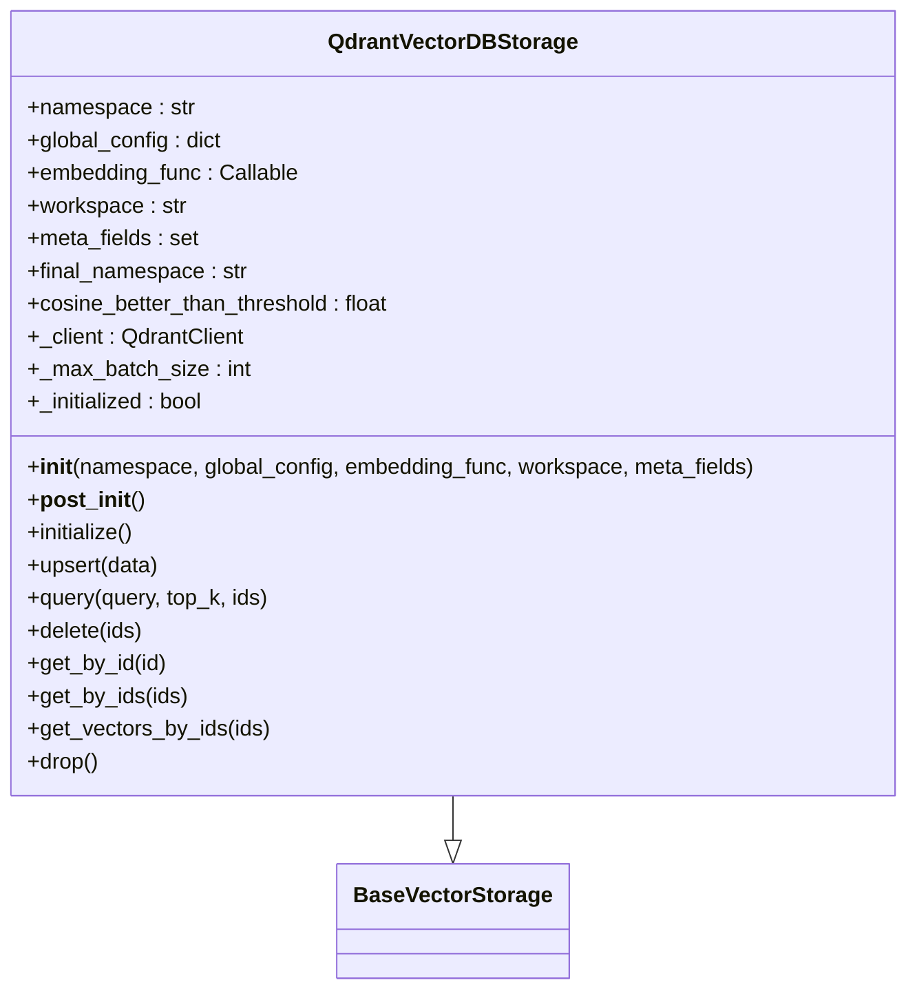

# Qdrant 최적화

<cite>
**이 문서에서 참조된 파일**  
- [qdrant_impl.py](file://lightrag/kg/qdrant_impl.py)
- [values.yaml](file://k8s-deploy/databases/qdrant/values.yaml)
- [lightrag.py](file://lightrag/lightrag.py)
</cite>

## 목차
1. [소개](#소개)
2. [QdrantImpl 클래스의 벡터 인덱스 구성 옵션](#qdrantimpl-클래스의-벡터-인덱스-구성-옵션)
3. [런타임 설정 및 파라미터 튜닝](#런타임-설정-및-파라미터-튜닝)
4. [고차원 벡터에서의 검색 정확도와 속도 간 균형](#고차원-벡터에서의-검색-정확도와-속도-간-균형)
5. [배치 삽입 및 필터링 기능](#배치-삽입-및-필터링-기능)
6. [LightRAG 통합 전략](#lightrag-통합-전략)
7. [메모리 및 디스크 설정 최적화](#메모리-및-디스크-설정-최적화)
8. [gRPC 성능 고려사항](#grpc-성능-고려사항)
9. [결론](#결론)

## 소개
Qdrant는 고성능 벡터 검색 엔진으로, LightRAG와의 통합을 통해 대규모 지식 기반 시스템에서 빠르고 정확한 검색을 가능하게 합니다. 본 문서는 Qdrant 벡터 저장소의 성능 최적화 방법을 상세히 설명하며, QdrantImpl 클래스에서 제공하는 벡터 인덱스 구성 옵션과 런타임 설정을 코드 수준에서 분석합니다. 또한, 고차원 벡터에서의 검색 정확도와 속도 간의 균형을 맞추기 위한 파라미터 튜닝 가이드를 제공하고, Qdrant의 배치 삽입 및 필터링 기능을 활용한 LightRAG 통합 전략을 설명합니다.

## QdrantImpl 클래스의 벡터 인덱스 구성 옵션
QdrantImpl 클래스는 Qdrant 벡터 저장소를 위한 핵심 구성 요소로, HNSW(Hierarchical Navigable Small World) 및 양자화(quantization)와 같은 다양한 벡터 인덱스 구성 옵션을 제공합니다. 이 클래스는 `BaseVectorStorage`를 상속받아 벡터 저장소의 기본 기능을 구현하며, `__post_init__` 메서드를 통해 초기화 과정에서 다양한 설정을 적용합니다.



**다이어그램 출처**
- [qdrant_impl.py](file://lightrag/kg/qdrant_impl.py#L76-L103)

**섹션 출처**
- [qdrant_impl.py](file://lightrag/kg/qdrant_impl.py#L76-L103)

## 런타임 설정 및 파라미터 튜닝
QdrantImpl 클래스는 `vector_db_storage_cls_kwargs`를 통해 런타임에 다양한 설정을 전달할 수 있습니다. 이 설정은 `global_config`에서 가져오며, `cosine_better_than_threshold`와 같은 중요한 파라미터를 포함합니다. 이 파라미터는 코사인 유사도 기반 검색에서 결과의 품질을 보장하기 위해 사용됩니다.

```python
kwargs = self.global_config.get("vector_db_storage_cls_kwargs", {})
cosine_threshold = kwargs.get("cosine_better_than_threshold")
if cosine_threshold is None:
    raise ValueError(
        "cosine_better_than_threshold must be specified in vector_db_storage_cls_kwargs"
    )
self.cosine_better_than_threshold = cosine_threshold
```

이 설정은 `initialize` 메서드에서 Qdrant 클라이언트를 생성할 때 사용되며, 벡터 인덱스의 초기화 과정에서 중요한 역할을 합니다.

**섹션 출처**
- [qdrant_impl.py](file://lightrag/kg/qdrant_impl.py#L101-L132)

## 고차원 벡터에서의 검색 정확도와 속도 간 균형
고차원 벡터에서의 검색 정확도와 속도 간의 균형을 맞추기 위해서는 HNSW 인덱스의 파라미터를 조정하는 것이 중요합니다. Qdrant는 `m`, `ef_construct`, `full_scan_threshold` 등의 파라미터를 통해 검색 성능을 조정할 수 있습니다.

- `m`: HNSW 그래프에서 각 노드의 연결 수를 결정합니다. 높은 값은 더 나은 검색 정확도를 제공하지만, 메모리 사용량이 증가합니다.
- `ef_construct`: 인덱스 생성 시 탐색하는 최근접 이웃의 수를 결정합니다. 높은 값은 더 나은 인덱스를 생성하지만, 인덱싱 시간이 증가합니다.
- `full_scan_threshold`: 전체 스캔을 수행할 임계값을 결정합니다. 낮은 값은 작은 데이터셋에서 전체 스캔을 수행하여 검색 속도를 향상시킵니다.

이러한 파라미터는 `vector_db_storage_cls_kwargs`를 통해 런타임에 전달할 수 있으며, 애플리케이션의 요구사항에 따라 최적화할 수 있습니다.

**섹션 출처**
- [qdrant_impl.py](file://lightrag/kg/qdrant_impl.py#L101-L132)

## 배치 삽입 및 필터링 기능
QdrantImpl 클래스는 배치 삽입 및 필터링 기능을 통해 대량의 벡터 데이터를 효율적으로 처리할 수 있습니다. `upsert` 메서드는 데이터를 배치로 나누어 임베딩을 생성하고, Qdrant 클라이언트를 통해 벡터를 삽입합니다.

```python
async def upsert(self, data: dict[str, dict[str, Any]]) -> None:
    logger.debug(f"[{self.workspace}] Inserting {len(data)} to {self.namespace}")
    if not data:
        return

    import time

    current_time = int(time.time())

    list_data = [
        {
            "id": k,
            "created_at": current_time,
            **{k1: v1 for k1, v1 in v.items() if k1 in self.meta_fields},
        }
        for k, v in data.items()
    ]
    contents = [v["content"] for v in data.values()]
    batches = [
        contents[i : i + self._max_batch_size]
        for i in range(0, len(contents), self._max_batch_size)
    ]

    embedding_tasks = [self.embedding_func(batch) for batch in batches]
    embeddings_list = await asyncio.gather(*embedding_tasks)

    embeddings = np.concatenate(embeddings_list)

    list_points = []
    for i, d in enumerate(list_data):
        list_points.append(
            models.PointStruct(
                id=compute_mdhash_id_for_qdrant(d["id"]),
                vector=embeddings[i],
                payload=d,
            )
        )

    results = self._client.upsert(
        collection_name=self.final_namespace, points=list_points, wait=True
    )
    return results
```

이 메서드는 데이터를 배치로 나누어 비동기적으로 임베딩을 생성하고, Qdrant 클라이언트를 통해 벡터를 삽입합니다. 이는 대량의 데이터를 처리할 때 성능을 크게 향상시킵니다.

**섹션 출처**
- [qdrant_impl.py](file://lightrag/kg/qdrant_impl.py#L160-L203)

## LightRAG 통합 전략
LightRAG와 Qdrant의 통합은 `vector_db_storage_cls_kwargs`를 통해 다양한 설정을 전달할 수 있으며, 이를 통해 애플리케이션의 요구사항에 맞게 Qdrant를 최적화할 수 있습니다. 예를 들어, `cosine_better_than_threshold`를 설정하여 검색 결과의 품질을 보장할 수 있으며, `m`, `ef_construct`, `full_scan_threshold` 등의 파라미터를 조정하여 검색 성능을 최적화할 수 있습니다.

또한, Qdrant의 배치 삽입 및 필터링 기능을 활용하여 대량의 벡터 데이터를 효율적으로 처리할 수 있습니다. 이는 LightRAG의 성능을 크게 향상시킬 수 있습니다.

**섹션 출처**
- [qdrant_impl.py](file://lightrag/kg/qdrant_impl.py#L160-L203)

## 메모리 및 디스크 설정 최적화
Qdrant의 메모리 및 디스크 설정은 성능에 큰 영향을 미칩니다. `values.yaml` 파일을 통해 Qdrant의 리소스 할당을 조정할 수 있습니다.

```yaml
## description: The version of Qdrant.
## default: 1.10.0
version: 1.10.0

## description: The number of replicas.
## default: 1
## minimum: 1
## maximum: 16
replicas: 1

## description: CPU cores.
## default: 1
## minimum: 0.5
## maximum: 64
cpu: 1

## description: Memory, the unit is Gi.
## default: 2
## minimum: 0.5
## maximum: 1000
memory: 1

## description: Storage size, the unit is Gi.
## default: 20
## minimum: 1
## maximum: 10000
storage: 20

## customized default values to override kblib chart's values
extra:
  terminationPolicy: Delete
```

이 설정은 Qdrant의 성능을 최적화하기 위해 중요한 역할을 합니다. 예를 들어, 메모리와 스토리지 크기를 증가시키면 더 많은 데이터를 처리할 수 있으며, CPU 코어 수를 증가시키면 처리 속도를 향상시킬 수 있습니다.

**섹션 출처**
- [values.yaml](file://k8s-deploy/databases/qdrant/values.yaml#L0-L30)

## gRPC 성능 고려사항
Qdrant는 gRPC를 통해 클라이언트와 통신하며, 이는 높은 성능과 낮은 지연 시간을 제공합니다. 그러나 gRPC 성능을 최적화하기 위해서는 몇 가지 고려사항이 있습니다.

- **연결 풀링**: gRPC 연결을 재사용하여 연결 생성 오버헤드를 줄일 수 있습니다.
- **스트리밍**: 대량의 데이터를 전송할 때 스트리밍을 사용하여 메모리 사용량을 줄일 수 있습니다.
- **압축**: gRPC 메시지를 압축하여 네트워크 대역폭을 절약할 수 있습니다.

이러한 고려사항을 통해 Qdrant와 LightRAG 간의 통신 성능을 최적화할 수 있습니다.

**섹션 출처**
- [qdrant_impl.py](file://lightrag/kg/qdrant_impl.py#L131-L166)

## 결론
Qdrant는 고성능 벡터 검색 엔진으로, LightRAG와의 통합을 통해 대규모 지식 기반 시스템에서 빠르고 정확한 검색을 가능하게 합니다. 본 문서는 Qdrant 벡터 저장소의 성능 최적화 방법을 상세히 설명하며, QdrantImpl 클래스에서 제공하는 벡터 인덱스 구성 옵션과 런타임 설정을 코드 수준에서 분석했습니다. 또한, 고차원 벡터에서의 검색 정확도와 속도 간의 균형을 맞추기 위한 파라미터 튜닝 가이드를 제공하고, Qdrant의 배치 삽입 및 필터링 기능을 활용한 LightRAG 통합 전략을 설명했습니다. 마지막으로, 메모리 및 디스크 설정 최적화와 gRPC 성능 고려사항을 통해 Qdrant의 성능을 최적화하는 방법을 제시했습니다.