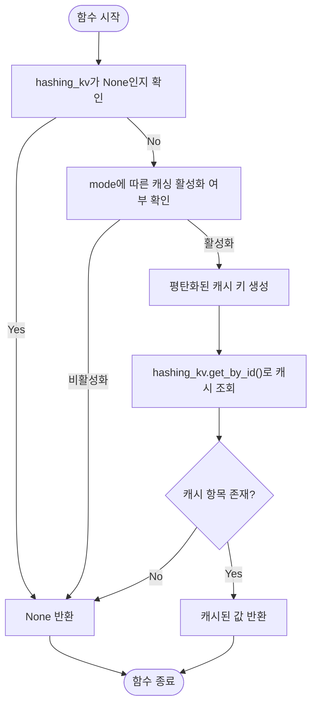

# 임베딩 캐싱

<cite>
**이 문서에서 참조한 파일**   
- [lightrag.py](file://lightrag/lightrag.py)
- [utils.py](file://lightrag/utils.py)
</cite>

## 목차
1. [임베딩 캐싱 전략 개요](#임베딩-캐싱-전략-개요)
2. [embedding_cache_config 설정 분석](#embedding_cache_config-설정-분석)
3. [handle_cache 함수의 캐시 검사 흐름](#handle_cache-함수의-캐시-검사-흐름)
4. [유사도 기반 캐시 검색 메커니즘](#유사도-기반-캐시-검색-메커니즘)
5. [입력 정규화 전략](#입력-정규화-전략)

## 임베딩 캐싱 전략 개요

LightRAG은 반복적인 임베딩 계산을 방지하고 성능을 향상시키기 위해 임베딩 캐싱 전략을 구현하고 있습니다. 이 전략은 `lightrag.py`의 `embedding_cache_config` 설정과 `utils.py`의 `handle_cache` 함수를 중심으로 동작하며, 유사도 기반 검색과 LLM 검증을 통해 정확성과 성능 간의 균형을 조절합니다. 캐싱은 동일한 텍스트 청크에 대한 중복된 임베딩 계산을 방지하고, 입력 정규화를 통해 캐시 적중률을 높이는 데 중점을 둡니다.

**Section sources**
- [lightrag.py](file://lightrag/lightrag.py#L180-L250)
- [utils.py](file://lightrag/utils.py#L768-L850)

## embedding_cache_config 설정 분석

`lightrag.py` 파일의 `LightRAG` 클래스 내부에 정의된 `embedding_cache_config` 설정은 임베딩 캐싱의 동작 방식을 제어하는 핵심 구성 요소입니다. 이 설정은 세 가지 주요 매개변수를 포함하고 있으며, 이들은 정확성과 성능 사이의 균형을 조절하는 데 사용됩니다.

- **enabled**: 이 부울 값이 `True`로 설정되면 캐싱 기능이 활성화되어 동일한 입력에 대한 임베딩 계산을 캐시에서 재사용함으로써 계산 비용을 절감합니다. `False`인 경우 캐싱이 비활성화되어 모든 임베딩 요청이 실제 계산을 거칩니다.
- **similarity_threshold**: 이 매개변수는 캐시 검색 시 유사도 기반 검색의 기준이 되는 최소 유사도 점수를 정의합니다. 기본값은 0.95이며, 입력 텍스트와 캐시된 텍스트 간의 코사인 유사도가 이 임계값 이상일 경우에만 캐시 항목을 사용합니다. 높은 임계값은 정확성을 높이지만 캐시 적중률을 낮출 수 있으며, 낮은 임계값은 성능을 향상시키지만 정확성이 저하될 수 있습니다.
- **use_llm_check**: 이 부울 값이 `True`로 설정되면, 유사도 기반 검색을 통해 찾은 캐시된 임베딩에 대해 추가적인 LLM 검증을 수행합니다. 이는 캐시된 결과의 정확성을 보장하기 위한 보안 장치로, 유사한 텍스트라도 의미적으로 중요한 차이가 있을 수 있는 경우에 유용합니다. 그러나 이 기능은 추가적인 LLM 호출을 필요로 하므로 성능에 부담을 줄 수 있습니다.

이러한 설정들은 사용자가 특정 사용 사례에 맞게 정확성과 성능 사이의 트레이드오프를 조정할 수 있도록 합니다.

**Section sources**
- [lightrag.py](file://lightrag/lightrag.py#L180-L250)

## handle_cache 함수의 캐시 검사 흐름

`utils.py` 파일의 `handle_cache` 함수는 임베딩 함수 호출 시 캐시를 검사하는 핵심 흐름을 담당합니다. 이 함수는 캐싱이 활성화되어 있는지 확인하고, 캐시 키를 생성한 후 캐시 저장소에서 해당 키에 대한 항목을 조회합니다.

함수는 먼저 `hashing_kv` (캐시 저장소)가 `None`인지 확인하여 캐싱이 설정되어 있는지 검사합니다. 이후 `mode` 파라미터를 기반으로 LLM 캐싱이 활성화되어 있는지 확인합니다. 예를 들어, `mode`가 "default"가 아닌 경우 `enable_llm_cache` 설정을 확인하고, "default"인 경우 `enable_llm_cache_for_entity_extract` 설정을 확인합니다. 이러한 조건 검사를 통과하면, `generate_cache_key` 함수를 사용하여 `{mode}:{cache_type}:{hash}` 형식의 평탄화된 캐시 키를 생성합니다. 이 키를 사용해 `hashing_kv.get_by_id()` 메서드를 호출하여 캐시 저장소에서 항목을 조회합니다. 조회 결과가 존재하면 캐시 적중(cache hit)으로 간주하고 캐시된 값을 반환하며, 존재하지 않으면 캐시 미스(cache miss)로 간주하여 `None`을 반환하여 실제 임베딩 계산이 수행되도록 합니다.

**Diagram sources **
- [utils.py](file://lightrag/utils.py#L768-L850)

**Section sources**
- [utils.py](file://lightrag/utils.py#L768-L850)

## 유사도 기반 캐시 검색 메커니즘

LightRAG의 유사도 기반 캐시 검색은 `utils.py` 파일에 정의된 `cosine_similarity` 함수를 활용하여 구현됩니다. 이 함수는 두 벡터 간의 코사인 유사도를 계산하며, 이는 두 벡터의 방향이 얼마나 유사한지를 나타내는 지표입니다. 계산은 두 벡터의 내적을 각각의 노름(L2 norm)의 곱으로 나누는 방식으로 수행됩니다.

중복 임베딩 계산을 방지하는 메커니즘은 다음과 같습니다. 새로운 텍스트 청크가 입력되면, 시스템은 먼저 해당 텍스트의 임베딩을 계산합니다. 그 다음, 이 임베딩을 캐시 저장소에 저장된 모든 임베딩과 `cosine_similarity` 함수를 사용하여 유사도를 계산합니다. 계산된 유사도 점수가 `embedding_cache_config`의 `similarity_threshold`보다 높은 캐시 항목이 존재하면, 시스템은 새로운 계산을 수행하지 않고 해당 캐시된 임베딩을 재사용합니다. 이 과정은 `handle_cache` 함수의 흐름과 결합되어, 캐시 키 기반 검색이 실패하더라도 유사도 기반 검색을 통해 캐시 적중을 시도할 수 있는 이중 검사 구조를 형성합니다. 이는 정확한 문자열 일치가 아닌 의미적 유사성에 기반한 캐싱을 가능하게 하여, 캐시 적중률을 크게 향상시킵니다.

**Section sources**
- [utils.py](file://lightrag/utils.py#L768-L814)

## 입력 정규화 전략

캐시 적중률을 높이기 위한 입력 정규화 전략은 `utils.py` 파일의 `clean_str` 함수를 중심으로 이루어집니다. 이 함수는 입력 문자열을 정제하여, 의미적으로 동일하지만 표면적인 형식이 다른 입력들이 동일한 캐시 키를 생성하도록 합니다.

주요 정규화 작업은 다음과 같습니다. 먼저, HTML 엔티티(예: `&amp;`, `&lt;`)를 해당 문자로 변환합니다. 다음으로, 문자열의 앞뒤 공백을 제거합니다. 마지막으로, 제어 문자(ASCII 범위 0x00-0x1F 및 0x7F-0x9F)를 모두 제거합니다. 이러한 정규화를 통해, 예를 들어 "  Hello World  "와 "Hello World" 또는 "Hello&amp;World"와 "Hello&World"와 같은 다양한 입력이 동일한 정제된 문자열로 변환됩니다. 이 정제된 문자열은 `compute_mdhash_id` 함수를 통해 해시 키로 변환되며, 결국 동일한 캐시 항목을 조회하게 됩니다. 이 전략은 사용자 입력의 불일치나 다양한 형식의 데이터 소스로부터 발생하는 미세한 차이를 무시함으로써, 캐시 시스템의 효율성을 극대화합니다.

**Section sources**
- [utils.py](file://lightrag/utils.py#L733-L767)