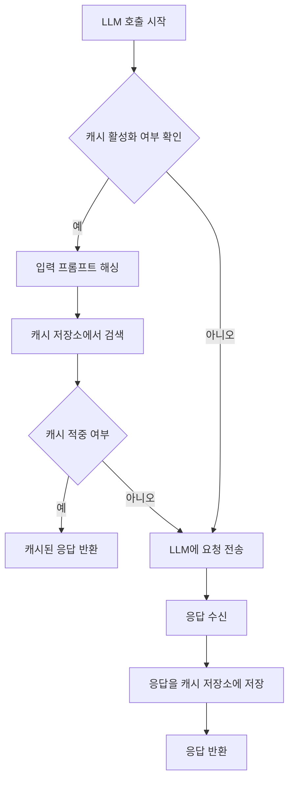
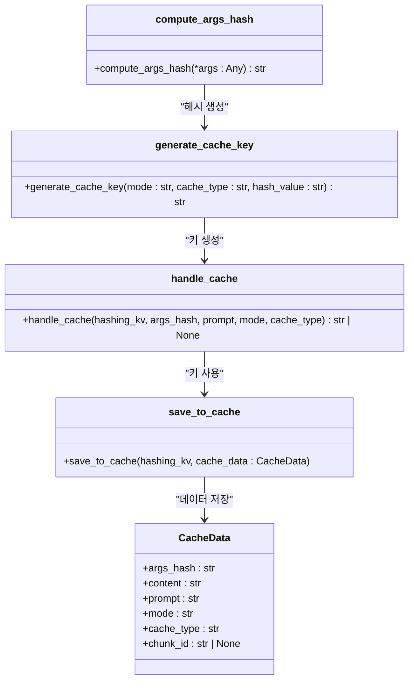
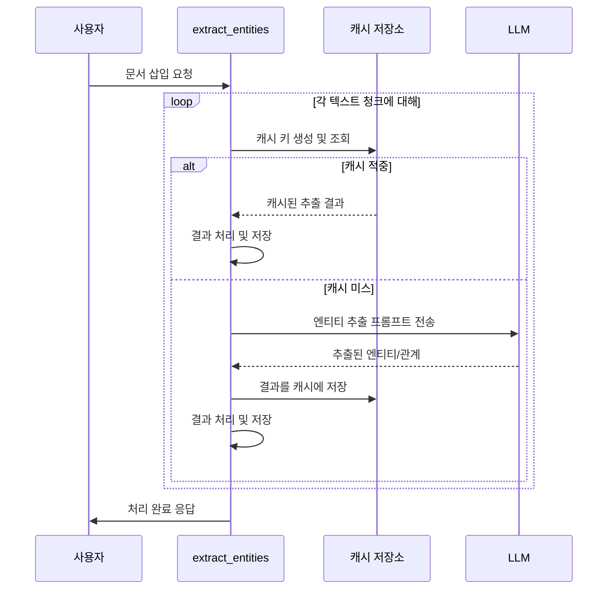

# 캐싱 전략

<cite>
**이 문서에서 참조된 파일**
- [lightrag.py](file://lightrag/lightrag.py)
- [utils.py](file://lightrag/utils.py)
- [operate.py](file://lightrag/operate.py)
</cite>

## 목차
1. [소개](#소개)
2. [LLM 및 임베딩 캐시 설정 분석](#llm-및-임베딩-캐시-설정-분석)
3. [캐시 키 생성 및 검색 로직](#캐시-키-생성-및-검색-로직)
4. [해시 알고리즘과 캐시 적중률](#해시-알고리즘과-캐시-적중률)
5. [정확성과 성능 간 균형 조정](#정확성과-성능-간-균형-조정)
6. [엔티티 추출 성능에 미치는 캐싱의 영향](#엔티티-추출-성능에-미치는-캐싱의-영향)
7. [캐시 무효화 및 메모리 최적화](#캐시-무효화-및-메모리-최적화)
8. [결론](#결론)

## 소개
LightRAG는 검색 증강 생성(RAG) 시스템에서 반복적인 LLM 호출과 임베딩 계산을 방지하기 위해 정교한 캐싱 메커니즘을 구현하고 있습니다. 이 문서는 `lightrag.py`, `utils.py`, `operate.py` 파일에 구현된 캐싱 아키텍처를 심층적으로 분석하고, 성능 최적화 전략을 제시합니다. 특히, LLM 응답과 임베딩 계산의 효율성을 극대화하는 설정과 로직에 초점을 맞춥니다.

## LLM 및 임베딩 캐시 설정 분석
LightRAG은 LLM 응답과 임베딩 계산의 두 가지 핵심 작업에 대해 별도의 캐시 설정을 제공합니다. 이러한 설정은 초기화 시점에 구성되며, 시스템의 성능과 비용에 직접적인 영향을 미칩니다.

### LLM 응답 캐싱
`lightrag.py` 파일에서 `enable_llm_cache` 및 `enable_llm_cache_for_entity_extract` 설정을 통해 LLM 응답 캐싱을 제어합니다. `enable_llm_cache`는 일반적인 쿼리에 대한 캐싱을 활성화하며, `enable_llm_cache_for_entity_extract`는 엔티티 추출과 같은 특정 작업에 대해서만 캐싱을 허용합니다. 이 분리된 설정은 중요한 비용 최적화 수단입니다. 엔티티 추출은 문서 처리 파이프라인에서 가장 자주 발생하는 LLM 호출이며, 동일한 텍스트 청크에 대해 반복적으로 호출될 수 있습니다. 이 설정을 활성화하면 동일한 입력에 대한 LLM 요금을 완전히 제거할 수 있습니다.

**Diagram sources**
- [lightrag.py](file://lightrag/lightrag.py#L270-L275)
- [utils.py](file://lightrag/utils.py#L779-L805)

**Section sources**
- [lightrag.py](file://lightrag/lightrag.py#L270-L275)
- [utils.py](file://lightrag/utils.py#L779-L805)

### 임베딩 계산 캐싱
임베딩 계산은 계산 비용이 매우 높은 작업입니다. `embedding_cache_config` 설정은 이 작업에 대한 캐싱을 관리합니다. 이 설정은 `enabled`, `similarity_threshold`, `use_llm_check`의 세 가지 하위 설정을 포함합니다. `enabled` 플래그는 캐싱을 전반적으로 활성화하거나 비활성화합니다. `similarity_threshold`는 기존 캐시된 임베딩과의 유사도를 기준으로 캐시 적중 여부를 판단하는 임계값을 정의합니다. `use_llm_check`는 캐시된 응답의 정확성을 추가로 검증하기 위해 LLM을 사용할지 여부를 결정합니다. 이 설정은 정확성과 성능 사이의 중요한 트레이드오프를 나타냅니다.

**Section sources**
- [lightrag.py](file://lightrag/lightrag.py#L260-L275)

## 캐시 키 생성 및 검색 로직
효율적인 캐싱을 위해서는 일관되고 고유한 캐시 키 생성 메커니즘이 필수적입니다. LightRAG은 `utils.py` 파일에서 `compute_args_hash`, `generate_cache_key`, `handle_cache` 함수를 통해 이 과정을 구현합니다.

### 캐시 키 생성
`compute_args_hash` 함수는 주어진 인수를 기반으로 해시를 계산합니다. 이 함수는 모든 인수를 문자열로 변환한 후 연결하여 하나의 문자열을 생성하고, 이를 UTF-8로 인코딩하여 MD5 해시를 생성합니다. 이 해시는 캐시 키의 핵심 구성 요소입니다. `generate_cache_key` 함수는 이 해시 값을 `mode`, `cache_type`과 결합하여 최종적인 평탄화된(flattened) 캐시 키 `{mode}:{cache_type}:{hash}`를 생성합니다. 이 구조는 다양한 작업 모드와 캐시 유형을 명확하게 구분할 수 있게 해줍니다.

**Diagram sources**
- [utils.py](file://lightrag/utils.py#L266-L307)
- [utils.py](file://lightrag/utils.py#L809-L816)

**Section sources**
- [utils.py](file://lightrag/utils.py#L266-L307)
- [utils.py](file://lightrag/utils.py#L809-L816)

### 캐시 검색
`handle_cache` 함수는 캐시 검색의 핵심 로직을 담당합니다. 이 함수는 먼저 전역 설정을 확인하여 해당 작업에 대해 캐싱이 활성화되어 있는지 검사합니다. 그 다음, `generate_cache_key`를 사용하여 쿼리에 대한 평탄화된 캐시 키를 생성하고, `get_by_id` 메서드를 통해 캐시 저장소에서 해당 키를 조회합니다. 캐시 항목이 존재하면, 저장된 응답을 반환하고, 그렇지 않으면 `None`을 반환하여 LLM 호출이 필요함을 알립니다.

**Section sources**
- [utils.py](file://lightrag/utils.py#L779-L805)

## 해시 알고리즘과 캐시 적중률
`compute_args_hash` 함수의 구현은 캐시 적중률에 직접적인 영향을 미칩니다. 이 함수는 입력의 정확한 재현을 보장하기 위해 모든 인수를 문자열로 변환하고 연결하는 방식을 사용합니다. 이는 입력이 동일하면 항상 동일한 해시를 생성한다는 것을 의미하므로, 캐시 적중률을 극대화하는 데 효과적입니다. 그러나 이 방식은 입력의 순서나 형식에 매우 민감합니다. 예를 들어, 프롬프트의 단어 순서가 바뀌거나, 불필요한 공백이 추가되면 다른 해시가 생성되어 캐시 미스로 이어질 수 있습니다. 이는 정확한 캐싱을 보장하는 동시에, 입력의 일관성을 유지해야 한다는 과제를 제시합니다.

**Section sources**
- [utils.py](file://lightrag/utils.py#L266-L284)

## 정확성과 성능 간 균형 조정
`embedding_cache_config`의 `similarity_threshold`와 `use_llm_check` 설정은 정확성과 성능 사이의 균형을 맞추는 데 핵심적인 역할을 합니다.

### 유사도 임계값(similarity_threshold)
`similarity_threshold`는 캐시된 임베딩과 새로운 입력 간의 코사인 유사도가 이 값 이상일 경우에만 캐시를 사용하도록 합니다. 높은 임계값(예: 0.95)은 캐시 적중률을 낮출 수 있지만, 캐시된 응답의 정확성을 높입니다. 반면, 낮은 임계값은 캐시 적중률을 높여 성능을 개선하지만, 정확성이 낮은 응답을 반환할 위험이 있습니다. 이 값을 조정함으로써 사용자는 자신의 애플리케이션에 적합한 정확성-성능 트레이드오프를 선택할 수 있습니다.

### LLM 검증(use_llm_check)
`use_llm_check` 설정은 캐시된 응답의 정확성을 검증하기 위해 추가적인 LLM 호출을 수행합니다. 이는 가장 높은 수준의 정확성을 보장하지만, 캐싱의 주된 목적(비용 절감 및 성능 향상)을 부분적으로 상쇄합니다. 따라서 이 설정은 정확성이 절대적으로 중요한 고가치 쿼리에만 제한적으로 사용하는 것이 권장됩니다. 대부분의 경우, 적절한 `similarity_threshold`를 설정하는 것이 더 실용적인 균형을 제공합니다.

**Section sources**
- [lightrag.py](file://lightrag/lightrag.py#L260-L275)

## 엔티티 추출 성능에 미치는 캐싱의 영향
`operate.py` 파일의 `extract_entities` 함수는 캐싱이 엔티티 추출 성능에 미치는 영향을 보여주는 핵심 예제입니다. 이 함수는 문서를 텍스트 청크로 분할한 후, 각 청크에 대해 LLM을 호출하여 엔티티와 관계를 추출합니다. `enable_llm_cache_for_entity_extract`가 활성화된 경우, 동일한 청크에 대한 후속 호출은 캐시된 결과를 즉시 반환받아 LLM 호출을 완전히 피할 수 있습니다.

**Diagram sources**
- [operate.py](file://lightrag/operate.py#L1674-L1914)
- [utils.py](file://lightrag/utils.py#L1392-L1502)

**Section sources**
- [operate.py](file://lightrag/operate.py#L1674-L1914)

## 캐시 무효화 및 메모리 사용량 최적화
효과적인 캐싱 전략에는 캐시 무효화와 메모리 관리도 포함되어야 합니다.

### 캐시 무효화
LightRAG은 명시적인 캐시 무효화 메커니즘을 제공합니다. `lightrag.py`의 `aclear_cache` 메서드는 `llm_response_cache` 저장소의 `drop` 메서드를 호출하여 모든 캐시된 데이터를 삭제합니다. 이는 데이터가 변경되었거나 캐시가 오염되었을 때 전체 캐시를 재설정해야 하는 경우에 유용합니다. 또한, `update_chunk_cache_list` 함수는 특정 텍스트 청크와 관련된 캐시 키를 추적함으로써,