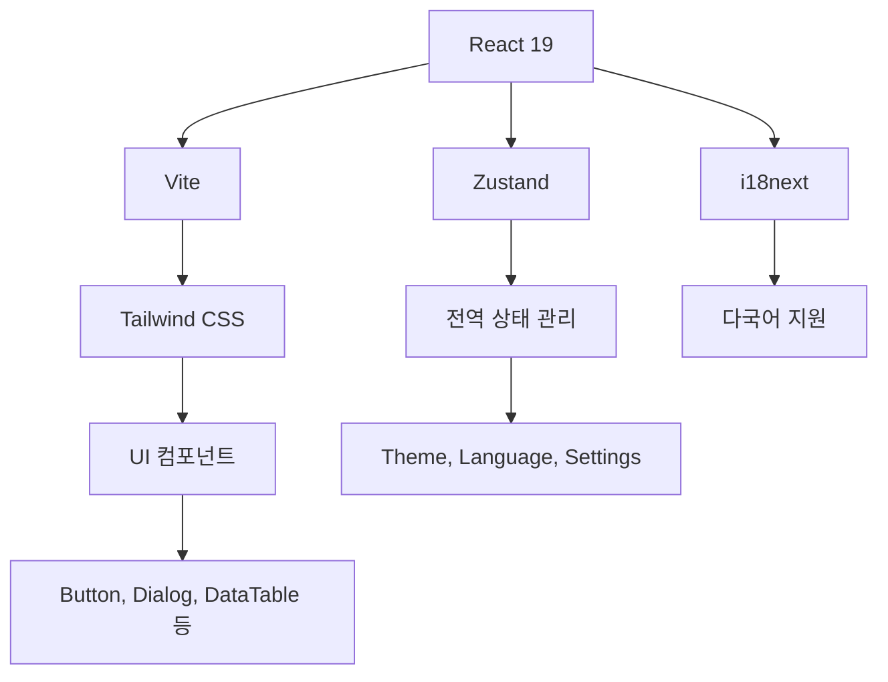
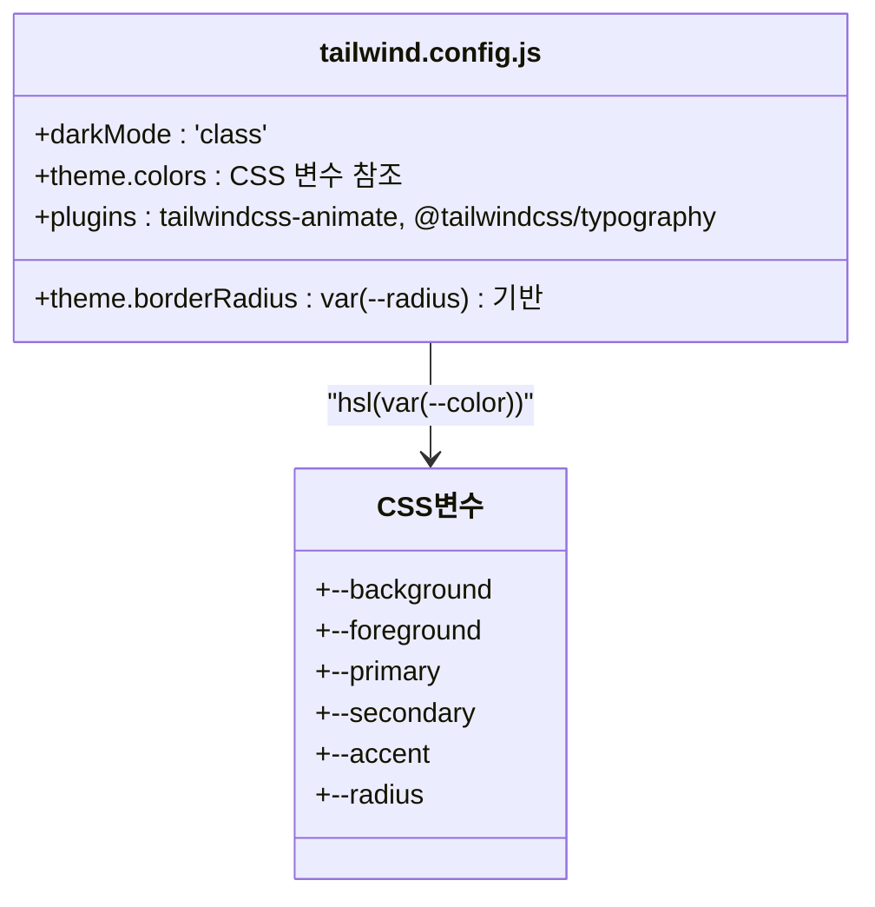
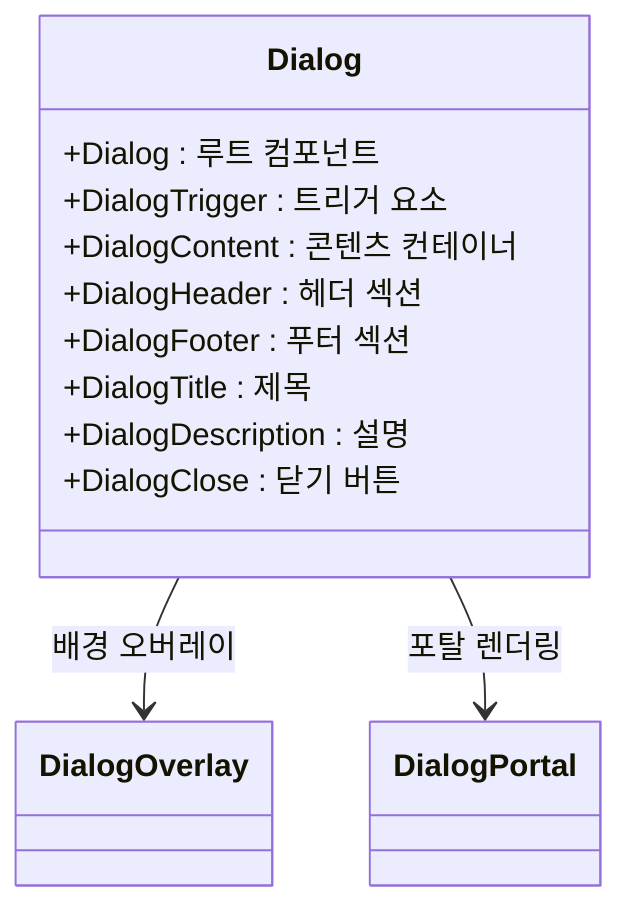
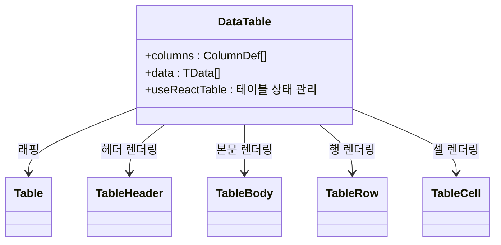
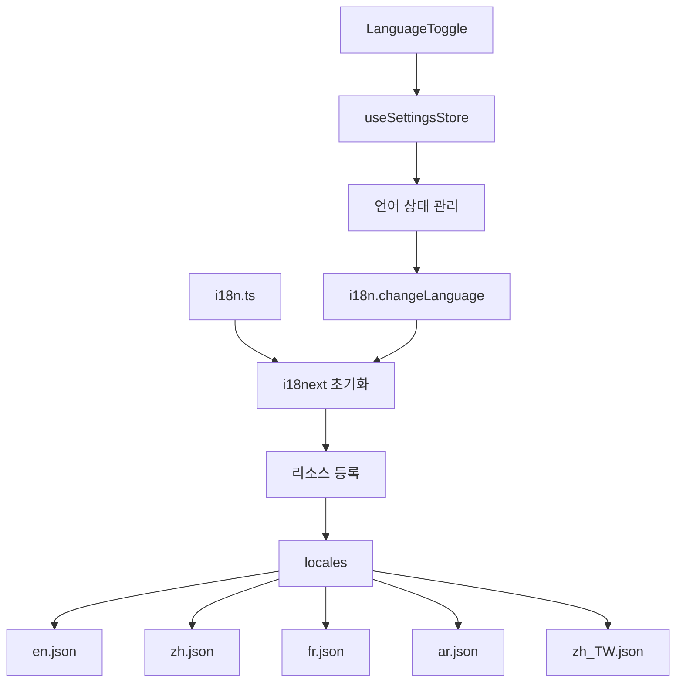
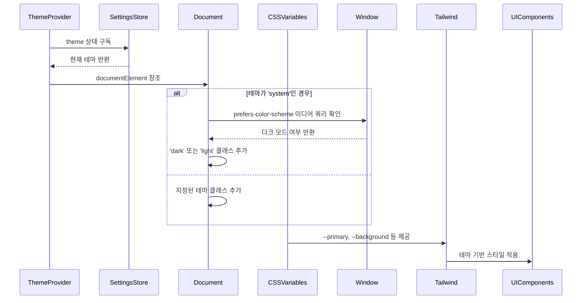
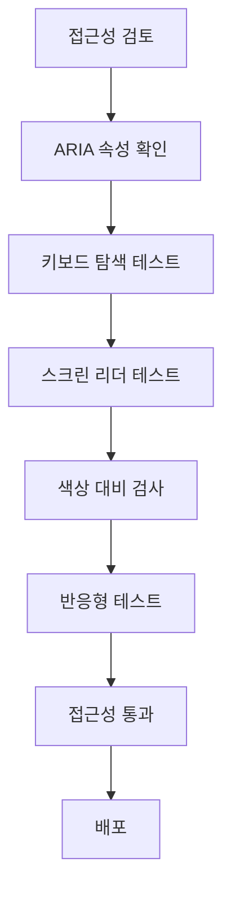
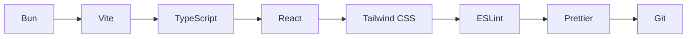
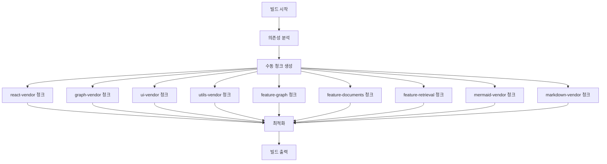

# UI 시스템 및 커스터마이징

<cite>
**이 문서에서 참조한 파일**  
- [Button.tsx](file://lightrag_webui/src/components/ui/Button.tsx)
- [Dialog.tsx](file://lightrag_webui/src/components/ui/Dialog.tsx)
- [DataTable.tsx](file://lightrag_webui/src/components/ui/DataTable.tsx)
- [Input.tsx](file://lightrag_webui/src/components/ui/Input.tsx)
- [LanguageToggle.tsx](file://lightrag_webui/src/components/LanguageToggle.tsx)
- [ThemeProvider.tsx](file://lightrag_webui/src/components/ThemeProvider.tsx)
- [tailwind.config.js](file://lightrag_webui/tailwind.config.js)
- [i18n.ts](file://lightrag_webui/src/i18n.ts)
- [vite.config.ts](file://lightrag_webui/vite.config.ts)
- [utils.ts](file://lightrag_webui/src/lib/utils.ts)
- [package.json](file://lightrag_webui/package.json)
- [locales/en.json](file://lightrag_webui/src/locales/en.json)
- [locales/zh.json](file://lightrag_webui/src/locales/zh.json)
- [locales/fr.json](file://lightrag_webui/src/locales/fr.json)
- [locales/ar.json](file://lightrag_webui/src/locales/ar.json)
- [locales/zh_TW.json](file://lightrag_webui/src/locales/zh_TW.json)
</cite>

## 목차
1. [소개](#소개)
2. [UI 아키텍처 개요](#ui-아키텍처-개요)
3. [디자인 시스템 구조](#디자인-시스템-구조)
4. [핵심 UI 컴포넌트](#핵심-ui-컴포넌트)
5. [다국어 지원 시스템](#다국어-지원-시스템)
6. [테마 및 다크 모드 관리](#테마-및-다크-모드-관리)
7. [접근성 및 반응형 디자인](#접근성-및-반응형-디자인)
8. [프론트엔드 개발 환경 및 빌드](#프론트엔드-개발-환경-및-빌드)
9. [결론](#결론)

## 소개
LightRAG WebUI는 React와 Tailwind CSS 기반의 현대적인 프론트엔드 아키텍처를 채택하여 일관성 있고 확장 가능한 UI 시스템을 제공합니다. 이 문서는 UI 아키텍처, 디자인 시스템, 다국어 및 테마 지원, 접근성 고려사항, 개발 환경 설정에 대한 포괄적인 가이드를 제공합니다.

## UI 아키텍처 개요
LightRAG WebUI는 구성 요소 기반 아키텍처를 사용하여 재사용성과 유지보수성을 극대화합니다. 주요 아키텍처 특징은 다음과 같습니다:
- **React 19 기반**: 최신 리액트 기능을 활용한 함수형 컴포넌트 아키텍처
- **Zustand 상태 관리**: 경량 상태 관리 라이브러리를 사용한 전역 상태 관리
- **Vite 기반 빌드 시스템**: 빠른 개발 서버와 효율적인 빌드 프로세스
- **모듈식 구성 요소 구조**: `src/components` 디렉터리 내의 기능별 구성 요소 그룹화



**Diagram sources**
- [vite.config.ts](file://lightrag_webui/vite.config.ts)
- [package.json](file://lightrag_webui/package.json)

**Section sources**
- [vite.config.ts](file://lightrag_webui/vite.config.ts)
- [package.json](file://lightrag_webui/package.json)

## 디자인 시스템 구조
LightRAG WebUI는 Tailwind CSS를 중심으로 일관된 디자인 시스템을 구축합니다. 디자인 시스템은 구성 요소, 테마, 유틸리티 함수로 구성됩니다.

### Tailwind CSS 구성
Tailwind 구성은 CSS 변수 기반의 테마 시스템과 확장 가능한 디자인 토큰을 제공합니다.



**Diagram sources**
- [tailwind.config.js](file://lightrag_webui/tailwind.config.js)

**Section sources**
- [tailwind.config.js](file://lightrag_webui/tailwind.config.js)

### 유틸리티 함수
공통 유틸리티 함수는 클래스 이름 조합과 상태 관리에 사용됩니다.

```mermaid
classDiagram
class utils.ts {
+cn(...inputs) : 클래스 이름 병합
+randomColor() : 랜덤 색상 생성
+throttle(fn, delay) : 함수 쓰로틀링
+createSelectors(store) : Zustand 선택기 생성
}
class class-variance-authority {
+cva() : 클래스 변형 정의
}
class tailwind-merge {
+twMerge() : 클래스 충돌 해결
}
utils.ts --> class-variance-authority
utils.ts --> tailwind-merge
```

**Diagram sources**
- [utils.ts](file://lightrag_webui/src/lib/utils.ts)

**Section sources**
- [utils.ts](file://lightrag_webui/src/lib/utils.ts)

## 핵심 UI 컴포넌트
핵심 UI 컴포넌트는 Radix UI를 기반으로 구축되어 접근성과 유연성을 제공합니다.

### Button 컴포넌트
버튼 컴포넌트는 다양한 변형과 크기 옵션을 제공하며, 툴팁 지원 기능을 포함합니다.

```mermaid
classDiagram
class Button {
+variant : default, destructive, outline, secondary, ghost, link
+size : default, sm, lg, icon
+asChild : 슬롯 사용 여부
+tooltip : 툴팁 텍스트
+side : 툴팁 위치
}
Button --> Tooltip : 조건부 렌더링
Button --> class-variance-authority : 스타일 변형
```

**Diagram sources**
- [Button.tsx](file://lightrag_webui/src/components/ui/Button.tsx)

**Section sources**
- [Button.tsx](file://lightrag_webui/src/components/ui/Button.tsx)

### Dialog 컴포넌트
다이얼로그 컴포넌트는 Radix UI 다이얼로그를 래핑하여 일관된 모달 경험을 제공합니다.



**Diagram sources**
- [Dialog.tsx](file://lightrag_webui/src/components/ui/Dialog.tsx)

**Section sources**
- [Dialog.tsx](file://lightrag_webui/src/components/ui/Dialog.tsx)

### DataTable 컴포넌트
데이터 테이블 컴포넌트는 TanStack React Table을 기반으로 동적 데이터 표시를 가능하게 합니다.



**Diagram sources**
- [DataTable.tsx](file://lightrag_webui/src/components/ui/DataTable.tsx)

**Section sources**
- [DataTable.tsx](file://lightrag_webui/src/components/ui/DataTable.tsx)

## 다국어 지원 시스템
LightRAG WebUI는 i18next를 사용하여 다국어 지원을 구현합니다.

### 다국어 아키텍처
다국어 시스템은 로케일 파일, i18next 구성, 상태 관리의 세 가지 주요 구성 요소로 이루어져 있습니다.



**Diagram sources**
- [i18n.ts](file://lightrag_webui/src/i18n.ts)
- [locales/en.json](file://lightrag_webui/src/locales/en.json)
- [locales/zh.json](file://lightrag_webui/src/locales/zh.json)
- [locales/fr.json](file://lightrag_webui/src/locales/fr.json)
- [locales/ar.json](file://lightrag_webui/src/locales/ar.json)
- [locales/zh_TW.json](file://lightrag_webui/src/locales/zh_TW.json)

**Section sources**
- [i18n.ts](file://lightrag_webui/src/i18n.ts)
- [LanguageToggle.tsx](file://lightrag_webui/src/components/LanguageToggle.tsx)

### 번역 추가 절차
새로운 언어를 추가하려면 다음 단계를 따르십시오:

1. `src/locales` 디렉터리에 새로운 JSON 파일 생성 (예: `es.json`)
2. 기존 언어 파일을 기반으로 번역 키 복사
3. 각 키에 대해 적절한 번역 제공
4. `i18n.ts` 파일에 새로운 언어 리소스 임포트 및 등록
5. `LanguageToggle` 컴포넌트에 새로운 언어 전환 로직 추가

## 테마 및 다크 모드 관리
LightRAG WebUI는 CSS 변수 기반의 유연한 테마 시스템을 제공합니다.

### ThemeProvider 아키텍처
테마 공급자는 시스템 설정, 사용자 설정, CSS 변수를 통합하여 테마를 관리합니다.



**Diagram sources**
- [ThemeProvider.tsx](file://lightrag_webui/src/components/ThemeProvider.tsx)
- [tailwind.config.js](file://lightrag_webui/tailwind.config.js)

**Section sources**
- [ThemeProvider.tsx](file://lightrag_webui/src/components/ThemeProvider.tsx)

### 테마 커스터마이징
CSS 변수를 통해 테마를 커스터마이징할 수 있습니다:

```css
:root {
  --background: 0 0% 100%;
  --foreground: 222.2 84% 4.9%;
  --primary: 262.1 83.3% 57.8%;
  --primary-foreground: 0 0% 98%;
  --accent: 12 65% 50%;
  --radius: 0.5rem;
}
```

기본 테마를 확장하거나, 새로운 CSS 변수를 정의하여 사용자 정의 테마를 생성할 수 있습니다.

## 접근성 및 반응형 디자인
LightRAG WebUI는 접근성과 반응형 디자인을 우선시하여 모든 사용자에게 최적의 경험을 제공합니다.

### 접근성 고려사항
- **ARIA 라벨**: 모든 인터랙티브 요소에 적절한 ARIA 속성 제공
- **키보드 네비게이션**: 탭 키를 사용한 전체 UI 탐색 지원
- **시각적 대체 텍스트**: 스크린 리더 사용자를 위한 sr-only 클래스
- **충분한 색상 대비**: WCAG 가이드라인 준수



**Section sources**
- [Button.tsx](file://lightrag_webui/src/components/ui/Button.tsx)
- [Dialog.tsx](file://lightrag_webui/src/components/ui/Dialog.tsx)
- [Input.tsx](file://lightrag_webui/src/components/ui/Input.tsx)

### 반응형 디자인 전략
- **모바일 우선 접근법**: 작은 화면부터 시작하여 점진적으로 확장
- **유연한 레이아웃**: Flexbox와 Grid를 활용한 유연한 레이아웃
- **반응형 유틸리티**: Tailwind의 반응형 접두사(sm, md, lg) 활용
- **터치 친화적 디자인**: 충분한 터치 타겟 크기 제공

## 프론트엔드 개발 환경 및 빌드
LightRAG WebUI는 현대적인 프론트엔드 개발 워크플로우를 제공합니다.

### 개발 환경 설정
Bun과 Vite를 사용하여 빠른 개발 환경을 구성합니다.



**Section sources**
- [vite.config.ts](file://lightrag_webui/vite.config.ts)
- [package.json](file://lightrag_webui/package.json)

### 빌드 프로세스
Vite 구성은 효율적인 빌드 출력을 위해 수동 청크를 정의합니다.



**Diagram sources**
- [vite.config.ts](file://lightrag_webui/vite.config.ts)

**Section sources**
- [vite.config.ts](file://lightrag_webui/vite.config.ts)

### 커스텀 컴포넌트 확장
새로운 UI 컴포넌트를 추가하려면 다음 구조를 따르십시오:

```
src/components/
└── ui/
    └── NewComponent.tsx
```

컴포넌트는 다음 가이드라인을 따라야 합니다:
- Radix UI 기반으로 구축
- Tailwind CSS 클래스 사용
- TypeScript로 타입 정의
- 접근성 고려
- 반응형 디자인 지원

## 결론
LightRAG WebUI는 React, Tailwind CSS, Vite를 기반으로 한 현대적인 프론트엔드 아키텍처를 제공합니다. 일관된 디자인 시스템, 다국어 지원, 테마 관리, 접근성 고려사항을 통해 확장 가능하고 유지보수하기 쉬운 UI를 구축할 수 있습니다. 이 문서는 핵심 구성 요소의 사용법과 커스터마이징 방법을 안내하여 개발자가 시스템을 효과적으로 활용할 수 있도록 돕습니다.