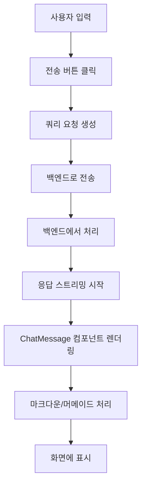
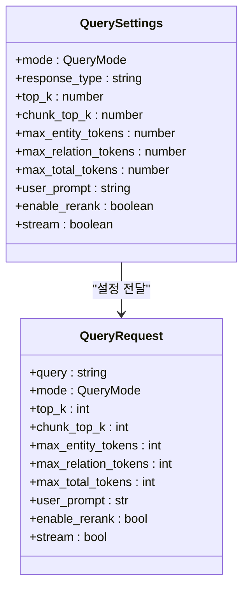
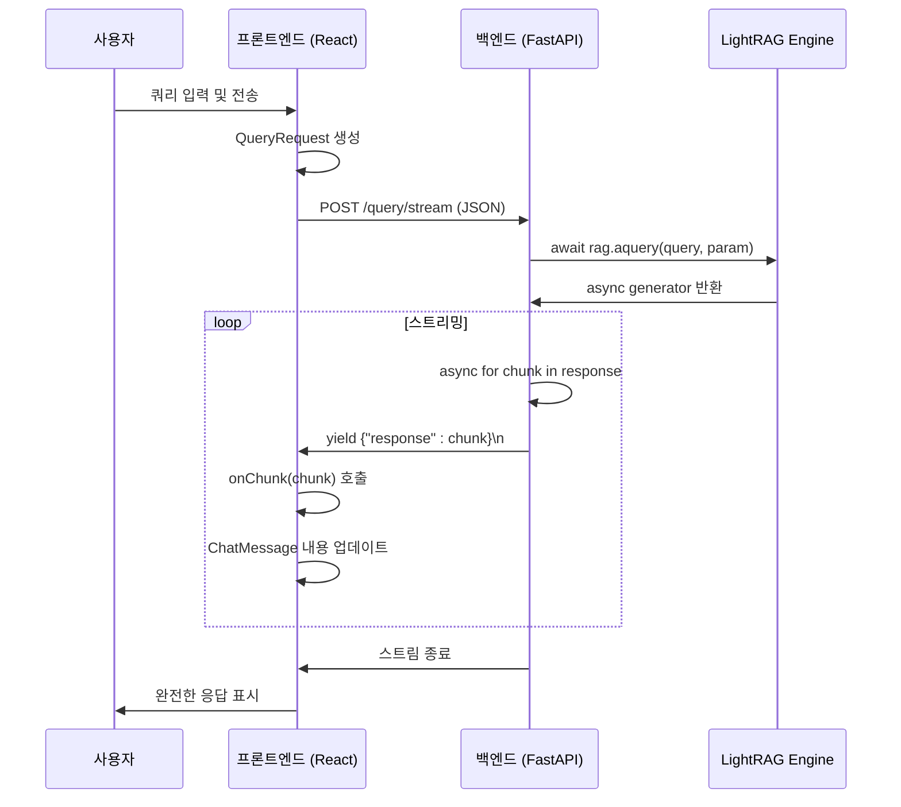

# 검색 테스트

<cite>
**이 문서에서 참조된 파일**  
- [RetrievalTesting.tsx](file://lightrag_webui/src/features/RetrievalTesting.tsx)
- [ChatMessage.tsx](file://lightrag_webui/src/components/retrieval/ChatMessage.tsx)
- [QuerySettings.tsx](file://lightrag_webui/src/components/retrieval/QuerySettings.tsx)
- [query_routes.py](file://lightrag/api/routers/query_routes.py)
- [lightrag.ts](file://lightrag_webui/src/api/lightrag.ts)
- [config.py](file://lightrag/api/config.py)
</cite>

## 목차
1. [소개](#소개)
2. [쿼리 입력 및 응답 표시](#쿼리-입력-및-응답-표시)
3. [검색 모드 및 설정](#검색-모드-및-설정)
4. [백엔드 통신 및 스트리밍](#백엔드-통신-및-스트리밍)
5. [오류 처리 및 피드백](#오류-처리-및-피드백)
6. [성능 최적화 조언](#성능-최적화-조언)

## 소개
RetrievalTesting 탭은 LightRAG 시스템의 RAG(Retrieval-Augmented Generation) 검색 기능을 테스트할 수 있는 핵심 인터페이스입니다. 사용자는 이 탭을 통해 다양한 검색 모드와 설정을 조정하면서 자연어 질문을 제출하고, 그에 대한 시스템의 응답을 실시간으로 확인할 수 있습니다. 이 문서는 RetrievalTesting 탭의 전체 테스트 프로세스를 상세히 설명하며, 사용자가 효과적으로 시스템을 평가하고 최적화할 수 있도록 안내합니다.

## 쿼리 입력 및 응답 표시

### 쿼리 입력 필드
사용자는 하단의 쿼리 입력 필드를 통해 질문을 제출할 수 있습니다. 이 입력 필드는 다음과 같은 특징을 가집니다:
- **입력 제출**: 사용자는 입력 필드에 질문을 입력한 후, 오른쪽의 전송 아이콘을 클릭하거나 Enter 키를 눌러 쿼리를 제출합니다.
- **입력 오류 처리**: 입력된 쿼리가 유효하지 않을 경우(예: 잘못된 검색 모드 접두사), 입력 필드 아래에 빨간색 텍스트로 오류 메시지가 표시됩니다.
- **입력 초기화**: 왼쪽의 지우기 아이콘을 클릭하면 입력 필드의 내용이 즉시 지워집니다.

**Section sources**
- [RetrievalTesting.tsx](file://lightrag_webui/src/features/RetrievalTesting.tsx#L200-L230)

### ChatMessage 컴포넌트를 통한 응답 표시
시스템의 응답은 `ChatMessage` 컴포넌트를 통해 화면에 표시됩니다. 이 컴포넌트는 다음과 같은 형식으로 작동합니다:
- **메시지 레이아웃**: 사용자 메시지는 오른쪽에, 시스템 응답은 왼쪽에 표시됩니다.
- **마크다운 렌더링**: 응답 내용은 `ReactMarkdown` 컴포넌트를 통해 렌더링되며, 마크다운 형식의 텍스트, 코드 블록, 수식 등을 올바르게 표시합니다.
- **머메이드 다이어그램**: 응답에 포함된 `mermaid` 코드 블록은 자동으로 시각화된 다이어그램으로 변환되어 표시됩니다. 이는 지식 그래프의 구조나 프로세스 흐름을 이해하는 데 유용합니다.
- **복사 기능**: 시스템 응답에는 오른쪽 하단에 복사 아이콘이 있으며, 이를 클릭하면 응답 전체가 클립보드에 복사됩니다.
- **로딩 상태**: 응답 생성 중에는 로딩 아이콘이 표시됩니다.

**Diagram sources**
- [ChatMessage.tsx](file://lightrag_webui/src/components/retrieval/ChatMessage.tsx#L1-L347)
- [RetrievalTesting.tsx](file://lightrag_webui/src/features/RetrievalTesting.tsx#L1-L395)

**Section sources**
- [ChatMessage.tsx](file://lightrag_webui/src/components/retrieval/ChatMessage.tsx#L1-L347)
- [RetrievalTesting.tsx](file://lightrag_webui/src/features/RetrievalTesting.tsx#L1-L395)

## 검색 모드 및 설정

### QuerySettings를 통한 검색 모드 선택
`QuerySettings` 패널을 통해 사용자는 다양한 검색 모드를 선택하고, LLM 및 reranker 설정을 조정할 수 있습니다.

#### 검색 모드
다음과 같은 검색 모드를 선택할 수 있습니다:
- **Naive**: 기본적인 벡터 검색만 수행합니다. 간단한 텍스트 일치에 적합합니다.
- **Local**: 지식 그래프 내에서 쿼리와 관련된 엔티티를 중심으로 로컬 컨텍스트를 검색합니다. 엔티티 간의 세부 관계를 탐색할 때 유용합니다.
- **Global**: 지식 그래프의 전역 구조를 분석하여 관련된 모든 관계를 검색합니다. 광범위한 맥락을 이해할 때 적합합니다.
- **Hybrid**: Local과 Global 모드의 결과를 결합합니다. 균형 잡힌 검색 결과를 제공합니다.
- **Mix**: 지식 그래프 검색과 벡터 검색을 모두 수행하고 결과를 통합합니다. 가장 포괄적인 검색을 제공합니다.
- **Bypass**: 검색을 완전히 우회하고, 입력된 쿼리만으로 LLM에 직접 요청을 보냅니다. 검색 기능을 테스트하지 않을 때 사용합니다.

**예시**: "양자 컴퓨터의 원리"라는 질문에 대해,
- **Local 모드**는 "양자 비트", "중첩", "얽힘"과 같은 핵심 엔티티와 그 주변 정보를 집중적으로 검색합니다.
- **Global 모드**는 "양자 컴퓨터"와 관련된 모든 연구, 응용 분야, 역사적 배경 등 광범위한 관계를 검색합니다.
- **Mix 모드**는 위의 두 결과와 함께 관련 연구 논문의 텍스트 청크를 추가로 검색하여 가장 풍부한 컨텍스트를 제공합니다.

#### LLM 및 Reranker 설정
- **응답 형식(Response Format)**: 응답을 "여러 단락", "단일 단락", "불릿 포인트" 중에서 선택할 수 있습니다.
- **Top K**: 검색할 상위 항목의 수를 설정합니다. Local 모드에서는 엔티티 수, Global 모드에서는 관계 수를 의미합니다.
- **Chunk Top K**: 벡터 검색에서 검색하고 재순위화 후 유지할 텍스트 청크의 수를 설정합니다.
- **토큰 제한**: `max_entity_tokens`, `max_relation_tokens`, `max_total_tokens`을 통해 검색 컨텍스트의 크기를 제어할 수 있습니다. 이는 LLM의 컨텍스트 창을 초과하지 않도록 합니다.
- **사용자 프롬프트(User Prompt)**: 기본 프롬프트 대신 사용자 정의 프롬프트를 입력할 수 있습니다.
- **재순위화(Rerank) 활성화**: 검색된 텍스트 청크에 대해 reranker 모델을 사용하여 관련성에 따라 재정렬할지 여부를 선택합니다. 활성화하면 정확도가 향상되지만 처리 시간이 증가할 수 있습니다.
- **스트리밍(Streaming)**: 응답을 생성되는 대로 실시간으로 스트리밍할지 여부를 선택합니다. 활성화되면 사용자가 응답을 기다리는 동안 중간 결과를 확인할 수 있습니다.

**Diagram sources**
- [QuerySettings.tsx](file://lightrag_webui/src/components/retrieval/QuerySettings.tsx#L1-L475)
- [query_routes.py](file://lightrag/api/routers/query_routes.py#L1-L225)

**Section sources**
- [QuerySettings.tsx](file://lightrag_webui/src/components/retrieval/QuerySettings.tsx#L1-L475)

## 백엔드 통신 및 스트리밍

### 비동기 통신 구조
RetrievalTesting 탭은 프론트엔드(React)와 백엔드(FastAPI) 사이에 비동기 통신을 사용합니다. 주요 흐름은 다음과 같습니다:
1. 사용자가 쿼리를 제출하면, `RetrievalTesting` 컴포넌트는 현재 `QuerySettings` 스토어의 값을 기반으로 `QueryRequest` 객체를 생성합니다.
2. 이 객체는 `lightrag.ts` 파일의 `queryText` 또는 `queryTextStream` 함수를 통해 백엔드의 `/query` 또는 `/query/stream` 엔드포인트로 POST 요청을 보냅니다.
3. 백엔드의 `query_routes.py`는 이 요청을 수신하고, `LightRAG` 인스턴스의 `aquery` 메서드를 비동기적으로 호출합니다.
4. `aquery` 메서드는 지정된 검색 모드에 따라 지식 그래프와 벡터 저장소에서 관련 정보를 검색하고, LLM에 컨텍스트를 제공하여 응답을 생성합니다.

### 스트리밍 응답 처리
스트리밍이 활성화된 경우, 백엔드는 `application/x-ndjson` 미디어 타입의 `StreamingResponse`를 반환합니다. 프론트엔드는 다음과 같은 방식으로 스트리밍을 처리합니다:
- **Fetch API 사용**: `axios` 대신 `fetch` API를 사용하여 스트리밍 응답을 처리합니다. 이는 `axios`가 스트리밍을 완전히 지원하지 않기 때문입니다.
- **Reader 및 디코더**: `response.body.getReader()`와 `TextDecoder`를 사용하여 스트림을 청크 단위로 읽고 디코딩합니다.
- **버퍼링 및 파싱**: 수신된 청크는 버퍼에 저장되며, 개행 문자(`\n`)를 기준으로 분리되어 각 줄이 JSON 객체로 파싱됩니다.
- **실시간 업데이트**: 파싱된 응답 청크는 `onChunk` 콜백을 통해 `RetrievalTesting` 컴포넌트로 전달되며, 즉시 `ChatMessage` 컴포넌트의 내용에 추가됩니다.
- **오류 처리**: 스트리밍 중에 오류가 발생하면 `onError` 콜백을 통해 사용자에게 알립니다.

**Diagram sources**
- [RetrievalTesting.tsx](file://lightrag_webui/src/features/RetrievalTesting.tsx#L1-L395)
- [lightrag.ts](file://lightrag_webui/src/api/lightrag.ts#L1-L763)
- [query_routes.py](file://lightrag/api/routers/query_routes.py#L1-L225)

**Section sources**
- [RetrievalTesting.tsx](file://lightrag_webui/src/features/RetrievalTesting.tsx#L1-L395)
- [lightrag.ts](file://lightrag_webui/src/api/lightrag.ts#L1-L763)
- [query_routes.py](file://lightrag/api/routers/query_routes.py#L1-L225)

## 오류 처리 및 피드백

### 오류 발생 시 사용자 피드백
시스템은 다양한 오류 상황에서 사용자에게 명확한 피드백을 제공합니다:
- **입력 오류**: 잘못된 검색 모드 접두사가 입력되면, 입력 필드 아래에 "유효하지 않은 검색 모드 접두사입니다."라는 메시지가 표시됩니다.
- **인증 오류**: API 키가 없거나 잘못된 경우, 백엔드는 401 Unauthorized 응답을 반환합니다. 프론트엔드는 이를