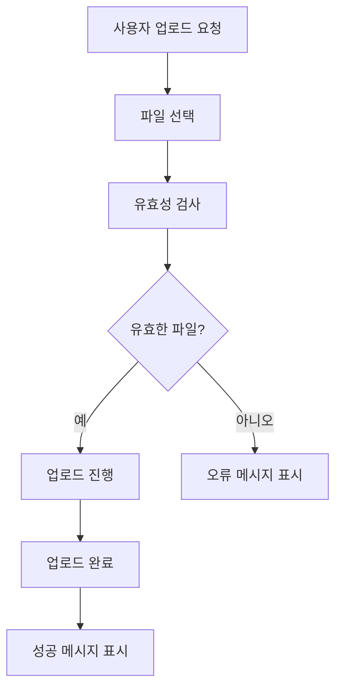
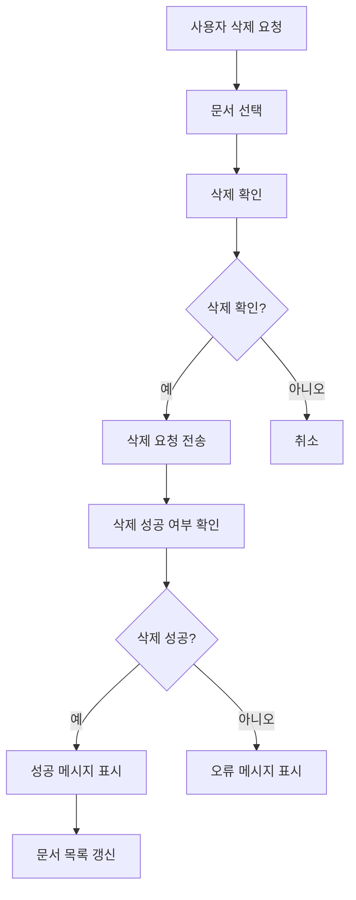
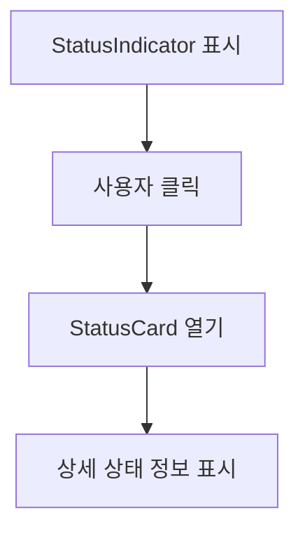
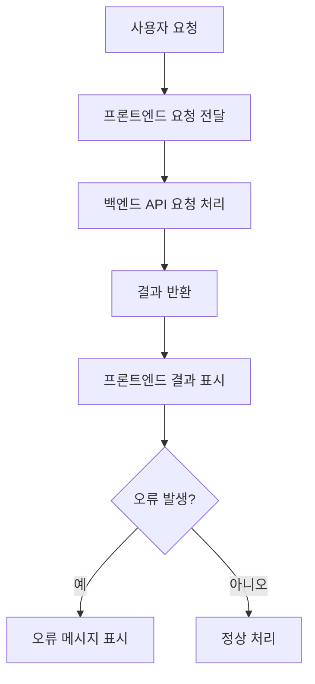
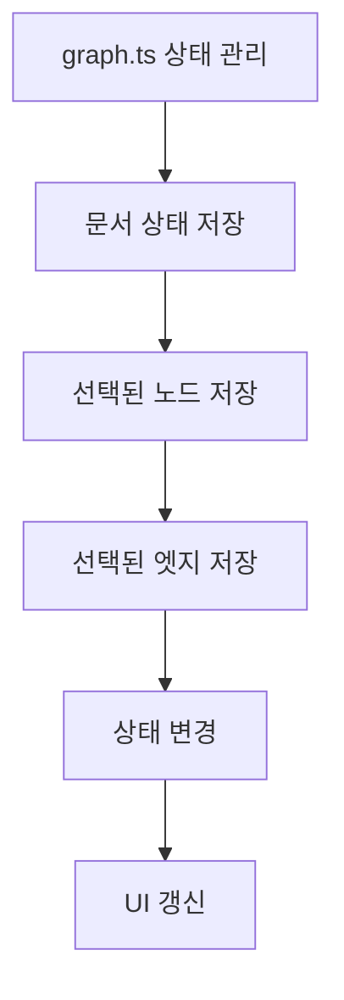

# 문서 관리

<cite>
**이 문서에서 참조한 파일**   
- [UploadDocumentsDialog.tsx](file://lightrag_webui/src/components/documents/UploadDocumentsDialog.tsx)
- [DeleteDocumentsDialog.tsx](file://lightrag_webui/src/components/documents/DeleteDocumentsDialog.tsx)
- [ClearDocumentsDialog.tsx](file://lightrag_webui/src/components/documents/ClearDocumentsDialog.tsx)
- [StatusCard.tsx](file://lightrag_webui/src/components/status/StatusCard.tsx)
- [StatusIndicator.tsx](file://lightrag_webui/src/components/status/StatusIndicator.tsx)
- [document_routes.py](file://lightrag/api/routers/document_routes.py)
- [lightrag.ts](file://lightrag_webui/src/api/lightrag.ts)
- [graph.ts](file://lightrag_webui/src/stores/graph.ts)
- [documents_standalone.py](file://upload/documents_standalone.py) - *CLI를 통한 독립형 문서 처리 기능 추가*
</cite>

## 업데이트 요약
**변경 사항**   
- CLI를 통해 웹 UI 없이도 문서 작업을 수행할 수 있는 `documents_standalone.py` 스크립트가 새롭게 추가됨
- 이 기능은 사용자가 명령줄 인터페이스를 통해 문서 스캔, 업로드, 삽입, 삭제 등을 수행할 수 있도록 함
- 기존의 웹 기반 문서 관리 기능 외에 오프라인 및 자동화된 문서 처리 옵션이 확장됨

## 목차
1. [소개](#소개)
2. [문서 업로드](#문서-업로드)
3. [문서 삭제](#문서-삭제)
4. [처리 상태 확인](#처리-상태-확인)
5. [백엔드 통신 및 오류 처리](#백엔드-통신-및-오류-처리)
6. [UI 상태 관리](#ui-상태-관리)
7. [독립형 문서 처리](#독립형-문서-처리)

## 소개
이 문서는 LightRAG 시스템의 문서 관리 기능에 대한 상세한 사용법을 제공합니다. 사용자는 문서 업로드, 삭제, 전체 삭제, 처리 상태 확인 등의 기능을 통해 문서를 효과적으로 관리할 수 있습니다. 이 문서는 UploadDocumentsDialog, DeleteDocumentsDialog, ClearDocumentsDialog, StatusCard, StatusIndicator 등의 컴포넌트를 중심으로 설명하며, 백엔드 API와의 통신 흐름과 오류 처리 전략, 사용자 경험을 고려한 로딩 상태 및 피드백 메커니즘을 포함합니다. 또한, 웹 UI 외부에서도 문서 작업이 가능한 새로운 CLI 도구에 대해서도 설명합니다.

## 문서 업로드
### UploadDocumentsDialog를 통한 다중 파일 형식 업로드 절차
UploadDocumentsDialog 컴포넌트는 사용자가 다양한 파일 형식(PDF, DOCX, PPTX, CSV 등)을 업로드할 수 있도록 합니다. 이 컴포넌트는 FileUploader 컴포넌트를 사용하여 파일을 업로드하며, 업로드 중에는 진행률을 표시합니다.

**업로드 절차**
1. 사용자는 UploadDocumentsDialog를 열어 파일을 선택합니다.
2. 선택한 파일은 FileUploader를 통해 업로드됩니다.
3. 업로드 중에는 진행률이 표시되며, 각 파일의 업로드 상태를 확인할 수 있습니다.
4. 업로드가 완료되면, 성공 또는 실패 메시지가 표시됩니다.

**유효성 검사 로직**
- 파일 이름이 유효한지 확인합니다.
- 파일 확장자가 지원되는 형식인지 확인합니다.
- 파일 크기가 최대 크기(200MB)를 초과하지 않는지 확인합니다.
- 중복된 파일 이름이 있는지 확인합니다.



**섹션 소스**
- [UploadDocumentsDialog.tsx](file://lightrag_webui/src/components/documents/UploadDocumentsDialog.tsx#L0-L220)
- [FileUploader.tsx](file://lightrag_webui/src/components/ui/FileUploader.tsx#L139-L176)

## 문서 삭제
### DeleteDocumentsDialog와 ClearDocumentsDialog를 활용한 선택적/전체 문서 삭제 프로세스
DeleteDocumentsDialog와 ClearDocumentsDialog 컴포넌트는 사용자가 문서를 선택적으로 또는 전체적으로 삭제할 수 있도록 합니다. DeleteDocumentsDialog는 선택한 문서를 삭제하며, ClearDocumentsDialog는 모든 문서를 삭제합니다.

**선택적 문서 삭제 프로세스**
1. 사용자는 DeleteDocumentsDialog를 열어 삭제할 문서를 선택합니다.
2. 선택한 문서의 ID를 backend에 전송합니다.
3. backend는 선택한 문서를 삭제하고, 삭제 성공 여부를 반환합니다.
4. 삭제 성공 시, 성공 메시지가 표시되고, 문서 목록이 갱신됩니다.

**전체 문서 삭제 프로세스**
1. 사용자는 ClearDocumentsDialog를 열어 모든 문서를 삭제합니다.
2. backend는 모든 문서를 삭제하고, 삭제 성공 여부를 반환합니다.
3. 삭제 성공 시, 성공 메시지가 표시되고, 문서 목록이 갱신됩니다.



**섹션 소스**
- [DeleteDocumentsDialog.tsx](file://lightrag_webui/src/components/documents/DeleteDocumentsDialog.tsx#L0-L175)
- [ClearDocumentsDialog.tsx](file://lightrag_webui/src/components/documents/ClearDocumentsDialog.tsx#L0-L211)

## 처리 상태 확인
### StatusCard와 StatusIndicator를 통한 문서 처리 파이프라인 상태 모니터링 방법
StatusCard와 StatusIndicator 컴포넌트는 문서 처리 파이프라인의 상태를 모니터링할 수 있도록 합니다. StatusIndicator는 시스템의 상태를 나타내는 아이콘을 표시하며, StatusCard는 상세한 상태 정보를 제공합니다.

**상태 모니터링 방법**
1. StatusIndicator는 시스템의 상태를 나타내는 아이콘을 표시합니다.
2. 사용자는 StatusIndicator를 클릭하여 StatusCard를 열 수 있습니다.
3. StatusCard는 서버 정보, LLM 구성, 임베딩 구성, 저장소 구성 등을 상세히 표시합니다.



**섹션 소스**
- [StatusIndicator.tsx](file://lightrag_webui/src/components/status/StatusIndicator.tsx#L0-L52)
- [StatusCard.tsx](file://lightrag_webui/src/components/status/StatusCard.tsx#L0-L91)

## 백엔드 통신 및 오류 처리
### 백엔드 API(document_routes)와의 통신 흐름과 오류 처리 전략
백엔드 API(document_routes)는 문서 업로드, 삭제, 상태 확인 등의 기능을 제공합니다. 이 API는 FastAPI를 사용하여 구현되며, 다양한 HTTP 메서드를 통해 요청을 처리합니다.

**통신 흐름**
1. 사용자는 프론트엔드에서 요청을 보냅니다.
2. 프론트엔드는 백엔드 API에 요청을 전달합니다.
3. 백엔드 API는 요청을 처리하고, 결과를 반환합니다.
4. 프론트엔드는 결과를 받아 사용자에게 표시합니다.

**오류 처리 전략**
- HTTP 상태 코드에 따라 오류 메시지를 표시합니다.
- 네트워크 오류 시, 사용자에게 네트워크 연결 상태를 확인하도록 안내합니다.
- 백엔드 서버 오류 시, 사용자에게 서버 상태를 확인하도록 안내합니다.



**섹션 소스**
- [document_routes.py](file://lightrag/api/routers/document_routes.py#L0-L799)
- [lightrag.ts](file://lightrag_webui/src/api/lightrag.ts#L0-L762)

## UI 상태 관리
### UI 상태 관리(store/graph.ts)와의 통합 방식
UI 상태 관리는 Zustand를 사용하여 관리됩니다. graph.ts 파일은 그래프 상태를 관리하는 스토어를 제공하며, 이 스토어는 문서 상태, 선택된 노드, 선택된 엣지 등의 정보를 저장합니다.

**통합 방식**
1. graph.ts 파일은 Zustand를 사용하여 그래프 상태를 관리합니다.
2. 문서 상태, 선택된 노드, 선택된 엣지 등의 정보를 저장합니다.
3. 상태 변경 시, UI가 자동으로 갱신됩니다.



**섹션 소스**
- [graph.ts](file://lightrag_webui/src/stores/graph.ts#L0-L388)

## 독립형 문서 처리
### CLI를 통한 독립형 문서 관리 기능
LightRAG 시스템은 웹 UI 외부에서도 문서 작업을 수행할 수 있도록 `documents_standalone.py`라는 독립형 스크립트를 제공합니다. 이 스크립트는 Python 표준 라이브러리만으로 구성되어 있어 별도의 FastAPI 서버 없이도 문서 관련 기능을 테스트하고 실행할 수 있습니다.

**주요 기능**
- 입력 디렉터리 스캔 및 파일 인덱싱 (`scan`)
- 파일 업로드 및 즉시 인덱싱 (`upload`)
- 텍스트 단일/다중 입력 처리 (`insert-text`, `insert-texts`)
- 문서 상태 조회, 페이지네이션, 트랙 상태 조회
- 문서/엔티티/관계 삭제, 전체 초기화, 캐시 삭제 등

**실행 예시**
```bash
python3 documents_standalone.py insert-text --text "OpenAI와 Microsoft가 협력했습니다."
python3 documents_standalone.py documents
python3 documents_standalone.py upload --file NP_ABLGI_35.pdf
python3 documents_standalone.py scan
```

결과는 LightRAG의 REST API 응답 형식과 유사한 JSON으로 출력되므로, 자동화된 스크립트나 배치 처리에 적합합니다. 이 기능은 개발, 테스트, CI/CD 파이프라인 등에서 유용하게 사용될 수 있습니다.

**섹션 소스**
- [documents_standalone.py](file://upload/documents_standalone.py#L0-L1219) - *CLI 기반 문서 처리 기능 구현*