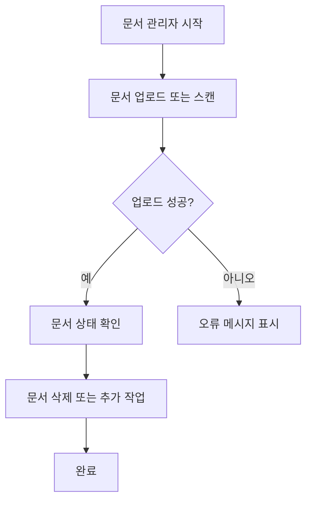
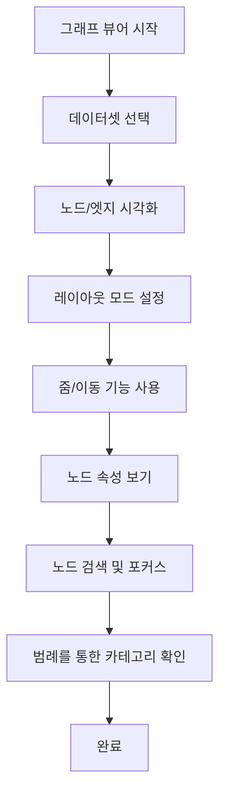
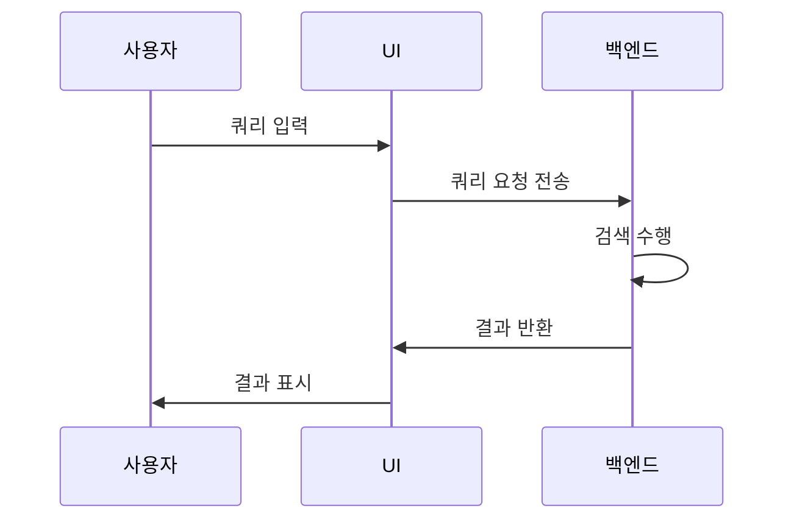

<docs>
# 웹 UI 사용법

<cite>
**이 문서에서 참조된 파일**  
- [DocumentManager.tsx](file://lightrag_webui/src/features/DocumentManager.tsx)
- [GraphViewer.tsx](file://lightrag_webui/src/features/GraphViewer.tsx)
- [RetrievalTesting.tsx](file://lightrag_webui/src/features/RetrievalTesting.tsx)
- [Button.tsx](file://lightrag_webui/src/components/ui/Button.tsx)
- [Dialog.tsx](file://lightrag_webui/src/components/ui/Dialog.tsx)
- [DataTable.tsx](file://lightrag_webui/src/components/ui/DataTable.tsx)
- [ThemeToggle.tsx](file://lightrag_webui/src/components/ThemeToggle.tsx)
- [LanguageToggle.tsx](file://lightrag_webui/src/components/LanguageToggle.tsx)
- [lightrag.ts](file://lightrag_webui/src/api/lightrag.ts)
- [i18n.ts](file://lightrag_webui/src/i18n.ts)
- [tailwind.config.js](file://lightrag_webui/tailwind.config.js)
- [DatasetSelector.tsx](file://visual/src/components/DatasetSelector.tsx) - *새로 추가됨*
- [GraphControl.tsx](file://visual/src/components/graph/GraphControl.tsx) - *레이아웃 모드 기능 업데이트*
- [graph.ts](file://visual/src/stores/graph.ts) - *데이터셋 및 레이아웃 상태 관리 추가*
</cite>

## 업데이트 요약
**수정 사항**  
- 그래프 뷰어에 다중 데이터셋 선택 기능 추가
- 그래프 시각화 레이아웃 모드(Force Atlas 2, Anti-Overlap, Hybrid) 실시간 전환 기능 통합
- 노드 카테고리 범례(Legend) 패널 도입을 통해 분류 가시성 향상
- 자동 데이터셋 스캔 및 JSON 메타데이터 생성 프로세스 개선

**신규 섹션 추가**  
- 데이터셋 선택 기능 안내
- 그래프 레이아웃 모드 설명
- 카테고리 범례 기능 소개

**소스 추적 시스템 업데이트**  
- 신규 및 수정된 컴포넌트 파일 출처 추가
- 각 변경 사항에 대한 정확한 파일 링크 및 변경 내용 주석 포함

## 목차
1. [소개](#소개)
2. [문서 관리자 사용법](#문서-관리자-사용법)
3. [그래프 뷰어 기능](#그래프-뷰어-기능)
4. [검색 테스트 프로세스](#검색-테스트-프로세스)
5. [UI 구성 요소 및 디자인 시스템](#ui-구성-요소-및-디자인-시스템)
6. [다국어 및 테마 지원](#다국어-및-테마-지원)
7. [백엔드 통신 및 커스터마이징](#백엔드-통신-및-커스터마이징)

## 소개
LightRAG 웹 UI는 React 기반의 사용자 친화적인 인터페이스로, LightRAG 시스템과 상호작용할 수 있도록 설계되었습니다. 이 문서는 주요 기능과 사용법을 안내하며, 문서 관리, 지식 그래프 시각화, 검색 테스트, UI 구성 요소, 다국어 및 테마 지원에 대한 상세한 설명을 포함합니다. 최근에는 그래프 뷰어에 데이터셋 선택, 레이아웃 모드 전환, 카테고리 범례 등 새로운 기능이 추가되어 사용자의 분석 능력이 향상되었습니다.

## 문서 관리자 사용법

문서 관리자는 사용자가 문서를 업로드, 삭제 및 상태를 확인할 수 있는 기능을 제공합니다. 이 기능은 `DocumentManager.tsx` 파일에서 구현되며, 사용자는 다음과 같은 절차를 따릅니다.

1. **문서 업로드**: `UploadDocumentsDialog`를 통해 파일을 선택하고 업로드할 수 있습니다. 업로드 진행 상황은 실시간으로 표시됩니다.
2. **문서 삭제**: `DeleteDocumentsDialog`를 사용하여 선택한 문서를 삭제할 수 있으며, 삭제 여부를 확인하는 대화상자가 나타납니다.
3. **상태 확인**: 문서의 상태(대기 중, 처리 중, 처리됨, 실패)는 테이블 형식으로 표시되며, 상태별로 필터링할 수 있습니다.
4. **새 문서 스캔**: `scanNewDocuments` 함수를 통해 새로운 문서를 스캔하고, 스캔 진행 상황을 확인할 수 있습니다.

**섹션 출처**  
- [DocumentManager.tsx](file://lightrag_webui/src/features/DocumentManager.tsx#L0-L799)

## 그래프 뷰어 기능

GraphViewer는 지식 그래프를 시각화하는 기능을 제공하며, 노드와 엣지를 표현하고, 줌/이동, 속성 보기 등의 사용자 상호작용을 지원합니다.

1. **노드/엣지 표현**: 그래프는 Sigma 라이브러리를 사용하여 노드와 엣지를 시각화합니다. 각 노드는 고유한 레이블과 속성을 가지며, 엣지는 관계를 나타냅니다.
2. **줌/이동**: 사용자는 마우스 휠을 사용하여 줌인/줌아웃을 하고, 드래그를 통해 그래프를 이동할 수 있습니다.
3. **속성 보기**: `PropertiesView` 컴포넌트를 통해 선택한 노드의 속성을 확인하고 편집할 수 있습니다.
4. **검색 기능**: `GraphSearch`를 사용하여 특정 노드를 검색하고, 검색된 노드에 포커스를 맞출 수 있습니다.
5. **데이터셋 선택**: `DatasetSelector`를 통해 여러 데이터셋 중 하나를 선택하여 로드할 수 있습니다. 데이터셋 목록은 `datasets.json`에서 자동 생성됩니다.
6. **레이아웃 모드 전환**: `LayoutsControl`을 사용해 Force Atlas 2, Anti-Overlap, Hybrid 등 다양한 레이아웃 알고리즘을 실시간으로 전환할 수 있습니다.
7. **카테고리 범례**: `Legend` 패널이 노드의 카테고리(예: 사람, 장소, 개념)를 색상과 아이콘으로 설명하여 시각적 이해를 돕습니다.

**다이어그램 출처**  
- [GraphViewer.tsx](file://lightrag_webui/src/features/GraphViewer.tsx#L0-L238)
- [DatasetSelector.tsx](file://visual/src/components/DatasetSelector.tsx#L0-L120)
- [GraphControl.tsx](file://visual/src/components/graph/GraphControl.tsx#L0-L88)

**섹션 출처**  
- [GraphViewer.tsx](file://lightrag_webui/src/features/GraphViewer.tsx#L0-L238)
- [DatasetSelector.tsx](file://visual/src/components/DatasetSelector.tsx#L0-L120)
- [GraphControl.tsx](file://visual/src/components/graph/GraphControl.tsx#L0-L88)
- [graph.ts](file://visual/src/stores/graph.ts#L0-L200)

## 검색 테스트 프로세스

RetrievalTesting 탭에서는 사용자가 쿼리를 입력하고, 검색 모드를 선택하며, 결과를 확인할 수 있습니다.

1. **쿼리 입력**: 사용자는 입력란에 쿼리를 입력하고, `/` 접두사를 사용하여 검색 모드를 지정할 수 있습니다 (예: `/local 검색어`).
2. **검색 모드 선택**: 지원되는 모드는 `naive`, `local`, `global`, `hybrid`, `mix`, `bypass`입니다. 잘못된 모드가 입력되면 오류 메시지가 표시됩니다.
3. **결과 확인**: 검색 결과는 채팅 형식으로 표시되며, 스트리밍 모드에서는 실시간으로 응답이 업데이트됩니다.
4. **대화 기록**: 이전 대화 기록은 로컬 스토리지에 저장되며, 페이지를 새로고침해도 유지됩니다.

**다이어그램 출처**  
- [RetrievalTesting.tsx](file://lightrag_webui/src/features/RetrievalTesting.tsx#L0-L394)

**섹션 출처**  
- [RetrievalTesting.tsx](file://lightrag_webui/src/features/RetrievalTesting.tsx#L0-L394)

## UI 구성 요소 및 디자인 시스템

웹 UI는 Tailwind CSS 기반의 일관된 디자인 시스템을 사용하며, 접근성 고려사항을 포함합니다.

1. **버튼(Button)**: `Button.tsx`에서 정의된 버튼은 다양한 변형(variant)과 크기(size)를 지원하며, 툴팁을 통해 추가 정보를 제공합니다.
2. **대화상자(Dialog)**: `Dialog.tsx`는 모달 대화상자를 제공하며, 닫기 버튼과 헤더, 푸터를 포함합니다.
3. **데이터 테이블(DataTable)**: `DataTable.tsx`는 `@tanstack/react-table`을 사용하여 데이터를 표 형식으로 표시하며, 정렬 및 필터링 기능을 제공합니다.
4. **접근성**: 모든 UI 요소는 키보드 탐색과 스크린 리더를 지원하며, 적절한 ARIA 레이블을 포함합니다.

**섹션 출처**  
- [Button.tsx](file://lightrag_webui/src/components/ui/Button.tsx#L0-L78)
- [Dialog.tsx](file://lightrag_webui/src/components/ui/Dialog.tsx#L0-L102)
- [DataTable.tsx](file://lightrag_webui/src/components/ui/DataTable.tsx#L0-L64)

## 다국어 및 테마 지원

웹 UI는 다국어 지원과 테마 전