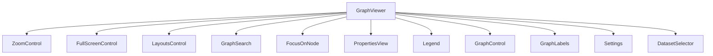
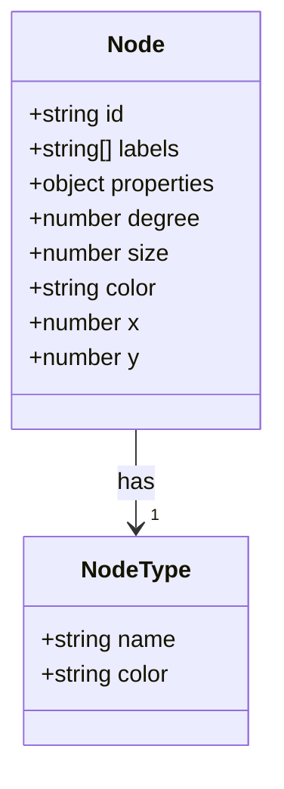
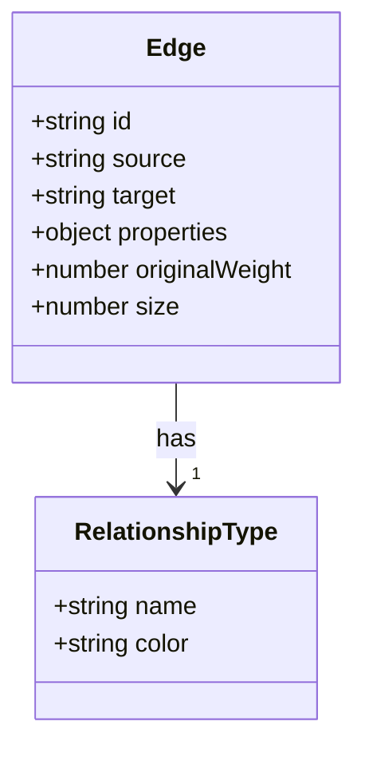
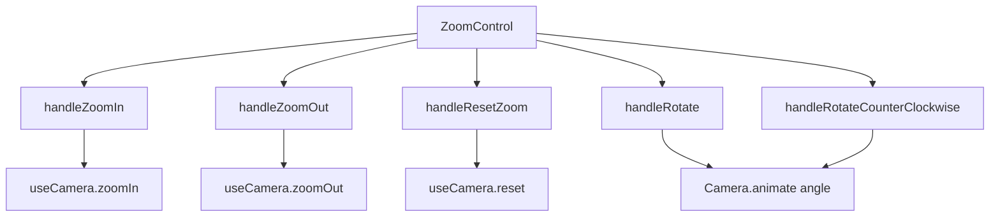
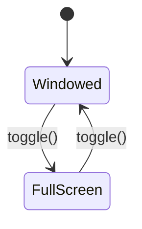
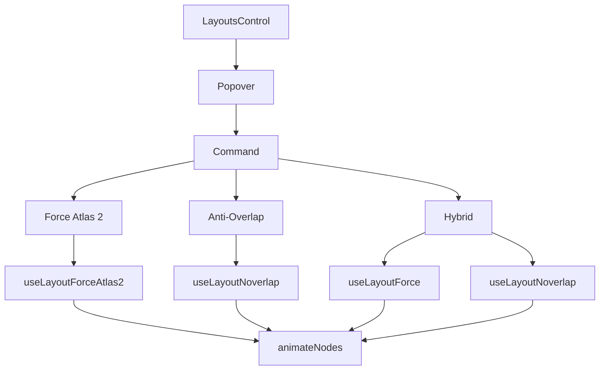

<docs>
# 지식 그래프 시각화

<cite>
**이 문서에서 참조한 파일**  
- [GraphViewer.tsx](file://lightrag_webui/src/features/GraphViewer.tsx)
- [useLightragGraph.tsx](file://lightrag_webui/src/hooks/useLightragGraph.tsx)
- [graph_routes.py](file://lightrag/api/routers/graph_routes.py)
- [ZoomControl.tsx](file://lightrag_webui/src/components/graph/ZoomControl.tsx)
- [FullScreenControl.tsx](file://lightrag_webui/src/components/graph/FullScreenControl.tsx)
- [LayoutsControl.tsx](file://lightrag_webui/src/components/graph/LayoutsControl.tsx)
- [GraphSearch.tsx](file://lightrag_webui/src/components/graph/GraphSearch.tsx)
- [FocusOnNode.tsx](file://lightrag_webui/src/components/graph/FocusOnNode.tsx)
- [PropertiesView.tsx](file://lightrag_webui/src/components/graph/PropertiesView.tsx)
- [PropertyEditDialog.tsx](file://lightrag_webui/src/components/graph/PropertyEditDialog.tsx)
- [Legend.tsx](file://lightrag_webui/src/components/graph/Legend.tsx)
- [DatasetSelector.tsx](file://visual/src/components/DatasetSelector.tsx)
- [graph.ts](file://visual/src/stores/graph.ts)
</cite>

## 업데이트 요약
**수정된 사항**
- GraphViewer 개요 섹션에서 Sigma.js 기반으로 변경됨에 따라 설명 수정
- 노드 및 엣지 시각화 섹션에서 카테고리별 색상 매핑 및 분류 로직 추가 반영
- 그래프 레이아웃 전환 섹션에서 Force Atlas 2, Anti-Overlap, Hybrid 모드로 세분화하여 설명
- 새로운 데이터셋 선택 기능과 범례 패널 추가 내용 반영
- 관련 소스 파일 목록에 신규 추가된 파일들 포함

## 목차
1. [소개](#소개)
2. [GraphViewer 개요](#graphviewer-개요)
3. [노드 및 엳지 시각화](#노드-및-엣지-시각화)
4. [확대/축소 및 전체 화면 제어](#확대축소-및-전체-화면-제어)
5. [그래프 레이아웃 전환](#그래프-레이아웃-전환)
6. [노드 검색 및 포커싱](#노드-검색-및-포커싱)
7. [속성 탐색 및 수정](#속성-탐색-및-수정)
8. [요소 범례 이해](#요소-범례-이해)
9. [사용자 상호작용 이벤트 처리](#사용자-상호작용-이벤트-처리)
10. [백엔드 데이터 동기화](#백엔드-데이터-동기화)
11. [대규모 그래프 성능 최적화](#대규모-그래프-성능-최적화)
12. [결론](#결론)

## 소개
이 문서는 LightRAG 프로젝트의 지식 그래프 시각화 기능에 대해 상세히 설명합니다. GraphViewer 컴포넌트를 중심으로 Sigma.js 기반의 노드와 엳지 시각화 방식, 사용자 상호작용 기능, 백엔드와의 데이터 동기화 방식 및 성능 최적화 전략을 다룹니다. 이 시스템은 사용자가 복잡한 지식 그래프를 직관적으로 탐색하고 분석할 수 있도록 다양한 시각화 도구와 제어 기능을 제공합니다.

## GraphViewer 개요
GraphViewer는 지식 그래프를 시각적으로 표현하고 상호작용할 수 있는 핵심 컴포넌트입니다. 이 컴포넌트는 Sigma.js 라이브러리를 기반으로 하며, cytoscape.js와 유사한 방식으로 노드와 엳지를 렌더링합니다. GraphViewer는 다양한 하위 컴포넌트를 통합하여 사용자에게 풍부한 시각화 경험을 제공합니다.

**Diagram sources**
- [GraphViewer.tsx](file://lightrag_webui/src/features/GraphViewer.tsx)

**Section sources**
- [GraphViewer.tsx](file://lightrag_webui/src/features/GraphViewer.tsx)

## 노드 및 엳지 시각화
지식 그래프의 시각화는 Sigma.js 기반의 라이브러리를 사용하여 구현됩니다. 노드와 엳지는 엔티티와 관계를 시각적으로 표현하며, 색상과 모양을 통해 다양한 정보를 전달합니다.

### 노드 시각화
노드는 지식 그래프의 엔티티를 나타냅니다. 노드의 시각적 특성은 다음과 같은 기준에 따라 결정됩니다:

- **크기**: 노드의 중심성(연결 정도)에 따라 결정됩니다. 연결된 엳지의 수(degree)가 많을수록 노드의 크기가 커집니다.
- **색상**: 엔티티의 유형(entity_type)에 따라 결정됩니다. 예를 들어, 'person'은 파란색, 'organization'은 녹색으로 표시됩니다.
- **모양**: 기본적으로 원형 모양을 사용하며, 테두리가 추가되어 선택된 노드를 강조합니다.

노드의 크기는 최소 크기와 최대 크기 사이에서 연결 정도의 제곱근에 비례하여 계산됩니다. 이는 중심성이 높은 노드가 더 두드러지게 표시되도록 하면서도, 크기 차이가 너무 극단적이지 않도록 조절합니다.

**Diagram sources**
- [useLightragGraph.tsx](file://lightrag_webui/src/hooks/useLightragGraph.tsx#L267-L311)

**Section sources**
- [useLightragGraph.tsx](file://lightrag_webui/src/hooks/useLightragGraph.tsx#L267-L311)

### 엳지 시각화
التز지는 노드 간의 관계를 나타냅니다. 엳지의 시각적 특성은 다음과 같은 기준에 따라 결정됩니다:

- **두께**: 관계의 중요도 또는 가중치(weight)에 따라 결정됩니다. 가중치가 높을수록 엳지가 더 두꺼워집니다.
- **색상**: 소스 노드의 색상을 따릅니다.
- **형태**: 기본적으로 화살표가 없는 곡선 형태를 사용합니다.

التز지의 두께는 엳지 속성에 있는 weight 값에 따라 결정되며, 이 값은 최소 두께와 최대 두께 사이에서 가중치의 제곱근에 비례하여 계산됩니다. 이는 중요한 관계가 더 두드러지게 표시되도록 합니다.

**Diagram sources**
- [useLightragGraph.tsx](file://lightrag_webui/src/hooks/useLightragGraph.tsx#L345-L385)

**Section sources**
- [useLightragGraph.tsx](file://lightrag_webui/src/hooks/useLightragGraph.tsx#L345-L385)

## 확대/축소 및 전체 화면 제어
사용자는 ZoomControl과 FullScreenControl을 통해 그래프의 보기(view)를 조정할 수 있습니다.

### ZoomControl
ZoomControl 컴포넌트는 그래프의 확대/축소 기능을 제공합니다. 다음과 같은 기능을 포함합니다:

- **확대**: + 버튼을 클릭하거나 ZoomIn 아이콘을 사용하여 그래프를 확대합니다.
- **축소**: - 버튼을 클릭하거나 ZoomOut 아이콘을 사용하여 그래프를 축소합니다.
- **리셋**: 전체 그래프를 화면에 맞게 다시 조정합니다.
- **회전**: 카메라를 시계 방향 또는 반시계 방향으로 회전시킵니다.

이러한 제어는 Sigma.js의 useCamera 훅을 통해 구현되며, 애니메이션 효과와 함께 부드러운 전환을 제공합니다.

**Diagram sources**
- [ZoomControl.tsx](file://lightrag_webui/src/components/graph/ZoomControl.tsx)

**Section sources**
- [ZoomControl.tsx](file://lightrag_webui/src/components/graph/ZoomControl.tsx)

### FullScreenControl
FullScreenControl 컴포넌트는 전체 화면 모드 전환 기능을 제공합니다. 사용자는 이 기능을 통해 그래프를 전체 화면으로 표시하거나, 다시 창 모드로 전환할 수 있습니다. 이 기능은 Sigma.js의 useFullScreen 훅을 통해 구현됩니다.

**Diagram sources**
- [FullScreenControl.tsx](file://lightrag_webui/src/components/graph/FullScreenControl.tsx)

**Section sources**
- [FullScreenControl.tsx](file://lightrag_webui/src/components/graph/FullScreenControl.tsx)

## 그래프 레이아웃 전환
LayoutsControl 컴포넌트를 통해 사용자는 그래프의 레이아웃을 다양한 알고리즘으로 전환할 수 있습니다. 지원되는 레이아웃은 다음과 같습니다:

- **Force Atlas 2**: 물리 기반의 힘-지향형 알고리즘을 사용하여 배치합니다.
- **Anti-Overlap**: 노드가 겹치지 않도록 배치합니다.
- **Hybrid**: Force Atlas 2와 Anti-Overlap 알고리즘을 결합한 하이브리드 모드입니다.

각 레이아웃은 Sigma.js의 다양한 레이아웃 훅(useLayoutCircular, useLayoutForce 등)을 통해 구현됩니다. 사용자는 레이아웃을 선택하면 animateNodes 함수를 통해 부드러운 애니메이션과 함께 노드의 위치가 변경됩니다.

**Diagram sources**
- [LayoutsControl.tsx](file://lightrag_webui/src/components/graph/LayoutsControl.tsx)

**Section sources**
- [LayoutsControl.tsx](file://lightrag_webui/src/components/graph/LayoutsControl.tsx)

## 노드 검색 및 포커싱
GraphSearch와 FocusOnNode 컴포넌트를 통해 사용자는 그래프 내에서 특정 노드를 검색하고 해당 노드에 포커스를 맞출 수 있습니다. GraphSearch는 입력된 키워드에 따라 노드를 실시간으로 필터링하며, FocusOnNode는 선택된 노드를 화면 중앙에 배치하여 쉽게 확인할 수 있도록 합니다.

**Section sources**
- [GraphSearch.tsx](file://lightrag_webui/src/components/graph/GraphSearch.tsx)
- [FocusOnNode.tsx](file://lightrag_webui/src/components/graph/FocusOnNode.tsx)

## 속성 탐색 및 수정
PropertiesView를 통해 사용자는 선택된 노드나 엳지의 속성을 탐색할 수 있으며, PropertyEditDialog를 활용하여 속성을 수정할 수 있습니다. 속성 수정은 백엔드의 graph_routes와 연동되어 실시간으로 저장되며, 변경 사항은 즉시 그래프에 반영됩니다.

**Section sources**
- [PropertiesView.tsx](file://lightrag_webui/src/components/graph/PropertiesView.tsx)
- [PropertyEditDialog.tsx](file://lightrag_webui/src/components/graph/PropertyEditDialog.tsx)

## 요소 범례 이해
Legend 컴포넌트는 그래프 내 노드의 카테고리(예: Person, Organization)를 색상과 함께 설명하는 범례 패널을 제공합니다. 이를 통해 사용자는 각 노드의 유형을 쉽게 식별할 수 있으며, 시각적인 혼란을 줄일 수 있습니다.

**Section sources**
- [Legend.tsx](file://lightrag_webui/src/components/graph/Legend.tsx)

## 사용자 상호작용 이벤트 처리
GraphViewer는 마우스 이벤트를 통해 사용자 상호작용을 처리합니다. 노드 클릭 시 속성 패널이 열리고, 드래그 앤 드롭을 통해 노드의 위치를 직접 조정할 수 있습니다. 이러한 이벤트는 Sigma.js의 이벤트 시스템을 통해 관리되며, 상태 저장소(graph store)와 연동되어 실시간으로 반영됩니다.

**Section sources**
- [GraphViewer.tsx](file://lightrag_webui/src/features/GraphViewer.tsx)

## 백엔드 데이터 동기화
백엔드의 graph_routes는 REST API를 통해 그래프 데이터의 조회 및 수정 기능을 제공합니다. /graphs 엔드포인트는 지정된 레이블을 포함하는 연결된 서브그래프를 반환하며, /graph/entity/edit 및 /graph/relation/edit 엔드포인트를 통해 엔티티와 관계의 속성을 수정할 수 있습니다. 프론트엔드는 이 API들과 연동되어 실시간으로 데이터를 동기화합니다.

**Section sources**
- [graph_routes.py](file://lightrag