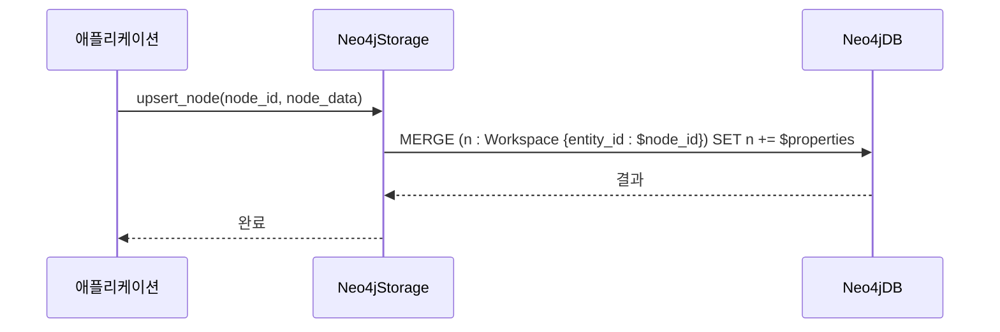
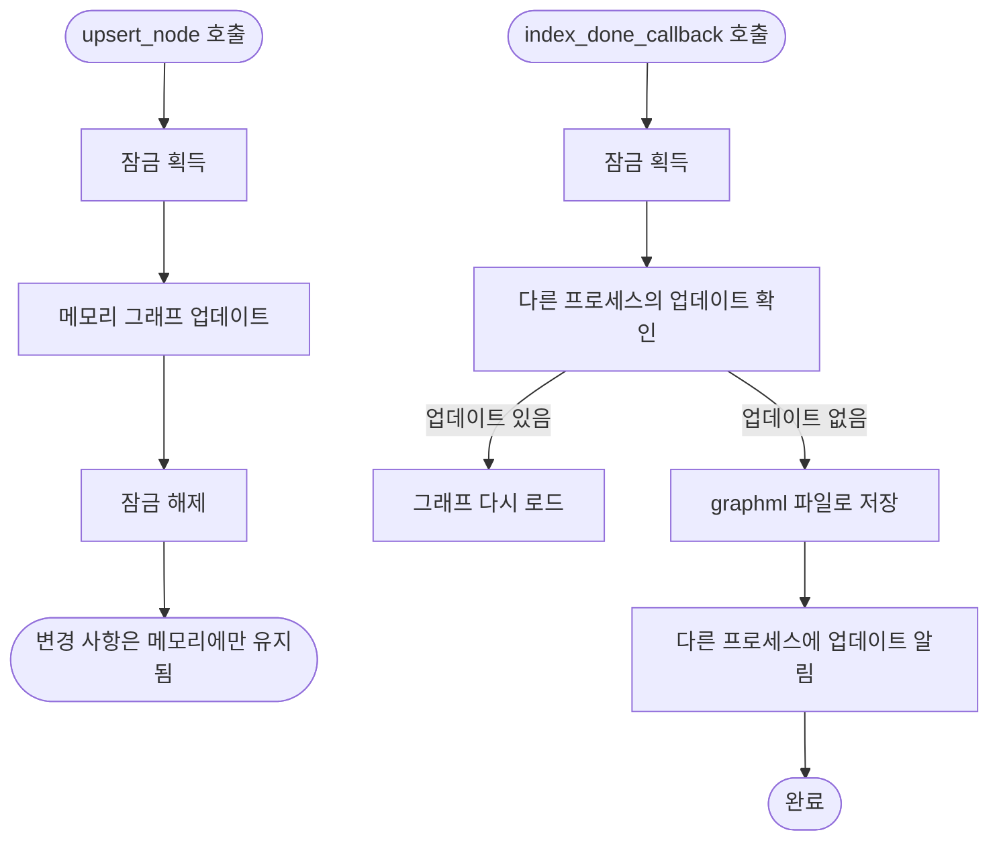

# 그래프 저장소

<cite>
**이 문서에서 참조한 파일**  
- [shared_storage.py](file://lightrag/kg/shared_storage.py)
- [neo4j_impl.py](file://lightrag/kg/neo4j_impl.py)
- [networkx_impl.py](file://lightrag/kg/networkx_impl.py)
- [memgraph_impl.py](file://lightrag/kg/memgraph_impl.py)
</cite>

## 목차
1. [소개](#소개)
2. [핵심 구성 요소](#핵심-구성-요소)
3. [아키텍처 개요](#아키텍처-개요)
4. [상세 구성 요소 분석](#상세-구성-요소-분석)
5. [의존성 분석](#의존성-분석)
6. [성능 고려사항](#성능-고려사항)
7. [문제 해결 가이드](#문제-해결-가이드)
8. [결론](#결론)

## 소개
LightRAG는 Neo4j, NetworkX, Memgraph 세 가지 그래프 저장소 구현체를 제공하여 다양한 사용 사례와 성능 요구사항에 대응할 수 있도록 설계되었습니다. 각 저장소는 공통된 `BaseGraphStorage` 인터페이스를 상속받아 일관된 API를 제공하면서도, 내부 구현 방식과 성능 특성은 서로 다릅니다. 이 문서는 각 저장소의 역할, 차이점, 초기화 방식, 트랜잭션 처리, 쿼리 최적화 전략을 분석하고, 사용자 정의 저장소를 구현하기 위한 확장 포인트를 설명합니다.

## 핵심 구성 요소

LightRAG의 그래프 저장소는 `BaseGraphStorage` 추상 클래스를 기반으로 하며, `shared_storage.py`에 정의된 공통 인터페이스를 통해 다양한 저장소 구현체가 상호 운용됩니다. `Neo4jStorage`, `NetworkXStorage`, `MemgraphStorage`는 각각의 데이터베이스 시스템과 상호작용하는 구체적인 구현체입니다. 이들 클래스는 노드, 관계, 속성의 저장 및 조회를 위한 표준화된 메서드를 제공합니다.

**구성 요소 소스**
- [shared_storage.py](file://lightrag/kg/shared_storage.py#L0-L799)
- [base.py](file://lightrag/base.py#L345-L668)

## 아키텍처 개요

LightRAG의 그래프 저장소 아키텍처는 추상화 계층을 통해 다양한 백엔드 저장소를 유연하게 통합합니다. `BaseGraphStorage` 인터페이스는 모든 그래프 저장소가 구현해야 하는 핵심 메서드를 정의하며, `shared_storage.py`는 프로세스 간 동기화를 위한 잠금 메커니즘과 공유 데이터 관리를 제공합니다. 각 구현체는 이 인터페이스를 따르면서도, 내부적으로는 각기 다른 데이터베이스 드라이버를 사용하여 데이터를 처리합니다.

```mermaid
graph TD
subgraph "공통 인터페이스"
BaseGraphStorage[BaseGraphStorage]:::class
end
subgraph "구현체"
Neo4jStorage[Neo4jStorage]:::class
NetworkXStorage[NetworkXStorage]:::class
MemgraphStorage[MemgraphStorage]:::class
end
subgraph "외부 시스템"
Neo4j[(Neo4j)]
Memgraph[(Memgraph)]
FileSystem[(파일 시스템)]
end
BaseGraphStorage --> Neo4jStorage
BaseGraphStorage --> NetworkXStorage
BaseGraphStorage --> MemgraphStorage
Neo4jStorage --> Neo4j
MemgraphStorage --> Memgraph
NetworkXStorage --> FileSystem
```

**다이어그램 소스**
- [base.py](file://lightrag/base.py#L345-L668)
- [neo4j_impl.py](file://lightrag/kg/neo4j_impl.py#L0-L1557)
- [networkx_impl.py](file://lightrag/kg/networkx_impl.py#L0-L500)
- [memgraph_impl.py](file://lightrag/kg/memgraph_impl.py#L0-L1092)

## 상세 구성 요소 분석

### Neo4j 구현 분석

Neo4j는 트랜잭션 안정성과 복잡한 그래프 쿼리에 최적화된 그래프 데이터베이스입니다. `Neo4jStorage`는 `neo4j` Python 드라이버를 사용하여 비동기적으로 Cypher 쿼리를 실행합니다. 초기화 시, 데이터베이스 연결을 설정하고, 워크스페이스 레이블에 대한 인덱스를 생성하여 쿼리 성능을 최적화합니다. `upsert_node` 및 `upsert_edge` 메서드는 `MERGE` 및 `SET` Cypher 명령어를 사용하여 노드와 관계를 삽입하거나 업데이트합니다. `tenacity` 라이브러리를 사용하여 네트워크 오류나 일시적인 오류에 대해 재시도 로직을 구현합니다.



**다이어그램 소스**
- [neo4j_impl.py](file://lightrag/kg/neo4j_impl.py#L0-L1557)

**구성 요소 소스**
- [neo4j_impl.py](file://lightrag/kg/neo4j_impl.py#L0-L1557)

### NetworkX 구현 분석

NetworkX는 메모리 기반의 그래프 처리 라이브러리로, `NetworkXStorage`는 이를 사용하여 그래프를 메모리에 유지합니다. 초기화 시, `graphml` 파일에서 그래프를 로드하거나, 새로운 빈 그래프를 생성합니다. `get_node`, `has_edge` 등의 조회 메서드는 메모리 내 그래프 객체에 직접 접근하여 매우 빠른 성능을 제공합니다. 변경 사항은 `index_done_callback` 메서드가 호출될 때까지 메모리에만 유지되며, 이 시점에 `graphml` 파일로 지속화됩니다. 다중 프로세스 환경에서는 `get_update_flag`와 `get_storage_lock`을 사용하여 프로세스 간 상태 동기화를 관리합니다.



**다이어그램 소스**
- [networkx_impl.py](file://lightrag/kg/networkx_impl.py#L0-L500)

**구성 요소 소스**
- [networkx_impl.py](file://lightrag/kg/networkx_impl.py#L0-L500)

### Memgraph 구현 분석

Memgraph은 실시간 처리에 특화된 고성능 그래프 데이터베이스입니다. `MemgraphStorage`는 Neo4j와 동일한 `neo4j` Python 드라이버를 사용하지만, Memgraph 서버에 연결합니다. 초기화 시, Memgraph 서버에 연결하고 워크스페이스 레이블에 대한 인덱스를 생성합니다. 실시간 처리 능력은 `upsert_node` 및 `upsert_edge` 메서드에서 구현된 수동 트랜잭션 수준 재시도 로직에 의해 강화됩니다. 이 로직은 `TransientError`와 같은 일시적인 충돌 오류를 처리하기 위해 지수 백오프와 지터를 사용합니다. `get_knowledge_graph` 메서드는 `[*BFS]` 구문을 사용하여 깊이 우선 탐색을 수행하며, 실시간 쿼리에 최적화되어 있습니다.

```mermaid
sequenceDiagram
participant 애플리케이션
participant MemgraphStorage
participant MemgraphDB
애플리케이션->>MemgraphStorage : upsert_node(node_id, node_data)
loop 재시도 루프
MemgraphStorage->>MemgraphDB : MERGE (n : Workspace {entity_id : $node_id}) SET n += $properties
alt 성공
MemgraphDB-->>MemgraphStorage : 결과
MemgraphStorage-->>애플리케이션 : 완료
break
else 일시적 오류
MemgraphDB--xMemgraphStorage : TransientError
MemgraphStorage->>MemgraphStorage : 지수 백오프 후 대기
end
end
```

**다이어그램 소스**
- [memgraph_impl.py](file://lightrag/kg/memgraph_impl.py#L0-L1092)

**구성 요소 소스**
- [memgraph_impl.py](file://lightrag/kg/memgraph_impl.py#L0-L1092)

### 지식 그래프 저장 구조

지식 그래프의 노드, 관계, 속성은 `KnowledgeGraphNode` 및 `KnowledgeGraphEdge` 데이터 클래스를 통해 정의됩니다. 노드는 `id`, `labels`, `properties` 필드를 가지며, 관계는 `id`, `type`, `source`, `target`, `properties` 필드를 가집니다. 실제 저장소 구현체는 이 구조를 내부 데이터 모델에 매핑합니다. 예를 들어, Neo4j에서는 노드의 `entity_id` 속성과 워크스페이스 레이블을 사용하여 노드를 식별하고, 관계는 `DIRECTED` 타입으로 저장됩니다. 속성은 모든 저장소에서 키-값 쌍으로 저장되며, `source_id` 속성은 여러 청크 ID를 `GRAPH_FIELD_SEP`로 구분하여 저장할 수 있습니다.

**구성 요소 소스**
- [types.py](file://lightrag/types.py#L11-L28)
- [neo4j_impl.py](file://lightrag/kg/neo4j_impl.py#L0-L1557)
- [networkx_impl.py](file://lightrag/kg/networkx_impl.py#L0-L500)
- [memgraph_impl.py](file://lightrag/kg/memgraph_impl.py#L0-L1092)

### 초기화 및 트랜잭션 처리

각 저장소의 초기화는 `initialize` 메서드에서 수행됩니다. Neo4j와 Memgraph은 환경 변수 또는 구성 파일에서 URI, 사용자 이름, 비밀번호를 읽어