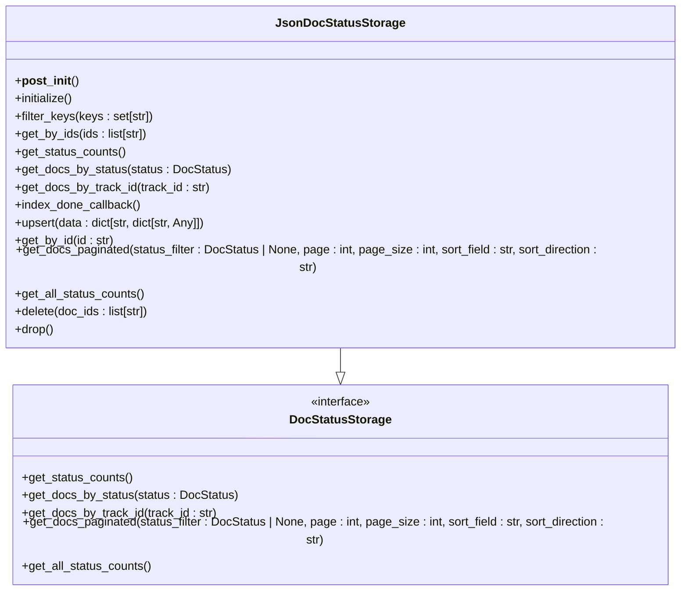

# 문서 상태 저장소

<cite>
**이 문서에서 참조된 파일**
- [json_doc_status_impl.py](file://lightrag/kg/json_doc_status_impl.py)
- [shared_storage.py](file://lightrag/kg/shared_storage.py)
- [base.py](file://lightrag/base.py)
- [postgres_impl.py](file://lightrag/kg/postgres_impl.py)
- [mongo_impl.py](file://lightrag/kg/mongo_impl.py)
</cite>

## 목차
1. [소개](#소개)
2. [문서 상태 저장소의 목적과 역할](#문서-상태-저장소의-목적과-역할)
3. [JsonDocStatusStorage의 상태 관리 메커니즘](#jsondocstatusstorage의-상태-관리-메커니즘)
4. [PostgreSQL 및 MongoDB를 통한 상태 저장의 장점](#postgresql-및-mongodb를-통한-상태-저장의-장점)
5. [문서 상태 생명주기 및 상태 전이](#문서-상태-생명주기-및-상태-전이)
6. [공통 상태 관리 로직과 인터페이스](#공통-상태-관리-로직과-인터페이스)
7. [사용자 정의 상태 저장소 구현 방법](#사용자-정의-상태-저장소-구현-방법)
8. [상태 일관성 보장 및 장애 복구](#상태-일관성-보장-및-장애-복구)
9. [모니터링을 위한 로깅 전략](#모니터링을-위한-로깅-전략)
10. [결론](#결론)

## 소개
LightRAG는 문서 처리 상태를 효율적으로 관리하기 위해 문서 상태 저장소(Document Status Storage)를 제공합니다. 이 저장소는 문서의 삽입, 분석, 오류 처리 등의 상태를 추적하고 관리하는 핵심 기능을 수행합니다. 본 문서는 문서 상태 저장소의 목적과 LightRAG 내에서의 역할을 설명하고, `json_doc_status_impl.py`가 문서의 처리 상태를 어떻게 관리하는지 코드 기반으로 분석합니다. 또한 PostgreSQL 및 MongoDB를 통한 상태 저장의 장점, 문서 상태의 생명주기(Lifecycle), 상태 전이(State Transition), 동시성 제어 메커니즘을 포함하여, `shared_storage.py`의 공통 상태 관리 로직과 `BaseDocumentStatusStorage` 인터페이스의 메서드를 분석하여 사용자 정의 상태 저장소 구현 방법을 제시합니다. 마지막으로 상태 일관성 보장, 장애 복구, 모니터링을 위한 로깅 전략을 포함합니다.

## 문서 상태 저장소의 목적과 역할
문서 상태 저장소는 LightRAG 시스템 내에서 문서 처리 상태를 추적하고 관리하는 핵심 컴포넌트입니다. 이 저장소는 각 문서의 처리 상태를 저장하고, 사용자에게 문서의 현재 상태를 제공하며, 시스템의 안정성과 신뢰성을 보장하는 데 중요한 역할을 합니다. 문서 상태 저장소는 문서의 삽입, 분석, 오류 처리 등의 상태를 기록하고, 이를 통해 사용자가 문서 처리 과정을 모니터링하고 문제를 진단할 수 있도록 합니다. 또한, 상태 저장소는 다중 프로세스 환경에서 상태 정보를 공유하고 동기화하여, 시스템의 일관성을 유지합니다.

**Section sources**
- [base.py](file://lightrag/base.py#L350-L390)

## JsonDocStatusStorage의 상태 관리 메커니즘
`JsonDocStatusStorage`는 JSON 파일을 사용하여 문서 상태를 관리하는 구현체입니다. 이 클래스는 `DocStatusStorage` 인터페이스를 상속받아, 문서 상태를 저장하고 관리하는 다양한 메서드를 제공합니다. `JsonDocStatusStorage`는 `__post_init__` 메서드에서 작업 디렉터리와 파일 경로를 설정하고, `initialize` 메서드에서 상태 데이터를 초기화합니다. 상태 데이터는 메모리에 저장되며, `upsert` 메서드를 통해 새로운 상태 정보를 삽입하거나 기존 정보를 업데이트합니다. 상태 정보는 `index_done_callback` 메서드를 통해 디스크에 저장되며, `get_status_counts` 메서드를 통해 각 상태별 문서 수를 조회할 수 있습니다.



**Diagram sources**
- [json_doc_status_impl.py](file://lightrag/kg/json_doc_status_impl.py#L15-L350)

## PostgreSQL 및 MongoDB를 통한 상태 저장의 장점
PostgreSQL 및 MongoDB를 사용하여 문서 상태를 저장하는 것은 여러 가지 장점을 제공합니다. PostgreSQL은 강력한 트랜잭션 지원과 ACID 속성을 제공하여, 상태 정보의 일관성과 신뢰성을 보장합니다. 또한, PostgreSQL은 복잡한 쿼리를 지원하여, 상태 정보를 효율적으로 조회하고 분석할 수 있습니다. 반면, MongoDB는 유연한 스키마와 높은 확장성을 제공하여, 다양한 상태 정보를 저장하고 관리할 수 있습니다. MongoDB는 JSON 형식의 데이터를 지원하여, 상태 정보를 직관적으로 저장하고 조회할 수 있으며, 대규모 데이터 처리에 적합합니다.

```mermaid
graph TD
    subgraph "PostgreSQL"
        A[강력한 트랜잭션 지원]
        B[ACID 속성]
        C[복잡한 쿼리 지원]
    end
    
    subgraph "MongoDB"
        D[유연한 스키마]
        E[높은 확장성]
        F[JSON 형식 데이터 지원]
    end
    
    A --> G[상