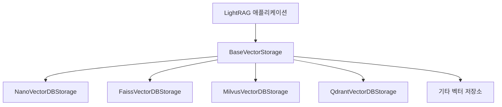

# 벡터 저장소

<cite>
**이 문서에서 참조된 파일**  
- [nano_vector_db_impl.py](file://lightrag/kg/nano_vector_db_impl.py)
- [faiss_impl.py](file://lightrag/kg/faiss_impl.py)
- [milvus_impl.py](file://lightrag/kg/milvus_impl.py)
- [qdrant_impl.py](file://lightrag/kg/qdrant_impl.py)
- [shared_storage.py](file://lightrag/kg/shared_storage.py)
</cite>

## 목차
1. [소개](#소개)
2. [벡터 저장소 아키텍처 개요](#벡터-저장소-아키텍처-개요)
3. [공통 인터페이스 및 추상 클래스](#공통-인터페이스-및-추상-클래스)
4. [백엔드별 특징 및 비교](#백엔드별-특징-및-비교)
   - [nano-vectordb](#nano-vectordb)
   - [Milvus](#milvus)
   - [Qdrant](#qdrant)
   - [Faiss](#faiss)
5. [저장, 인덱싱, 검색 프로세스](#저장-인덱싱-검색-프로세스)
6. [초기화 및 연결 설정](#초기화-및-연결-설정)
7. [성능 튜닝 및 최적화 전략](#성능-튜닝-및-최적화-전략)
8. [벡터 차원, 거리 측정, 인덱스 유형의 트레이드오프](#벡터-차원-거리-측정-인덱스-유형의-트레이드오프)
9. [사용자 정의 벡터 저장소 개발](#사용자-정의-벡터-저장소-개발)
10. [결론](#결론)

## 소개

LightRAG는 다양한 벡터 저장소 백엔드를 지원하는 유연한 아키텍처를 제공합니다. 이 문서는 LightRAG의 벡터 저장소 아키텍처를 심층적으로 분석하고, nano-vectordb, Milvus, Qdrant, Faiss 각 백엔드의 특징을 설명합니다. 특히 nano_vector_db_impl.py의 경량 설계 원리, Milvus와 Qdrant의 분산 환경 지원 능력, Faiss의 로컬 벡터 검색 최적화 전략을 비교 분석합니다. 또한 임베딩 벡터의 저장, 인덱싱, 검색 프로세스를 코드 기반으로 설명하고, 각 저장소의 초기화 파라미터, 연결 설정, 성능 튜닝 옵션을 제시합니다. shared_storage.py를 통해 벡터 저장소들이 공통적으로 구현하는 인터페이스를 분석하고, 사용자 정의 벡터 저장소를 개발하기 위한 BaseVectorStorage 추상 클래스의 핵심 메서드를 설명합니다. 마지막으로 벡터 차원, 거리 측정 방식, 인덱스 유형 선택에 따른 검색 정확도와 속도의 트레이드오프를 포함합니다.

## 벡터 저장소 아키텍처 개요

LightRAG의 벡터 저장소 아키텍처는 다양한 벡터 데이터베이스 백엔드를 추상화하여 일관된 인터페이스를 제공하는 것을 목표로 합니다. 이 아키텍처는 `BaseVectorStorage` 추상 클래스를 중심으로 구성되며, 모든 벡터 저장소 구현체는 이 클래스를 상속받아 구현됩니다. 이 설계는 사용자가 다양한 벡터 저장소를 쉽게 교체하고 통합할 수 있도록 하며, LightRAG의 확장성을 극대화합니다.

각 벡터 저장소 구현체는 고유한 초기화, 연결, 저장, 검색 메커니즘을 가지고 있지만, `BaseVectorStorage`가 정의하는 공통 인터페이스를 통해 동일한 방식으로 접근할 수 있습니다. 이는 LightRAG의 핵심 기능인 지식 그래프 구축과 검색 프로세스를 저장소 종류에 관계없이 일관되게 수행할 수 있게 합니다.



**도표 출처**
- [base.py](file://lightrag/base.py)
- [nano_vector_db_impl.py](file://lightrag/kg/nano_vector_db_impl.py)
- [faiss_impl.py](file://lightrag/kg/faiss_impl.py)
- [milvus_impl.py](file://lightrag/kg/milvus_impl.py)
- [qdrant_impl.py](file://lightrag/kg/qdrant_impl.py)

## 공통 인터페이스 및 추상 클래스

LightRAG의 벡터 저장소 아키텍처는 `BaseVectorStorage` 추상 클래스를 통해 공통 인터페이스를 정의합니다. 이 클래스는 모든 벡터 저장소 구현체가 반드시 구현해야 하는 핵심 메서드들을 추상화하여, 다양한 백엔드 간의 일관성을 보장합니다.

```python
class BaseVectorStorage(StorageNameSpace, ABC):
    embedding_func: EmbeddingFunc
    cosine_better_than_threshold: float = field(default=0.2)
    meta_fields: set[str] = field(default_factory=set)

    @abstractmethod
    async def query(
        self, query: str, top_k: int, ids: list[str] | None = None
    ) -> list[dict[str, Any]]:
        """벡터 저장소를 쿼리하고 상위 k개의 결과를 검색합니다."""

    @abstractmethod
    async def upsert(self, data: dict[str, dict[str, Any]]) -> None:
        """저장소에 벡터를 삽입하거나 업데이트합니다."""

    @abstractmethod
    async def delete_entity(self, entity_name: str) -> None:
        """엔터티 이름으로 단일 엔터티를 삭제합니다."""

    @abstractmethod
    async def delete_entity_relation(self, entity_name: str) -> None:
        """지정된 엔터티에 대한 관계를 삭제합니다."""

    @abstractmethod
    async def get_by_id(self, id: str) -> dict[str, Any] | None:
        """ID로 벡터 데이터를 가져옵니다."""

    @abstractmethod
    async def get_by_ids(self, ids: list[str]) -> list[dict[str, Any]]:
        """여러 ID로 벡터 데이터를 가져옵니다."""

    @abstractmethod
    async def delete(self, ids: list[str]):
        """지정된 ID의 벡터를 삭제합니다."""

    @abstractmethod
    async def get_vectors_by_ids(self, ids: list[str]) -> dict[str, list[float]]:
        """ID로 벡터를 가져옵니다."""
```

이 추상 클래스는 `upsert`, `query`, `delete`, `get_by_id`, `get_by_ids`, `get_vectors_by_ids`, `delete_entity`, `delete_entity_relation` 등의 핵심 메서드를 정의합니다. 이러한 공통 인터페이스를 통해 LightRAG는 다양한 벡터 저장소를 추상화하여 동일한 방식으로 조작할 수 있습니다.

**도표 출처**
- [base.py](file://lightrag/base.py#L211-L300)

## 백엔드별 특징 및 비교

### nano-vectordb

`NanoVectorDBStorage`는 경량화된 벡터 저장소로, 로컬 파일 시스템에 JSON 형식으로 데이터를 저장합니다. 이 저장소는 단순한 구조와 낮은 의존성으로 인해 개발 및 테스트 환경에 적합합니다.

**특징:**
- **경량 설계:** `nano_vectordb` 라이브러리를 사용하여 간단한 벡터 저장소를 구현합니다.
- **파일 기반 저장:** `vdb_{namespace}.json` 파일에 벡터 데이터를 저장합니다.
- **압축 최적화:** 벡터 데이터를 Float16으로 변환한 후 zlib으로 압축하고 Base64로 인코딩하여 저장 공간을 절약합니다.
- **워크스페이스 격리:** 워크스페이스별로 별도의 디렉터리에 데이터를 저장하여 논리적 격리를 제공합니다.

```python
# 벡터 데이터 압축 및 저장
vector_f16 = embeddings[i].astype(np.float16)
compressed_vector = zlib.compress(vector_f16.tobytes())
encoded_vector = base64.b64encode(compressed_vector).decode("utf-8")
d["vector"] = encoded_vector
```

**도표 출처**
- [nano_vector_db_impl.py](file://lightrag/kg/nano_vector_db_impl.py#L132-L171)

### Milvus

`MilvusVectorDBStorage`는 Milvus 벡터 데이터베이스를 위한 구현체로, 분산 환경에서의 확장성과 고성능을 제공합니다. Milvus는 대규모 벡터 데이터셋을 처리하기 위한 최적화된 인덱싱과 검색 기능을 제공합니다.

**특징:**
- **분산 환경 지원:** 클러스터링 아키텍처를 통해 수평 확장이 가능합니다.
- **고급 인덱싱:** HNSW(Hierarchical Navigable Small World) 인덱스를 사용하여 빠른 근접 이웃 검색을 수행합니다.
- **동적 필드 지원:** `enable_dynamic_field=True` 설정을 통해 스키마 외 필드도 저장할 수 있습니다.
- **자동 마이그레이션:** 스키마 변경 시 `query_iterator`를 사용하여 대량 데이터의 원활한 마이그레이션을 지원합니다.

```python
# HNSW 인덱스 생성
vector_index.add_index(
    field_name="vector",
    index_type="HNSW",
    metric_type="COSINE",
    params={"M": 16, "efConstruction": 256},
)
```

**도표 출처**
- [milvus_impl.py](file://lightrag/kg/milvus_impl.py#L193-L193)

### Qdrant

`QdrantVectorDBStorage`는 Qdrant 벡터 데이터베이스를 위한 구현체로, 분산 아키텍처와 고성능 검색을 제공합니다. Qdrant는 실시간 애플리케이션에 적합한 저지연 검색을 특징으로 합니다.

**특징:**
- **분산 아키텍처:** 클러스터 모드에서 노드 간 데이터 복제와 로드 밸런싱을 지원합니다.
- **고성능 검색:** 메모리 기반 인덱싱과 최적화된 알고리즘을 통해 빠른 검색 속도를 제공합니다.
- **유연한 연결:** 환경 변수 또는 config.ini 파일을 통해 연결 설정을 관리합니다.
- **자동 지속성:** `wait=True` 옵션을 통해 데이터의 지속성을 보장합니다.

```python
# Qdrant 클라이언트 초기화
self._client = QdrantClient(
    url=os.environ.get("QDRANT_URL", config.get("qdrant", "uri", fallback=None)),
    api_key=os.environ.get("QDRANT_API_KEY", config.get("qdrant", "apikey", fallback=None)),
)
```

**도표 출처**
- [qdrant_impl.py](file://lightrag/kg/qdrant_impl.py#L131-L166)

### Faiss

`FaissVectorDBStorage`는 Facebook AI Similarity Search(Faiss)를 위한 구현체로, 로컬 환경에서의 고성능 벡터 검색을 최적화합니다. Faiss는 대규모 벡터 데이터셋에 대한 근접 이웃 검색을 위한 다양한 인덱싱 전략을 제공합니다.

**특징:**
- **로컬 최적화:** CPU 또는 GPU에서 실행되는 로컬 벡터 검색 엔진입니다.
- **다양한 인덱스 유형:** IndexFlatIP(정밀 검색), IVF(양자화 기반 검색), HNSW(계층적 검색) 등 다양한 인덱스를 지원합니다.
- **코사인 유사도:** 벡터를 정규화한 후 내적 검색을 통해 코사인 유사도를 계산합니다.
- **지속성 관리:** `faiss.write_index`와 `faiss.read_index`를 통해 인덱스의 저장과 로드를 관리합니다.

```python
# Faiss 인덱스 저장
faiss.write_index(self._index, self._faiss_index_file)
```

**도표 출처**
- [faiss_impl.py](file://lightrag/kg/faiss_impl.py#L334-L367)

## 저장, 인덱싱, 검색 프로세스

LightRAG의 벡터 저장소는 일관된 저장, 인덱싱, 검색 프로세스를 따릅니다. 이 프로세스는 `upsert`, `query`, `index_done_callback` 메서드를 통해 구현됩니다.

### 저장 프로세스

벡터 저장소의 저장 프로세스는 다음과 같습니다:
1. **임베딩 생성:** 입력 텍스트를 배치로 나누어 임베딩 함수를 통해 벡터로 변환합니다.
2. **데이터 준비:** 메타데이터와 생성된 벡터를 결합하여 저장할 데이터 구조를 만듭니다.
3. **업서트 수행:** 벡터 저장소에 데이터를 삽입하거나 기존 데이터를 업데이트합니다.

```python
async def upsert(self, data: dict[str, dict[str, Any]]) -> None:
    # 임베딩 생성
    embedding_tasks = [self.embedding_func(batch) for batch in batches]
    embeddings_list = await asyncio.gather(*embedding_tasks)
    embeddings = np.concatenate(embeddings_list)
    
    # 데이터 준비 및 업서트
    # ...
```

### 인덱싱 프로세스

인덱싱 프로세스는 저장소 종류에 따라 다릅니다:
- **nano-vectordb:** JSON 파일에 저장된 후 `index_done_callback`에서 저장됩니다.
- **Milvus:** HNSW 인덱스를 사용하여 자동으로 인덱싱됩니다.
- **Qdrant:** 내부적으로 HNSW 인덱스를 사용하여 자동 인덱싱됩니다.
- **Faiss:** IndexFlatIP 또는 다른 인덱스 유형을 사용하여 메모리에 인덱스를 유지합니다.

### 검색 프로세스

검색 프로세스는 다음과 같습니다:
1. **쿼리 임베딩 생성:** 검색 쿼리 텍스트를 임베딩 함수를 통해 벡터로 변환합니다.
2. **유사도 검색:** 저장소의 검색 기능을 사용하여 쿼리 벡터와 가장 유사한 벡터를 찾습니다.
3. **결과 필터링:** 거리 임계값(`cosine_better_than_threshold`)을 기준으로 결과를 필터링합니다.

```python
async def query(
    self, query: str, top_k: int, ids: list[str] | None = None
) -> list[dict[str, Any]]:
    # 쿼리 임베딩 생성
    embedding = await self.embedding_func([query], _priority=5)
    embedding = embedding[0]
    
    # 유사도 검색
    results = client.query(
        query=embedding,
        top_k=top_k,
        better_than_threshold=self.cosine_better_than_threshold,
    )
```

**도표 출처**
- [nano_vector_db_impl.py](file://lightrag/kg/nano_vector_db_impl.py#L132-L171)
- [faiss_impl.py](file://lightrag/kg/faiss_impl.py#L171-L207)
- [milvus_impl.py](file://lightrag/kg/milvus_impl.py#L193-L193)
- [qdrant_impl.py](file://lightrag/kg/qdrant_impl.py#L200-L241)

## 초기화 및 연결 설정

각 벡터 저장소는 고유한 초기화 및 연결 설정을 요구합니다. 이 설정은 `__post_init__` 및 `initialize` 메서드를 통해 수행됩니다.

### 공통 초기화 파라미터

모든 벡터 저장소는 다음과 같은 공통 초기화 파라미터를 사용합니다:
- **working_dir:** 로컬 저장소의 작업 디렉터리 경로
- **workspace:** 데이터 격리를 위한 워크스페이스 이름
- **embedding_batch_num:** 임베딩 생성 시 배치 크기
- **vector_db_storage_cls_kwargs:** 저장소별 추가 설정

### 백엔드별 연결 설정

#### nano-vectordb 연결 설정

```python
def __post_init__(self):
    working_dir = self.global_config["working_dir"]
    if self.workspace:
        workspace_dir = os.path.join(working_dir, self.workspace)
        self.final_namespace = f"{self.workspace}_{self.namespace}"
    else:
        self.final_namespace = self.namespace
        workspace_dir = working_dir
    
    os.makedirs(workspace_dir, exist_ok=True)
    self._client_file_name = os.path.join(workspace_dir, f"vdb_{self.namespace}.json")
    self._client = NanoVectorDB(self.embedding_func.embedding_dim, storage_file=self._client_file_name)
```

#### Milvus 연결 설정

Milvus는 환경 변수 또는 config.ini 파일을 통해 연결 설정을 관리합니다. 연결 정보는 `pymilvus` 클라이언트를 통해 설정됩니다.

#### Qdrant 연결 설정

```python
async def initialize(self):
    self._client = QdrantClient(
        url=os.environ.get("QDRANT_URL", config.get("qdrant", "uri", fallback=None)),
        api_key=os.environ.get("QDRANT_API_KEY", config.get("qdrant", "apikey", fallback=None)),
    )
```

#### Faiss 연결 설정

```python
def __post_init__(self):
    working_dir = self.global_config["working_dir"]
    if self.workspace:
        workspace_dir = os.path.join(working_dir, self.workspace)
        self.final_namespace = f"{self.workspace}_{self.namespace}"
    else:
        self.final_namespace = self.namespace
        self.workspace = "_"
        workspace_dir = working_dir
    
    os.makedirs(workspace_dir, exist_ok=True)
    self._faiss_index_file = os.path.join(workspace_dir, f"faiss_index_{self.namespace}.index")
    self._meta_file = self._faiss_index_file + ".meta.json"
    self._index = faiss.IndexFlatIP(self._dim)
    self._load_faiss_index()
```

**도표 출처**
- [nano_vector_db_impl.py](file://lightrag/kg/nano_vector_db_impl.py#L43-L75)
- [faiss_impl.py](file://lightrag/kg/faiss_impl.py#L41-L71)
- [qdrant_impl.py](file://lightrag/kg/qdrant_impl.py#L101-L132)

## 성능 튜닝 및 최적화 전략

각 벡터 저장소는 고유한 성능 튜닝 및 최적화 전략을 제공합니다.

### nano-vectordb 최적화 전략

- **벡터 압축:** Float16 + zlib + Base64 압축을 통해 저장 공간을 최적화합니다.
- **배치 처리:** `embedding_batch_num` 설정을 통해 임베딩 생성 시 배치 크기를 조절합니다.
- **지속성 관리:** `index_done_callback`에서 데이터를 저장하여 성능과 지속성의 균형을 맞춥니다.

### Faiss 최적화 전략

- **인덱스 유형 선택