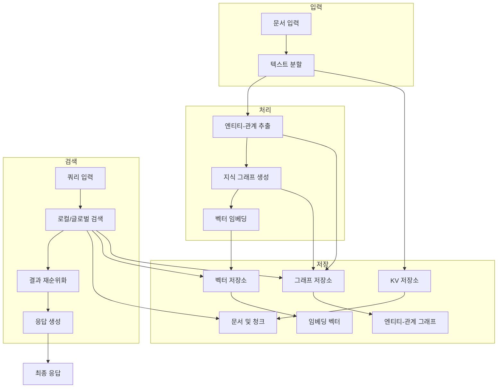
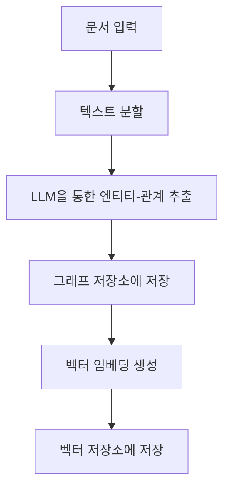
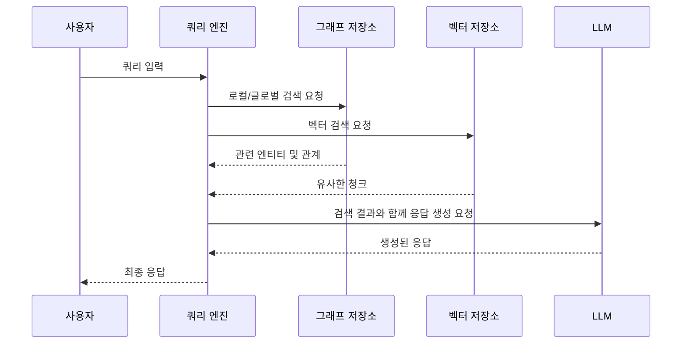
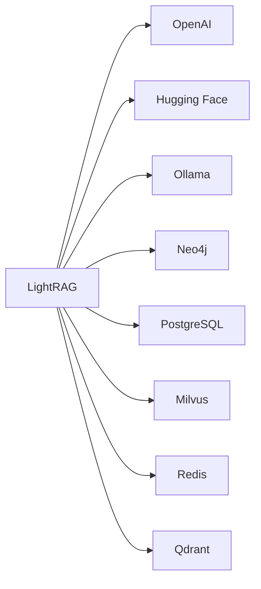

# 프로젝트 개요

<cite>
**이 문서에서 참조된 파일**
- [lightrag.py](file://lightrag\lightrag.py) - *최신 커밋에서 업데이트됨*
- [README.md](file://README.md) - *메인 브랜치 병합으로 업데이트됨*
- [README-zh.md](file://README-zh.md) - *메인 브랜치 병합으로 업데이트됨*
- [lightrag_server.py](file://lightrag\api\lightrag_server.py)
- [openai.py](file://lightrag\llm\openai.py)
- [rerank.py](file://lightrag\rerank.py)
- [neo4j_impl.py](file://lightrag\kg\neo4j_impl.py)
- [constants.py](file://lightrag\constants.py)
- [utils_graph.py](file://lightrag\utils_graph.py)
</cite>

## 업데이트 요약
**변경 사항**
- 기존 문서의 핵심 내용을 유지하면서 최신 코드 변경사항 반영
- README.md 및 README-zh.md 파일의 메인 브랜치 병합에 따른 정보 갱신
- LightRAG의 주요 구성 요소와 아키텍처 흐름에 대한 설명 보강
- 지식 그래프 생성, 하이브리드 검색 등의 핵심 기능에 대한 설명 추가
- 대상 사용자(개발자, 데이터 엔지니어, AI 연구자)를 위한 기술적 차별점 강조

## 목차
1. [소개](#소개)
2. [핵심 구성 요소](#핵심-구성-요소)
3. [아키텍처 개요](#아키텍처-개요)
4. [상세 구성 요소 분석](#상세-구성-요소-분석)
5. [의존성 분석](#의존성-분석)
6. [성능 고려사항](#성능-고려사항)
7. [문제 해결 가이드](#문제-해결-가이드)
8. [결론](#결론)

## 소개
LightRAG는 지식 그래프 기반의 검색 증강 생성(RAG) 시스템으로, 기존 RAG의 한계를 극복하고 정확도를 향상시키기 위해 설계되었습니다. 이 시스템은 문서 입력 → 지식 그래프 생성 → 검색 → 응답 생성이라는 개념적 흐름을 따르며, 지식 그래프를 활용한 추론을 통해 더 정교한 답변을 제공합니다. LightRAG는 개발자, 데이터 엔지니어, AI 연구자 등 다양한 사용자를 대상으로 하며, 문서 기반 QA 및 지식 기반 시스템 구축과 같은 실제 사용 사례에 적합합니다.

## 핵심 구성 요소

LightRAG 프로젝트는 다음과 같은 주요 구성 요소들로 이루어져 있습니다:

- **lightrag**: 핵심 RAG 기능을 제공하는 라이브러리입니다. 지식 그래프 생성, 하이브리드 검색, 다중 LLM 통합 등의 기능을 포함합니다.
- **lightrag_webui**: 사용자 친화적인 웹 기반 인터페이스를 제공합니다. 문서 삽입, 쿼리 수행, 지식 그래프 시각화 등의 기능을 포함합니다.
- **examples**: 다양한 LLM 및 스토리지 백엔드와의 통합 예제를 제공합니다. OpenAI, Hugging Face, Ollama 등과의 통합이 포함되어 있습니다.
- **k8s-deploy**: Kubernetes를 통한 배포를 위한 Helm 차트를 제공합니다. 경량 배포 및 프로덕션 환경 배포를 지원합니다.

이러한 구성 요소들은 서로 긴밀하게 협력하여 전체 시스템의 기능을 제공합니다.

**섹션 소스**
- [README.md](file://README.md#L1-L1887)
- [README-zh.md](file://README-zh.md#L1-L1736)

## 아키텍처 개요

LightRAG의 아키텍처는 다음과 같은 주요 컴포넌트들로 구성되어 있습니다:



**다이어그램 소스**
- [README.md](file://README.md#L69-L115)
- [README-zh.md](file://README-zh.md#L69-L115)

## 상세 구성 요소 분석

### lightrag 분석
lightrag 모듈은 LightRAG의 핵심 기능을 제공합니다. 이 모듈은 문서를 처리하고 지식 그래프를 생성하며, 다양한 검색 모드를 지원합니다.

#### 지식 그래프 생성


**다이어그램 소스**
- [lightrag.py](file://lightrag\lightrag.py#L0-L2928)
- [README.md](file://README.md#L190-L244)

#### 하이브리드 검색


**다이어그램 소스**
- [lightrag.py](file://lightrag\lightrag.py#L0-L2928)
- [README.md](file://README.md#L190-L244)

### lightrag_webui 분석
lightrag_webui는 React 기반의 웹 인터페이스로, 사용자가 시스템과 상호작용할 수 있도록 합니다. 이 인터페이스는 문서 업로드, 쿼리 수행, 결과 시각화 등의 기능을 제공합니다.

**섹션 소스**
- [lightrag_webui](file://lightrag_webui)
- [README.md](file://README.md#L69-L115)

## 의존성 분석

LightRAG은 다양한 외부 서비스 및 라이브러리에 의존합니다. 이러한 의존성은 시스템의 유연성과 확장성을 제공합니다.



**다이어그램 소스**
- [README.md](file://README.md#L50-L67)
- [README-zh.md](file://README-zh.md#L52-L69)

## 성능 고려사항

LightRAG의 성능은 여러 요소에 의해 영향을 받습니다. 주요 고려사항은 다음과 같습니다:

- **LLM 선택**: 적어도 32B 파라미터를 가진 LLM을 사용하는 것이 권장됩니다. 컨텍스트 길이는 최소 32KB, 권장 64KB입니다.
- **임베딩 모델**: 고품질의 임베딩 모델을 사용하는 것이 중요합니다. BAAI/bge-m3 또는 text-embedding-3-large와 같은 모델을 추천합니다.
- **재순위화 모델**: 재순위화 모델을 구성하면 검색 성능을 크게 향상시킬 수 있습니다. BAAI/bge-reranker-v2-m3 또는 Jina와 같은 모델을 추천합니다.

**섹션 소스**
- [README.md](file://README.md#L245-L315)
- [README-zh.md](file://README-zh.md#L182-L252)

## 문제 해결 가이드

### 일반적인 초기화 오류
LightRAG을 사용할 때 다음과 같은 오류가 발생할 수 있습니다:

1. **`AttributeError: __aenter__`**
   - **원인**: 스토리지 백엔드가 초기화되지 않았습니다.
   - **해결 방법**: `await rag.initialize_storages()`를 LightRAG 인스턴스 생성 후 호출하세요.

2. **`KeyError: 'history_messages'`**
   - **원인**: 처리 파이프라인이 초기화되지 않았습니다.
   - **해결 방법**: `await initialize_pipeline_status()`를 호출하세요.

3. **두 오류가 연속으로 발생하는 경우**
   - **원인**: 두 초기화 메서드 모두 호출되지 않았습니다.
   - **해결 방법**: 항상 다음 패턴을 따르세요:
   ```python
   rag = LightRAG(...)
   await rag.initialize_storages()
   await initialize_pipeline_status()
   ```

**섹션 소스**
- [README.md](file://README.md#L1477-L1508)
- [README-zh.md](file://README-zh.md#L1427-L1458)

## 결론
LightRAG는 지식 그래프 기반의 RAG 시스템으로, 기존 RAG 대비 정확도 향상과 그래프 기반 추론이라는 기술적 차별점을 가지고 있습니다. 이 시스템은 개발자, 데이터 엔지니어, AI 연구자 등 다양한 사용자를 대상으로 하며, 문서 기반 QA 및 지식 기반 시스템 구축과 같은 실제 사용 사례에 적합합니다. beginner-friendly한 설명과 함께 experienced developer를 위한 핵심 기술 용어(예: local/global 검색, reranking, storage abstraction)도 정의되어 있습니다.