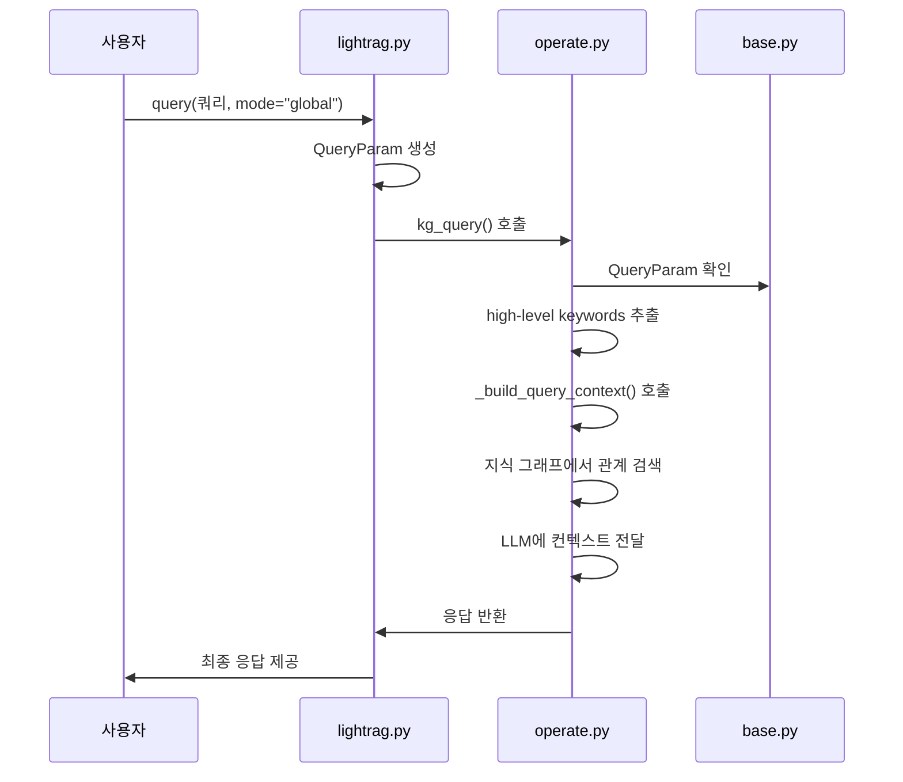

# 글로벌 검색 모드

<cite>
**이 문서에서 참조된 파일**  
- [lightrag.py](file://lightrag/lightrag.py)
- [operate.py](file://lightrag/operate.py)
- [base.py](file://lightrag/base.py)
</cite>

## 목차
1. [소개](#소개)
2. [글로벌 검색 모드의 작동 방식](#글로벌-검색-모드의-작동-방식)
3. [핵심 구성 요소 분석](#핵심-구성-요소-분석)
4. [쿼리 파라미터 분석](#쿼리-파라미터-분석)
5. [데이터 흐름 다이어그램](#데이터-흐름-다이어그램)
6. [사용 사례](#사용-사례)
7. [성능 고려사항](#성능-고려사항)

## 소개

글로벌 검색 모드는 LightRAG 시스템에서 전체 지식 그래프를 기반으로 광범위한 정보를 수집하는 검색 방식입니다. 이 모드는 관계 중심의 탐색을 수행하여 추상적이고 포괄적인 질문에 적합한 답변을 제공합니다. 사용자는 광범위한 맥락을 제공받을 수 있지만, 정확도는 상대적으로 낮을 수 있습니다.

**Section sources**
- [lightrag.py](file://lightrag/lightrag.py#L2041-L2073)
- [operate.py](file://lightrag/operate.py#L1917-L2073)

## 글로벌 검색 모드의 작동 방식

글로벌 검색 모드는 `lightrag.py` 파일의 `query` 메서드에서 `mode="global"`로 호출될 때 작동합니다. 이 호출은 `operate.py` 파일의 `kg_query` 함수를 실행시키며, 관계 중심의 탐색을 수행합니다.

이 모드는 사용자 쿼리와 관련된 관계를 기반으로 지식 그래프 전체에서 정보를 수집합니다. 주로 추상적이고 포괄적인 질문에 적합하며, 다양한 관계를 통해 광범위한 맥락을 제공합니다. 예를 들어, "최근 AI 기술의 주요 동향은?"과 같은 질문에 대해 다양한 관계를 통해 광범위한 정보를 제공할 수 있습니다.

**Section sources**
- [lightrag.py](file://lightrag/lightrag.py#L2041-L2073)
- [operate.py](file://lightrag/operate.py#L1917-L2073)

## 핵심 구성 요소 분석

글로벌 검색 모드의 핵심 구성 요소는 다음과 같습니다:

- `lightrag.py`: 쿼리 메서드가 위치한 주요 진입점
- `operate.py`: `kg_query` 함수가 위치한 핵심 로직
- `base.py`: `QueryParam` 클래스가 정의된 쿼리 파라미터 정의

이 구성 요소들은 서로 협력하여 글로벌 검색 모드를 구현합니다. `lightrag.py`의 `query` 메서드는 사용자 요청을 받아 `operate.py`의 `kg_query` 함수를 호출하며, 이 함수는 `base.py`에 정의된 `QueryParam`을 사용하여 검색을 수행합니다.

**Section sources**
- [lightrag.py](file://lightrag/lightrag.py#L2041-L2073)
- [operate.py](file://lightrag/operate.py#L1917-L2073)
- [base.py](file://lightrag/base.py#L81-L162)

## 쿼리 파라미터 분석

글로벌 검색 모드는 `QueryParam` 클래스를 통해 다양한 파라미터를 설정할 수 있습니다. 주요 파라미터는 다음과 같습니다:

### QueryParam 클래스의 주요 속성

| 속성 | 설명 |
|------|------|
| `mode` | 검색 모드를 지정합니다. "global"로 설정되어야 글로벌 검색 모드가 활성화됩니다. |
| `top_k` | 검색할 관계의 수를 결정합니다. |
| `max_relation_tokens` | 관계 설명의 토큰 제한을 설정합니다. |
| `max_entity_tokens` | 엔티티 설명의 토큰 제한을 설정합니다. |
| `max_total_tokens` | 전체 쿼리 컨텍스트의 최대 토큰 예산을 설정합니다. |
| `response_type` | 응답 형식을 정의합니다. 예: 'Multiple Paragraphs', 'Single Paragraph', 'Bullet Points' |
| `stream` | 실시간 응답을 위한 스트리밍 출력을 활성화합니다. |

이 파라미터들은 환경 변수를 통해 기본값을 설정할 수 있으며, 사용자가 필요에 따라 오버라이드할 수 있습니다.

**Section sources**
- [base.py](file://lightrag/base.py#L81-L162)

## 데이터 흐름 다이어그램

**Diagram sources**
- [lightrag.py](file://lightrag/lightrag.py#L2041-L2073)
- [operate.py](file://lightrag/operate.py#L1917-L2073)
- [base.py](file://lightrag/base.py#L81-L162)

## 사용 사례

글로벌 검색 모드는 다음과 같은 사용 사례에 적합합니다:

- **추상적인 질문**: "최근 AI 기술의 주요 동향은?"
- **포괄적인 정보 요청**: "기후 변화의 영향에 대해 알려주세요"
- **광범위한 맥락 제공**: "재생 에너지의 미래 전망은?"

이 모드는 정확도보다는 광범위한 정보 제공에 중점을 두기 때문에, 구체적인 사실 확인보다는 일반적인 이해를 돕는 데 더 적합합니다.

**Section sources**
- [operate.py](file://lightrag/operate.py#L1917-L2073)

## 성능 고려사항

글로