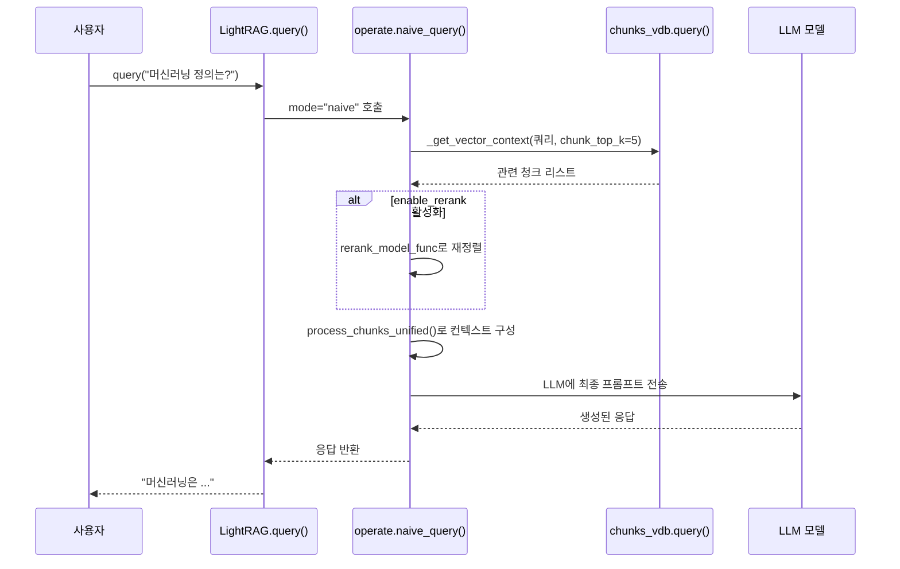

# 나이브 검색 모드

<cite>
**이 문서에서 참조한 파일**  
- [lightrag.py](file://lightrag/lightrag.py)
- [operate.py](file://lightrag/operate.py)
- [types.py](file://lightrag/types.py)
</cite>

## 목차
1. [소개](#소개)
2. [나이브 검색 모드의 작동 원리](#나이브-검색-모드의-작동-원리)
3. [핵심 구성 요소 분석](#핵심-구성-요소-분석)
4. [쿼리 파라미터의 역할](#쿼리-파라미터의-역할)
5. [성능 및 활용 사례](#성능-및-활용-사례)
6. [결론](#결론)

## 소개
나이브 검색 모드는 지식 그래프를 사용하지 않고 오직 벡터 저장소 기반의 텍스트 청크 검색만을 수행하는 간단하고 빠른 검색 방식입니다. 이 모드는 복잡한 의미적 분석 없이 순수한 벡터 유사도 기반으로 정보를 검색하며, 지식 그래프 초기화 전 테스트 또는 단순한 정보 검색에 적합합니다. 본 문서는 `lightrag.py`와 `operate.py` 파일의 코드를 기반으로 나이브 검색 모드의 내부 작동 방식과 핵심 구성 요소를 분석합니다.

## 나이브 검색 모드의 작동 원리
나이브 검색 모드는 `lightrag.py`의 `query` 메서드에서 `mode="naive"`로 호출될 때, `operate.py`의 `naive_query` 함수가 실행되어 작동합니다. 이 과정은 다음과 같은 단계로 이루어집니다.

1.  **쿼리 입력**: 사용자는 자연어 쿼리를 입력합니다.
2.  **벡터 검색**: 입력된 쿼리는 벡터화되어, `chunks_vdb` (청크 벡터 저장소)에서 `chunk_top_k` 개수만큼의 관련성 높은 텍스트 청크를 벡터 유사도 기반으로 검색합니다.
3.  **재정렬 (선택 사항)**: `enable_rerank`가 활성화된 경우, 검색된 청크들은 재정렬 모델을 통해 다시 순위가 매겨집니다.
4.  **컨텍스트 구성**: 검색된 청크들은 토큰 수 제한을 고려하여 최종 컨텍스트로 구성됩니다.
5.  **LLM 응답 생성**: 구성된 컨텍스트와 쿼리, 시스템 프롬프트가 결합되어 LLM에 전달되며, LLM은 이를 바탕으로 최종 응답을 생성합니다.

**다이어그램 출처**
- [lightrag.py](file://lightrag/lightrag.py#L1000-L1200)
- [operate.py](file://lightrag/operate.py#L3397-L3599)

**섹션 출처**
- [lightrag.py](file://lightrag/lightrag.py#L1000-L1200)
- [operate.py](file://lightrag/operate.py#L3397-L3599)

## 핵심 구성 요소 분석
나이브 검색 모드의 핵심은 `operate.py` 파일에 정의된 `naive_query` 함수에 있습니다. 이 함수는 쿼리 처리의 전반적인 흐름을 제어하며, 다양한 구성 요소와 상호작용합니다.

### naive_query 함수
`naive_query` 함수는 나이브 검색 모드의 핵심 로직을 담당합니다. 주요 기능은 다음과 같습니다.

*   **캐싱 처리**: 동일한 쿼리에 대한 응답을 캐싱하여 성능을 향상시킵니다. `compute_args_hash` 함수를 사용하여 쿼리 파라미터를 기반으로 해시를 생성하고, `handle_cache` 함수로 캐시를 확인합니다.
*   **벡터 컨텍스트 검색**: `_get_vector_context` 함수를 호출하여 벡터 저장소에서 관련 청크를 검색합니다. 이 함수는 내부적으로 `chunks_vdb.query()` 메서드를 사용합니다.
*   **토큰 관리**: 시스템 프롬프트, 대화 기록, 쿼리, 응답 등 모든 요소의 토큰 수를 계산하여, `max_total_tokens` 제한 내에서 최적의 청크를 선택할 수 있도록 합니다.
*   **응답 생성**: 최종적으로 구성된 컨텍스트를 LLM에 전달하고, 생성된 응답을 후처리하여 반환합니다.

**섹션 출처**
- [operate.py](file://lightrag/operate.py#L3397-L3599)

### _get_vector_context 함수
이 함수는 벡터 저장소에서 관련 청크를 검색하는 핵심 역할을 합니다. `query_param` 객체의 `chunk_top_k` 값을 사용하여 검색할 청크의 수를 결정하고, `enable_rerank` 설정에 따라 재정렬을 수행합니다. 재정렬이 활성화되면, 검색된 청크들은 `rerank_model_func`에 의해 다시 순위가 매겨지며, `min_rerank_score`보다 낮은 점수를 받은 청크는 필터링됩니다.

**섹션 출처**
- [operate.py](file://lightrag/operate.py#L3241-L3241)

## 쿼리 파라미터의 역할
나이브 검색 모드의 동작은 `QueryParam` 객체를 통해 세밀하게 제어됩니다. 이 객체는 `base.py` 파일에 정의되어 있으며, 다음의 주요 파라미터들이 나이브 검색에 영향을 미칩니다.

| 파라미터 이름 | 설명 | 기본값 |
| :--- | :--- | :--- |
| `mode` | 검색 모드를 지정합니다. `"naive"`로 설정되어야 나이브 모드가 활성화됩니다. | `"mix"` |
| `chunk_top_k` | 벡터 저장소에서 검색할 텍스트 청크의 수를 결정합니다. | 환경 변수 `CHUNK_TOP_K` 또는 `DEFAULT_CHUNK_TOP_K` |
| `enable_rerank` | 검색된 청크에 대해 재정렬 기능을 활성화할지 여부를 결정합니다. | 환경 변수 `RERANK_BY_DEFAULT` |
| `max_total_tokens` | 전체 쿼리 컨텍스트의 최대 토큰 수를 제한합니다. | 환경 변수 `MAX_TOTAL_TOKENS` 또는 `DEFAULT_MAX_TOTAL_TOKENS` |
| `response_type` | LLM이 생성할 응답의 형식을 지정합니다 (예: "단락", "불릿 포인트"). | `"여러 단락"` |

**섹션 출처**
- [base.py](file://lightrag/base.py#L81-L162)

## 성능 및 활용 사례
나이브 검색 모드는 다음과 같은 특징을 가집니다.

*   **장점**: 처리 속도가 매우 빠르며, 구현이 간단하고 리소스 소모가 적습니다. 지식 그래프를 구축하지 않은 초기 단계에서 빠르게 검색 기능을 테스트하거나, 단순한 키워드 기반 검색이 필요한 경우에 이상적입니다.
*   **단점**: 지식 그래프를 활용하지 않기 때문에, 엔티티 간의 복잡한 관계나 깊은 의미적 연결을 이해하지 못합니다. 검색 결과의 정확도와 깊이가 제한될 수 있습니다.

**예시 활용 사례**:
*   '문서에서 "머신러닝"이라는 단어가 포함된 문장은?'과 같은 단순한 키워드 검색.
*   지식 그래프 초기화 전, 벡터 저장소의 검색 성능을 빠르게 검증하는 경우.
*   의미적 깊이보다는 빠른 응답 속도가 우선시되는 애플리케이션.

**섹션 출처**
- [lightrag.py](file://lightrag/lightrag.py#L1000-L1200)
- [operate.py](file://lightrag/operate.py#L3397-L3599)

## 결론
나이브 검색 모드는 LightRAG에서 가장 간단하고 빠른 검색 전략입니다. 이 모드는 지식 그래프를 우회하고, 순수하게 벡터 유사도 기반의 텍스트 청크 검색에 의존하여 작동합니다. `chunk_top_k`와 `enable_rerank`와 같은 쿼리 파라미터를 통해 검색의 범위와 정확도를 조절할 수 있습니다. 이 모드는 빠른 프로토타이핑, 단순한 정보 검색, 또는 지식 그래프가 준비되지 않은 초기 단계에서 매우 유용하지만, 복잡한 의미적 질문에는 한계가 있습니다. 사용자는 사용 사례에 따라 나이브 모드와 더 정교한 `local`, `global`, `hybrid` 모드를 적절히 선택해야 합니다.