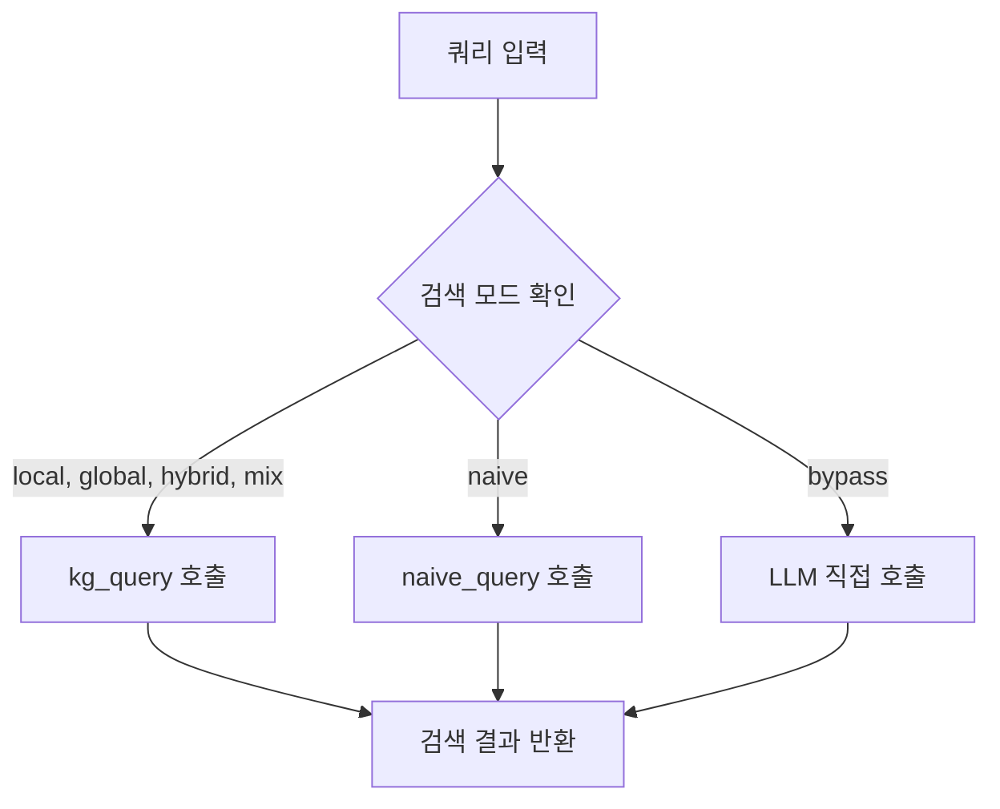
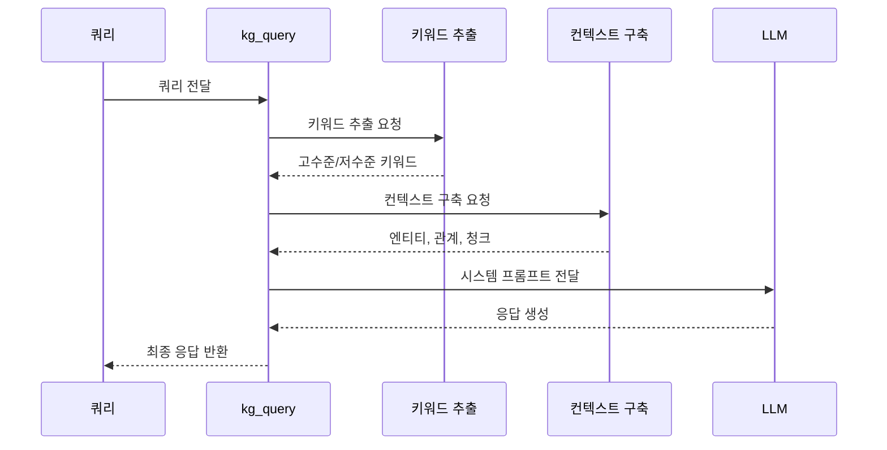
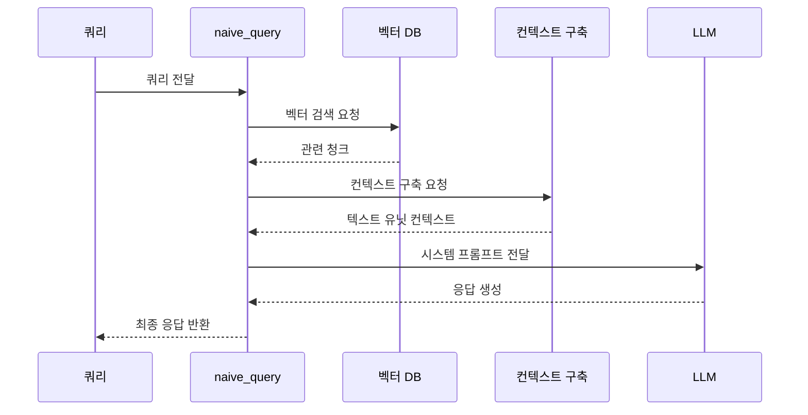

# 다중 검색 모드

<cite>
**이 문서에서 참조된 파일**   
- [lightrag.py](file://lightrag/lightrag.py)
- [operate.py](file://lightrag/operate.py)
- [types.py](file://lightrag/types.py)
</cite>

## 목차
1. [소개](#소개)
2. [검색 모드 비교](#검색-모드-비교)
3. [쿼리 처리 로직 분석](#쿼리-처리-로직-분석)
4. [QueryParam 속성의 영향](#queryparam-속성의-영향)
5. [성능 특성 및 사용 시나리오](#성능-특성-및-사용-시나리오)
6. [결론](#결론)

## 소개
LightRAG는 다양한 검색 모드를 제공하여 사용 사례에 따라 최적화된 정보 검색을 가능하게 합니다. 이 문서는 LightRAG의 네 가지 검색 모드(local, global, hybrid, mix)의 차이점과 사용 사례를 비교하고, 각 모드에서의 쿼리 처리 로직을 lightrag.py의 query 메서드와 operate.py의 kg_query, naive_query 함수를 기반으로 설명합니다. 또한 QueryParam 클래스의 각 속성(top_k, chunk_top_k 등)이 검색 결과에 미치는 영향을 구체적인 예시와 함께 안내하며, 다양한 검색 모드의 성능 특성과 적합한 사용 시나리오를 제시합니다.

**Section sources**
- [lightrag.py](file://lightrag/lightrag.py#L1-L2928)

## 검색 모드 비교
LightRAG는 네 가지 주요 검색 모드를 제공합니다: local, global, hybrid, mix. 각 모드는 서로 다른 정보 검색 전략을 사용하여 다양한 사용 사례에 적합하도록 설계되었습니다.

- **Local 모드**: 엔티티 중심의 검색을 수행합니다. 쿼리에서 추출된 저수준 키워드를 기반으로 관련 엔티티를 검색하고, 해당 엔티티와 연결된 관계 및 텍스트 청크를 가져옵니다. 이 모드는 특정 개체에 대한 상세한 정보를 찾을 때 유용합니다.

- **Global 모드**: 관계 중심의 검색을 수행합니다. 쿼리에서 추출된 고수준 키워드를 기반으로 관련 관계를 검색하고, 해당 관계와 연결된 엔티티 및 텍스트 청크를 가져옵니다. 이 모드는 개념 간의 연결성이나 네트워크 구조를 이해할 때 유용합니다.

- **Hybrid 모드**: Local과 Global 모드를 결합하여, 엔티티와 관계를 모두 고려한 검색을 수행합니다. 두 모드의 결과를 라운드 로빈 방식으로 병합하여 균형 잡힌 검색 결과를 제공합니다. 이 모드는 포괄적인 정보 검색이 필요할 때 적합합니다.

- **Mix 모드**: 지식 그래프 기반 검색과 순수 벡터 검색을 결합합니다. kg_query를 통해 지식 그래프에서 정보를 검색하고, naive_query를 통해 벡터 데이터베이스에서 직접 텍스트 청크를 검색한 후, 두 결과를 통합합니다. 이 모드는 구조화된 지식과 원본 텍스트 정보를 모두 활용해야 할 때 유용합니다.

**Section sources**
- [lightrag.py](file://lightrag/lightrag.py#L1-L2928)
- [operate.py](file://lightrag/operate.py#L1-L3601)

## 쿼리 처리 로직 분석
LightRAG의 쿼리 처리는 lightrag.py의 query 메서드를 중심으로 이루어지며, 이 메서드는 operate.py의 kg_query와 naive_query 함수를 호출하여 검색을 수행합니다.

### query 메서드의 처리 흐름
lightrag.py의 query 메서드는 다음과 같은 처리 흐름을 가집니다:

**Diagram sources**
- [lightrag.py](file://lightrag/lightrag.py#L1-L2928)

### kg_query 함수의 처리 로직
kg_query 함수는 지식 그래프 기반 검색을 수행하며, 다음과 같은 단계를 거칩니다:

1. **키워드 추출**: 쿼리에서 고수준 및 저수준 키워드를 추출합니다.
2. **컨텍스트 구축**: 추출된 키워드를 기반으로 엔티티, 관계, 텍스트 청크를 검색하여 컨텍스트를 구축합니다.
3. **LLM 응답 생성**: 구축된 컨텍스트를 시스템 프롬프트에 포함시켜 LLM에 전달하고, 응답을 생성합니다.

**Diagram sources**
- [operate.py](file://lightrag/operate.py#L1917-L2073)

### naive_query 함수의 처리 로직
naive_query 함수는 순수 벡터 기반 검색을 수행하며, 다음과 같은 단계를 거칩니다:

1. **벡터 검색**: 쿼리를 벡터 데이터베이스에 전달하여 관련 텍스트 청크를 검색합니다.
2. **컨텍스트 구축**: 검색된 텍스트 청크를 기반으로 컨텍스트를 구축합니다.
3. **LLM 응답 생성**: 구축된 컨텍스트를 시스템 프롬프트에 포함시켜 LLM에 전달하고, 응답을 생성합니다.

**Diagram sources**
- [operate.py](file://lightrag/operate.py#L3397-L3599)

## QueryParam 속성의 영향
QueryParam 클래스는 검색 결과에 미치는 다양한 속성을 정의합니다. 각 속성은 검색 결과의 범위, 품질, 성능에 직접적인 영향을 미칩니다.

### 주요 속성 및 영향
다음 표는 QueryParam 클래스의 주요 속성과 그 영향을 요약한 것입니다:

| 속성 | 설명 | 영향 예시 |
|------|------|----------|
| top_k | 검색할 엔티티/관계의 수 | top_k=5로 설정하면 상위 5개의 관련 엔티티만 검색됨 |
| chunk_top_k | 컨텍스트에 포함할 청크의 최대 수 | chunk_top_k=3으로 설정하면 최대 3개의 청크만 포함됨 |
| max_entity_tokens | 엔티티 컨텍스트의 최대 토큰 수 | max_entity_tokens=100으로 설정하면 엔티티 정보가 100토큰으로 제한됨 |
| max_relation_tokens | 관계 컨텍스트의 최대 토큰 수 | max_relation_tokens=150으로 설정하면 관계 정보가 150토큰으로 제한됨 |
| max_total_tokens | 전체 컨텍스트의 최대 토큰 수 | max_total_tokens=2000으로 설정하면 전체 컨텍스트가 2000토큰으로 제한됨 |
| cosine_threshold | 벡터 검색의 코사인 유사도 임계값 | cosine_threshold=0.5로 설정하면 유사도가 0.5 이상인 결과만 포함됨 |
| related_chunk_number | 단일 엔티티 또는 관계로부터 가져올 관련 청크의 수 | related_chunk_number=2로 설정하면 각 엔티티로부터 최대 2개의 청크를 가져옴 |
| kg_chunk_pick_method | 텍스트 청크 선택 방법 | kg_chunk_pick_method='WEIGHT'로 설정하면 가중치 기반 선택, 'VECTOR'로 설정하면 벡터 유사도 기반 선택 |

**Section sources**
- [lightrag.py](file://lightrag/lightrag.py#L1-L2928)
- [operate.py](file://lightrag/operate.py#L1-L3601)

## 성능 특성 및 사용 시나리오
각 검색 모드는 고유한 성능 특성과 적합한 사용 시나리오를 가지고 있습니다.

### 성능 특성 비교
다음 표는 네 가지 검색 모드의 성능 특성을 비교한 것입니다:

| 모드 | 정확도 | 속도 | 메모리 사용량 | 적합한 사용 시나리오 |
|------|--------|------|--------------|-------------------|
| Local | 높음 | 중간 | 중간 | 특정 개체에 대한 상세 정보 검색 |
| Global | 중간 | 빠름 | 낮음 | 개념 간 연결성 분석 |
| Hybrid | 매우 높음 | 느림 | 높음 | 포괄적인 정보 검색 |
| Mix | 매우 높음 | 느림 | 매우 높음 | 구조화된 지식과 원본 텍스트 통합 |

### 사용 시나리오 예시
- **Local 모드**: "Steve Jobs의 생애와 업적에 대해 알려줘"와 같은 특정 인물에 대한 상세 정보를 요청할 때 적합합니다. 엔티티 중심의 검색을 통해 Steve Jobs에 대한 상세한 정보를 효과적으로 제공할 수 있습니다.

- **Global 모드**: "혁신과 기술의 관계는 무엇인가요?"와 같은 개념 간의 관계를 묻는 질문에 적합합니다. 관계 중심의 검색을 통해 혁신과 기술 간의 연결성을 분석할 수 있습니다.

- **Hybrid 모드**: "애플의 역사와 주요 인물들에 대해 알려줘"와 같은 포괄적인 정보를 요청할 때 적합합니다. 엔티티와 관계를 모두 고려하여 균형 잡힌 검색 결과를 제공합니다.

- **Mix 모드**: "이 문서에서 Steve Jobs에 대해 어떻게 언급하고 있나요?"와 같은 특정 문서 내의 정보를 요청할 때 적합합니다. 지식 그래프 기반 검색과 순수 벡터 검색을 결합하여 구조화된 지식과 원본 텍스트 정보를 모두 활용할 수 있습니다.

**Section sources**
- [lightrag.py](file://lightrag/lightrag.py#L1-L2928)
- [operate.py](file://lightrag/operate.py#L1-L3601)

## 결론
LightRAG의 네 가지 검색 모드(local, global, hybrid, mix)는 서로 다른 정보 검색 전략을 제공하여 다양한 사용 사례에 적합하도록 설계되었습니다. 각 모드는 고유한 장점과 제한점을 가지고 있으며, 사용 사례에 따라 적절한 모드를 선택하는 것이 중요합니다. QueryParam 클래스의 속성들을 적절히 조정함으로써 검색 결과의 범위, 품질, 성능을 최적화할 수 있습니다. 사용자는 검색 목적과 요구사항을 고려하여 가장 적합한 검색 모드와 파라미터 설정을 선택해야 합니다.